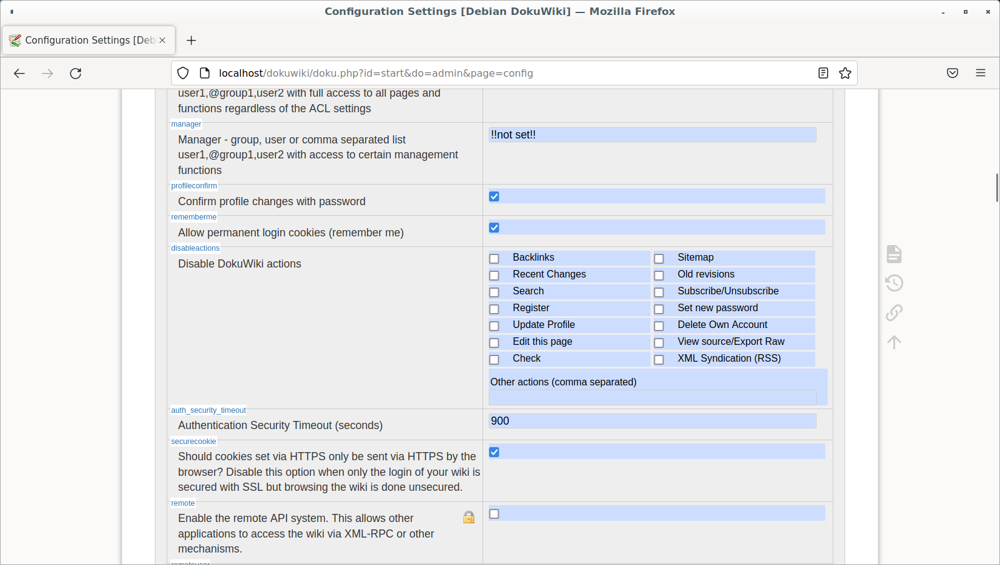
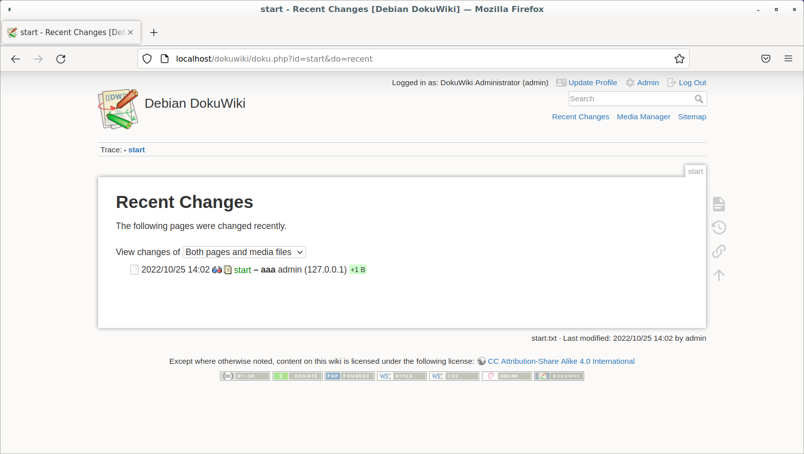
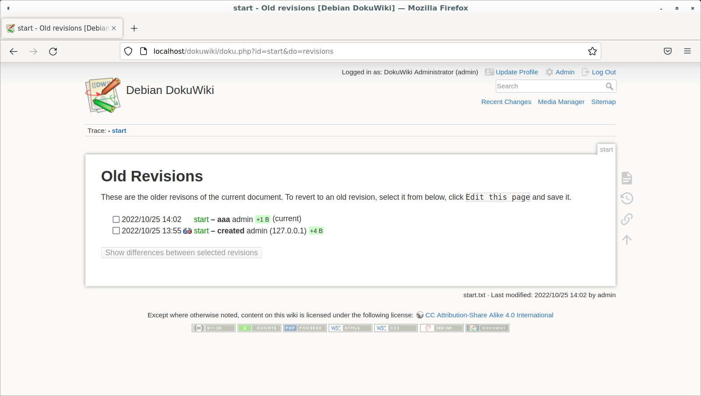
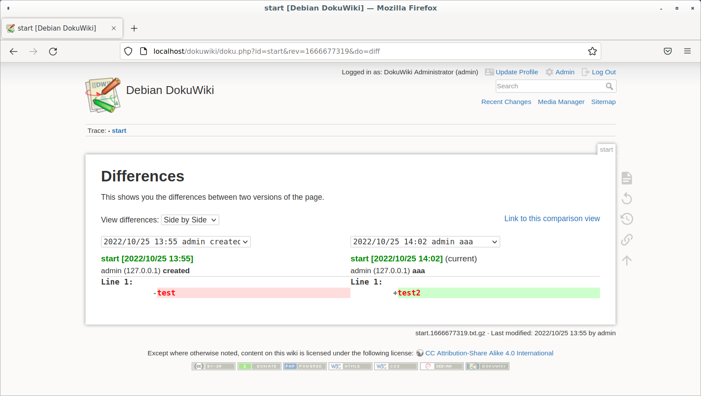
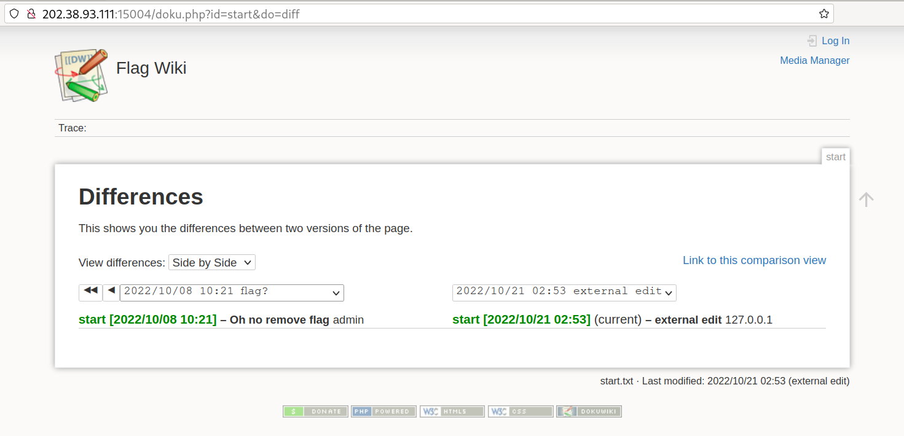

# Flag 的痕迹

题解作者：[taoky](https://github.com/taoky)

出题人、验题人、文案设计等：见 [Hackergame 2022 幕后工作人员](../../credits.pdf)。

## 题目描述

- 题目分类：web

- 题目分值：150

小 Z 听说 Dokuwiki 配置很简单，所以在自己的机器上整了一份。可是不巧的是，他一不小心把珍贵的 flag 粘贴到了 wiki 首页提交了！他赶紧改好，并且也把历史记录（revisions）功能关掉了。

「这样就应该就不会泄漏 flag 了吧」，小 Z 如是安慰自己。

然而事实真的如此吗？

> （题目 Dokuwiki 版本基于 2022-07-31a "Igor"）

## 题解

同样，这道题 idea 是 @zzh1996 的，我负责 implementation。

DokuWiki 是非常轻量级的 wiki 解决方案：没有数据库，相关的数据全部放文件里面由文件系统管理。因为容易配置而比较流行。

所以我们先本地配置试试，摸一下 `dokuwiki` 吧：

```
sudo apt install dokuwiki
```

（我比较懒，这么装不是最新的，但是作为展示的 demo 足够了）

我们看到作为管理员，可以禁用掉 DokuWiki 的一些 "actions"，这其中就包含了「最近修改」和「历史记录」。



再摸摸可以发现，上面这两个功能长这个样子：





可以注意到，不同的 action 对应 URL 参数里面不同的 "do"。再探索一下，就能看到有个 action，似乎不在管理员 UI 的禁用列表里面：



Diff。而且这个页面可以看到所有的修改记录。

让我们试试吧：



点击下面的下拉框，选中以前的记录，结果就出来了。

### 附注

为了让 DokuWiki 在只读环境中运行，并且不随便放 session 干扰其他题目，我对 DokuWiki 的源代码做了一些修改，参考 src 目录。相关的修改以 GPLv2 协议发布。

## 出题思路

本节作者：[zzh1996](https://github.com/zzh1996)

这道题的出题思路是我提供的。

我的个人主页就是使用 DokuWiki 搭建的。（在写这段话时我暂时把它下线维护了，等我有时间处理一下再上线。）我关掉了历史记录功能，并且确认了设置页面该关的都关了，但是没想到被细心的某拼盘出题人通过 diff 功能翻出来了一些黑历史，于是就想出成一道题。
