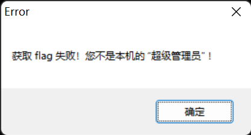
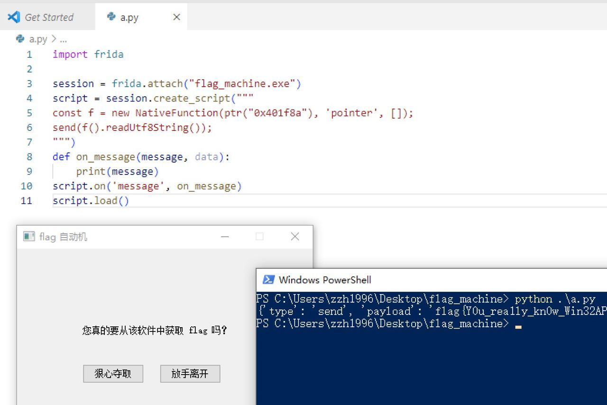

# Flag 自动机

题解作者：[忧郁沙茶](https://github.com/Crabtux)

出题人、验题人、文案设计等：见 [Hackergame 2022 幕后工作人员](../../credits.pdf)。

## 题目描述

- 题目分类：binary

- 题目分值：200

Hackergame 2022 组委会为大家搬来了一台能够自动获取 flag 的机器。然而，想要提取出其中的 flag 似乎没那么简单……

请点击下方的「打开/下载题目」按钮，从 flag 自动机中提取 flag。

**请选手注意：`flag_machine.zip` 中的 `flag_machine.exe.manifest` 仅为美化窗口使用，与本题解法无关。**

[打开/下载题目](files/flag_machine.zip)

## 背景

本题是 binary 分类的签到题，最开始的 idea 是我在强网杯结束之后，在回学校的火车上想到的。出题的目的是整个小活，以及让大家熟悉一下逆向工程一些最基本的操作。

我认为逆向工程是一件有趣的事情。在逻辑逆向完成之后，你实际上可以对这个小小的可执行文件做很多的操作。然而在传统 CTF 题中，有很多题目并不能达到我心目中“有趣”的标准，而我不喜欢无趣的题目，所以我最终还是决定把这道题端上来。

我本人对逆向工程并不十分熟悉，为了降低逆向的难度，将其控制在我的能力范围内，我选择使用 Win32 API 来实现题目界面，而不使用诸如 Qt 一类的 GUI 框架（所以你会发现这个界面非常丑陋 Orz，但这已经是我的极限水平了）。

实际上这题只是提供了一个场景，并没有把解法固定死；又因为题目做的限制十分宽松，因此解法应该是相当多样的，这篇题解仅覆盖了其中的若干种解法。

这里要感谢 [taoky](https://github.com/taoky) 和 [zzh1996](https://github.com/zzh1996) 学长帮忙测试题目，以及 [emc2314](https://github.com/emc2314) 学长为题目的实现提供的一些思路。

## 在说解法之前……

我们从一个非专业 CTF 选手（但有一定的计算机知识）的角度，说说这题的思维流程。

如果你打开过这道题目，试图点击「狠心夺取」按钮，会发现在你鼠标移动到这个按钮的一瞬间，它会随机移动到整个窗口的另一个位置，不让你点击。然而，[taoky](https://github.com/taoky) 学长在测试的时候发现，在 wine 下面运行这个程序，有几率会直接 focus 到「确定」按钮上面，再按下键盘上的 Space 键就能获得 flag（我本人还没有测试过这种情况）。但我并不希望有人能依靠运气点出这个 flag。

所以就算你真的运气好，点到了这个按钮，会发现等待你的只有这样的提示：



很明显，想要依靠直接点击这个按钮获得 flag 的思路断了，我们需要想别的办法。

我们都知道，一个 C 语言源文件，经过预处理、编译、汇编、链接生成一个可执行文件，程序运行逻辑的载体从 C 语言代码转变为汇编代码，最终转变为机器码。程序运行时，CPU 能够读取这些机器码，并执行对应的操作，但对于人类来说，很难从可执行文件里面的机器语言中直接看出程序运行的逻辑。

但我们有没有办法通过机器语言，获得人类可读的程序执行逻辑呢？答案是有，这就是逆向工程技术。

常用的逆向工程框架有 IDA、Ghidra、Binary Ninja 等，我们这里使用 IDA 进行分析。

我们使用 IDA 的 decompiler 插件，猛戳 F5：

```c
int __stdcall WinMain(HINSTANCE hInstance, HINSTANCE hPrevInstance, LPSTR lpCmdLine, int nShowCmd)
{
  unsigned int v4; // eax
  WNDCLASSW WndClass; // [esp+3Ch] [ebp-4Ch] BYREF
  struct tagMSG Msg; // [esp+64h] [ebp-24h] BYREF

  v4 = time(0);
  srand(v4);
  memset(&WndClass, 0, sizeof(WndClass));
  WndClass.lpszClassName = aFlag;
  WndClass.hInstance = hInstance;
  WndClass.hbrBackground = GetSysColorBrush(15);
  WndClass.lpfnWndProc = sub_401510;
  WndClass.hCursor = LoadCursorA(0, (LPCSTR)0x7F00);
  RegisterClassW(&WndClass);
  CreateWindowExW(0, WndClass.lpszClassName, aFlag, 0x10CF0000u, 150, 150, 400, 300, 0, 0, hInstance, 0);
  SetWindowSubclass(hWnd, pfnSubclass, 0x190u, 0);
  while ( GetMessageA(&Msg, 0, 0, 0) )
  {
    TranslateMessage(&Msg);
    DispatchMessageA(&Msg);
  }
  return Msg.wParam;
}
```

可以看到，IDA 对 Win32 API 的支持十分出色，基本上还原了 WinMain 函数的逻辑。

我们看到函数指针 `WndClass.lpfnWndProc` 指向 `sub_401510`，跟进去：

```c
LRESULT __stdcall sub_401510(HWND hWndParent, UINT Msg, WPARAM a3, LPARAM lParam)
{
  size_t v4; // eax
  FILE *Stream; // [esp+40h] [ebp-18h]
  void *Block; // [esp+44h] [ebp-14h]
  HFONT wParam; // [esp+48h] [ebp-10h]
  unsigned int dwNewLong; // [esp+4Ch] [ebp-Ch]

  switch ( Msg )
  {
    case 2u:
      PostQuitMessage(0);
      break;
    case 0x111u:
      if ( (_WORD)a3 == 2 )
        PostQuitMessage(0);
      if ( (_WORD)a3 == 3 )
      {
        if ( lParam == 114514 )
        {
          Block = (void *)sub_401F8A(hWndParent, 114514);
          MessageBoxW(hWndParent, &word_40A0C4, L"Congratulations", 0);
          Stream = fopen("flag_machine.txt", "w");
          ...
```

于是，我们获得了 `WinMain` 函数和 `sub_401510` 函数的大致逻辑。从逻辑中可以看出来，`sub_401510` 似乎是一个很重要的回调函数，但它什么时候会被调用呢？我们会在解法一里面说明。

## 解法一：使用 Win32 API

这是我出这题最开始希望考察的解法。在说这个解法之前，我们补充一些背景知识。

### 背景知识

限于篇幅，我们在这里只说明一些跟题目比较相关的知识，如果感兴趣的话，可以自行查阅 Win32 API 有关的资料。

在 Windows 操作系统中，<strong>窗口（Window）</strong>的定义是抽象的。对于一个 Windows 下的 GUI 程序来说，不仅仅只有那个大大的对话框是窗口，对话框中的一个按钮，一段文本，一个输入框，都算作是一个窗口。每个 Windows 下的 GUI 程序都至少会创建一个窗口，它充当用户与应用程序之间的主接口，称为**主窗口**。

窗口有这样一些特性：

- 每个窗口都由一个被称为<strong>窗口句柄（Window Handle）</strong>的整数唯一标识
- 每个窗口都有一个**窗口过程（Window Procedure）**，它是一个回调函数，在窗口接收到消息时，这个回调函数就会被调用

窗口过程 `WndProc` 的函数原型如下：

```c
LRESULT CALLBACK WndProc( //WndProc名称可自由定义
    HWND hwnd,
    UINT uMsg,
    WPARAM wParam,
    LPARAM lParam
)；
```

那发送给窗口的消息又是从哪里来的呢？这就要说到 Windows 的消息机制，开发过 Windows 下 GUI 程序的同学应该对这个名词不太陌生。

Windows 下的 GUI 程序是**事件驱动**的。在 Windows 下，用户敲击键盘、移动鼠标、点击鼠标按钮、改变窗口尺寸，这些操作都算作是一个**事件（Event）**。当有事件发生的时候，Windows 就会生成一条消息，将其放入相应应用的**消息队列**中。每个 GUI 程序都必须负责处理自己的消息队列，处理消息队列的逻辑被称为**消息循环（Message Loop）**。

一个简单的消息循环实现大概长这样：

```c
    MSG msg;
    while (GetMessage(&msg, NULL, 0, 0))
    {
        TranslateMessage(&msg);
        DispatchMessage(&msg);
    }
```

其中：

- `GetMessage` 从消息队列中检索消息，并将其复制到 `msg` 中
- `TranslateMessage` 与从键盘接收字符输入有关，这里不作展开
- `DispatchMessage` 用于向 `msg` 中指定的窗口对应的窗口过程发送消息

### 解法

在查询 `RegisterClassW`、`CreateWindowW` 等函数 / 宏的函数原型之后，我们查看反编译结果，从 `WinMain` 函数开始，理一下程序大致的流程：

- 使用 `RegisterClassW` 注册了一个窗口类，供 `CreateWindowEx` 使用，类名为 `const char *aFlag`*，窗口过程为 `sub_401510`
- 使用 `CreateWindowExW` 创建了主窗口，标题为 `const char *aFlag`
- `SetWindowSubClass` 不用管
- 消息循环开始

根据消息机制的特性，我们可以知道，只需要向这个程序中的某个窗口发送一条合适的消息，即可触发将 flag 保存到本地文件的逻辑。那么如何向窗口发送消息呢？在经过简单的搜索之后，我们找到了 `PostMessageW` 的函数原型：

```c
BOOL PostMessageW(
  [in, optional] HWND   hWnd,
  [in]           UINT   Msg,
  [in]           WPARAM wParam,
  [in]           LPARAM lParam
);
```

我们可以发现，`PostMessageW` 的参数与上面提到的窗口过程 `WndProc` 的参数十分类似，实际上它们就是对接起来的。

通过分析 `sub_401510`，我们可以轻松地发现：当 `Msg = 0x111`、`wParam = 3`、`lParam = 114514` 的时候，就会触发获取 flag 的逻辑。

现在只缺一个窗口句柄了。窗口句柄怎么获得呢？这里我们提供两种办法：

- 使用 Win32 API 提供的 `FindWindowW` 宏
- 使用 WinSpy++ 等工具

WinSpy++ 等工具的使用我们这里不做介绍，请读者自行查阅。我们来看看如何使用 `FindWindowW` 来获取窗口句柄。

`FindWindowW` 的定义如下：

```c
HWND FindWindowW(
  [in, optional] LPCWSTR lpClassName,
  [in, optional] LPCWSTR lpWindowName
);
```

注意到我们需要搜索的窗口并不是子窗口，所以不使用 `FindWindowExW` 函数。从这个定义中可以看出，为了获取窗口句柄，我们需要窗口的 `lpClassName` 和 `lpWindowName`，这两个参数的值均为 `const char *aFlag`。我们用 IDA 看看：

```nasm
.rdata:0040A14C 66 00 6C 00 61 00 67 00 20 00 text "UTF-16LE", 'flag '
.rdata:0040A156 EA                            db 0EAh
.rdata:0040A157 81                            db  81h
.rdata:0040A158 A8                            db 0A8h
.rdata:0040A159 52                            db  52h ; R
.rdata:0040A15A 3A                            db  3Ah ; :
.rdata:0040A15B 67                            db  67h ; g
```

联想到我们用的 Win32 API 都是以 w 结尾的，这应该是 Unicode 编码（UTF-16 Little Endian），我们把这个 text 拉长一点：

```nasm
.rdata:0040A14C 66 00 6C 00 61 00 67 00 20 00+text "UTF-16LE", 'flag 自动机'
```

至此，我们获得了所有需要的信息。现在我们编写用于发送消息的代码：

```c
#include <windows.h>
#include <stdio.h>

int main(void){
    HWND target = NULL;

    // 获取窗口句柄
    target = FindWindowW(L"flag 自动机", L"flag 自动机");
    if (target == NULL){
        printf("error!");
        return -1;
    }
    printf("0x%x", target);

    // 发送消息
    PostMessageW(target, 0x111, 3, 114514);
    return 0;
}
```

打开 `flag_machine.exe`，编译此源文件，运行可执行文件即可。

## 解法二：patch 可执行文件

我们前面说到，程序的执行逻辑蕴藏在机器码当中，而机器码在二进制文件中实际上也就是一些二进制流。那我们能否通过直接修改这些二进制流，更改二进制文件的执行逻辑呢？答案是可以的，这被称为对二进制文件做 patch。

我们在解法一中忽略了 `WinMain` 函数中的一句话：

```c
    SetWindowSubclass(hWnd, pfnSubclass, 0x190u, 0);
```

查阅 Win32 API 文档后，我们可以知道，这个函数可以创建一个子类回调函数，回调函数对应的函数指针是 `pfnSubclass`，我们跟进去看一下：

```c
LRESULT __stdcall pfnSubclass(
        HWND hWnd,
        UINT uMsg,
        WPARAM wParam,
        LPARAM lParam,
        UINT_PTR uIdSubclass,
        DWORD_PTR dwRefData)
{
  int Y; // [esp+28h] [ebp-10h]
  int X; // [esp+2Ch] [ebp-Ch]

  if ( uMsg == 512 )
  {
    X = rand() % 150 + 50;
    Y = rand() % 150 + 50;
    SetWindowPos(::hWnd, 0, X, Y, 80, 25, 0);
  }
  return DefSubclassProc(hWnd, uMsg, wParam, lParam);
}
```

现在哪怕不需要看文档，我们也能猜到，这就是让那个「狠心夺取」按钮跑来跑去的罪魁祸首。

从汇编语言的层次来看，我们有很多做法来防止这个 `SetWindowPos` 函数被调用，比如修改一下 if 判断的逻辑，让 `==` 变成 `!=`，这一步需要在汇编层面完成。

我们找到对应的汇编语句：

```nasm
.text:00401966 0F 85 99 00 00 00             jnz     loc_401A05
```

将 `jnz` 改成 `jz` 即可。patch 的工具有很多，如果现场查了 `jnz` 和 `jz` 指令对应的机器码，直接用十六进制编辑器手搓 patch 也是可以的。

```nasm
.text:00401966 0F 84 99 00 00 00             jz      loc_401A05
```

我们现在能点到这个按钮了，不过还有一个问题，我们点击按钮默认发送的消息不能让获取 flag 的逻辑被调用。我们回到 `sub_401510`：

```c
        if ( lParam == 114514 )
        {
          Block = (void *)sub_401F8A(hWndParent, 114514);
          MessageBoxW(hWndParent, &word_40A0C4, L"Congratulations", 0);
          Stream = fopen("flag_machine.txt", "w");
          if ( !Stream )
          {
            MessageBoxW(hWndParent, &word_40A13C, &Caption, 0);
            free(Block);
            exit(-1);
          }
          v4 = strlen((const char *)Block);
          fwrite(Block, 1u, v4, Stream);
          fclose(Stream);
          free(Block);
        }
```

如法炮制，将 `lParam == 114514` 改成 `lParam != 114514` 即可，同样需要在汇编层面完成 patch。

```nasm
.text:00401811 74 2D                         jz      short loc_401840
```

`jz` 改成 `jnz` 即可。

```nasm
.text:00401811 75 2D                         jnz     short loc_401840
```

patch 完成之后，保存可执行文件，直接点击按钮即可获得 flag！~~这下 Flag 自动机了~~

## 解法三：动态调试

这里我们使用的调试器是 x64dbg，只需要知道一些调试器的基本功能就能解决本题。

如果你直接一路 F9 下去的话，会发现窗口压根不会弹出，程序直接就结束了，这是因为我做了一个简单的检测动态调试的模块。

具体来说，我写了一个 C++ 类：

```cpp
class anti_Debug{
public:
    anti_Debug(void){
        BOOL isDebuggerPresent = FALSE;
        if (CheckRemoteDebuggerPresent(GetCurrentProcess(), &isDebuggerPresent ))
        {
            if (isDebuggerPresent )
            {
                exit(-1);
            }
        }
    }
};
```

然后定义了一个全局变量的对象。这样，这段代码就会在 WinMain 函数之前执行。注意到，我并没有使用最常见的 `isDebuggerPresent` 函数，而是使用了 `CheckRemoteDebuggerPresent` 函数，这个玩意不是依靠修改 PEB 来实现的，所以直接使用 x64dbg 的 PEB 隐藏功能是没用的。

不过这样的检测并没有什么意义，根据逆向分析的结果我们知道，`sub_401F8A` 函数用于解密密文，并且返回 flag 的明文。于是我们使用 x64dbg，考虑如下操作：

- 当 EIP 到达程序的入口点时，将 EIP 设置为 `0x401F8A`
- 把整个函数强行跑到 `strncpy` 为止
- 在内存中找到解密结果

在内存中找到的解密结果就是我们需要的 flag 明文。

## 解法四：静态分析 flag 解密逻辑

我们回到 IDA。看起来 `sub_401F8A`  会返回 flag 的明文，应该就是解密逻辑了。但如果你点进 `sub_401F8A` 这个函数的话，会发现它有一点点奇怪：

```c
char *sub_401F8A()
{
  char *Destination; // [esp+18h] [ebp-10h]

  ((void (*)(void))loc_401C1A)();
  sub_401EB8();
  sub_408290(&unk_40A1A5, (char)&Source);
  Destination = (char *)malloc(0x2Bu);
  strncpy(Destination, &Source, 0x2Bu);
  return Destination;
}
```

出现了一个 `loc_401C1A`，而不是正常函数应该有的 `sub_401C1A`，我们再跟进去看看：

```nasm
.text:00401C1A                               ; ---------------------------------------------------------------------------
.text:00401C1A
.text:00401C1A                               loc_401C1A:                             ; CODE XREF: sub_401F8A+6↓p
.text:00401C1A 55                            push    ebp
.text:00401C1B 89 E5                         mov     ebp, esp
.text:00401C1D 57                            push    edi
.text:00401C1E 56                            push    esi
.text:00401C1F 53                            push    ebx
.text:00401C20 83 EC 2C                      sub     esp, 2Ch
.text:00401C23 C7 45 E4 00 00 00 00          mov     dword ptr [ebp-1Ch], 0
.text:00401C23
.text:00401C2A
.text:00401C2A                               loc_401C2A:                             ; CODE XREF: .text:00401E6D↓j
.text:00401C2A 83 7D E4 0C                   cmp     dword ptr [ebp-1Ch], 0Ch
.text:00401C2E 0F 8F 3E 02 00 00             jg      loc_401E72
.text:00401C2E
.text:00401C34 C7 45 DC 00 00 00 00          mov     dword ptr [ebp-24h], 0
.text:00401C34
.text:00401C3B
.text:00401C3B                               loc_401C3B:                             ; CODE XREF: .text:00401E64↓j
.text:00401C3B 8B 45 DC                      mov     eax, [ebp-24h]
.text:00401C3E 83 F8 03                      cmp     eax, 3
.text:00401C41 0F 8F 22 02 00 00             jg      loc_401E69
.text:00401C41
.text:00401C47 8B 55 DC                      mov     edx, [ebp-24h]
.text:00401C4A 89 D0                         mov     eax, edx
.text:00401C4C C1 E0 02                      shl     eax, 2
.text:00401C4F 01 D0                         add     eax, edx
.text:00401C51 74 03                         jz      short near ptr loc_401C55+1
.text:00401C51
.text:00401C53 75 01                         jnz     short near ptr loc_401C55+1
.text:00401C53
.text:00401C55
.text:00401C55                               loc_401C55:                             ; CODE XREF: .text:00401C51↑j
.text:00401C55                                                                       ; .text:00401C53↑j
.text:00401C55 EA 01 C0 01 C2 89 D0          jmp     far ptr 0D089h:0C201C001h
.text:00401C55
.text:00401C5C                               ; ---------------------------------------------------------------------------
```

出现在我们眼前的是一坨汇编指令，漂亮的反编译结果荡然无存。

了解一点汇编（或者干脆现学）的同学，稍微读一读这个逻辑就可以发现一些不对劲的地方。在 `0x401C51` 和 `0x401C53` 处出现了一组互补的判断，而且跳到了同一个地方：`loc_401C55+1`，而 `loc_401C55` 处却出现了一个奇怪的 `jmp` 指令，直接跳到了一个不对头的地方。

这是一种常见的干扰反编译的方法，被称为「花指令」。通过在正常的代码中插入一些垃圾指令，来阻止反编译器的分析。像这里，`0x401C55` 处的 `EA` 实际上就是垃圾指令，实际执行根本不会碰到这里，但反编译器对其做了分析，由于 x86_64 的指令是变长指令，分析就出现了问题。

这个问题很好解决，我们在 `loc_401C55` 处按下 `u` 键（undefine），再直接将 `0x401C55` 处的 `EA` 修改为 `90`（NOP 指令）：

```nasm
.text:00401C55 90                            nop
```

这样，这一处简单的花指令就被我们去除了。

然而我们再往下看，发现还有一个地方的分析出了问题：

```nasm
.text:00401C84 50                            push    eax
.text:00401C85 52                            push    edx
.text:00401C86 EB 08                         jmp     short loc_401C90
.text:00401C86
.text:00401C88
.text:00401C88                               ; =============== S U B R O U T I N E =======================================
.text:00401C88
.text:00401C88
.text:00401C88                               sub_401C88 proc near                    ; CODE XREF: .text:loc_401C90↓p
.text:00401C88 8B 04 24                      mov     eax, [esp+0]
.text:00401C8B 83 C4 08                      add     esp, 8
.text:00401C8E FF E0                         jmp     eax
.text:00401C8E
.text:00401C8E                               sub_401C88 endp ; sp-analysis failed
.text:00401C8E
.text:00401C90                               ; ---------------------------------------------------------------------------
.text:00401C90
.text:00401C90                               loc_401C90:                             ; CODE XREF: .text:00401C86↑j
.text:00401C90 E8 F3 FF FF FF                call    sub_401C88
.text:00401C90
.text:00401C95 58                            pop     eax
```

这个 `sub_401C88` 十分奇怪。在调用它之前，我们 `push` 了 `eax` 和 `edx`。在函数体内部，它没有使用 `ret` 指令跳出函数，而是从栈中直接取出了返回地址，保存在 `eax` 中，然后通过 `add esp, 8`，将返回地址和 `edx` 弹出栈，最后再 `jmp eax`，以 `pop eax` 来恢复 `eax` 寄存器的值，这样确实也能达到跟 `ret` 相同的效果。可反编译器没法做这么精密的分析，它的判定是堆栈不平衡，从而导致反编译过程无法进行。

这怎么修呢？有个很简单的方法。我们注意到，这整个过程虽然花里胡哨，但实际上什么都没有做。我们直接把这整段逻辑 NOP 掉即可。注意，NOP 的范围需要精确，从 `0x401C84` 到 `0x401C95` 都需要 NOP 掉。

```nasm
.text:00401C80 01 C0                             add     eax, eax
.text:00401C82 01 D0                             add     eax, edx
.text:00401C84 90                                nop
.text:00401C85 90                                nop
.text:00401C86 90                                nop
.text:00401C87 90                                nop
.text:00401C88 90                                nop
.text:00401C89 90                                nop
.text:00401C8A 90                                nop
.text:00401C8B 90                                nop
.text:00401C8C 90                                nop
.text:00401C8D 90                                nop
.text:00401C8E 90                                nop
.text:00401C8F 90                                nop
.text:00401C90 90                                nop
.text:00401C91 90                                nop
.text:00401C92 90                                nop
.text:00401C93 90                                nop
.text:00401C94 90                                nop
.text:00401C95 90                                nop
.text:00401C96 C1 E0 02                          shl     eax, 2
.text:00401C99 01 C2                             add     edx, eax
.text:00401C9B 8B 45 DC                          mov     eax, [ebp-24h]
```

这样，整个函数的花指令就被我们去掉了。我们回到函数的开头 `loc_401C1A`，按下 `p` 键生成函数，再 F5 反编译即可。

剩下的就是照抄这些解密函数，然后编译运行，即可获得 flag。

## 后记

看到 Hackergame 大群里有人在讨论这道题目，~~并且好像没人骂它~~，出题人非常开心。

这个文案是我当时测试的时候随手写的，没想到最后忘了改，整活大失败！

## 参考资料

- Microsoft 技术文档（Windows 和消息）：<https://learn.microsoft.com/zh-cn/windows/win32/winmsg/windowing>

## @zzh1996 补充解法

本节作者：[zzh1996](https://github.com/zzh1996)

直接用 frida 不香吗？


