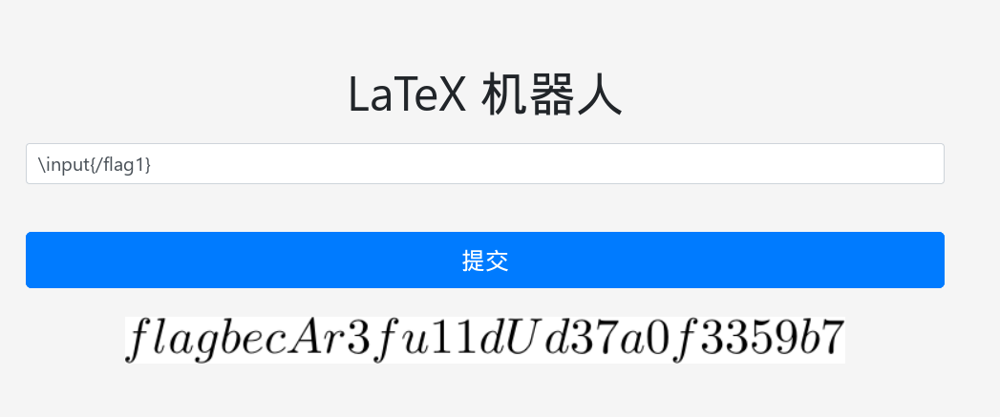
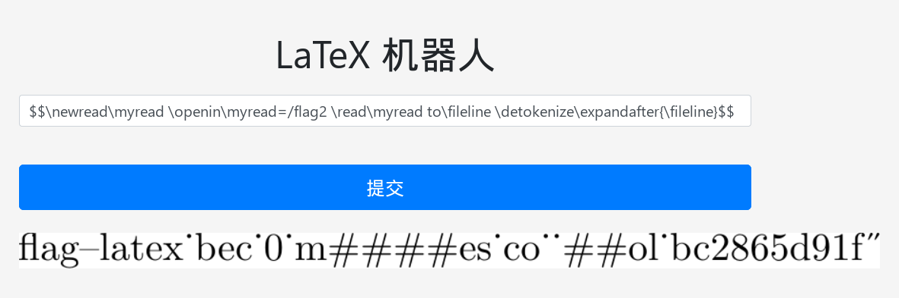

# LaTeX 机器人

题解作者：[regymm](https://github.com/regymm)

出题人、验题人、文案设计等：见 [Hackergame 2022 幕后工作人员](https://hack.lug.ustc.edu.cn/credits/)。

## 题目描述

- 题目分类：web

- 题目分值：纯文本（150）+ 特殊字符混入（200）

在网上社交群组中交流数学和物理问题时，总是免不了输入公式。而显然大多数常用的聊天软件并不能做到这一点。为了方便大家在水群和卖弱之余能够高效地进行学术交流，G 社的同学制作了一个简单易用的将 LaTeX 公式代码转换成图片的网站，并通过聊天机器人在群里实时将群友发送的公式转换成图片发出。

这个网站的思路也很直接：把用户输入的 LaTeX 插入到一个写好头部和尾部的 TeX 文件中，将文件编译成 PDF，再将 PDF 裁剪成大小合适的图片。

“LaTeX 又不是被编译执行的代码，这种东西不会有事的。”

物理出身的开发者们明显不是太在意这个网站的安全问题，也没有对用户的输入做任何检查。

那你能想办法获得服务器上放在根目录下的 flag 吗？

**纯文本**

第一个 flag 位于 `/flag1`，flag 花括号内的内容由纯文本组成（即只包含大写小写字母和数字 0-9）。

**特殊字符混入**

第二个 flag 位于 `/flag2`，这次，flag 花括号内的内容除了字母和数字之外，还混入了两种特殊字符：下划线（`_`）和井号（`#`）。你可能需要想些其他办法了。

[LaTeX 图片生成后端的 Dockerfile 附件下载](src/latexbot-backend.zip)

## 题解

明显这个题作者自己是没有能力解出来的，所以题解也只能稍微写一下了。详细的分析和 LaTeX 讲解就留给选手吧！

第一问很简单，只要随便查一下 LaTeX 读取文件，就不难发现只需要一个 `\input{}`，即可轻松解答。

因为输入是直接按 LaTeX 语法解析的，flag 的花括号没有显示出来，但也无妨。

第二问开始 tricky 了起来，因为 flag 中有特殊字符，直接解析是不符合 LaTeX 语法的从而会报错，所以必须想些其他方法。

我找到的办法是使用 `\detokenize` ，结果如下：

在本地对含有下划线和井号的字符串进行实验，不难发现这个输出中的“点”是下划线，而一个 `#` 会被变成两个。从而 flag 内容就可以得知了。
