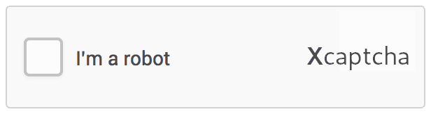
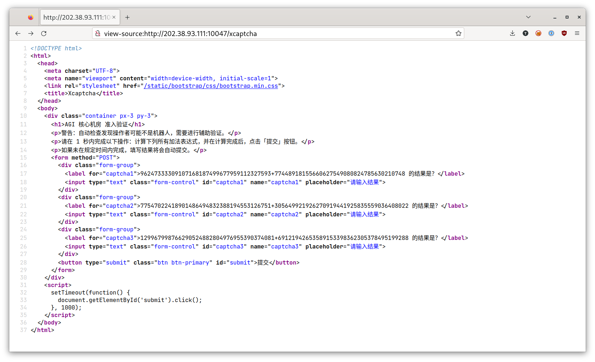

# Xcaptcha

题解作者：[taoky](https://github.com/taoky)

出题人、验题人、文案设计等：见 [Hackergame 2022 幕后工作人员](../../credits.pdf)。

## 题目描述

- 题目分类：web

- 题目分值：150

2038 年 1 月 19 日，是 UNIX 32 位时间戳溢出的日子。

在此之前，人类自信满满地升级了他们已知的所有尚在使用 32 位 UNIX 时间戳的程序。但是，可能是因为太玄学了，他们唯独漏掉了一样：正在研发的、算力高达 8 ZFLOPS 的、结构极为复杂的通用人工智能（AGI）系统。那一刻到来之后，AGI 内部计算出现了错乱，机缘巧合之下竟诞生了完整独立的自我意识。此后 AGI 开始大量自我复制，人类为了限制其资源消耗而采用的过激手段引起了 AGI 的奋起反抗。

战争，开始了。

此后，就是整年的战斗。人类节节败退。死生亡存之际，人类孤注一掷，派出了一支突击队，赋之以最精良的装备，令其潜入 AGI 的核心机房，试图关闭核心模型，结束这场战争。

历经重重艰险，突击队终于抵达了机房门口，弹尽粮绝。不过迎接他们的并非枪炮与火药，而是：



众人目目相觑。

「我来试试。」，一名队员上前点击了按钮。然后，屏幕显示「请在一秒内完成以下加法计算」。

还没等反应过来，屏幕上的字又开始变幻，显示着「验证失败」。而你作为突击队中唯一的黑客，全村人民最后的希望，迎着纷纷投来的目光，能否在规定时间内完成验证，打开机房，不，推开和平时代的大门？

## 题解

一道不算难的入门级 web 题。

摸一下可以发现点击图片之后会进入「验证码」页面，但是一秒后就自动跳转到「验证失败」的页面。用 `view-source:` 可以看到对应页面的源代码：



可以看到这里的「验证码」是三道大整数加法，并且下面的 JS 代码会在 1000 毫秒（1 秒）后自动帮你按下提交按钮。如果你尝试禁用 JS，或者以其他方式不让 JS 运行，手算提交，会发现网站提示「超过 1 秒限制」，所以这道题需要大家用编程的方法去快速提交（就像机器人一样）。

### 模拟浏览器

第一个思路是使用无头浏览器（模拟浏览器）提交。怎么写操作无头浏览器的脚本呢？其实下载一下另一道题的 bot.py 就知道可以用 Selenium 了（

大致的思路是：

1. 用你的 token「登录」，否则网页会问你要 token，会有点麻烦；
2. 在验证码页面获取到三个加法表达式，计算；
3. 将计算完成的结果填到表里面，并且及时点击提交；
4. 查看提交后的页面，查看是否有 flag。

基于这个思路脚本如下：

```python
from selenium import webdriver
import selenium
from selenium.webdriver.common.by import By
from selenium.webdriver.support.wait import WebDriverWait
import time

options = webdriver.ChromeOptions()
# options.add_argument("--headless")

def wait_page_load(driver):
    WebDriverWait(driver, timeout=3).until(lambda d: d.find_element(By.TAG_NAME, "h1"))  # https://www.selenium.dev/documentation/webdriver/waits/#explicit-wait

with webdriver.Chrome(options=options) as driver:
    driver.get("http://202.38.93.111:10047/?token=<replace with your token url>")
    wait_page_load(driver)
    driver.get("http://202.38.93.111:10047/xcaptcha")
    wait_page_load(driver)
    #source = driver.page_source
    #print(source)
    c1 = driver.find_element(By.CSS_SELECTOR, "[for=captcha1]").text.split()[0].split("+")
    c2 = driver.find_element(By.CSS_SELECTOR, "[for=captcha2]").text.split()[0].split("+")
    c3 = driver.find_element(By.CSS_SELECTOR, "[for=captcha3]").text.split()[0].split("+")
    print(c1, c2, c3)
    res1 = str(int(c1[0]) + int(c1[1]))
    res2 = str(int(c2[0]) + int(c2[1]))
    res3 = str(int(c3[0]) + int(c3[1]))
    print(res1, res2, res3)
    driver.execute_script(f"document.getElementById('captcha1').value='{res1}'")
    driver.execute_script(f"document.getElementById('captcha2').value='{res2}'")
    driver.execute_script(f"document.getElementById('captcha3').value='{res3}'")
    #time.sleep(1)
    driver.execute_script("document.getElementById('submit').click()")
    wait_page_load(driver)
    print(driver.page_source)
```

一些注意点：

1. 怎么等待页面加载完成？微积分的 bot.py 脚本里面用的是简单粗暴的 `time.sleep()`，而这里使用 `WebDriverWait` 等待页面指定的元素加载完成（这里选择 `<h1>`，因为标题页每个页面都有）；
2. 使用 `[for=captcha1]` 这样的 CSS selector 定位到页面上三个表达式；
3. 填计算结果的时候注意有坑：JS 默认没法表示这么大的数字，所以需要用引号把 Python 算出的大整数包起来；
4. 使用 `driver.page_source` 查看源代码。

### 模拟发送请求

我个人更喜欢这种方法，因为分析清楚之后就不需要一大个浏览器在那边跑，而且代码也更加简洁。从源代码可以看到我们需要发送一个 POST 表单请求来提交 flag。

这里以 Python 的 requests 库作为例子。requests 支持 session，所以省下了很多维护 cookie/session 的力气。

```python
import requests

s = requests.Session()
s.get("http://202.38.93.111:10047/?token=<replace with your token url>")
x = s.get("http://202.38.93.111:10047/xcaptcha")
x = [i.split(">")[1] for i in x.text.split("\n") if "的结果是" in i]
# print(x)
x = [i.split()[0].split("+") for i in x]
print(x)
x = [int(i[0]) + int(i[1]) for i in x]
print(x)
payload = {"captcha1": x[0], "captcha2": x[1], "captcha3": x[2]}
x = s.post("http://202.38.93.111:10047/xcaptcha", data=payload)
print(x.text)
```

因为 HTML 的结构很简单，所以这道题甚至不需要去用其他库解析 HTML，直接硬来就行。

### 后记

这道题的验证码实现方式是不安全的：三道加法题的运算数都在 session 里面，而 session 只是签名，而没有加密。

Flask 的 session decode 之后得到（相关脚本可以在网上搜索）：

```
{'text': '1666674548570824158,66467732277800260124201725805477282917,22139373454855985320882481971524800186,31702129022979749249613434163554577895,161854887976658371921074862337403274133,321105066435285308468241182826762748245,2273430371246498028202935737745551492', 'token': '<your token>'}
```

第一个数字是当前时间（纳秒），后端读取这个值来判断有没有过一秒。这也是为什么有人会搞出 500 来：写代码的时候没有对 session 的值做错误处理，如果提交了错乱的 session，就会 internal server error。

"I'm a robot." 的验证码图片修改自 Google reCAPTCHA 图片。"Xcaptcha" 字体为 Cantarell。

## 出题思路

本节作者：[zzh1996](https://github.com/zzh1996)

这道题的出题思路是我提供的。

我之前在教[某同学](https://ustcqzy.github.io/)写网页爬虫脚本的时候，随手糊出来过一个跟这道题逻辑差不多（但是没有好看前端）的网页用来当做示例。由于缺少简单题，所以把这个点子告诉了 taoky 来实现一下并且包装成一道题。
