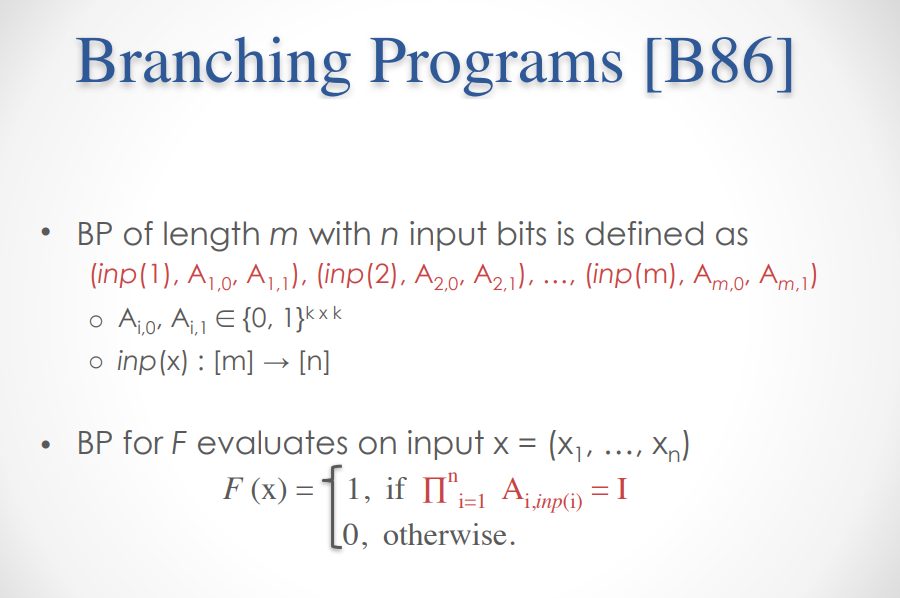
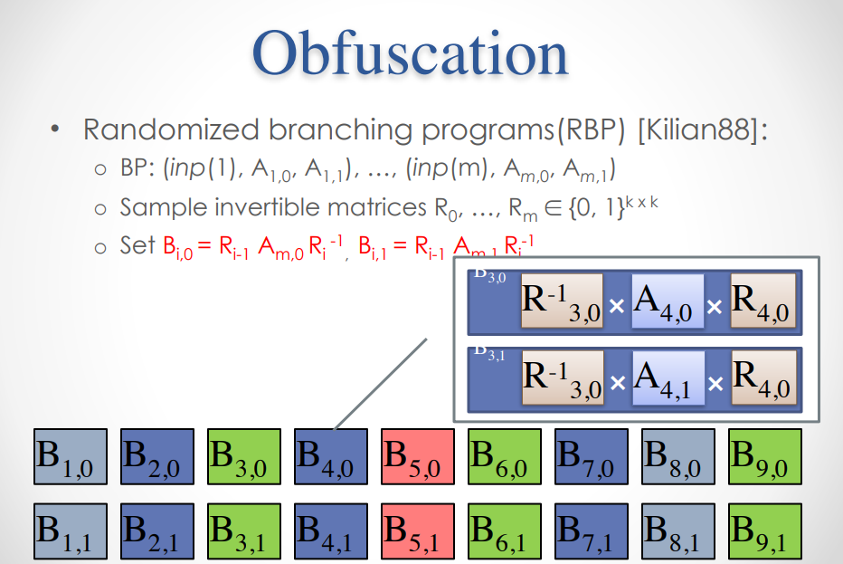

# 企鹅拼盘

题解作者：[emc2314](https://github.com/emc2314)

出题人、验题人、文案设计等：见 [Hackergame 2022 幕后工作人员](../../credits.pdf)。

## 题目描述

- 题目分类：math

- 题目分值：这么简单我闭眼都可以！（100）+ 大力当然出奇迹啦~（150）+ 这个拼盘。。能靠掀桌子弄乱吗？（350）

这是一个可爱的企鹅滑块拼盘。（觉得不可爱的同学可以换可爱的题做）

和市面上只能打乱之后拼回的普通滑块拼盘不同，这个拼盘是自动打乱拼回的。一次游戏可以帮助您体验到 `16/256/4096` 次普通拼盘的乐趣。

每一步的打乱的方式有两种，选择哪一种则由您的输入（长度为 `4/16/64` 的 `0/1` 序列）的某一位决定。如果您在最后能成功打乱这个拼盘，您就可以获取到 flag 啦，快来试试吧wwwwww


你可以在下面列出的两种方法中任选其一来连接题目：

- 点击下面的 "打开/下载题目" 按钮通过网页终端与远程交互。如果采用这种方法，在正常情况下，你不需要手动输入 token。
- 在 Linux、macOS、WSL 或 Git Bash 等本地终端中使用 `stty raw -echo; nc 202.38.93.111 11011; stty sane` 命令来连接题目。如果采用这种方法，你必须手动输入 token（复制粘贴也可）。**注意，输入的 token 不会被显示，输入结束后按 Ctrl-J 即可开始题目。**

> - 本地终端或网页终端至少需要 120x33 的大小。
> - 如果想要本地直接运行源代码，需要使用 Python 3.10 及以上版本。

> 如果你不知道 `nc` 是什么，或者在使用上面的命令时遇到了困难，可以参考我们编写的 [萌新入门手册：如何使用 nc/ncat？](https://lug.ustc.edu.cn/planet/2019/09/how-to-use-nc/)

题目代码：[下载](src/BoardProgram.zip)

## 题解

这道题，其实原本要长不少。这道题的背景，可能也比大多数人想像中的要更深刻一些。只不过因为作者是一只习惯于和 DDL 搏斗的咕咕鸟，而且还被要求在截止期限之前写好 exp，所以之前所计划的题目的大半（还包括一个应该很好看的 flutter 前端）全部被鸽了。不过意外的是这个三小时极限糊出来的 TUI 似乎反响还不错。

当然这也会造成一些缺憾，比如有选手不知道怎么输入字符串，没想到远程 terminal 也可以使用鼠标之类的事情。还可能有同学在不了解原理的前提下也能做出本题，而那些被第二问 flag 指引去老实学习的同学可能反而无从下手。窃以为 Hackergame 出题人根本上是一个服务性质的工作，负责向选手提供引导以及为选手创造发挥其才智的空间，维持比赛的公平性以保证选手参赛的正面反馈和游戏体验。从这一点来说本题无疑并没有做到其最开始设计时应该做到的程度，在此反省也希望看到本段文字的其他出题人引以为戒（~~不要当 DDL 战士了~~）。

在阅读正式题解之前，尚有兴趣的选手可以试试一道 [附加题](src/b48_obf.tar.bz2)。规则不变，但是这道题因为运行时间过久（跑完一次大概需要 2min）故而没有加入正式的题目中。附加题中使用了稍微相对复杂的结构，一些过于直接的做法可能会因此失效。

(打字好累，以下从简)

这道题的出发点是 iO。自 Barak 证明 VBB (Virtual Black Box) Obfuscation 不存在之后，Indistinguishable Obfuscation 便成为了人们追求的方向。尝试构造 iO 的方向很多而且也非常复杂，这里我们简单介绍一下基于 multilinear map 的 iO 构造。

这种构造最开始来自 GGH+13 的一篇论文，其中 Multilinear map 可以理解成类似于 ECC 上 Weil pairing 的多元形式。这篇论文里提出了一种方法基于 RBP (Randomized (Matrix) Branching Program) 的一种构造方法，而 Matrix Branching Program 是 Branching Program 的一种。我们这道题目就是从 BP 开始，稍稍引入 Kilian Randomization（虽然从这里到 iO 还有十万八千里的路要走）。



BP 是定义在一个群上，由一串指令构成，每一条指令对应一个输入 bit 和两个元素： A[i,0] 和 A[i,1]。Eval 的方式就是把这些指令中的元素按照输入的 bits 相乘，最终和单位元比较，0/1 作为结果。容易证明（留作练习）本题中 4x4 的拼盘的移动方式（保证移动前后右下角空白不变）对应的置换组成的群和交错群 A15 同构，故而企鹅拼盘即为一个基于 A15 的 Branching program。

那么如何构造一个具体的 BP 呢？在 1989 年 Barrington 提出了一个定理，后人称之为 Barrington's theorem：

> If f : {0, 1}^n → {0, 1} can be computed by a circuit of depth d, then it can be computed by a branching program of width 5 and length O(4^d)

也就是说宽度为 5 的 BP 可以模拟任何 Boolean formula，也就是 NC1。这个证明是算是构造性的，具体而言 Barrington 在 S5 群上构造出 And 门的实现，加上 Not 门非常显然可以实现，故而定理成立。而 And 门的构造的核心在于 S5 是不可解群，进一步的，是存在两个元素 A 和 B 以及他们的交换子 ABA^-1B^-1，且这三者共轭（实际上这就是 A B 两个 BP 的 and 结果，不难验证 A 或者 B 中有一个为 I 的时候此项为 I，否则为其交换子）。所以我们可以很容易把这个构造推广到其他不可解群上（容易证明 A15 是不可解群）。

在实现 BP 相关代码之前，我们需要生成至少一组 A, B 使得他们相互且于交换子共轭。为了提升随机性，我们这里生成了 32 组，显然不同组之间的元素必须相互共轭。

另外一个问题在于，即使知道 A 和 B 共轭，在 A15 这种交错群中求使 A=CBC^-1 成立的 C 也并不一定容易。所以我们选择了群中一个存在一个循环节长度为偶数的置换的共轭类（为什么要这么选留作思考题），具体而言是 (1,2,3,4,5,6),(7,8,9,10,11),(12,13,14,15)。

于是 sage 代码如下：
```python
A=AlternatingGroup(15)
C=A([(1,2,3,4,5,6),(7,8,9,10,11),(12,13,14,15)]).conjugacy_class()
cons = []
while len(cons) < 32:
    a=C.unrank(randint(0,100000))
    if a.inverse() not in C:
        continue
    b=C.unrank(randint(0,100000))
    if b.inverse() not in C:
        continue
    c=a*b*a.inverse()*b.inverse()
    if c in C and c.inverse() in C:
        cons.append((a,b))
```
然后我们定义 Branching Program:
```python
class BP:
    def __init__(self, A=A, C=C, bits=[], p0s=[], p1s=[], v=None):
        self.A = A
        self.C = C
        self.bits = bits.copy()
        self.p0s = p0s.copy()
        self.p1s = p1s.copy()
        self.v = v

    def single(self, bit, v=None):
        while v == None:
            vv = self.C.unrank(randint(0,100000))
            if vv.inverse() in vv.conjugacy_class():
                v = vv
        self.v = v
        self.bits.append(bit)
        self.p0s.append(self.A.identity())
        self.p1s.append(v)
        assert v != self.A.identity()

    def __invert__(self):
        v = self.v.inverse()
        bp = BP(A=self.A,C=self.C,bits=self.bits,p0s=self.p0s,p1s=self.p1s,v=v)
        bp.p0s[-1] = bp.p0s[-1]*v
        bp.p1s[-1] = bp.p1s[-1]*v
        return bp

    def _conjugate(self,dest):
        assert dest in self.v.conjugacy_class()
        a = self.v
        l = list(reduce(lambda a,b: list(a)+list(b), sorted(a.cycle_tuples(), key=lambda x: len(x))))
        li = list(reduce(lambda a,b: list(a)+list(b), sorted(dest.cycle_tuples(), key=lambda x: len(x))))
        lb = []
        for i in range(1,16):
            if i not in li:
                li.append(i)
        for i in range(1,16):
            if i not in l:
                l.append(i)
        for i in range(1,16):
            lb.append(li[l.index(i)])
        b=Permutation(lb)
        if b not in self.A:
            l = list(list(sorted(a.cycle_tuples(), key=lambda x: len(x))[0])[1:])+[list(sorted(a.cycle_tuples(), key=lambda x: len(x))[0])[0]]+list(reduce(lambda a,b: list(a)+list(b), sorted(a.cycle_tuples(), key=lambda x: len(x))[1:]))
            lb = []
            for i in range(1,16):
                if i not in l:
                    l.append(i)
            for i in range(1,16):
                lb.append(li[l.index(i)])
            b=Permutation(lb)
        b=self.A(b).inverse()

        bp = BP(A=self.A,C=self.C,bits=self.bits,p0s=self.p0s,p1s=self.p1s,v=self.v)
        bp.v = b*bp.v*b.inverse()
        bp.p0s[0] = b*bp.p0s[0]
        bp.p1s[0] = b*bp.p1s[0]
        bp.p0s[-1] = bp.p0s[-1]*b.inverse()
        bp.p1s[-1] = bp.p1s[-1]*b.inverse()

        assert bp.v == dest
        return bp

    def _inverse(self):
        return self._conjugate(self.v.inverse())

    def __add__(self,other):
        bp = BP(A=self.A,C=self.C,bits=self.bits,p0s=self.p0s,p1s=self.p1s,v=self.v)
        bp.bits += other.bits
        bp.p0s += other.p0s
        bp.p1s += other.p1s
        bp.v = bp.v*other.v
        return bp

    def __and__(self,other):
        va, vb = choice(cons)
        a=self._conjugate(va)
        b=other._conjugate(vb)
        bp = a+b+a._inverse()+b._inverse()
        return bp

    def __or__(self,other):
        return ~((~self)&(~other))

    def __xor__(self,other):
        return (self&~other)|(~self&other)

    def evaluate(self, bits):
        v = self.A.identity()
        for i in range(len(self.bits)):
            if bits[self.bits[i]]:
                v = v*self.p1s[i]
            else:
                v = v*self.p0s[i]
        assert v==self.A.identity() or v==self.v
        return v==self.v

```
(其中 ```__add__``` 的含义是拼接而不是加法，只在内部使用。)

完成了基础功能我们可以稍作优化，比如把相邻的 bit 如果相同则合并等等（实际上应该不太会发生）
```python
def optimize(self):
    for i in range(len(self.bits)-1):
        if self.bits[i] == self.bits[i+1]:
            self.bits.pop(i+1)
            self.p0s[i] = self.p0s[i]*self.p0s.pop(i+1)
            self.p1s[i] = self.p1s[i]*self.p1s.pop(i+1)
            self.optimize()
            break
    for i in range(len(self.bits)-1):
        if self.p0s[i+1] == self.p1s[i+1]:
            self.bits.pop(i+1)
            self.p0s[i] = self.p0s[i]*self.p0s.pop(i+1)
            self.p1s[i] = self.p1s[i]*self.p1s.pop(i+1)
            self.optimize()
            break
```
此时我们的元素还是置换，而不是具体的移动方法，所以我们需要实现一个 ```toMoves``` 函数，把置换求解成滑块的移动（因为元素在 A15 内所以一定可解）。具体实现作为课后练习，此处不开源（~~实际上是因为代码太烂了~~）,需要注意的是必须使用确定性解而不可以使用 ```A*``` 等启发式搜索算法，否则复杂度 gg。（毕竟有 4096x2（附加题有 150 万x2）个置换需要求解）。

然后我们就可以出题啦：

```python
bitlength = 4
obf = False
filename = f'b{bitlength}{"_obf" if obf else ""}.json'
ans = list(map(int, bin(int(hashlib.sha256(f"{filename}-safesuffix".encode()).hexdigest(),16))[-bitlength:]))
bps = []
for i in range(bitlength):
    bps.append(BP())
    bps[i].single(i)
rbps = [[bps[i] if ans[i] else ~bps[i] for i in range(bitlength)]]
while len(rbps[-1]) > 1:
    if obf:
        shuffle(rbps[-1])
    nrbps = []
    for i in range(len(rbps[-1])//2):
        nrbps.append(rbps[-1][i*2]&rbps[-1][i*2+1])
    if len(rbps[-1]) % 2:
        nrbps.append(rbps[-1][-1])
    rbps.append(nrbps)
if obf:
    rbps[-1][0].obfuscate()
rbps[-1][0].optimize()
json.dump(rbps[-1][0].toMoves(),open(filename,'w'))
```
嘛，细心的同学可能发现了，我们还有一个 ```obfuscate``` 函数没有实现，这个就是 Kilian Randomization 的部分了。从 ```b4.json``` 中我们可以看到存在一些空置换，而这些空置换的位置恰好对应了代码中 Not 门的位置。为了隐藏起这些固定的结构，我们在两条指令间插入相互抵销的群元素：



用代码写就是：
```python
def obfuscate(self):
    for i in range(len(self.bits)-1):
        v = self.A.random_element()
        self.p0s[i] = self.p0s[i]*v
        self.p1s[i] = self.p1s[i]*v
        self.p0s[i+1] = v.inverse()*self.p0s[i+1]
        self.p1s[i+1] = v.inverse()*self.p1s[i+1]
    v = self.A.random_element()
    self.p0s[0] = v*self.p0s[0]
    self.p1s[0] = v*self.p1s[0]
    self.p0s[-1] = self.p0s[-1]*v.inverse()
    self.p1s[-1] = self.p1s[-1]*v.inverse()
    self.v = v*self.v*v.inverse()
```
好，原理讲完啦。（什么？没讲清楚？自己看论文去吧）（累趴）

那么期望题解呢？

第一问有手就行，第二问直接复用代码爆破。第三问可以简单观察，得知第一层存在一些 Not 门而第二层之后全是 And。于是乎只需要把每连续四个 bits 对应的元素乘起来，改变输入观察结果，如果发现比例是 1:3 的话，那么 1 对应的输入就是两个 True 值啦。于是解题代码如下：

```python
r = [0]*64
solved = []
i = 0
while len(solved) < 64:
    bp=BP(bits=challengeBP.bits[i:i+4],p0s=challengeBP.p0s[i:i+4],p1s=challengeBP.p1s[i:i+4])
    bpair = challengeBP.bits[i:i+2]
    bpair.sort()
    tc = {}
    for x in range(2):
        for y in range(2):
            v=peval(bp,[0]*bpair[0]+[x]+[0]*(bpair[1]-bpair[0]-1)+[y])
            if v not in tc:
                tc[v]=[0,(x,y)]
            tc[v][0] += 1
    for v in tc:
        if tc[v][0] == 1:
            r[bpair[0]] = tc[v][1][0]
            r[bpair[1]] = tc[v][1][1]
            if bpair[0] not in solved:
                solved.append(bpair[0])
            if bpair[1] not in solved:
                solved.append(bpair[1])
        else:
            assert tc[v][0] == 3
    i += 4
```

什么？附加题的解题方法？我只能说把上面的代码迭代几层之后就能逆向出所有门的逻辑，然后剩下的就只剩下简单的数学部分了。

剧透：2023 年估计不会继续往下出题了，要真出到 iO 的话 writeup 和 exp 我都得写累死 Orz。
