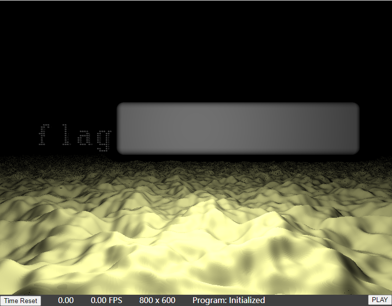
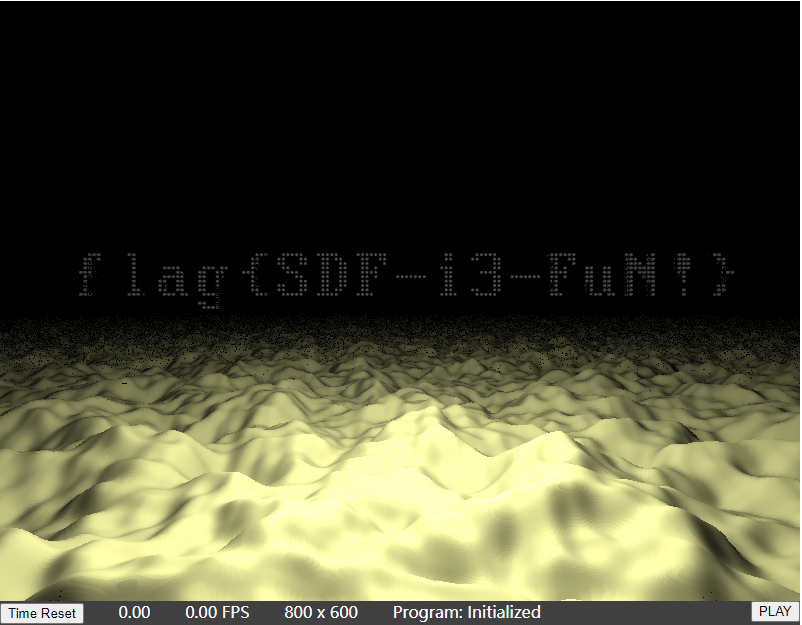

# 光与影

题解作者：[libreliu](https://github.com/libreliu/)

出题人、验题人、文案设计等：见 [Hackergame 2022 幕后工作人员](https://hack.lug.ustc.edu.cn/credits/)。

## 题目描述

- 题目分类：general

- 题目分值：250

冒险，就要不断向前！

在寂静的神秘星球上，继续前进，探寻 flag 的奥秘吧！

提示：题目代码编译和场景渲染需要一段时间（取决于你的机器配置），请耐心等待。如果你看到 "Your WebGL context has lost." 的提示，则可能需要更换浏览器或环境。目前我们已知在 Linux 环境下，使用 Intel 核显的 Chrome/Chromium 用户可能无法正常渲染。

## 题解

### 出题思路

本题是 Hackergame 2020 的[超简陋的 OpenGL 小程序](https://github.com/USTC-Hackergame/hackergame2020-writeups/tree/master/official/%E8%B6%85%E7%AE%80%E9%99%8B%E7%9A%84%20OpenGL%20%E5%B0%8F%E7%A8%8B%E5%BA%8F)一题的精神续作，即 flag 均被场景中物体遮挡而无法看到。

传统上，用于实时渲染的[渲染管线](https://learnopengl-cn.readthedocs.io/zh/latest/01%20Getting%20started/04%20Hello%20Triangle/)大致是输入三角面片模型的顶点数据，依次变换到世界坐标、投影坐标后进行透视除法，得到三角形的各个顶点在**屏幕空间坐标**上的位置，然后对每个在屏幕上可见的像素进行深度排序和剔除后 (Early-Z 启用时)，运行片段着色器程序，得到每个像素最终的颜色。这也是 2020 年题目进行渲染所用的方式，也是绝大多数“主流”的实时渲染的图形程序的实现方法。

不过，本题中进行模型渲染的方法有所不同：所有真正的渲染工作都发生在**片段着色器**中。

所谓「都发生在片段着色器中」，其实就是用若干三角形覆盖整个屏幕，达到让屏幕的每一个像素都会运行一次片段着色的效果。

简单来说，可以把这样配置的渲染管线中的片段着色器看成一个函数 `(r(x, y), g(x, y), b(x, y)`，输入的是每一个屏幕上像素的屏幕空间坐标 `x` 和 `y`，输出的是该点的 `RGB` 值。

虽然在这里的片段着色器的功能非常容易理解，但是进行程序编写的程序设计语言还是要使用 OpenGL ES 着色器语言 (Shading Language)；不过大体上来说，这门语言和 C 的风格很像，应该不难理解。

用片段着色器进行渲染的头号难题，是如何对场景进行着色，也就是给定屏幕上 `(x, y)` 点坐标，应该如何知晓该点的颜色呢？

假使我们知道摄像机的位置、朝向和向上的方向，那么我们就可以将屏幕上的 `(x, y)` 对应相机的「感光元件」中某个位置应该接受的光的强度联系起来。自然的，我们就可以想象从相机受光的这个像素打一条光线出去，看看他和场景中哪个物体的哪一个地方相交，这个地方的材质如何、以及是否被场景中的光源照射到、如果照射到那么和曲面在这里的法线夹角如何。

这里面有几个问题：
1. 怎么寻找从相机发出的这条射线和场景交于哪点？
2. 怎么获得相交点的法线方向？
3. 怎么知道相交位置是否被场景中的光源照射到？

#### Raymarching + SDF

通过使用一种被称作**有向距离场** (Signed Distance Field, 下面简称 SDF) 的隐式曲面表示形式，配合被称作 **Raymarching** 的光线-场景求交技术，我们可以解决上面提出的问题。

所谓 **SDF**，粗略的来说，就是一个函数 `float SDF(vec3 position)`，对给定的空间中位置 `position`，它的值为该 SDF 所表示的隐式曲面到该位置的最短距离。

对于简单的物体来说，SDF 是可以解析或近似解析的进行表示的，比如 [Inigo Quilez ::   articles :: distance functions](https://iquilezles.org/articles/distfunctions/) 这里就收集有很多常见几何体的 SDF 表示。

同时，我们可以法线，简单的用 `min(SDF1, SDF2)` 和 `max(SDF1, SDF2)` 就可以构造在物体的外部正确的、两物体并集和交集的 SDF 表示。

> 值得注意的是，SDF 一般意义上来说是对曲面内部和外部均有定义的，曲面内部的点 SDF 值为负数。[这篇文章](https://iquilezles.org/articles/interiordistance/) 讨论了前面简单的 min/max 的做法可能会对在曲面内部的 SDF 的表示中产生的问题。

那么，一种很自然的想法就是通过基本几何体的交、并、差等实现复杂场景的表示。如果仔细观察的话，本场景中的 flag 文本就是由一个一个球体进行并集操作合并而成的，而最外面的 box 则最后和它们并上 (参考 `sceneSDF` 函数)。

> 如果把 box 也写到这道题中由文字生成的表达式中，题目的难度应该会上升一个等级。不过笔者出这道题目的目的，还是让大家玩玩 Shader，太复杂就感觉有些跑偏了。

那么，有了 SDF 表示后，应该如何渲染场景呢？那就要用到 **Raymarching** 了。

从摄像机发出一条光线 `r(t) = origin + t * direction` (为了方便起见，`direction` 需要是单位长度的), 我们要找到使得光线交于场景的那个 `t` 值。

由于 SDF 表示隐式曲面到该位置的最短距离，所以我们的光线每次走 `SDF(r(t_i))` 的步长是不会因为步长过大而错过交点的。循环几次，直到 `SDF(r(t_k))` 的值小于我们心目中的某个值，这样我们就找到了与曲面的交点，这就是 `rayMarchConservative` 函数的基本思想。

不过组成场景的另外一个重要部分是 ~~(并不)~~ 像火星地表一样的崎岖不平的地形。这个地形是来源于分形 Perlin 噪声，实现在 `cnoise` 和 `heightMap` 函数中。

我们从 `heightMap` 拿到的输出，是一个表示对于给定平面上坐标所对应的高度的映射的函数，这个函数并不能直接用 SDF 表达，自然前面说的 Raymarching 技术其实不是很起作用。

所以，这里笔者参考了 [Mountains - Shadertoy](https://www.shadertoy.com/view/4slGD4) 中对高度图求交的方法，在 `intersectHeightMap` 里面做了高度图的求交计算。

求交之后的另一个步骤是**光照计算**，这里只计算了给定位置的点光源照射到该物体的 Lambertian 反射所做的贡献，可以参考 `shadeScene` 函数。其中，面法线的估计采用简单的差分方法实现。

### 解法

超级简单！原来的场景如图所示：



只要将网页引用的 Javascript 脚本 `fragment-shader.js` 中，`sceneSDF` 函数中 `tmin` 的计算由

```javascript
float tmin = min(min(min(min(t1, t2), t3), t4), t5);
```

改为

```javascript
float tmin = min(min(min(t1, t2), t3), t4);
```

即可获得被遮挡的 flag，如图所示：



### 花絮

#### 编译 Shader 时浏览器卡顿

由于 Shader 里写了巨长的表达式来解析的表示 flag 文字，所以各路验题人都遇到了或多或少的性能问题，其中比较突出的是编译 Shader 时浏览器会卡住。

这个问题根据 [Stack Overflow 的回答](https://stackoverflow.com/questions/53541626/webgl-how-to-avoid-long-shader-compile-stalling-a-tab)来看，似乎很难避免。

#### 性能问题

由于 Fragment Shader 里面搞了这么多计算，所以核显和亮机卡用户普遍表示压力很大，还有不少人吐槽说浏览器 / 系统都会 hang 住。

~~新一代 Graphics Stack 稳定性测试！AMD / NVIDIA / Intel 给我打钱~~
