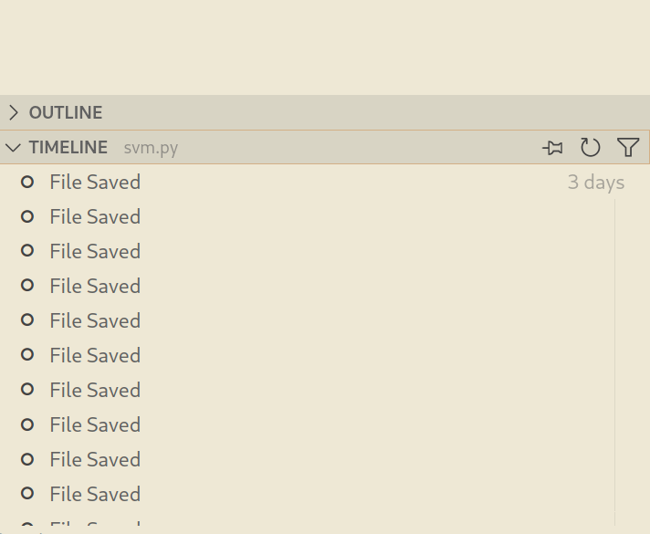

# 家目录里的秘密

题解作者：[taoky](https://github.com/taoky)

出题人、验题人、文案设计等：见 [Hackergame 2022 幕后工作人员](https://hack.lug.ustc.edu.cn/credits/)。

## 题目描述

- 题目分类：general

- 题目分值：VS Code 里的 flag（100）+ Rclone 里的 flag（150）

实验室给小 K 分配了一个高性能服务器的账户，为了不用重新配置 VSCode, Rclone 等小 K 常用的生产力工具，最简单的方法当然是把自己的家目录打包拷贝过去。

但是很不巧，对存放于小 K 电脑里的 Hackergame 2022 的 flag 觊觎已久的 Eve 同学恰好最近拿到了这个服务器的管理员权限（通过觊觎另一位同学的敏感信息），于是也拿到了小 K 同学家目录的压缩包。

然而更不巧的是，由于 Hackergame 部署了基于魔法的作弊行为预知系统，Eve 同学还未来得及解压压缩包就被 Z 同学提前抓获。

为了证明 Eve 同学不良企图的危害性，你能在这个压缩包里找到重要的 flag 信息吗？

**公益广告：题目千万条，诚信第一条！解题不合规，同学两行泪。**

[打开/下载题目](src/user_home.tar.gz)

## 题解

这道题 idea 是 @zzh1996 的，我负责 implementation。

这道题不算难（特别是第一小题，就是为了送分的）。

### VS Code

做法很简单：只要在文件夹里搜索 flag 就行了。为了提供一些干扰项，我下载了 xv6-riscv 的代码，然后把里面有 flag 这个单词的文件全点了一遍。

可选的做法有很多：可以直接在 VS Code 里面打开这个目录然后搜索，也可以用命令行工具：

```console
$ grep -IR 'flag{' .
grep: ./.config/menus/cinnamon-applications-merged: No such file or directory
./.config/Code/User/History/2f23f721/DUGV.c:// flag{finding_everything_through_vscode_config_file_932rjdakd}
$ # 或者可以用 ripgrep
$ rg -F --hidden --no-ignore 'flag{'
.config/Code/User/History/2f23f721/DUGV.c
5:// flag{finding_everything_through_vscode_config_file_932rjdakd}
```

这一小题的目的是告诉大家：你以为你删掉的文件，其实可能 VS Code 还帮你留了一份。

在不同的操作系统下，VS Code 的配置目录是不同的：

- Windows: `%APPDATA%\Code\`
- Linux: `$HOME/.config/Code/`
- macOS: `$HOME/Library/Application Support/Code/`

对于这道题，罪魁祸首是 VS Code 默认开启的本地编辑历史（Local history）功能。**即使没有使用 git 来跟踪历史，每次保存文本文件的时候，VS Code 都会帮你保存一份副本**。历史记录可以在左侧 "Explorer" 列的 "Timeline" 里面看到。



除此之外，VS Code 还会记录工作区里面未保存的文件的内容，如果你直接关闭了 VS Code，下次启动的时候未保存的文件它还会帮你恢复。这个功能被称为 [Hot Exit](https://code.visualstudio.com/docs/editor/codebasics#_hot-exit)。对应的文件会保存到 `vscode 的配置目录/Backups`。

如果不需要以上两个功能，可以在 VS Code 的设置中关闭。

### Rclone

首先 rclone 的配置文件很容易找到，在 `.config/rclone/rclone.conf`，第二个 flag 就在这里。

需要注意的是，题目目标不是去连接 `ftp.example.com`。根据 RFC 2606，"example.com" 是被保留的二级域名，目的就是提供一个展示配置的例子，而不用担心这个域名突然被奇怪的人注册之后用在奇怪的地方（作为一个反面教材，之前 Golang 的官方代码示例中曾经出现过随便写的例子域名跳转到色情网站的情况）。

所以可以推断出，flag 在密码栏里，但是看起来这个密码被混淆了。不过，我们可以实际去装个 rclone 试一下，密码填 123456：

```console
$ rclone config
2022/10/24 15:01:28 NOTICE: Config file "/home/user/.config/rclone/rclone.conf" not found - using defaults
No remotes found - make a new one
n) New remote
s) Set configuration password
q) Quit config
n/s/q> n
name> test
Type of storage to configure.
Enter a string value. Press Enter for the default ("").
Choose a number from below, or type in your own value
 1 / 1Fichier
   \ "fichier"
 2 / Alias for an existing remote
   \ "alias"
 3 / Amazon Drive
   \ "amazon cloud drive"
 4 / Amazon S3 Compliant Storage Provider (AWS, Alibaba, Ceph, Digital Ocean, Dreamhost, IBM COS, Minio, Tencent COS, etc)
   \ "s3"
 5 / Backblaze B2
   \ "b2"
 6 / Box
   \ "box"
 7 / Cache a remote
   \ "cache"
 8 / Citrix Sharefile
   \ "sharefile"
 9 / Dropbox
   \ "dropbox"
10 / Encrypt/Decrypt a remote
   \ "crypt"
11 / FTP Connection
   \ "ftp"
12 / Google Cloud Storage (this is not Google Drive)
   \ "google cloud storage"
13 / Google Drive
   \ "drive"
14 / Google Photos
   \ "google photos"
15 / Hubic
   \ "hubic"
16 / In memory object storage system.
   \ "memory"
17 / Jottacloud
   \ "jottacloud"
18 / Koofr
   \ "koofr"
19 / Local Disk
   \ "local"
20 / Mail.ru Cloud
   \ "mailru"
21 / Microsoft Azure Blob Storage
   \ "azureblob"
22 / Microsoft OneDrive
   \ "onedrive"
23 / OpenDrive
   \ "opendrive"
24 / OpenStack Swift (Rackspace Cloud Files, Memset Memstore, OVH)
   \ "swift"
25 / Pcloud
   \ "pcloud"
26 / Put.io
   \ "putio"
27 / SSH/SFTP Connection
   \ "sftp"
28 / Sugarsync
   \ "sugarsync"
29 / Transparently chunk/split large files
   \ "chunker"
30 / Union merges the contents of several upstream fs
   \ "union"
31 / Webdav
   \ "webdav"
32 / Yandex Disk
   \ "yandex"
33 / http Connection
   \ "http"
34 / premiumize.me
   \ "premiumizeme"
35 / seafile
   \ "seafile"
Storage> 11
** See help for ftp backend at: https://rclone.org/ftp/ **

FTP host to connect to
Enter a string value. Press Enter for the default ("").
Choose a number from below, or type in your own value
 1 / Connect to ftp.example.com
   \ "ftp.example.com"
host> ftp.example.com
FTP username, leave blank for current username, user
Enter a string value. Press Enter for the default ("").
user> test
FTP port, leave blank to use default (21)
Enter a string value. Press Enter for the default ("").
port> 21
FTP password
y) Yes type in my own password
g) Generate random password
y/g> y
Enter the password:
password:
Confirm the password:
password:
Use FTPS over TLS (Implicit)
When using implicit FTP over TLS the client will connect using TLS
right from the start, which in turn breaks the compatibility with
non-TLS-aware servers. This is usually served over port 990 rather
than port 21. Cannot be used in combination with explicit FTP.
Enter a boolean value (true or false). Press Enter for the default ("false").
tls>
Use FTP over TLS (Explicit)
When using explicit FTP over TLS the client explicitly request
security from the server in order to upgrade a plain text connection
to an encrypted one. Cannot be used in combination with implicit FTP.
Enter a boolean value (true or false). Press Enter for the default ("false").
explicit_tls>
Edit advanced config? (y/n)
y) Yes
n) No (default)
y/n> n
Remote config
--------------------
[test]
host = ftp.example.com
user = test
port = 21
pass = *** ENCRYPTED ***
--------------------
y) Yes this is OK (default)
e) Edit this remote
d) Delete this remote
y/e/d> y
Current remotes:

Name                 Type
====                 ====
test                 ftp

e) Edit existing remote
n) New remote
d) Delete remote
r) Rename remote
c) Copy remote
s) Set configuration password
q) Quit config
e/n/d/r/c/s/q> q
```

然后看看：

```console
$ cat ~/.config/rclone/rclone.conf
[test]
type = ftp
host = ftp.example.com
user = test
port = 21
pass = 1JSoPhL7qgX4QydAFl9k_-I12fJpYw
```

可以注意到：

- 配置中的密码和 123456 不同，说明被混淆了；
- 但是这个混淆一定是可逆的，因为 rclone 没有问我们要其他的方法去加密存储的密码。在实际连接的时候，它必须要获得原始的密码。

这个「加密/混淆」功能对应的是 [rclone obscure](https://rclone.org/commands/rclone_obscure/)。如果你的搜索技能够好，可能可以找到解混淆的 golang 代码。没有找到也没有关系，我们来看一下 rclone 的代码，搜索 obscure，可以定位到文件 `fs/config/obscure/obscure.go`：

```golang
package obscure

// 省略部分代码

// Reveal an obscured value
func Reveal(x string) (string, error) {
	ciphertext, err := base64.RawURLEncoding.DecodeString(x)
	if err != nil {
		return "", fmt.Errorf("base64 decode failed when revealing password - is it obscured?: %w", err)
	}
	if len(ciphertext) < aes.BlockSize {
		return "", errors.New("input too short when revealing password - is it obscured?")
	}
	buf := ciphertext[aes.BlockSize:]
	iv := ciphertext[:aes.BlockSize]
	if err := crypt(buf, buf, iv); err != nil {
		return "", fmt.Errorf("decrypt failed when revealing password - is it obscured?: %w", err)
	}
	return string(buf), nil
}

// MustReveal reveals an obscured value, exiting with a fatal error if it failed
func MustReveal(x string) string {
	out, err := Reveal(x)
	if err != nil {
		log.Fatalf("Reveal failed: %v", err)
	}
	return out
}
```

整个逻辑一览无余了。当然我们可以去手工实现解密，但是为什么不直接调用这个函数呢？

```golang
package main

import (
        "fmt"
        "github.com/rclone/rclone/fs/config/obscure"
)

func main() {
        fmt.Println(obscure.MustReveal("tqqTq4tmQRDZ0sT_leJr7-WtCiHVXSMrVN49dWELPH1uce-5DPiuDtjBUN3EI38zvewgN5JaZqAirNnLlsQ"))
}
```

新手提示：

1. 先 `go mod init <name>` 生成 go package（`<name>` 换成你喜欢的名字）
2. 将需要运行的 go 代码放进一个 go 文件里（注意这里 `package` 需要为 `main`），然后 `go run your_file.go`
3. 按照给出的提示下载缺少的依赖（`go get github.com/rclone/rclone/fs/config/obscure`）

这道题也提醒了：rclone 的这种混淆（以及其他类似软件对密码的混淆）只能防止从你旁边经过的人的匆匆一瞥，无法防止以各种方式看到你的文件的人拿到真正的密码。

## 出题思路

本节作者：[zzh1996](https://github.com/zzh1996)

这道题的出题思路是我提供的。

我在使用 VSCode 的过程中发现，从某个版本开始，VSCode 有了本地的文件历史记录功能，会在你每次保存文件时在它自己的目录下保存一份副本。虽然这题直接 grep 就能找到 flag，但是我想提醒大家的是，如果你在 VSCode 中编辑过一些包含敏感信息的文件（例如 API key、私钥、密码等等），并且你不希望这些敏感信息直接保存在磁盘上，那么你应该清理一下 VSCode 保存的历史记录。

对于使用 VSCode Remote 的场景，VSCode 编辑过的文件的历史版本会保存在服务器上。例如说你用 VSCode 连接一台公用的服务器，在上面编辑了一些敏感信息，但是很快删掉了，这时 VSCode 的历史记录里面仍然会保存有一份。即使你把项目目录删掉了，VSCode 的历史记录也仍然会存在。

关于第二问，我是在自己使用 Rclone 的过程中发现它保存在配置文件里的密码被“加密”了。但是既然 Rclone 都可以直接使用这个密码，就说明它没有被真的“加密”，而只是混淆了一下而已。这里提醒一下大家，虽然“加密”后的密码变成了一串看起来随机的字符串，但是这并没有带来太多额外的安全性。可以类比成 base64，并不是真正的加密，只是混淆了一下而已。
