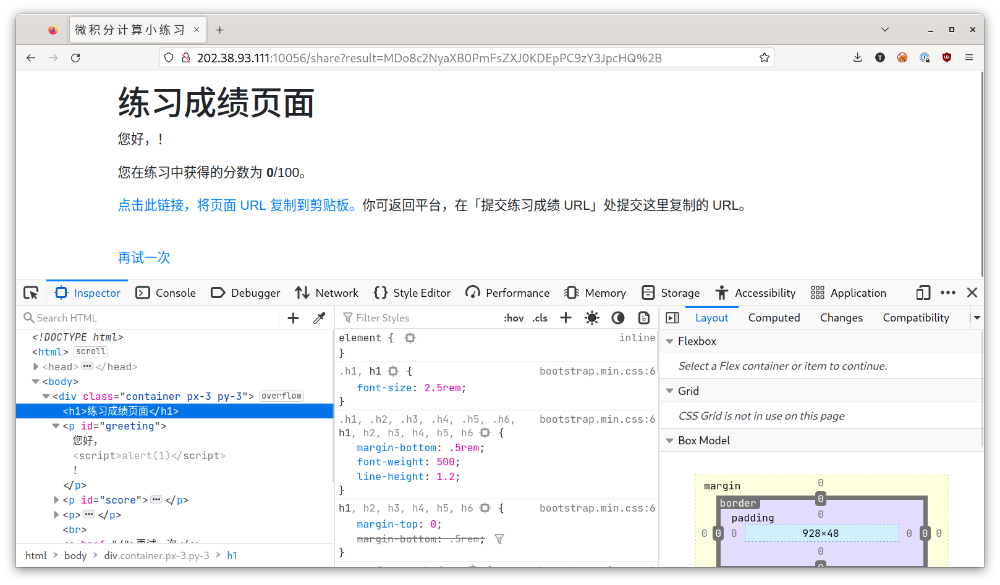
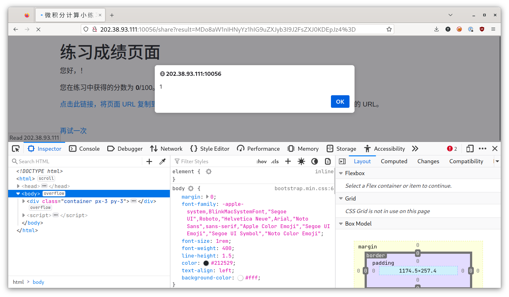

# 微积分计算小练习

题解作者：[taoky](https://github.com/taoky)

出题人、验题人、文案设计等：见 [Hackergame 2022 幕后工作人员](https://hack.lug.ustc.edu.cn/credits/)。

## 题目描述

- 题目分类：web

- 题目分值：200

小 X 作为某门符号计算课程的助教，为了让大家熟悉软件的使用，他写了一个小网站：上面放着五道简单的题目，只要输入姓名和题目答案，提交后就可以看到自己的分数。

[点击此链接访问练习网站](http://202.38.93.111:10056/?token={token})

想起自己前几天在公众号上学过的 Java 设计模式免费试听课，本着前后端离心（咦？是前后端离心吗？还是离婚？离。。离谱？总之把功能能拆则拆就对啦）的思想，小 X 还单独写了一个程序，欢迎同学们把自己的成绩链接提交上来。

总之，因为其先进的设计思想，需要同学们做完练习之后手动把成绩连接贴到这里来：

[点击此链接提交练习成绩 URL](http://202.38.93.111:10057/?token={token})

点击下方的「打开/下载题目」按钮，查看接收成绩链接的程序的源代码。

提示：

1. 不必输入自己真实的姓名；
2. 根据比赛规则，**请勿分享自己的链接，或点击其他人分享的链接**。

[打开/下载题目](src/bot/bot.py)

## 题解

这可能是 hackergame 历史以来第一道 XSS 题目。和 @volltin 聊天的时候，我说「我们整一道简单的 XSS 吧！」，于是当时讨论出的场景是「一个成绩单，名字可以随便填来 XSS」，最终我在写实现实际落地的时候场景换成了微积分小测验。

本题不要求选手掌握与微积分或符号计算软件有关的任何知识（事实上微积分很多东西我也差不多忘了，这五道题是我随便找的，然后拿 sympy 验算了一下结果）。

打开题目，先随便填，然后看结果页面的源代码：

```html
<!DOCTYPE html>
<html>
  <head>
    <meta charset="UTF-8">
    <meta name="viewport" content="width=device-width, initial-scale=1">
    <link rel="stylesheet" href="/static/bootstrap/css/bootstrap.min.css">
    <title>微 积 分 计 算 小 练 习</title>
  </head>
  <body>
    <div class="container px-3 py-3">
        <h1>练习成绩页面</h1>
        <p id="greeting">您好，[[ username ]]！</p>
        <p id="score">您在练习中获得的分数为 <b>[[ score ]]</b>/100。</p>

        <p><a href="#" id="copy">点击此链接，将页面 URL 复制到剪贴板。</a>你可返回平台，在「提交练习成绩 URL」处提交这里复制的 URL。</p>
        <br>
        <a href="/">再试一次</a>
    </div>
    <script>
        function click() {
            var url = window.location.href;
            var input = document.createElement('input');
            input.setAttribute('readonly', 'readonly');
            input.setAttribute('value', url);
            document.body.appendChild(input);
            input.select();
            if (document.execCommand('copy')) {
                document.execCommand('copy');
                alert('已复制到剪贴板');
            }
            document.body.removeChild(input);
        }
        
        document.querySelector("#copy").addEventListener("click", click);

        const queryString = window.location.search;
        const urlParams = new URLSearchParams(queryString);
        const result = urlParams.get('result');
        const b64decode = atob(result);
        const colon = b64decode.indexOf(":");
        const score = b64decode.substring(0, colon);
        const username = b64decode.substring(colon + 1);

        document.querySelector("#greeting").innerHTML = "您好，" + username + "！";
        document.querySelector("#score").innerHTML = "您在练习中获得的分数为 <b>" + score + "</b>/100。";

    </script>
  </body>
</html>
```

阅读可以看到它的逻辑：

1. [`window.location.search`](https://developer.mozilla.org/en-US/docs/Web/API/Location/search) 获取了 URL 中的查询字符串，然后由 [`URLSearchParams`](https://developer.mozilla.org/en-US/docs/Web/API/URLSearchParams) 解析；
2. 取出的 `result` 使用 `atob()` 解码 base64 字符串，然后以冒号 `:` 分割，前者为分数，后者为用户名；
3. 最后，修改 ID 为 `greeting` 和 `score` 的两个元素的内部 HTML，可以注意到，**这里的操作就是直接拼接了字符串**。

**直接拼接 HTML 是非常非常危险的事情，因为 HTML 中可以包含任意的 JavaScript 脚本命令。通过 XSS，攻击者可以以你的身份做任何事情**。作为 XSS 最经典的例子，我们可以试试把用户名设置为 `<script>alert(1)</script>`：



诶，好像没有弹窗嘛！这是因为，标准规定，[使用 `innerHTML` 插入的 `<script>` 标签不会被执行](https://developer.mozilla.org/en-US/docs/Web/API/Element/innerHTML#security_considerations)。但是这不代表 `innerHTML` 就安全了，让我们微调一下我们的 payload 到 ``（图片无法加载的时候，会执行 `onerror` 里面的 JS 脚本）：



我们的 `alert(1)` 脚本执行了！

接下来就是回到「提交练习成绩 URL」这里，把我们构造的 payload 喂给 bot（初见题目的时候一般都会点击打开题目的按钮，这时候会下载一个 bot.py）。这里可能「经验丰富」的选手会有思维定势，会写出把 `document.cookie` 发送到自己的服务器的 payload——结果发现环境压根没网。解答的关键在：

```python
try:
    greeting = driver.execute_script(f"return document.querySelector('#greeting').textContent")
    score = driver.execute_script(f"return document.querySelector('#score').textContent")
except selenium.common.exceptions.JavascriptException:
    print('JavaScript Error: Did you give me correct URL?')
    exit(1)

print("OK. Now I know that:")
print(greeting)
print(score)
```

这里会把 ID 为 greeting 和 score 的元素的内容显示出来。所以我们把 flag 写到里面就行了。设置用户名为 ``，然后提交得到的 URL 再扔给 bot 就好了。

### 致谢

本题参考了 PKU-GeekGame v1 的「Q小树洞的一大步」一题的有关源代码文件（[writeup](https://github.com/PKU-GeekGame/geekgame-1st/tree/master/writeups/xmcp#q%E5%B0%8F%E6%A0%91%E6%B4%9E%E7%9A%84%E4%B8%80%E5%A4%A7%E6%AD%A5-webhole)），在此表示感谢。相关文件以 BSD 协议授权。
