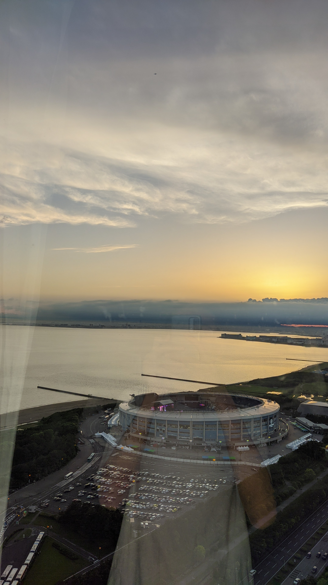
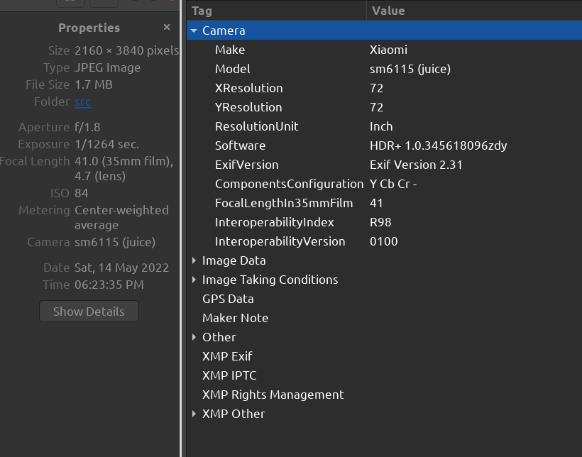
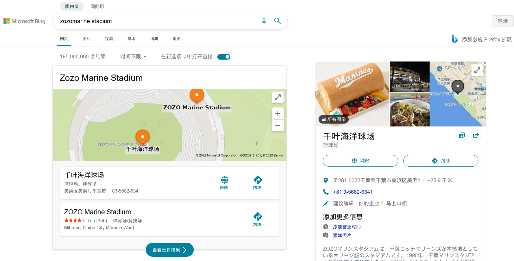
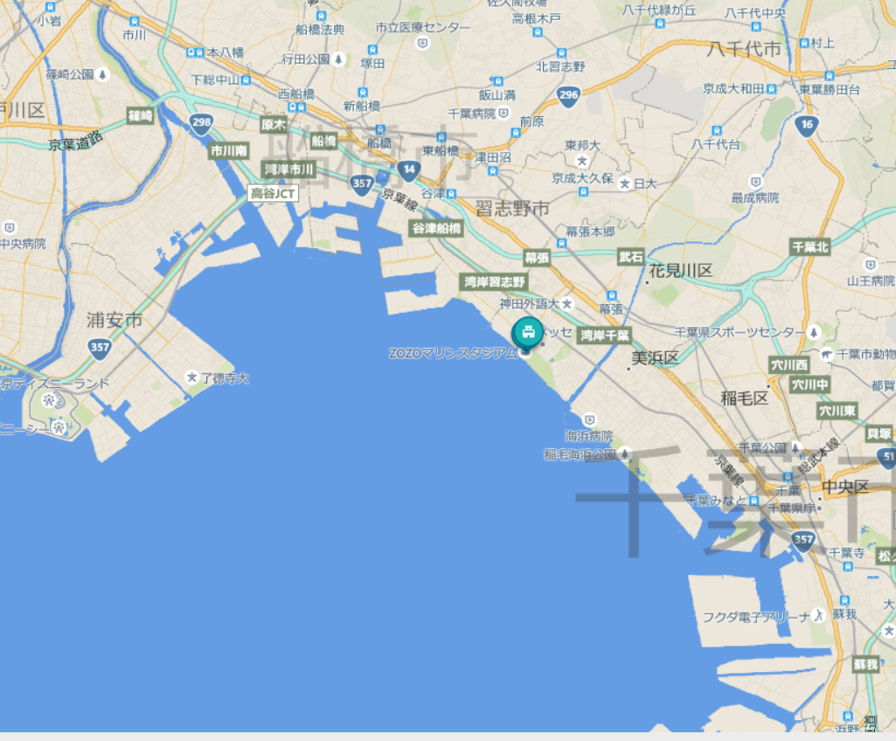
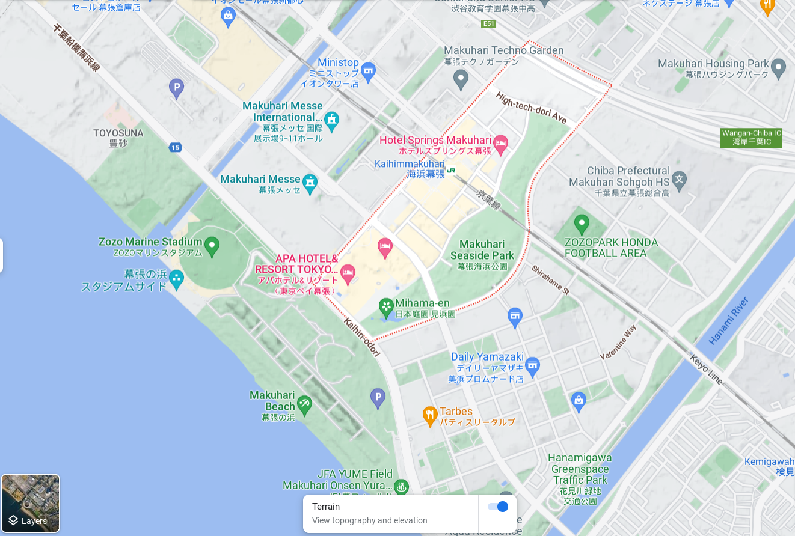
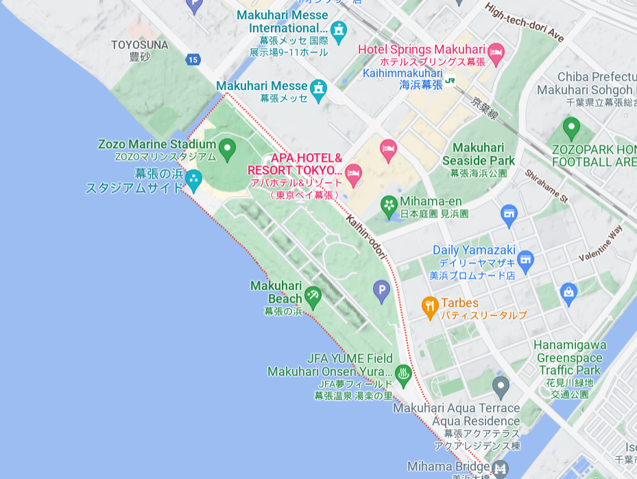
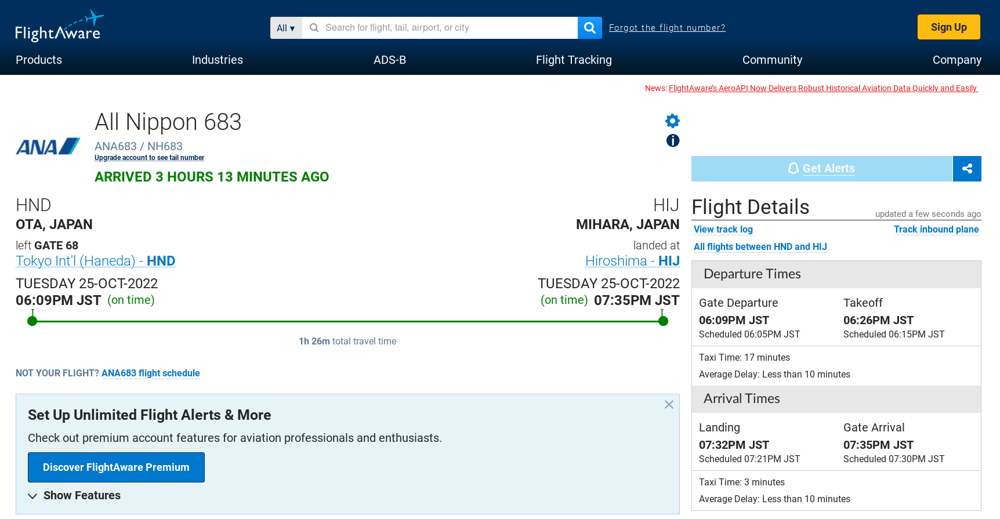
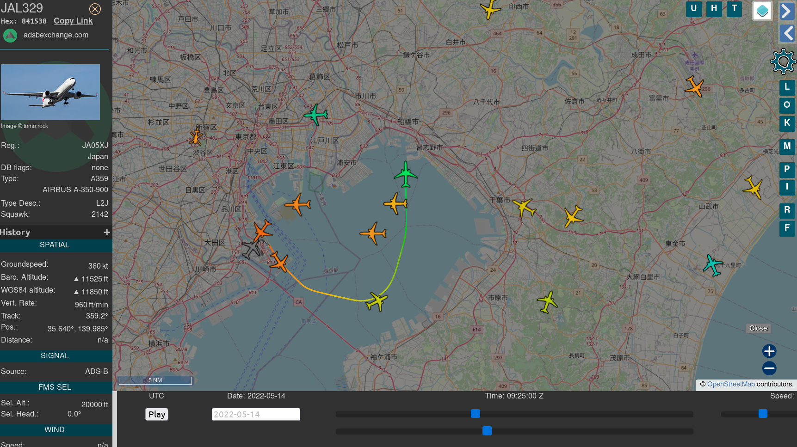

# 旅行照片 2.0

题解作者：[regymm](https://github.com/regymm)

出题人、验题人、文案设计等：见 [Hackergame 2022 幕后工作人员](https://hack.lug.ustc.edu.cn/credits/)。

## 题目描述

- 题目分类：general

- 题目分值：照片分析（100）+ 社工入门（150）

你的学长决定来一场蓄谋已久的旅行。通过他发给你的照片来看，酒店应该是又被他住下了。

请回答问题以获取 flag。图片为手机拍摄的原始文件，未经任何处理。手机系统时间等信息正确可靠。

## 题目问题

### 第一题：照片分析

1. 图片所包含的 EXIF 信息版本是多少？（如 2.1）。
2. 拍照使用手机的品牌是什么？（华为/荣耀；OPPO；苹果；三星；索尼；小米/红米）
3. 该图片被拍摄时相机的感光度（ISO）是多少？（整数数字，如 3200）
4. 照片拍摄日期是哪一天？（格式为年/月/日，如 2022/10/01。按拍摄地点当地日期计算。）
5. 照片拍摄时是否使用了闪光灯？（是/否）

### 第二题：社工实践

#### 酒店

1. 请写出拍照人所在地点的邮政编码，格式为 3 至 10 位数字，不含空格或下划线等特殊符号（如 230026、94720）。
2. 照片窗户上反射出了拍照人的手机。那么这部手机的屏幕分辨率是多少呢？（格式为长 + 字母 x + 宽，如 1920x1080）

#### 航班

仔细观察，可以发现照片空中（白色云上方中间位置）有一架飞机。你能调查出这架飞机的信息吗？

3. 起飞机场（IATA 机场编号，如 PEK）
4. 降落机场（IATA 机场编号，如 HFE）
5. 航班号（两个大写字母和若干个数字，如 CA1813）

## 题解

我觉得比较有趣的一道题。

第一问很简单，只要查看照片的 EXIF 信息就可以了。方法有很多，在 Linux 上用自带的图片查看器（`eog`）就没有问题。可以右键点击图片并选择 Properties。

大致看一遍，发现题目答案都在里面了。可以发现，这里几乎包含了照片全部的信息，从拍摄时间到拍摄设备（如果手机相机软件开启了记录 GPS 的功能，还会直接显示 GPS 定位）。所以，给别人分享未抹去 EXIF 信息的原始文件是一件非常危险的事情。一般来说，在各种聊天软件中发送的图片默认会被压缩并抹去 EXIF 信息。但如果发送原图，那么很可能 EXIF 信息不会被抹去，这将导致严重的信息泄漏。如果真的是旅游或是出去玩的照片倒也没有什么，然而如果是在家拍摄的图片（即使是拍摄一些看起来无关的东西，比如拍摄的文件或电脑屏幕，经常会以原图发送），包含了 GPS 信息并被直接分享，则会带来很大风险。

---

第二问需要仔细查看图片细节了。

一个非常明显的就是楼下的圆形体育场，放大可以看到体育场一楼黑底白字的横幅：WELCOME TO ZOZOMARINE STADIUM。查找这个 Stadium，直接就得到了地点：千叶海洋球场，邮编 261-0022。当然，我也很好奇如果不看这里，只看远处的天际线能不能分析出位置，虽然我肯定看不出来。

但明显你的学长住在酒店而不是球场里，所以需要在附近查找有哪些酒店。图中面前左边是开阔海域，右边接近陆地并且有部分突出，结合地图可以看出拍摄角度是在球场的东南方。放大地图，确实发现球场东方不远处有数家酒店。查看可以得知几家酒店的邮编全部为 261-0021，于是这个去掉横线就是答案。

如果在谷歌地图直接输入邮编，可以方便地看到每个邮编对应的“地界”。可以看到两个邮编只有一路之隔。

 

---

接下来是手机屏幕分辨率。其实从 EXIF 信息里不只能看出手机是小米，还能看出型号（Model）为：`sm6115(juice)` 。

可以直接谷歌搜索关键字（其他搜索引擎这里表现不是很好）：

红米 9T 直接就蹦了出来，并且各个刷机 root 论坛已经指名道姓这部手机代号就是 juice。看图片（背面三摄像头，旁边小圆的闪光灯）和题目图片玻璃上的反光也是一样，那么可以确定就是这个型号了。之后可以直接在[小米官网](https://www.mi.com/global/redmi-9t/specs)查到配置信息，其中屏幕分辨率是 2340x1080。其实国内这部手机不叫 9T，而是红米 Note 9 4G，但配置都是一样的。

---

接下来是航班追踪。

我们已知地点和时间（明显 EXIF 内也有精确到秒的拍摄时间），看到天上有飞机飞过，要如何知道飞机的信息呢？

很多人应该都用过 FlightAware ，而类似的网站和应用也不少。在这些网站上可以看到全世界几乎所有飞机的位置和各种追踪信息。而能够掌握如此大量信息的原因是全世界各地都有收集并上传空中飞机发射的 [ADS-B 信号](https://zh.wikipedia.org/wiki/广播式自动相关监视) 的接收器，而其中很多是无线电和航空爱好者维护的。我个人虽然也用各种设备接收过这个 1090 MHz 的信号，但毕竟不懂无线电，这里就不多说了。但要注意的是，这个频率不属于业余无线电频率，理论上个人不能使用，虽然如果只是接收应该没有太大问题。但将接收到的数据上传到网上是有法律风险的。而发射这一频段的信号明显是严重的违法行为，尽管可能并没有人真的愚蠢到大功率发射 ADS-B 信号。

这些网站上可以方便地看到当前以及过去一小段时间航班的信息，但对于这种几个月前的数据，似乎只有会员才能访问。或许你可以选择注册一个帐号试用几天。

尽管如此，免费查看历史的 ADS-B 追踪网站还是存在的。比如[此处的论坛](https://www.reddit.com/r/ADSB/comments/nzamfo/how_to_find_historical_adsb_records/)就提供答案：使用 ADSB Exchange 的回放功能。

于是开始查找，照片拍摄时间是 UTC+9 时区 2022 年 5 月 14 日 18:23:35 ，对应 UTC 时间是 5 月 14 日 09:23:35 ，网站上时间查询可以精确到每 10 秒钟。

定位到东京湾附近，可以看到在拍摄地点的西北方向（正是照片拍摄的朝向，并且飞机飞行方向也和图片上一致）仅有一架飞机刚好飞过：

那么可以确定这就是图中拍摄到的飞机。 ADSB Exchange 只给出了少量的信息，接下来搜索这架 ANA683（比如在 FlightAware 上，通常每个航班编号只会执飞固定航线，起飞和降落地点一般不会改变），不难找到这是从东京国际机场（IATA 代码 HND ，通常被称为羽田机场）飞往广岛机场（IATA 代码 HIJ）的全日空航空 683 号班机，题目要求两个字母加数字的航班号就是 NH683 。

编写题解时 FlightAware 上的查询信息，可以看到数据非常丰富：

于是到此题目就解完了。

要注意的是照片精确到分钟的拍摄时间是非常必要的，因为仅仅 1 分钟后就有另一架飞机（JL329，HND => FUK）从拍摄地点前经过：

其实作者本来对飞机追踪这种事情不怎么感兴趣，但乘坐飞机在香港国际机场（HKG）转机降落时机场倾盆大雨，于是飞机复飞（go-around），绕机场一大圈才再次降落成功，在此惊吓之后的几天正好在酒店无事，就研究了一下相关的事情。当时我正和旁边的老外聊天，本来已经放松心情准备降落了，突然身边引擎巨响然后飞机再次拉起，急速上升到平稳高度之后，机长在麦克风里说：This is your captain speaking ... 然后过了一两分钟之后乘务员播报了普通话和粤语翻译。真的是和电影中的场景一样。确实能明显感觉到客舱的气氛瞬间紧张了起来。然而降落之后并没有传说中的鼓掌。

---

那么题目到此为止，open questions 却还有一些，留做作业（不保证可解）：

1. 图中的千叶海洋球场点着紫色的灯光，似乎在举行某些二次元活动。你能调查出活动是什么吗？更进一步，照片拍摄时正在表演的节目播放的歌曲是什么？
2. 作者入住的酒店到底是哪一家？是否能推断出所在楼层？
3. 作者乘坐的在 HKG 降落时复飞的航班，航班号是多少？

欢迎选手在题解中回答这几个问题！
