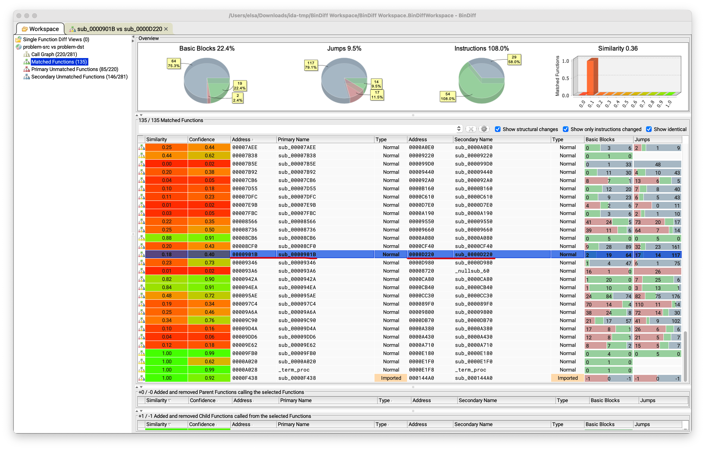
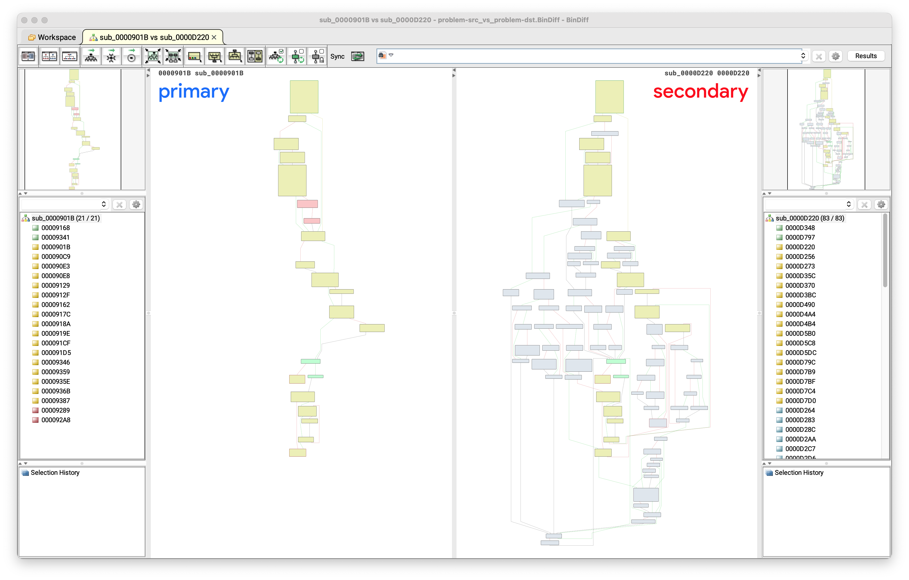

# 火眼金睛的小 E

题解作者：[Elsa Granger](https://github.com/zeyugao)

出题人、验题人、文案设计等：见 [Hackergame 2022 幕后工作人员](https://hack.lug.ustc.edu.cn/credits/)。

## 题目描述

- 题目分类：binary

- 题目分值：有手就行（150）+ 唯快不破（200）+ 大力出奇迹（350）

小 E 有很多的 ELF 文件，它们里面的函数有点像，能把它们匹配起来吗？

小 A：这不是用 BinDiff 就可以了吗，很简单吧？

你可以通过 `nc 202.38.93.111 12400` 来连接题目，或者点击下面的 "打开/下载题目" 按钮通过网页终端与远程交互。

> 如果你不知道 `nc` 是什么，或者在使用上面的命令时遇到了困难，可以参考我们编写的 [萌新入门手册：如何使用 nc/ncat？](https://lug.ustc.edu.cn/planet/2019/09/how-to-use-nc/)

## 题解

本题的所有 ELF 文件为提前编译得到，并在 `strip` 的基础上删掉了一些段，避免一些非预期情况。

所有的 ELF 文件在 [elf.tar.gz.gpg](https://ftp.lug.ustc.edu.cn/misc/hackergame/2022/火眼金睛的小%20E/elf.tar.gz.gpg)，解压密码 `346c4f5092b32109ab6276e8c3e984d0`。

```shell
gpg -d elf.tar.gz.gpg | tar xz
```

可以得到文件夹 `flat_files`，里面的文件名是 sha256，与 nc 时提供的 binary 的 url 里面的路径里面的 sha256 相一致。

### Level 1

题目需要找到两个 binary 里面两个对应函数的位置，比较常用的工具就是 [BinDiff](https://www.zynamics.com/bindiff.html)，支持 IDA 与 Ghidra。

题解里面使用的是 IDA 来进行分析。

用 IDA 打开其中一个 binary 之后，等分析完了之后直接关掉 IDA，保存为 `.i64` 文件到目录里面。然后用同样的方式得到另一个 binary 的 `.i64` 文件。

然后用 BinDiff 去 diff 一下这两个 `.i64` 文件，找到 nc 里面要求的源 binary 的地址，与 BinDiff 认为的匹配的函数，比如图里面的，题目要求源 binary 里面的地址是 `0x901b`，BinDiff 认为匹配的函数地址是 `0xd220`。



点进去可以看两个函数的 CFG (Control Flow Graph)，虽然好像看起来差得有点远，但是 BinDiff 还是认为他们是比较相似的函数。



因为只有两个 binary，直接手做一下就可以了，但是 BinDiff 有时候会出错，就需要多试一下。在 nc 的时候，显示了一堆中文。

> 现在，将输入用于生成题目的时间戳
>
> 如果输入了两次相同的时间戳，那么你将会得到相同的题目
>
> 而如果两次输入的时间戳相差 10 分钟或以上，你将会得到不同的题目
>
> 本次连接允许的输入的时间戳的范围是: [1666785441, 1666871841]
>
> 即：如果你在本次连接中拿到了题目，你将有最多 1440 分钟的时间来提交结果

这个时间戳的作用就是，可以通过修改在时间限制范围内的时间戳来获得不同的题目，来多试一试，从而实现 100% 的正确率。

注：这题因为 Ghidra 同样也支持了 binexport 和 BinDiff 插件，因此也可以用 Ghidra 来做，并不是必须要一个 IDA。

### Level 2

题目里面给了随机数种子输入的位置，说明可以拿到题目之后离线做。100 个 binary 的匹配比较需要自动化了。在网上搜索一下，可以找到 [Automated BinDiff.](https://syscall.eu/blog/2014/06/08/bindiff_export/)，里面是 idc 的脚本，并且调用的 BinDiff 版本比较老了，因此去找找里面调用的 `binexport` 函数的用法。在 [binexport](https://github.com/google/binexport) 里面，可以知道可以写成 [IDC](https://github.com/google/binexport#idc-scripting):

```c
static main() {
  batch(0);
  auto_wait();
  load_and_run_plugin("binexport12_ida", 2 /* kBinary */);
  qexit(0);
}
```

或者 [IDAPython](https://github.com/google/binexport#idapython)

```python
import idaapi
idaapi.ida_expr.eval_idc_expr(None, ida_idaapi.BADADDR,
  'BinExportBinary("exported.BinExport");')
```

可以写出 [level2](./level) 下的自动化使用 BinDiff 进行分析的代码。

- `batch-fetch-problem.py` 会根据服务器提供的最后的一个时间戳请求题目，并将所有的题目请求下来，保存到 `problem-save` 下面。

- `batch-bindiff.py` 以保存的题目的路径作为参数，会对里面每一个题目调用 IDA 分析得到 `.i64` 文件，然后调用 BinDiff 进行分析，得到 BinDiff 认为的匹配函数。

- `batch-submit.py` 会根据上一个文件得到的结果，对服务器进行提交。

里面可以设置是否需要 `dry_run`。

其中需要配置 `ida-bindiff-helper.sh` 文件，里面需要替换两个路径，分别是 IDA 的路径与 `analyse.py` 的路径。

在 level2 的时候，BinDiff 还是可以应付的，因为 binary 里面的函数差异没有那么大，题目里面要求的 40% 的正确率还是比较容易达到的。

### Level 3

Level 2 的 bindiff 已经无法 Handle 这种差异比较大的 binary 了，需要找一下有没有学术上对应的工作。近几年的一些工作都应该可以处理。

找一个 Binary Similarity 的工作：[Awesome Binary Similarity](https://github.com/SystemSecurityStorm/Awesome-Binary-Similarity)

#### SAFE

Paper: [SAFE: Self-Attentive Function Embeddings for Binary Similarity](https://arxiv.org/pdf/1811.05296.pdf)

SAFE 的原本的实现是 Tensorflow 的，在 [SAFE : Self Attentive Function Embedding](https://github.com/gadiluna/SAFE) 里面。在 ReadMe 的最后，有 torch 的实现 [SAFEtorch](https://github.com/facebookresearch/SAFEtorch)。

```shell
git clone https://github.com/facebookresearch/SAFEtorch
```

根据里面的 `test.py` 可以写出 eval 的代码。

参考在 [level3/safe](level3/safe/batch-safe.py)，里面的默认了 `SAFEtorch` repo 与 `batch-safe.py` 文件在同一级下。

其他文件与 level2 基本相同，为拉取题目与进行提交。

#### jTrans

Paper: [jTrans: Jump-Aware Transformer for Binary Code Similarity Detection](https://arxiv.org/pdf/2205.12713.pdf)

```shell
git clone https://github.com/vul337/jTrans
```

把数据处理部分打一个 [patch](./level3/jtrans/jtrans-process.diff)，去掉一些 binaryai 的依赖（需要注册，并且已经停止服务了），然后就可以直接运行了。

根据 repo README 里面的东西，从 `fasteval.py` 里面得到用法，写对应的 eval 代码。

题解里面给出了具体 eval 的代码，在 [level3/jtrans](./level3/jtrans) 下面，可以看到 `batch-jtrans-eval.py` 里面的代码，需要根据显卡显存大小修改 119 行的 `batch_size = 256`。

其他文件与 level2 基本相同，为拉取题目与进行提交，除了一些修改：

- `batch-fetch-problem.py` 在获得了一个 elf 后调用了 `process_elf` 函数，调用了 `process-elf.sh` 文件。后者需要进行两处路径替换，分别为替换为 IDA 的地址与 `jTrans` 的地址。

## Misc

题目里面相对应的 binary 是 Ubuntu APT 里面同一个项目通过不同的优化等级进行编译得到的，并通过对应的符号表得到 ground truth。
由于会有编译优化的问题，比如 `-O3` 时将会有比较激进的内联，或者循环展开，使得虽然被认为是 ground truth 的两个函数实际上长得十分不一样。

虽然可以有可以直接通过函数在 binary 里面的顺序得到相匹配的函数的概率，但是实际上编译器往往会对函数的位置进行调整，使得应该无法直接通过位置进行匹配。

Level 1 和 Level 2 是 `O1` 与 `O2` 的对应的优化等级进行比较，Level 3 是 `O0` 与 `O3` 的对应的优化等级进行比较。因此对于 Bindiff 来说，Level 3 可能太难了，
测试的时候往往只有 5% 左右的正确率。

在测试的时候发现，即使使用了 `strip` 来去掉 binary 里面的信息，`.dynsym` 与 `.symtab` 里面的符号信息是不会被去掉的。如果手动进行去掉这两个段，
会导致 IDA 无法找到许多的函数，需要其他的分析方法来让 IDA 识别出来。因此最后只去掉了 `.dynstr` 与 `.symtab` 段。
在测试时，IDA 在随机出来的 200 个 binary pair 中，大概有 10% 左右无法将 ground truth 标记为函数。对于依赖 IDA 提取函数边界来进行函数比较的工作而言，
也就是说，这 10% 的题目从一开始就错了。

同样的，由于有训练集和测试集不一致的问题，现在的 Binary Similarity 在测试时往往有正确率比较大的下降，因此 level 3 的要求从一开始的 70%，降到了 40%，再降到了 30%。这个时候，由于正确率的要求比较低，之前的一些手工的特征提取工作也往往能够达到要求。手搓代码提取 feature 的 mcfx tql。

本来是想给 mcfx 上上对抗，没想到给其他选手上了对抗，（在写题解的时候还是只有 mcfx 一解，update：看到有两解了，后面如果还囤 flag 就没法更新了人数了），真的是红豆泥私密马赛！
