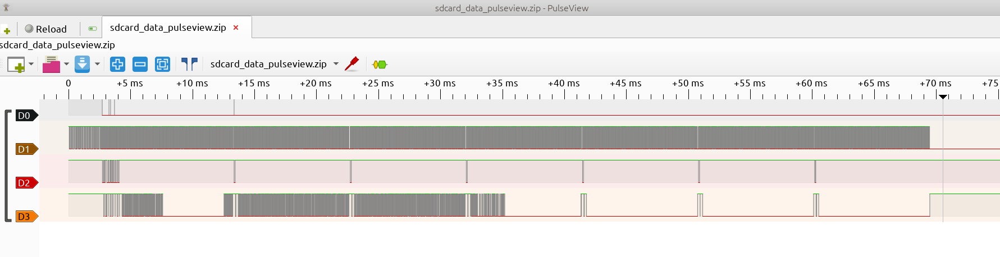
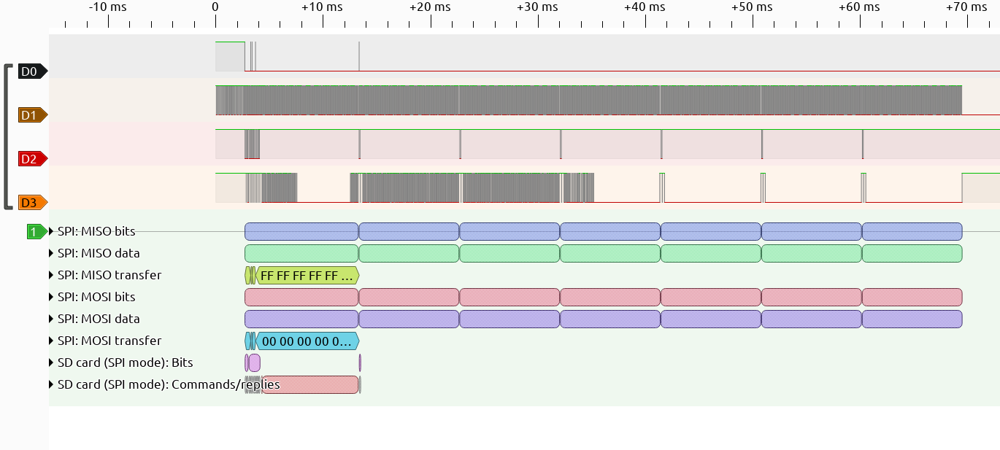
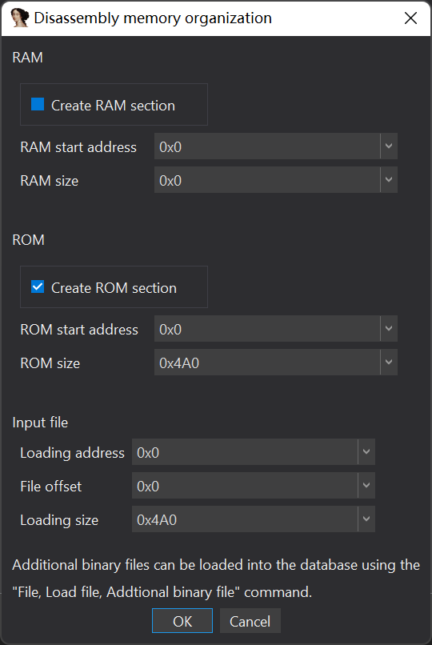
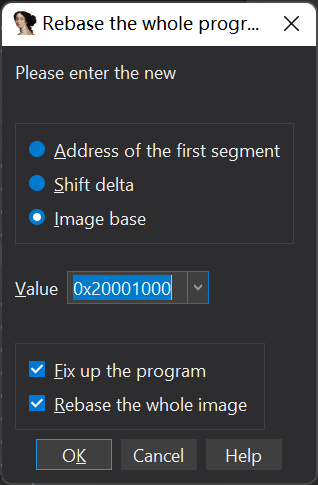
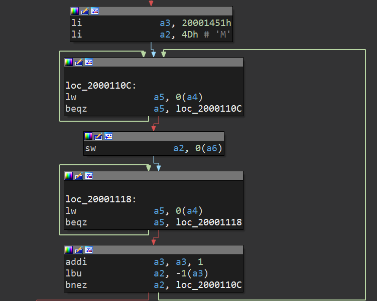

# 片上系统

题解作者：[regymm](https://github.com/regymm)、[忧郁沙茶](https://github.com/Crabtux)

出题人、验题人、文案设计等：见 [Hackergame 2022 幕后工作人员](https://hack.lug.ustc.edu.cn/credits/)。

## 题目描述

- 题目分类：binary

- 题目分值：引导扇区（200）+ 操作系统（300）

你的室友在学习了计算机组成原理之后沉迷 RISC-V 软核开发。

RISC-V，是一个近年来兴起的开放指令集架构。

软核，意思是这个 RISC-V CPU（如果能称之为 CPU 的话）是在 FPGA 等可编程芯片中运行的（而不是在真正硅片上固定的物理电路）。同时，CPU 需要的外部硬件，如字符打印、图像显示、LED 点灯等等，均需要自己用硬件描述语言编写（而不像单片机等设备开发时只要调用库函数就可以了）。有些人会选择已经实现好的开源部件和处理器，组合定制成为一套片上系统（System on Chip, SoC），用于嵌入式开发、工业控制或个人娱乐等目的。而另外一些失去理智的人们则选择以一己之力，从零开始编写自己的 CPU 和外设，并企图用自己几个月摸鱼摸出的处理器与嵌入式大厂数十年的积累抗衡，尽管 Ta 们的 CPU 通常性能不如 i386、没有异常处理、甚至几十个周期才能完成一条指令，而外设也通常仅限于串口和几个屈指可数的 LED 灯。

最近，你听说室友在 SD 卡方面取得了些进展。在他日复一日的自言自语中，你逐渐了解到这个由他一个人自主研发的片上系统现在已经可以从 SD 卡启动：先由“片上 ROM 中的固件”加载并运行 SD 卡第一个扇区中的“引导程序”，之后由这个“引导程序”从 SD 卡中加载“操作系统”。而这个“操作系统”目前能做的只是向“串口”输出一些字符。

同时你听说，这个并不完善的 SD 卡驱动只使用了 SD 卡的 SPI 模式，而传输速度也是低得感人。此时你突然想到：如果速度不快的话，是不是可以用逻辑分析仪来采集（偷窃）这个 SD 卡的信号，从而“获得” SD 卡以至于这个“操作系统”的秘密？

你从抽屉角落掏出吃灰已久的逻辑分析仪。这个小东西价格不到 50 块钱，采样率也只有 24 M。你打开 PulseView，把采样率调高，连上室友开发板上 SD 卡的引脚，然后接通了开发板的电源，希望这聊胜于无的分析仪真的能抓到点什么有意思的信号。至于你为什么没有直接把 SD 卡拿下来读取数据，就没人知道了。

**引导扇区**

听说，第一个 flag 藏在 SD 卡第一个扇区的末尾。你能找到它吗？

**操作系统**

室友的“操作系统”会输出一些调试信息和第二个 flag。从室友前些日子社交网络发布的终端截图看，这个“操作系统”每次“启动”都会首先输出：

```
LED: ON
Memory: OK
```

或许你可以根据这一部分固定的输出和引导扇区的代码，先搞清楚那“串口”和“SD 卡驱动”到底是怎么工作的，之后再仔细研究 flag 到底是什么，就像当年的 Enigma 一样。

[打开/下载题目](src/sdcard_data_pulseview.zip)

## 题解

### 前言

这一部分由 [regymm](https://github.com/regymm) 编写。

今年的硬件题，背景就是组成原理经常涉及的 FPGA 上 RISC-V 开发。这种经常被称为“造轮子”、“创”、“造机”、“灵车”的行为是非常有趣的。但是请谨慎入坑，从购买第一块 FPGA 开发板到混迹二手市场使用回收芯片自制 PCB 并拥有十多块各种厂商的 FPGA 灵车板子只需要不到一年的时间；从无害的组成原理学习到滑入无法与现代科技共存的深渊也只有一步之遥。

表情包来自网络：


题目是逻辑分析仪抓取的 SD 卡信号，并且题目中说了只使用了 SPI 模式，那先了解一下这是什么意思。

SD 卡是一种非常 low 的存储设备，使用的协议（指硬件上的协议，类似于 USB）也很简单。[这里](https://www.electroniccircuitsdesign.com/pinout/sd-microsd-card-pinout.html)描述了 SD 卡（以及 microSD 卡，SD 卡的诸多分类这里就不说了）的 pinout。其中提到的 SD 和 SPI 字样就是 SD 卡的两种工作模式：速度较高的 SD 模式和速度较低但更简单的 SPI 模式。实现这个低速的 SPI 模式几乎是 SD 卡标准的硬性要求，因为 SD 卡标准在设计的时候就考虑到了作为极低端嵌入式设备存储的需求：而有了 SPI 之后，所有支持 SPI 的单片机、Arduino、乃至没有处理器的低端设备便都能访问到 GB 量级的 SD 卡存储了。相比之下，USB 协议复杂，需要性能稍强的处理器，便无缘普通单片机了。并且 USB 协议的控制器很复杂，而被控设备简单，这也是为什么 USB 设备（U 盘、鼠标键盘）如此普遍，而在嵌入式领域却不能随心所欲地使用。

如果在 FPGA 上开发自己的片上系统，那对于永久存储来说 SD 卡也通常是第一选择：一个 SPI 总线实在是过于简单了。NAND 等闪存明显比 SPI 复杂并且也不方便用户随时改变内容（不能从板子上拔下来），SPI Flash 容量也通常很小，而 USB 更是复杂到了一般人无法独立完成的程度。

话虽如此说，我猜大多数人并没有孤身与 FPGA 上的 SD 卡搏斗的经历：其实里面的“坑”还是很多的。随便说两个，SD 卡根据容量分为不同”版本“，比如最基本的 2 GB 以下容量称为 SD，2 至 32 GB 称为 SDHC，32 GB 以上称为 SDXC，这几者的协议指令略有不同。另外，尽管 SD 卡有 SPI 模式，但初始化时的第一条指令仍然是在 SD 模式发出的，所以硬件上必须进行一些处理。如果多个 SPI 设备共用一组管脚，那么在对 SD 卡初始化操作时其他设备可能受到不良影响。

如果你的 SD 卡怎么也不 work ，那为了避免陷入 [FPGA Hell](https://zipcpu.com/blog/2017/05/19/fpga-hell.html) ，你必须有办法查看硬件的输出到底是什么。Xilinx Vivado 的 ILA 功能非常强大，而逻辑分析仪（即本题涉及到的内容）无疑也是首选调试方法之一。

用 PulseView 打开并查看逻辑分析仪抓取的波形：



可以一眼看出是 SPI 了，D0 明显是低电平有效的使能，D1 是时钟，D2 和 D3 就是 MISO 和 MOSI 的数据信号了。由于主要是读取 SD 卡，不难看出 D3 是 SD 卡的输出，信号很多，D2 是输入的控制命令，信号较少。因为 SD 卡的 SPI 协议是很基础的内容，我们可以直接用 PulseView 自带的协议解析功能解析出来。点击任务栏最后一个图标（Add protocol decoder），查找到 SD card (SPI mode) ，点击添加后在左边点击新出现的标签，设置 D0 到 D3 对应的信号，就可以直接解码了：



开头部分被解析得很好，可以趁机复习一下 SDHC 卡初始化序列：先发送 CMD0 和 CMD8，CMD8 的返回结果较长，之后反复发送 CMD55 和 ACMD41 直到 SD 卡返回 0x00。

之后也很直观，可以直接看到 Host 发出了一个 Read block 的指令，参数是 0x0 地址，即第 1 个扇区，之后一整个 block 的数据就从 MISO 传了过来：你发现开头有一些非 0 数据，末尾也有一点点数据。根据题目描述，第一个扇区末尾就是 flag：于是我们把这个扇区的数据导出（比如右键最后一行 Export all annotations from this role 然后稍微处理一下）

```
$ tail -n 2 a.txt
for i in data:
	print(chr(i), end="")
$ python3 a.txt
7 Áÿï7 go@· ¨
             · ¥G
· ¯G
    · ®
       · ¨Ç     p§ãþ# ¯# Î§¦GG#.×þãg   flag{0K_you_goT_th3_b4sIc_1dE4_caRRy_0N}%   
```

于是直接得到了 flag。

### 获取“引导扇区”和“操作系统”的固件

这一部分由 [regymm](https://github.com/regymm) 编写。

根据题目描述第一扇区首部是 bootloader，负责加载后面的”操作系统“，那我们自然也许要读取后面的扇区内容。

但遗憾的是不知为何后面的数据没有被正确解析，这个原因我也不很清楚，我猜测的原因是，在我的 Verilog 驱动中，SD 卡指令的 CRC 并没有被正确维护（因为偷懒），SD 卡并不在乎这一点，但有可能 PulseView 的协议解析比较挑剔。

于是我们只能导出整个 MISO 并手动筛选，这也并不困难。在读 sector 指令发出后，MISO 第一次为 0 的字节表示数据开始传输，后面紧接着 512 字节就是扇区内容。很明显这个 SD 卡驱动并没有一次 burst 读取多个扇区。

得到扇区之后就可以分析其内容了。因为我不是反汇编高手，就简单说说。

使用 `riscv32-unknown-elf-objdump -D -m riscv -b binary -d sector.img` 对“引导程序”进行反汇编。

```
0000000000000000 <.data>:
       0:	37011020          	lui	sp,0x20100
       4:	1301c1ff          	addi	sp,sp,-4 # 0x200ffffc
       8:	ef000001          	jal	ra,0x18
       c:	37150020          	lui	a0,0x20001
      10:	67000500          	jr	a0 # 0x20001000
      14:	6f004000          	j	0x18
      18:	b7070020          	lui	a5,0x20000
      1c:	83a8870b          	lw	a7,184(a5) # 0x200000b8
      20:	b7070020          	lui	a5,0x20000
      24:	83a5470a          	lw	a1,164(a5) # 0x200000a4
      28:	b7070020          	lui	a5,0x20000
      2c:	03af470b          	lw	t5,180(a5) # 0x200000b4
      30:	b7070020          	lui	a5,0x20000
      34:	83ae070b          	lw	t4,176(a5) # 0x200000b0
      38:	b7070020          	lui	a5,0x20000
      3c:	03a8c709          	lw	a6,156(a5) # 0x2000009c
      40:	13051000          	li	a0,1
      44:	13860820          	addi	a2,a7,512
      48:	130e1000          	li	t3,1
      4c:	13037000          	li	t1,7
      50:	83a70500          	lw	a5,0(a1)
      54:	e38e07fe          	beqz	a5,0x50
      58:	2320af00          	sw	a0,0(t5)
      5c:	23a0ce01          	sw	t3,0(t4)
      60:	83a70500          	lw	a5,0(a1)
      64:	e38e07fe          	beqz	a5,0x60
      68:	93870800          	mv	a5,a7
      6c:	13070800          	mv	a4,a6
      70:	83a60700          	lw	a3,0(a5)
      74:	13074700          	addi	a4,a4,4
      78:	93874700          	addi	a5,a5,4
      7c:	232ed7fe          	sw	a3,-4(a4)
      80:	e398c7fe          	bne	a5,a2,0x70
      84:	13051500          	addi	a0,a0,1
      88:	13080820          	addi	a6,a6,512
      8c:	e31265fc          	bne	a0,t1,0x50
      90:	b7120020          	lui	t0,0x20001
      94:	67800200          	jr	t0 # 0x20001000
      98:	67800000          	ret
      9c:	0010                	addi	s0,sp,32
      9e:	0020                	fld	fs0,0(s0)
      a0:	1420                	fld	fa3,0(s0)
      a2:	0096                	0x9600
      a4:	1020                	fld	fa2,0(s0)
      a6:	0096                	0x9600
      a8:	0020                	fld	fs0,0(s0)
      aa:	0096                	0x9600
      ac:	0810                	addi	a0,sp,32
      ae:	0096                	0x9600
      b0:	0410                	addi	s1,sp,32
      b2:	0096                	0x9600
      b4:	0010                	addi	s0,sp,32
      b6:	0096                	0x9600
      b8:	0000                	unimp
      ba:	0096                	0x9600
	...
     1d8:	666c                	flw	fs8,88(sp)
     1da:	6167                	lui	a4,0x18
     1dc:	7b304b5f          	0x5f4b307b
     1e0:	796f                	lui	t5,0x1e
     1e2:	755f                	li	t5,-3
     1e4:	676f545f          	0x5f546f67
     1e8:	7468                	flw	fa3,84(s0)
     1ea:	335f6234          	0x34625f33
     1ee:	7349635f          	0x5f634973
     1f2:	3164                	lui	s0,0xc
     1f4:	4534                	jal	0xfffffffffffffc94
     1f6:	5f63 6152 5279      	0x79525261635f
     1fc:	5f30 4e7d 3701      	0x1377d4e305f
```

应该不难看出先加载并操作了 0x96000000 附近的地址，0x20001000 附近的地址被写入，最后跳转到了 0x20001000。那么我们就知道了操作系统的入口地址就是 0x20001000。而 0x96000000 附近的地址是 MMIO，用来操控 SD 卡驱动。也不难猜测程序内存空间 0x90000000 开头的地址都是 MMIO。

### 操作系统 —— 逆向部分

这一部分由 [忧郁沙茶](https://github.com/Crabtux) 编写。

在这里说明一下，我不是专门做逆向的，水平非常业余，对硬件也没啥研究，如果表述上有错误的地方，请各位 dalao 轻喷。

我们这里假定，你已经从 SD 卡中 dump 出完整的"操作系统"。我所使用的逆向工具是 IDA Pro 7.7，逆向在 Windows 11 下完成。

你需要一个 RISC-V 指令集参考手册。RISC-V 官方提供了一个 PDF 版本的参考手册，它的链接是：<https://riscv.org/wp-content/uploads/2017/05/riscv-spec-v2.2.pdf>。不过这个参考手册或许太过笨重，因为我们实际上只需要知道少量的指令就能够解决此题。

由于这个"操作系统"并不是 ELF 文件，而是裸的 RISC-V Shellcode，并且在入手这题时，我对这个"操作系统"的一些性质完全没有了解，仅知道它是 RISC-V 指令集，我考虑先随意做一些设置，得到初步的反汇编结果，进行分析，获取更多信息之后再确定其他设置。

第一次载入"操作系统"时，我直接使用了默认设置（ImageBase 为 0x0，File Offset 也为 0x0）：



载入文件之后，我们猜测 0x0 处即为 EntryPoint，尝试在 0x0 处反汇编，按下 `c` 键：

```nasm
ROM:00000000 37 01 10 20 13 01 C1 FF       li              sp, 200FFFFCh
ROM:00000008 EF 00 40 06                   jal             sub_6C
```

分析结果很清晰，我们发现在入口点设置 `sp` 的值之后，会跳转到分析出的 `sub_6C` 中。

`sub_18` 暂时不管，我们对 `sub_6C` 进行分析：

```nasm
ROM:0000006C                               sub_6C:                                 # CODE XREF: ROM:00000008↑p
ROM:0000006C                               ...                                     ; 这里省略了一些栈中的变量
ROM:0000006C B7 17 00 20 83 A7 47 49       lw              a5, 20001494h
ROM:00000074 37 17 00 20 03 25 87 48       lw              a0, 20001488h, a4
ROM:0000007C 13 01 01 FD                   addi            sp, sp, -30h
ROM:00000080 23 24 81 02                   sw              s0, 24h+var_s4(sp)
ROM:00000084 23 22 91 02                   sw              s1, 24h+var_s0(sp)
ROM:00000088 23 26 11 02                   sw              ra, 24h+var_s8(sp)
ROM:0000008C 13 07 10 00                   li              a4, 1
ROM:00000090 23 A0 E7 00                   sw              a4, 0(a5)
ROM:00000094 93 07 F0 FF                   li              a5, -1
ROM:00000098 23 2C F5 00                   sw              a5, 18h(a0)
ROM:0000009C B7 14 00 20                   lui             s1, 20001h
ROM:000000A0 37 14 00 20                   lui             s0, 20001h
ROM:000000A4 23 2E F5 00                   sw              a5, 1Ch(a0)
ROM:000000A8 03 A7 84 49                   lw              a4, 498h(s1)
ROM:000000AC 03 28 C4 49                   lw              a6, 49Ch(s0)
ROM:000000B0 23 20 F5 02                   sw              a5, 20h(a0)
ROM:000000B4 B7 16 00 20                   lui             a3, 20001h
ROM:000000B8 23 22 F5 02                   sw              a5, 24h(a0)
ROM:000000BC 93 86 56 44                   addi            a3, a3, 445h
ROM:000000C0 13 06 C0 04                   li              a2, 4Ch # 'L'
```

由于 IDA 的分析结果是 subroutine，我们可以使用 Graph View 更加方便地查看控制流，按下 Space 键即可在 Graph View 和 List View 之间切换。

注意到许多与地址有关的常数，其开头 20 bits 均为 `0x20001`，而与栈空间有关的地址在 `0x20100000` 左右浮动，我们猜测 `0x20001000` 为 ImageBase。由于程序中很多地址是基于 ImageBase 的编码方式，我们希望获取一些与交叉引用有关的信息，因此我们应当做一下 program rebase：



由于是相对不熟悉的固件逆向，我们应当忽略一些不重要/看不懂的逻辑，学会抓重点。

首先我们可以注意到，从 `0x20001444` 开始出现了一些 ASCII 字符串，正对应着题目中的示例输出：

```
LED: ON
Memory: OK
```

因此控制流中应当出现对这些地址的引用。经过查看，我们发现控制流中多次出现了类似这样的结构：



我们看看 `0x20001451` 存着什么：

```nasm
ROM:20001450 4D                            .byte  4Dh # M
ROM:20001451 65                            .byte  65h # e
ROM:20001452 6D                            .byte  6Dh # m
ROM:20001453 6F                            .byte  6Fh # o
ROM:20001454 72                            .byte  72h # r
ROM:20001455 79                            .byte  79h # y
ROM:20001456 3A                            .byte  3Ah # :
ROM:20001457 20                            .byte  20h
ROM:20001458 00                            .byte    0
```

`a2` 本身的值和 `a3` 指针指向的字符串加起来，正好构成了 "Memory: " 整个字符串，而程序的其他地方就就没有引用这个字符串了。从选手做题的角度，直觉上已经可以认定，这里是用来串口输出 "Memory: " 的逻辑。

不过我们在这里稍微深挖一下这段逻辑的细节。`a4` 和 `a6` 是什么呢？ 我们在 `sub_2000106C` 的开头找到了给他们赋值的汇编语句：

```nasm
ROM:2000109C B7 14 00 20                   lui             s1, 20001h
ROM:200010A0 37 14 00 20                   lui             s0, 20001h
...
ROM:200010A8 03 A7 84 49                   lw              a4, 498h(s1)
ROM:200010AC 03 28 C4 49                   lw              a6, 49Ch(s0)
```

查看 `0x20001498` 和 `0x2000149C` 处的值：

```nasm
ROM:20001498 08 00 00 93                   dword_20001498:.word 93000008h          # DATA XREF: ROM:200013C0↑r
ROM:2000149C 00 00 00 93                   dword_2000149C:.word 93000000h          # DATA XREF: ROM:200013D0↑r
```

可知 `a4 = 0x93000008`、`a6 = 0x93000000`，这就是上面提到的 MMIO 地址，我们可以通过对这些地址进行读写来访问 I/O 设备。

在了解"操作系统"如何进行 I/O 之后，我们可以去寻找输出 flag 的逻辑了。

```nasm
; 输出 "flag{"
ROM:200012FC B7 17 00 20 93 87 97 47       li              a5, 20001479h
ROM:20001304 93 06 60 06                   li              a3, 66h # 'f'
ROM:20001304
ROM:20001308
ROM:20001308                               loc_20001308:                           # CODE XREF: sub_2000106C+2A0↓j
ROM:20001308                                                                       # sub_2000106C+2B8↓j
ROM:20001308 83 25 07 00                   lw              a1, 0(a4)
ROM:2000130C E3 8E 05 FE                   beqz            a1, loc_20001308
ROM:2000130C
ROM:20001310 23 20 D6 00                   sw              a3, 0(a2)
ROM:20001310
ROM:20001314
ROM:20001314                               loc_20001314:                           # CODE XREF: sub_2000106C+2AC↓j
ROM:20001314 83 26 07 00                   lw              a3, 0(a4)
ROM:20001318 E3 8E 06 FE                   beqz            a3, loc_20001314
ROM:20001318
ROM:2000131C 93 87 17 00                   addi            a5, a5, 1
ROM:20001320 83 C6 F7 FF                   lbu             a3, -1(a5)
ROM:20001324 E3 92 06 FE                   bnez            a3, loc_20001308

; 输出 flag 大括号中间的字符
ROM:20001328 37 15 00 20 13 05 85 01       li              a0, 20001018h
ROM:20001330 EF F0 9F CE                   jal             loc_20001018
ROM:20001330
ROM:20001334 37 15 00 20                   lui             a0, 20001h
ROM:20001338 B7 C7 AD DE 93 87 F7 EE       li              a5, -21524111h
ROM:20001340 13 05 C5 06                   addi            a0, a0, 6Ch # 'l'
ROM:20001344 33 45 F5 00                   xor             a0, a0, a5
ROM:20001348 EF F0 1F CD                   jal             loc_20001018
ROM:20001348
ROM:2000134C 13 05 00 0E                   li              a0, 0E0h
ROM:20001350 EF F0 9F CC                   jal             loc_20001018

; 输出 "}"
ROM:20001354 83 A6 84 49                   lw              a3, 498h(s1)
ROM:20001358 03 26 C4 49                   lw              a2, 49Ch(s0)
ROM:2000135C B7 17 00 20 93 87 17 48       li              a5, 20001481h
ROM:20001364 13 07 D0 07                   li              a4, 7Dh # '}'
ROM:20001364
ROM:20001368
ROM:20001368                               loc_20001368:                           # CODE XREF: sub_2000106C+300↓j
ROM:20001368                                                                       # sub_2000106C+318↓j
ROM:20001368 83 A5 06 00                   lw              a1, 0(a3)
ROM:2000136C E3 8E 05 FE                   beqz            a1, loc_20001368
ROM:2000136C
ROM:20001370 23 20 E6 00                   sw              a4, 0(a2)
ROM:20001370
ROM:20001374
ROM:20001374                               loc_20001374:                           # CODE XREF: sub_2000106C+30C↓j
ROM:20001374 03 A7 06 00                   lw              a4, 0(a3)
ROM:20001378 E3 0E 07 FE                   beqz            a4, loc_20001374
ROM:20001378
ROM:2000137C 93 87 17 00                   addi            a5, a5, 1
ROM:20001380 03 C7 F7 FF                   lbu             a4, -1(a5)
ROM:20001384 E3 12 07 FE                   bnez            a4, loc_20001368
```

可以看到，输出 "flag{" 和 "}" 的逻辑和上面分析的逻辑相仿，但输出 flag 中间部分的逻辑有些奇怪，看起来是以 `a0` 为唯一的参数，调用了 `loc_20001018` 函数。我们跟进去看看：

```nasm
ROM:20001018                               loc_20001018:                           # CODE XREF: sub_2000106C+2C4↓p
ROM:20001018                                                                       # sub_2000106C+2DC↓p
ROM:20001018                                                                       # sub_2000106C+2E4↓p
ROM:20001018 B7 17 00 20                   lui             a5, 20001h
ROM:2000101C 37 17 00 20                   lui             a4, 20001h
ROM:20001020 83 A7 87 49                   lw              a5, 498h(a5)
ROM:20001024 83 28 C7 49                   lw              a7, 49Ch(a4)
ROM:20001028 13 06 C0 01                   li              a2, 1Ch
ROM:2000102C 13 08 90 00                   li              a6, 9
ROM:20001030 93 05 C0 FF                   li              a1, -4
ROM:20001030
ROM:20001034
ROM:20001034                               loc_20001034:                           # CODE XREF: ROM:20001064↓j
ROM:20001034 33 57 C5 00                   srl             a4, a0, a2
ROM:20001038 13 77 F7 00                   andi            a4, a4, 0Fh
ROM:2000103C 93 06 00 03                   li              a3, 30h # '0'
ROM:20001040 63 54 E8 00                   bge             a6, a4, loc_20001048
ROM:20001040
ROM:20001044 93 06 70 05                   li              a3, 57h # 'W'
ROM:20001044
ROM:20001048
ROM:20001048                               loc_20001048:                           # CODE XREF: ROM:20001040↑j
ROM:20001048 B3 86 E6 00                   add             a3, a3, a4
ROM:20001048
ROM:2000104C
ROM:2000104C                               loc_2000104C:                           # CODE XREF: ROM:20001050↓j
ROM:2000104C 03 A7 07 00                   lw              a4, 0(a5)
ROM:20001050 E3 0E 07 FE                   beqz            a4, loc_2000104C
ROM:20001050
ROM:20001054 23 A0 D8 00                   sw              a3, 0(a7)
ROM:20001054
ROM:20001058
ROM:20001058                               loc_20001058:                           # CODE XREF: ROM:2000105C↓j
ROM:20001058 03 A7 07 00                   lw              a4, 0(a5)
ROM:2000105C E3 0E 07 FE                   beqz            a4, loc_20001058
ROM:2000105C
ROM:20001060 13 06 C6 FF                   addi            a2, a2, -4
ROM:20001064 E3 18 B6 FC                   bne             a2, a1, loc_20001034
ROM:20001064
ROM:20001068 67 80 00 00                   ret
```

这里的分析就比较简单了，容易看出 `loc_20001018` 将 `a0` 对应的十六进制数字以 hex 字符串（'a' 到 'f' 小写）的形式从高位向低位向串口输出。

`loc_20001018` 一共被调用了三次，三次 `a0` 的值分别为：`0x20001018`、`0x2000106C ^ 0xDEADBEEF = 0xFEADAE83`、`0x000000E0`，因此串口输出的 flag 应当为：`flag{20001018feadae83000000e0}`。

另：我在验证题目的时候似乎也出现了一些操作错误，导致文件偏移有点奇怪，不过不怎么影响控制流的分析。

### 后记

这一部分由 [regymm](https://github.com/regymm) 编写。

代码中还有一段负责控制视频输出的代码（目前打印了一些彩条），本来这道题想再加一问，就是向视频的 framebuffer 中写入 flag，但因为 Verilog 代码的部分不方便优雅地提供，就作罢了。

另一点是，这一整套程序是真的能在硬件上跑起来的，逻辑分析仪的内容也是真实抓取的内容（我截取了包含数据的这段内容。另外因为信号完整性的问题，SPI 的使能采样时有些毛刺），flag 也是真的被输出到串口了。RISC-V 核心的代码其实和题目关系不大，但 SD 卡驱动代码还是在这里放一下：

[SD 卡底层驱动](src/sd_controller.v) 与 [SD 卡接口驱动](src/sdcard.v)

有趣的是这个驱动其实是从某 MIT 课程网站上找到的并改进的，因为网站上没有写明 License，我还特意找到了当时课程助教的联系方式，发邮件问能不能在我自己的项目里用这些代码然后用 GPL 发布，对方表示 Go ahead。

在题解的最后，我们提供了源代码和 SD 卡的前 7 个扇区的内容。

[源代码和编译后的二进制文件](src/bootloader.zip) 与 [SD 卡前 7 个扇区的内容](src/first_7_sectors.img)
