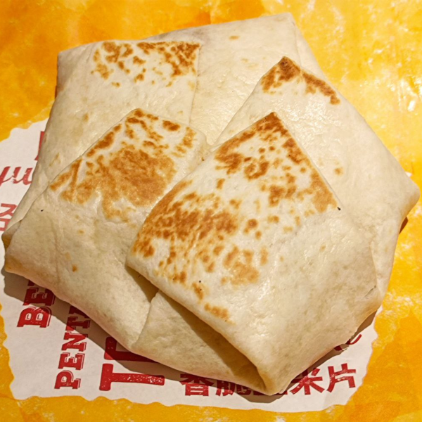

# 猜数字

题解作者：[ustc_zzzz](https://github.com/ustc-zzzz)

出题人、验题人、文案设计等：见 [Hackergame 2022 幕后工作人员](https://hack.lug.ustc.edu.cn/credits/)。

## 题目描述

- 题目分类：general

- 题目分值：150

某大型餐饮连锁店的畅销菜品「嫩牛七方」（见下图）自正式线下售卖以来便好评如潮，但囿于产能限制，只有每周四才会对外售卖。你也是一名「嫩牛七方」的爱好者——每个星期四的晚上都能在某家连锁店里找到你的身影。



「嫩牛七方」在绝大多数情况下都是七边形，但也会有粗心的店员在制作的时候不小心少折一道，从而将其变成六边形。不过，由于某大型餐饮连锁店对质量的严格把控，哪怕作为十多年以来的忠实粉丝，你也只吃到过两次六边形的「嫩牛七方」。当然，在极少数情况下也会有五边形的「嫩牛七方」——但恐怕仅有百万分之一的概率。上一个五边形的「嫩牛七方」在交易市场上已经卖出足足 50 元的天价了。

吃到五边形的「嫩牛七方」一直是你这十多来以来的梦想，但囊中羞涩的你，自然是没有办法付得起这 50 块的高价。一周一度的星期四悄然到来，你在各大社交平台发遍了文案，也没有找到人转给你这 50 块钱。这样的悲惨境遇难免使你开始思考人生，在不怀希望的等候中你盯着手机中空旷的点赞通知，思绪却渐渐飘向了这个学期的原子物理。在那里的生活的电子们成群结对，不受制于世俗的欲望却能幸福地在原子轨道间跃迁。可能唯一的缺憾就是诞生了一门完全无法理解的学科，里面的公式如同由符号们随机排列组合构成。这使你想到了你在程序设计课上的作业——一个猜数字小游戏。这个小游戏需要做的事情非常简单：在 0 和 1 之间猜一个数字（精确到小数点后 6 位），并通过反馈的「大」还是「小」修正猜测，直至完全猜中。一次性命中的概率显然也是一百万分之一（和五边形的「嫩牛七方」达成了某种意义上的同构）——但从学霸室友手中借来的概率论与统计学笔记上万千公式的模样在思绪中一瞬而过，于是你默默祈祷着大数定理，虔诚地按下了提交的按钮。

## 题解

通过对 QQ 群的观察，我发现不少选手都尝试通过暴力破解的方式解决问题。这固然是有我的过失在里面的：我不应该把猜对的可能性设置成百万分之一这么大。不过，一个人需要在比赛开始的七天内每天发送近四百万次请求（猜两百万次），才能有 50% 的概率在某一次猜测中一次猜对。因此，达成这一非预期解的概率是非常低的——当然如果真的有幸运儿通过暴力破解的方式做出来了，我也接纳它作为这道题本身解法的一种。

这道题考察的其实是 IEEE 754 标准定义的浮点数并不满足数学上的全序关系。数学上的全序关系（`<`）需要同时满足三条：

1. 非自反性：对于任意 `a`，均有 `a < a` 不成立。
2. 传递性：对于任意 `a`、`b`、和 `c`，均有 `a < b` 且 `b < c` 蕴含 `a < c` 成立。
3. 完全性：对于任意 `a` 和 `b`，均有 `a ≠ b` 蕴含 `a < b` 或 `b < a` 成立。

IEEE 754 标准定义的浮点数满足第 1 条和第 2 条，但因为某个数的存在而不满足第 3 条。这个数就是 `NaN`：

- 对于任意 `a`，`a ≠ NaN` 成立，但 `a < NaN` 或 `NaN < a` 均不成立。

这道题[源代码](src/GuessNumber.java)中的核心判断逻辑是以下三行：

```java
var isLess = guess < this.number - 1e-6 / 2;
var isMore = guess > this.number + 1e-6 / 2;
var isPassed = !isLess && !isMore;
```

使得 `isPassed` 为 `true` 的不仅可以是 `this.number` 本身，也可以是 `NaN`。换言之，提交 `NaN` 即可完成解题：

```http
POST /state
Content-Type: text/xml;charset=UTF-8
Authorization: Bearer 1:MEQCIBxs4yBzfjnYS/o+Z3Bm3lJpIZVfvB1dsjSkzcgj8PakAiAtZcKG6tBqDhbOYEXwigMCd6bUBJe7P9KlIr6dxDPu4A==

<state><guess>NaN</guess></state>
```

事后的一点碎碎念：不知道有多少选手和我一样喜欢吃 KFC 的嫩牛五方——虽然它似乎从来都没有在疯狂星期四出现过，而且它现在已经下架了。
