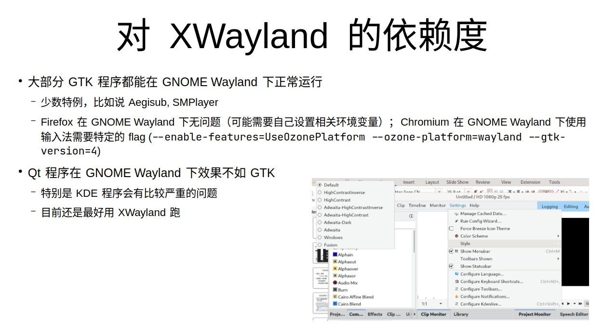
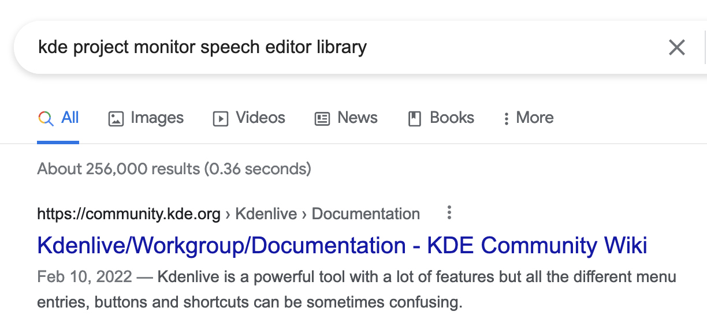
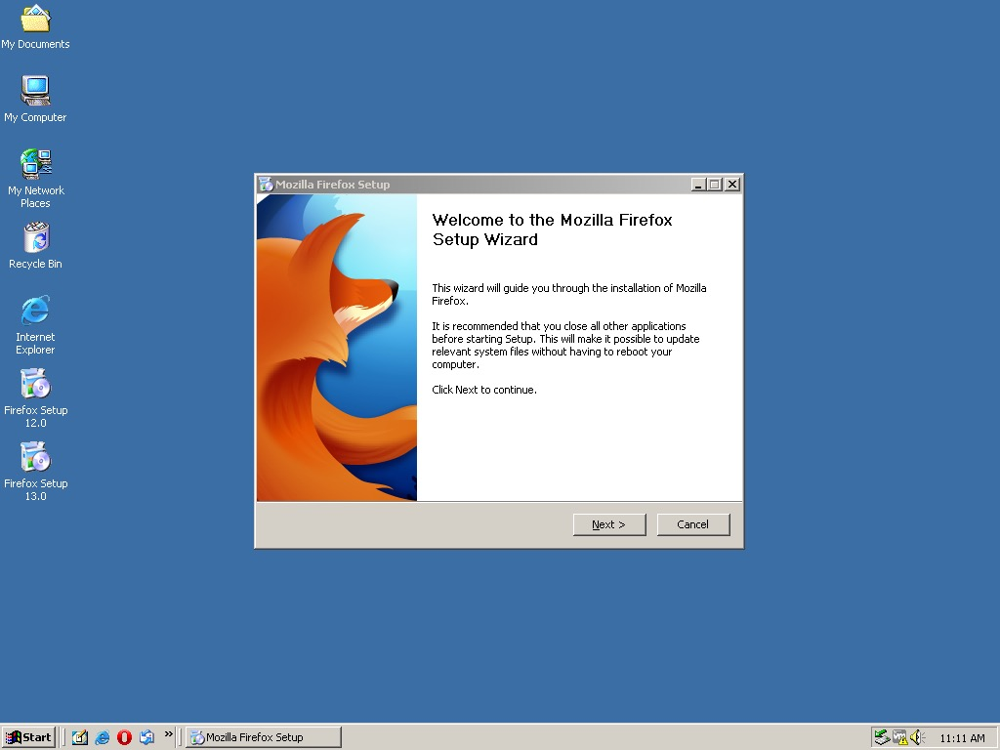
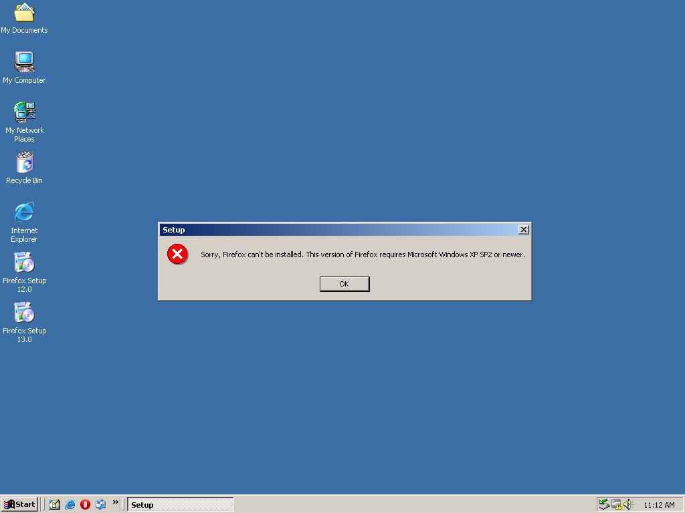
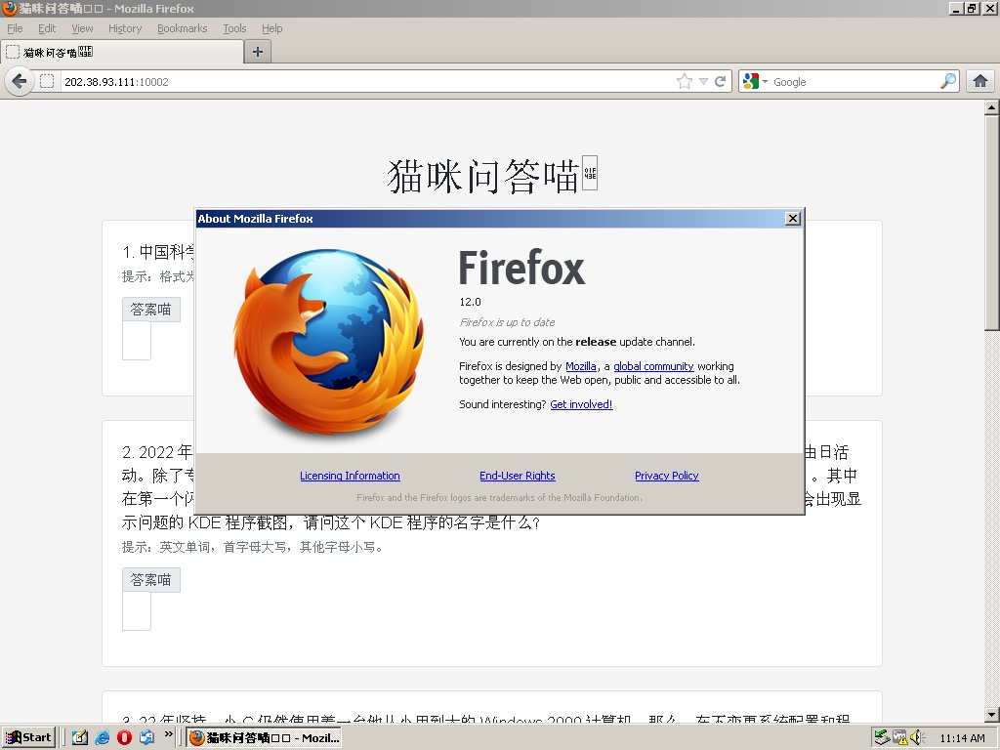
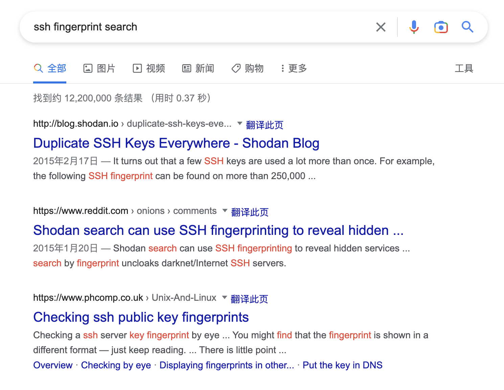
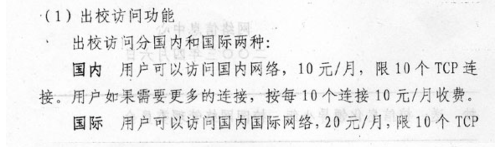
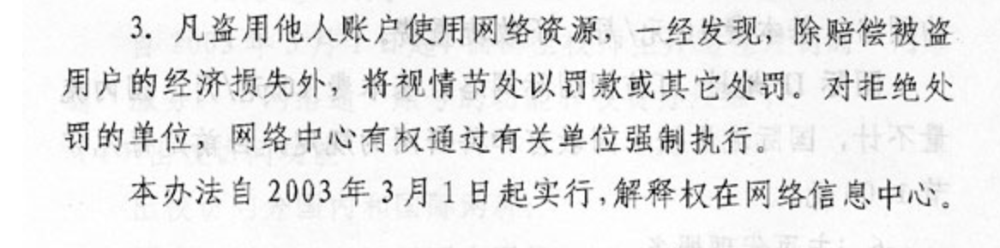

# 猫咪问答喵

出题人、验题人、文案设计等：见 [Hackergame 2022 幕后工作人员](../../credits.pdf)。

## 题目描述

- 题目分类：general

- 题目分值：一半的题目喵（100）+ 全部的题目喵（200）

参加猫咪问答喵，参加喵咪问答谢谢喵。

提示：**解出谜题不需要是科大在校学生**。解题遇到困难？你可以参考以下题解：

- [2018 年猫咪问答题解](https://github.com/ustclug/hackergame2018-writeups/blob/master/official/ustcquiz/README.md)
- [2020 年猫咪问答++ 题解](https://github.com/USTC-Hackergame/hackergame2020-writeups/blob/master/official/%E7%8C%AB%E5%92%AA%E9%97%AE%E7%AD%94++/README.md)
- [2021 年猫咪问答 Pro Max 题解](https://github.com/USTC-Hackergame/hackergame2021-writeups/blob/master/official/%E7%8C%AB%E5%92%AA%E9%97%AE%E7%AD%94%20Pro%20Max/README.md)

**如果你在解出本题的过程中遇到困难，那么可以先尝试后面的题目，不必按顺序做题。**

<p><b style="color:red">补充说明 1：第 5 小题的答案中，域名的字母共有 6 个，各不相同，该域名于 1996 年创建。</b></p>

## 题解

今年的猫咪问答题目难度不高，并且提供了总共答对题目的数量，因此直接搜索或者爆破都很方便。

> 1. 中国科学技术大学 NEBULA 战队（USTC NEBULA）是于何时成立的喵？
>
>    提示：格式为 YYYY-MM，例如 2038 年 1 月即为 2038-01。

搜索「中国科学技术大学 NEBULA 战队」，可以搜索到[新闻稿《中国科学技术大学星云（Nebula）战队在第六届强网杯再创佳绩》](https://cybersec.ustc.edu.cn/2022/0826/c23847a565848/page.htm)，在新闻稿的最后：

> 中国科学技术大学“星云战队（Nebula）”成立于2017年3月，“星云”一词来自……

得到答案为 2017-03。

> 2. 2022 年 9 月，中国科学技术大学学生 Linux 用户协会（LUG @ USTC）在科大校内承办了软件自由日活动。除了专注于自由撸猫的主会场之外，还有一些和技术相关的分会场（如闪电演讲 Lightning Talk）。其中在第一个闪电演讲主题里，主讲人于 slides 中展示了一张在 GNOME Wayland 下使用 Wayland 后端会出现显示问题的 KDE 程序截图，请问这个 KDE 程序的名字是什么？
>
>    提示：英文单词，首字母大写，其他字母小写。

LUG @ USTC 活动的有关资料都在[官网](https://lug.ustc.edu.cn)可以找到，slides 也不例外。在[软件自由日介绍页](https://lug.ustc.edu.cn/wiki/lug/events/sfd/)可以找到[该闪电演讲对应的 slides 链接](https://ftp.lug.ustc.edu.cn/%E6%B4%BB%E5%8A%A8/2022.9.20_%E8%BD%AF%E4%BB%B6%E8%87%AA%E7%94%B1%E6%97%A5/slides/gnome-wayland-user-perspective.pdf)，而倒数第六页的截图：



可以看到菜单显示不正确。而 Settings 最下面是 "Configure Kdenlive"，再搜索可以确定这个有问题的软件就是 Kdenlive。即使没有看到这一条，用 UI 中的文本搜索，也可能可以找到结果：



如果去找直播视频，应该也能做出来，不过可能听不清楚。

> 3. 22 年坚持，小 C 仍然使用着一台他从小用到大的 Windows 2000 计算机。那么，在不变更系统配置和程序代码的前提下，Firefox 浏览器能在 Windows 2000 下运行的最后一个大版本号是多少？
>
>    提示：格式为 2 位数字的整数。

直接搜索 firefox windows 2000 latest version，可能能搜到 [The latest versions to work on w2000 are 28.0 and 24.8.1esr. Wich to use, and why?](https://support.mozilla.org/en-US/questions/1052888)。但是这不代表这两版本是答案。看完页面可以知道，Firefox 12.0 才是最后官方支持的版本，并且在 [Firefox 13.0 系统要求](https://www.mozilla.org/en-US/firefox/13.0/system-requirements/)里，已经不包含 Windows 2000 了。

题目已经说了「不变更系统配置和程序代码的前提」，所以各种靠魔改的方案跑高版本 Firefox 的不在此列。

The hard way 则是：亲自试一试。

Firefox 12:



Firefox 13:



特别地，还可以用 Firefox 12（备注：于 2012 年发布）渲染这道题的页面：



> 4. 你知道 PwnKit（CVE-2021-4034）喵？据可靠谣传，出题组的某位同学本来想出这样一道类似的题，但是发现 Linux 内核更新之后居然不再允许 argc 为 0 了喵！那么，请找出在 Linux 内核 master 分支（torvalds/linux.git）下，首个变动此行为的 commit 的 hash 吧喵！
>
>    提示：格式为 40 个字符长的 commit 的 SHA1 哈希值，字母小写，注意不是 merge commit。

最简单的做法，就是去 [Torvalds 老人家在 GitHub 上的仓库](https://github.com/torvalds/linux)，[搜索 CVE-2021-4034](https://github.com/torvalds/linux/search?q=CVE-2021-4034&type=commits)。

至于 The hard way，我们可以找个用新内核的机器，然后写个程序，看看会发生什么：

guest.c:

```c
#include <stdio.h>

int main(int argc, char **argv) {
    printf("argc: %d\n", argc);
    printf("argv[0]: %s\n", argv[0]);
    printf("argv[1]: %s\n", argv[1]);
    return 0;
}
```

host.c:

```c
#include <unistd.h>

int main(void) {
    execve("./guest", NULL, NULL);
    return 1;
}
```

编译后执行得到：

```console
$ ./host
argc: 1
argv[0]:
argv[1]: (null)
```

可以发现 argc 确实变成了 1（即使我们给的 argv 为 `NULL`）。看 `dmesg` 可以发现：

```
[956141.320366] process 'host' launched './guest' with NULL argv: empty string added
```

所以我们直接去搜索字符串 "with NULL argv: empty string added"。可以用 [GitHub 代码搜索](https://cs.github.com)，也可以用 [Debian 代码搜索](https://codesearch.debian.net)。最终可以得到对应的逻辑在 fs/exec.c 里面。

知道在哪里的话就好办多了，直接 `git blame` 即可定位到 <https://github.com/torvalds/linux/commit/dcd46d897adb70d63e025f175a00a89797d31a43>。

除此之外，也可以利用 GitHub 的搜索语法，[在 `torvalds/linux` 里面搜索所有有 `argv` 的非 merge commit](https://github.com/search?p=2&q=merge%3Afalse+argv+repo%3Atorvalds%2Flinux&type=Commits)，然后一个一个看，也能找到对应的 commit。

> 5. 通过监视猫咪在键盘上看似乱踩的故意行为，不出所料发现其秘密连上了一个 ssh 服务器，终端显示 `ED25519 key fingerprint is MD5:e4:ff:65:d7:be:5d:c8:44:1d:89:6b:50:f5:50:a0:ce.`，你知道猫咪在连接什么域名吗？
>
>    提示：填写形如 example.com 的二级域名，答案中不同的字母有 6 个。

首先搜索如何根据 fingerprint 得到 SSH 服务器的相关信息：



可以找到 [Shodan](www.shodan.io) 可以搜索互联网上的 SSH 服务器的指纹，如图：


可以得到域名 `sdf.org`。

添加补充说明后，其实可以直接枚举六个字母的域名（为了得到 1996 年合法的域名后缀，即 top-level domain 时，可以参考 GeekGame-0th 的小北问答一题的做法，如：[link](https://github.com/PKU-GeekGame/geekgame-0th/blob/main/writeups/player-DF4D0155/writeup.md#8)，然后通过 DNS 排除一部分答案，再 ssh 获取指纹（`ssh example.com -o FingerprintHash=md5`)。

> 6. 中国科学技术大学可以出校访问国内国际网络从而允许云撸猫的“网络通”定价为 20 元一个月是从哪一天正式实行的？
>
>    提示：格式为 YYYY-MM-DD，例如 2038 年 1 月 1 日，即为 2038-01-01。

通过搜索 `网络通` + `USTC` 可以得到 `wlt.ustc.edu.cn` 的域名，从这个页面可以看出主管的部门是 `网络与信息中心`，然后搜索 `USTC` + `网络与信息中心` + `网络通`，很容易到达网络信息中心 [主页](https://ustcnet.ustc.edu.cn/main.htm)，并且发现下方的 [网络服务及费用分担标准](https://ustcnet.ustc.edu.cn/2015/0127/c11088a119923/page.htm)，这个页面是 2015 年更新的，但这并不是最早的实行时间。通过搜索里面的关键字 「国际权限可访问全球地址，每月20元，限10个TCP连接。」，可以发现 2010 年也有类似的 [更新](https://www.ustc.edu.cn/info/1057/4931.htm)，这个通知中提到了更早的 2003 年的「网字〔2003〕1号《关于实行新的网络费用分担办法的通知》」，为了找到「网字」系列通知全文，重新回到网络信息中心 [主页](https://ustcnet.ustc.edu.cn/main.htm)，可以在「官方文件」中找到「网字」系列通知的 [列表](https://ustcnet.ustc.edu.cn/11109/list.htm)，其中有 2003 年的 [网字〔2003〕1号](https://ustcnet.ustc.edu.cn/2003/0301/c11109a210890/page.htm)，此文件从 2003 年 3 月 1 日起实施。




