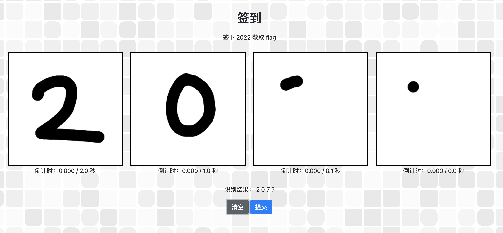
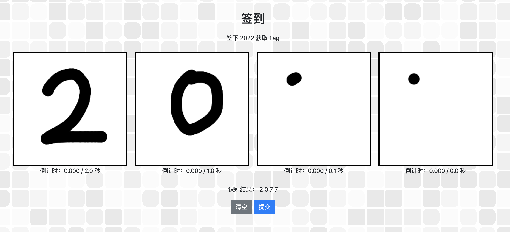
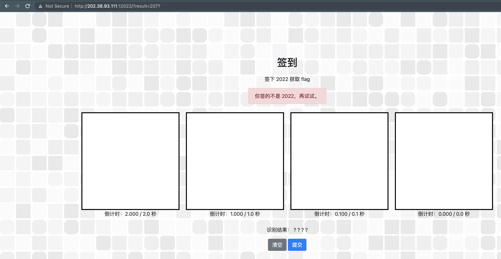
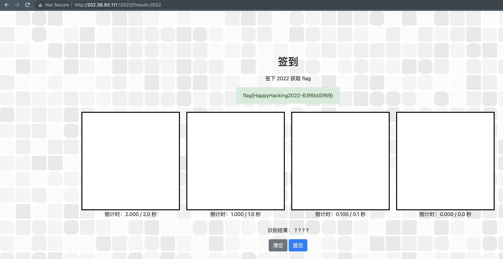
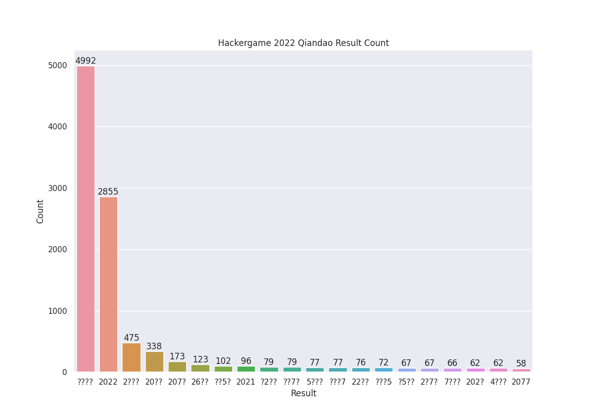
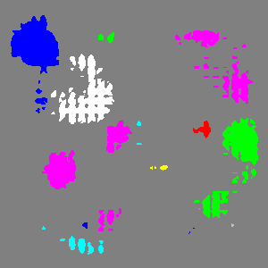

# 签到

题解作者：[volltin](https://github.com/volltin)

出题人、验题人、文案设计等：见 [Hackergame 2022 幕后工作人员](../../credits.pdf)。

## 题目描述

- 题目分类：web

- 题目分值：50

众所周知，签到题是一道手速题。

为了充分发挥出诸位因为各种原因而手速优异于常人的选手们的特长，我们精心设计了今年的签到题。进一步地，为了更细致地区分不同手速的选手，我们还通过详尽的调研及统计分析，将签下字符的时间限制分为了多个等级。只有最顶尖的手速选手，才能在 CPU 来得及反应之前顺利签下 2022，从而得到光荣的 flag！

提示：完成题目遇到困难？你可以参考 [2018 年签到题题解](https://github.com/ustclug/hackergame2018-writeups/tree/master/official/qiandao)、[2019 年签到题题解](https://github.com/ustclug/hackergame2019-writeups/blob/master/official/%E7%AD%BE%E5%88%B0%E9%A2%98/README.md)、[2020 年签到题题解](https://github.com/USTC-Hackergame/hackergame2020-writeups/blob/master/official/%E7%AD%BE%E5%88%B0/README.md) 和 [2021 年签到题题解](https://github.com/USTC-Hackergame/hackergame2021-writeups/blob/master/official/%E7%AD%BE%E5%88%B0/README.md)。

## 题解

打开签到题目后，可以看出题目要求在框中签下 2022，但是后两个框的时间限制比较小，所以很难写对，可能会识别为 `?`。

例子 1：

例子 2：

但是不管识别为了什么数字，都可以点击蓝色的「提交」按钮，此时观察浏览器的地址栏，可以看到识别的结果 `207?` 被填入了 URL 中，并且页面提示：`你签的不是 2022，再试试。`，如下图所示：

所以我们可以通过修改 URL 中的参数，来达到签下 2022 的目的，将地址栏中的参数 `207?` 修改为 `2022`（见下图浏览器的左上角区域），然后回车，就可以得到 flag 了。

## 统计数据

我们在前期测试时发现很容易写出 `2077` 所以还特意加了彩蛋。

模型识别肯定是不太稳定的，在最后两个框内，只用一个点其实也可以画出 2，下面这张图展示了在每个地方只画一个点，最后得到的识别结果，颜色代表的最后的识别结果 `0-9`： `['#000', '#00f', '#0f0', '#0ff', '#f00', '#f0f', '#ff0', '#fff', '#404040', '#c0c0c0']`，灰色（`#808080`）代表 `?`，绿色 （`#0f0`）代表 `2`：

