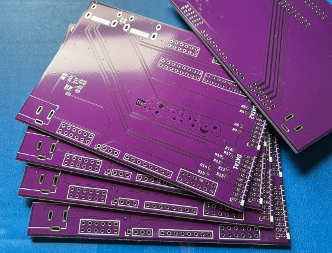
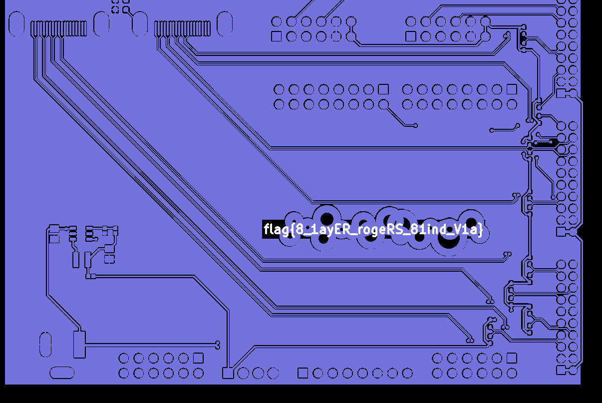
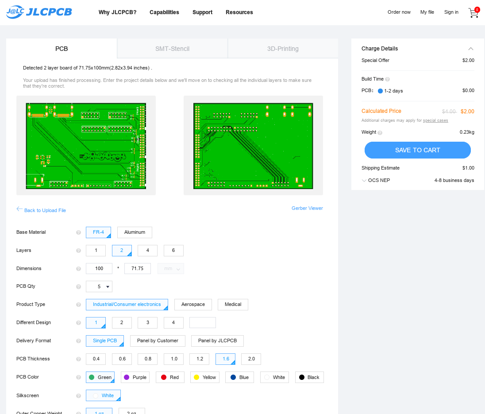
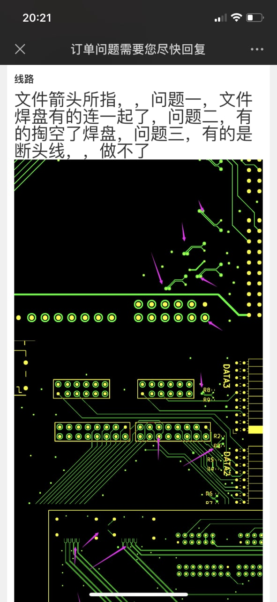

# 线路板

题解作者：[regymm](https://github.com/regymm)

出题人、验题人、文案设计等：见 [Hackergame 2022 幕后工作人员](https://hack.lug.ustc.edu.cn/credits/)。

## 题目描述

- 题目分类：general

- 题目分值：150

中午起床，看到室友的桌子上又多了一个正方形的盒子。快递标签上一如既往的写着：线路板。和往常一样，你“帮”室友拆开快递并抢先把板子把玩一番。可是突然，你注意到板子表面似乎写着些东西……看起来像是……flag？

可是只有开头的几个字母可以看清楚。你一时间不知所措。

幸运的是，你通过盒子上的联系方式找到了制作厂家，通过板子丝印上的序列号查出了室友的底细，并以放弃每月两次免费 PCB 打样包邮的机会为代价要来了这批带有 flag 的板子的生产文件。那这些文件里会不会包含着更多有关 flag 的信息呢？

[打开/下载题目](files/fabrication_files.zip)

## 题解

考察 PCB 设计相关内容，但算是送分题了。

在 PCB 设计过程中，我们会使用 EDA 软件（如现在很流行的自由软件 KiCad，以及经常发律师函的 Altium Designer 等）依次进行原理图绘制、元器件摆放、用电路板上的走线连接元器件，等等。在 PCB 绘制完成后，我们需要将设计导出成 PCB 生产厂家可以直接使用的格式（如果 PCB 设计复杂，那么直接把包含所有设计细节甚至是原理图的源文件交给厂家明显也不是好的选择）。这个格式通常是 Gerber，也就是本题附件包含的文件。这种文件里面没有任何关于元器件或连线的细节，而只有 PCB 各层的几何结构。如果你希望别人能够自己生产你设计的硬件，却又不希望设计完全开源或被改动，那么只发布 Gerber 文件可能是一个好的选择。但要注意仅仅这样的“开源”可能并不够让你的产品成为标准的“开源硬件”。

说回题目，只要用任何一个 Gerber 查看器查看一下压缩包里面的文件就好了。比如用 KiCad 自带的查看器或是更轻量的 gerbv 打开 `ebaz_sdr-F_Cu.gbr`，然后在 flag 处鼠标选区，就可以看到被高亮 flag 了。如果你已经到了用 Gerber 查看器打开这一步，那应该随便点点鼠标就明白怎么回事了……不知道为什么做出来的人这么少。

Flag 内容的意思是一些高级的 PCB 制作工艺：8 层版，Rogers 板材，盲孔。

你会发现每一层铜（这里只有表层和底层）、丝印（板子上白色的字）、和边框（`Edge_Cuts`）都被输出到了不同的 Gerber 文件中，因为明显在 PCB 生产过程中这些部分是分开制作的。另外，`ebaz_sdr-PTH.drl` 文件记录了板子上所有钻孔的位置。

当然，你可以直接把压缩包上传到 PCB 厂家的网站并生产：

这是嘉立创国际版，所以价格贵一些（但似乎直接网页解析 Gerber）。题目中提到的每月两次免费打样包邮是真的存在的，但近期似乎因为被薅羊毛过于严重被迫改成了其他优惠方式。总之现在已经是 2022 年了，个人玩家自己设计并制作 PCB 已经变成了一件几乎没有门槛的事情，对硬件感兴趣的朋友们不要错过啊。

另外群里看到一张图：

不知道是怎么搞的……反正本人真的用这个文件在 JLCPCB 制作过板子，并没有遇到任何问题。

群里有人问这个板子到底是干什么的，其实这是一个扭曲的转接板，负责将本人为 PYNQ-Z1 制作的 AD936X 软件无线电扩展板（PYNQSDR）接在经典“矿渣” EBAZ4205 上，用来实现超低成本的 PlutoSDR 兼容设备。所以板子上方是 PYNQ-Z1 的两个 HDMI 和两个 PMOD，而右方是 EBAZ4205 经典的三个 2x10 mm 排针。详情在本人的 Twitter 上有更新。
