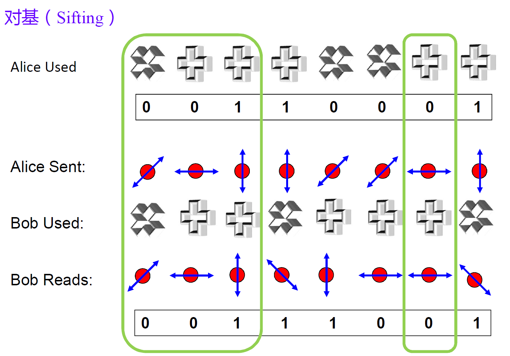
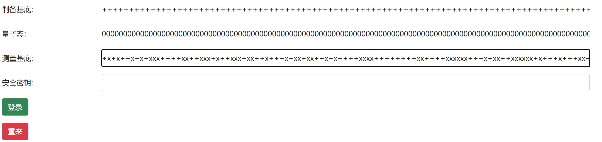
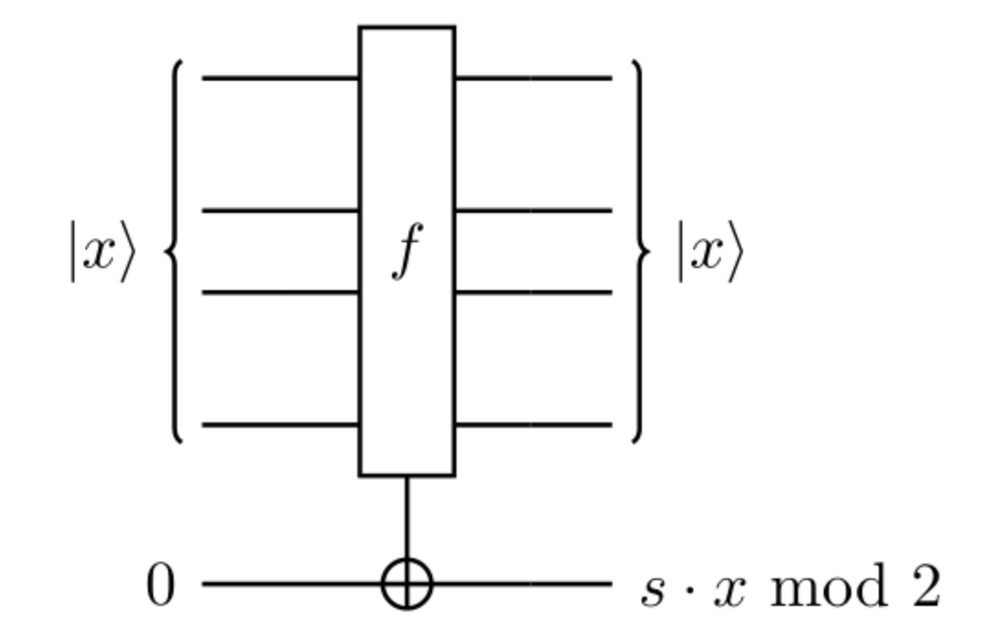

# 量子藏宝图

题解作者：[Elliot](https://github.com/ertuil)

出题人、验题人、文案设计等：见 [Hackergame 2022 幕后工作人员](https://hack.lug.ustc.edu.cn/credits/)。

## 题目描述

- 题目分类：math

- 题目分值：300

相传，**伯恩斯坦**曾到访过一个叫做「坎瑞亚」的古国。游历期间，他发明了一种基于量子计算的密码算法，这种算法可以利用量子计算机进行快速运算。然而，时光荏苒，时过境迁，这种算法竟遗失在了历史长河里。这天，旅行者（你）在游历提瓦特大陆时，收到了一封神秘的匿名邮件。据邮件所说，旅行者若是能够重新解密这一算法，便能获得一个名为 **FLAG** 的金色圣遗物。似乎 **FLAG** 正是隐藏在算法之中。

## 题解

> 由于 Github 的 Markdown 部分公式渲染效果不佳，本 Writeup 提供 [PDF 版本](pdf/writeup.pdf)

### 出题思路

本题旨在借助量子信息学中的经典算法，来向大家介绍量子信息学的基本知识。这两个算法分别是：BB84 协议[^1]和 Bernstein-Vazirani 算法[^2]。其中，BB84 协议是最早设计的量子密钥分发方案，由 Bennertt 和 Brassard 在 1984 年提出；Bernstein-Vazirani 算法则是最早被理论证明量子计算优越的算法之一，由伯恩斯坦和瓦济拉尼在 1992 年提出。

本题通过引入两个挑战，考察答题者的资料收集、线性代数和对量子信息学的基本掌握。

### 第一部分： BB84 协议

该部分对应了**第一章-第一幕**的内容，要求答题者和服务器协商出一个长度为 128 比特的随机密钥。

#### 1.1 量子信息学基础

**量子比特**：量子信息学的基础单位是量子比特（Qubit），通常将其编码一个 2x1 的列向量，例如：

$$\ket{0} = [1, 0]^T, \ket{1}= [0, 1]^T$$

在物理上说，一个 Qubit 通常被编码在一个物理量上（对应的，经典比特通常被编码在电压上）。量子态可以被编码在光量子的偏振特性上，比如 $\ket{0}$ 编码为水平偏振（ $0\degree$ ) 光子， $\ket{1}$ 被编码 （ $90\degree$ ) 在垂直偏振光子。一个水平偏振的光子可以通过水平放置的偏振片，而垂直偏振光子无法通过。


**量子测量**： 因此，我们可以让一个光子通过一个偏振片，然后探测这个光子，以此实现对量子态的测量。例如，我们可以让一个光量子通过一个水平偏振片，然后探测这个光子。如果能够探测到，那么这个光子是 $\ket{0}$ ，反之是 $\ket{1}$ 。这种测量被成为 **Pauli-Z 基测量** [^3]。


**量子操作**：但是，单个量子比特的表达能力比经典比特强。比如，将一个 $\ket{0}$ 的光子通过一个 $45\degree$ 的偏振片。此时，该光量子会变成状态：

$$\ket{+} = \frac{1}{\sqrt{2}}[1, 1]^T$$

此时，如果再次进行 **Pauli-Z 基测量**，得到的量子态是随机的，有 $(1/\sqrt{2})^2=1/2$ 的概率能够测量得到光子，有 1/2 概率无法探测到光子。也就是说，测量结果是量子态在测量基上的投影分量。

另一种测量是 **Pauli-X 基测量**，让光子通过一个 $45\degree$ 的偏振片，则一个 $45\degree$ 偏振的光子一定能被探测，一个 $135\degree$的光子一定不能被探测到（因为 $135\degree$ 和 $45\degree$ 正交，其在 $45\degree$ 方向上的投影分量为 0）。一个 $0\degree$ 或 $90\degree$ 的光子有 1/2 可能性被测量到，有 1/2 的概率不被测量到。

我们通常将 $0\degree$ 和 $90\degree$ 光子称为 **Z** 基态制备的量子，他通过 **Pauli-Z** 基测量可以得到量子态，通过 **Pauli-X** 基的测量则将产生误码。反之， $45\degree$ 和 $135\degree$ 光子称为 **X** 基态制备的量子，通过 **Pauli-X** 基测量可以得到精确结果，而 **Pauli-Z** 基础测量则会产生完全随机乱码。


量子信息学将常见的量子操作形式化为 **量子逻辑门** [^4]，用一个矩阵来表示。如果用一个矩阵操作一个量子态，则新的量子态是矩阵和量子态向量的乘积结果。例如，一个常见的量子门是 **Pauli-X** 门（对应经典的逻辑非门），其矩阵表示是：

$$
\begin{bmatrix}
0 & & 1 \\ 
1 & & 0 
\end{bmatrix}
$$

一个 $\ket{0}$ 的量子态经过该逻辑门可以得到 $\ket{1}$ 量子态：

$$\ket{1} = 
\begin{bmatrix} 
0 \\ 
1 
\end{bmatrix} = 
\begin{bmatrix} 
0 && 1 \\ 
1 && 0 
\end{bmatrix} \cdot 
\begin{bmatrix} 
1 \\ 
0 
\end{bmatrix}$$

和经典逻辑的 “与门“ 或 ”或门” 类似，量子逻辑门同样存在多比特量子逻辑门，一个最经典的是 CNOT，量子受控非门。该门有两个输入，一个控制比特 $q_0$ ，一个受控比特 $q_1$ 。如果 $q_0 = \ket{0}$，那么 $q_1$ 状态不变；反之，如果 $q_0 = \ket{1}$，那么 $q_1$ 状态反转（相当于执行 **Pauli-X** 门）。其状态矩阵是：

$$ CNOT = 
\begin{bmatrix}
1 && 0 && 0 && 0 \\ 
0 && 1 && 0 && 0 \\
0 && 0 && 0 && 1 \\
0 && 0 && 1 && 0 
\end{bmatrix}$$

假设 $q_0 = \ket{1}$ 和 $q_1=\ket{0}$ 系统的状态 $S= q_0 \otimes q_1 = \ket{1} \otimes \ket{0} = [0, 0, 1, 0]^T$ （迪尔卡积）。经过 CNOT 门后状态为：

$$ CNOT \cdot S = [0, 0, 0, 1]^T = [0, 1]^T \otimes [0, 1]^T = \ket{1} \times \ket{1}$$

即 $q_1$ 被反转。 


人们将量子门组合起来，构建了量子门电路，并证明了量子门电路在表达量子算法方面的完备性。关于量子电路的介绍可以参考[^6][^7]。

#### 1.2 BB84 协议

BB84 协议[^1]利用了量子测量的投影特性，构造了第一个”信息论“安全的密钥分发协议。密钥分发协议是这样一种场景：Alice 和 Bob 作为通信双方，需要使用某种加密算法对消息明文进行加密。但是任何加密算法均需要一个双方共享的密钥，该密钥需要满足如下需求：

1. 该密钥应当是密码学安全的随机字符串序列
2. 该密钥不能被除了 Alice 和 Bob 之外的其他实体得知（比如一个攻击者 Eva）

现代密码学通常基于某些数学难解问题构造密钥分发协议，比如 D-H 密钥交换协议或者基于椭圆曲线的 D-H 密钥交换（ECDH）协议等，但是通常存在如下两个问题：

1. 产生的密钥长度受限。实际密钥将不得不进行派生。
1. D-H 密钥交换和 ECDH 的安全假设在量子计算模型下被认为是不安全的。

BB84 协议的主要流程是：

1. Alice 随机产生随机数 0 或者 1，并随机产生制备基 **Pauli-X** 或者 **Pauli-Z**。然后，将随机数编码到这个制备基上。（将 $\ket{0}$ 和 $\ket{+}$ 编码为0，将 $\ket{1}$ 和 $\ket{-}$ 编码为 1）。将量子发送给 Bob。
2. Bob 随机选择 **Pauli-X** 基或者 **Pauli-Z** 基对接收到的光子进行测量，得到结果 0 或者 1（将 $\ket{0}$ 和 $\ket{+}$ 编码为 0，将 $\ket{1}$ 和 $\ket{-}$ 编码为 1）。
3. Alice 公开选择的制备量子态的基 X 或者 Z，而 Bob 公开测量基。如果双方答案一致，则将测量结果保留作为密钥。



该流程满足了密钥交换的两个需求：

1. 只要 Alice 和 Bob 的随机数是安全的，那么密钥结果是随机字符串。
2. 中间人 Eva 将无法得知传输的量子态的准确信息。Eva 可以截取 Alice 发送的光子并测量。但是他不能保证选择的测量基和 Alice 的制备基一致，最终将无法准确恢复量子态并发送给 Bob。另一方面，Alice 和 Bob 可以通过对产生密钥进行校验的方式，证实链路上不存在窃听攻击。

#### 1.3 第一阶段解题思路


根据题意，我们在 BB84 协议中充当 Alice 的角色。我们需要首先制备“随机”的基底和量子态。考虑到 Bob 有 1/2 的概率会选择错误的测量基，我们尽可能输入长度超过 $2\times 128 = 256$ 的基底和量子态。为了简单起见，我们制备全部量子态为 0，全部制备基底为 +。



我们接收到来自 Bob 的随机测量基底为：

```
+x+x++x+x+xxx++++xx++xxx+x++xxx+xx++x+++x+xx+xx++x+x++++xxxx++++++++xx++++xxxxxx+++x+xx++xxxxxx+x+++x+++xx+x++x++xx++xxx+x++x+xxxxxxxx+x+x++x++x+++xx+x+xx+++x+++xxx+x++x+xx+xxxx+++x+x+x+xxxxx+x+xxx++x++xxxxx++xxx+++xx++++x++xx+xx+xxx+xxxx++xxx+x+x+x+xx+x+++++xx++++xxx++x+x+x+x+++x+x++xx+xx+x+x+x+x++
```

我们发现其中有 148 个 '+'，和我们的制备基底一致。对应的密钥保留，最终安全密钥是长度为 148 的 '0...' 字符串。


### 第二阶段 Bernstein-Vazirani 算法

根据题干中的“伯恩斯坦”的描述，我们需要解题者自行搜索了解 Bernstein-Vazirani 算法。该部分对应了**第二章-第一幕** 的题目。

#### 2.1 算法简介

Bernstein-Vazirani 算法 [^2] 是最早的被证明量子计算优越性（即量子计算模型比经典计算模型高效）的算法之一，这个网页 [^5] 给出了关于这个算法的很好的描述。

该算法针对这样一个问题：假设存在一个黑盒函数 $f_s(x)$ ，该黑盒函数中藏有一个长度为 n 的秘密字符串 $s \leftarrow \{0,1\}^n$。算法的输入是一个和 $s$ 等长的字符串 $x\in \{0,1\}^n$，输出 $s$ 和 $x$ 的正交积:

$$f_s(x) = s \cdot x \bmod 2 = \sum_{i=0}^n s[i] \cdot x[i] \bmod 2$$


**经典解法**： 经典解法的计算复杂度为 $O(n)$ ，具体做法是构造 n 个字符串 $x_1 = 000...00001$, $x_2 = 000...00010$ ... $x_n = 100...00000$。分别将 $x_i$ 输入得到 $f(x_i) = s[i]$ （秘密字符串的第 i 比特）


**量子算法**：Bernstein-Vazirani 算法的计算复杂度为 $O(1)$ ，该算法巧妙的运用了量子计算模型的并发特性。具体实现如下：


我们首先构造一个量子电路版本的黑盒函 $F$ ，该函数输入是 n 个的输入量子比特寄存器 $\ket{x}\_{(0,n)}$ 和一个输出寄存器 $\ket{y}\_{(n+1)} = \ket{0}$ 。经过该门电路后，前 n 个输入量子比特的状态不变，为 $\ket{x}\_{(0,n)}$ ，而输出寄存器 $\ket{y}\_{(n+1)} = \ket{ s \cdot x \bmod 2}$ 。下图是该黑盒操作的示意图：



具体解法为：

1. 将输入寄存器 $\ket{x}\_{(0,n)}$ 的每一个 Qubit 置为 $\ket{0}$ 。将输出寄存器 $\ket{y}\_{(n+1)}$ 置为 $\ket{0}$ 
2. 将输出寄存器通过一个 **Pauli-X** 操作

    ```math
    X = \begin{bmatrix} 
    0 && 1 \\ 
    1 && 0
    \end{bmatrix}
    ```

    转化为 $\ket{1}=[0, 1]^T$ ；再通过 Hadamard 门 

    ```math
    H = \frac{1}{\sqrt{2}} 
    \begin{bmatrix} 
    1 && 1 \\ 
    1 && -1
    \end{bmatrix}
    ```

    转化为 $\ket{-} = \frac{1}{\sqrt{2}} [1, -1]^T$ 
3. 将输入寄存器 $\ket{x}\_{(0,n)}$ 的每一个 Qubit 经过 Hadamard 门 
4. 将输入寄存器  $\ket{x}\_{(0,n)}$ 和输出寄存器 $\ket{y}\_{(n+1)}$ 通过黑盒函数 $F$，得到 $\ket{x}\_{(0,n)}$ 和 $\ket{y}\_{(n+1)}=\ket{ s \cdot x \bmod 2}$
5. 将输入寄存器  $\ket{x}\_{(0,n)}$ 的每一个 Qubit 再次 Hadamard 门 
6. 使用 **Pauli-Z** 基测量输入寄存器  $\ket{x}\_{(0,n)}$ ，其第 i 个 Qubit 的测量结果即为 $\ket{x}\_i = \ket{s_i}$ 


可以发现，该算法调用以此黑盒函数 $F$ ，即可实现求解。具体解法可以参考 [^5]，这里就不给出了。只提一点，通过前三步的构造，输入寄存器的状态器是：

$$
\ket{x}\_{0,n} = \frac{1}{ \sqrt{2}^{n}} \sum_{i=1}^n \ket{x_i}
$$

其中， $\ket{x_i} = \ket{0000 ... i000}$ 的第 i 比特为 1 。实质上实现了对经典算法中的每一个输入的叠加，以此构造了并行特性。 

#### 2.2 本题解法

本题，我们得到了整个算法的量子电路图，包括黑盒函数 $F$ 的内部结果，可以推测这题是需要我们根据电路图本身来求解秘密值 $s$。我们发现，在图中的两条灰色竖线部分正好对应了黑盒函数  $F$ ，我们下面来针对这部分重点分析。


首先，我们观察到了大量 CNOT 门电路（蓝色细连线），比如，第一个CNOT 门将 $q_0$ 和 $q_{128}$ 连接。根据该电路的效果：

1. 如果 $q_0=0$ （对应了 $x_0 = 0$），那么 $q_{128}$ 不变。对应了 y 不变
2. 如果 $q_0=1$ （对应了 $x_0 = 1$），那么 $q_{128}$ 反转。对应了 $y = y + 1 \pmod 2 = y + s_0 \cdot 1 \pmod 2 = y + s_0 \cdot x_0 \pmod 2$

也就是说，如果 $s_i = 1$，那么存在一个 CNOT 门 连接 $q_i$ 和 $q_{128}$。


但是，我们还进一步观察到了若干成对出现的 $X$ 和 $Z$ 门，我们分别来对其进行讨论。

**$X$ 门混淆**: 观察到 Bernstein-Vazirani 算法中，输入黑盒的 $\ket{q_i} = \ket{+} = \frac{1}{\sqrt{2}} [1, 1]^T$ ,该状态经过一次 $X$ 门之后的状态是:

$$\ket{q_i'} = 
\begin{bmatrix} 
0 && 1 \\ 
1 && 0
\end{bmatrix} \frac{1}{\sqrt{2}} 
\begin{bmatrix} 
1 \\ 
1 
\end{bmatrix} = \frac{1}{\sqrt{2}} 
\begin{bmatrix} 
1 \\ 
1 
\end{bmatrix} = \ket{q_i}, \forall i < 128$$

即， $X$ 门对于输入寄存器 Qubit 的状态不变。


**$Z$ 门混淆**: 

**Pauli-Z** 门的矩阵表达是: 

$$
\begin{bmatrix} 
1 && 0 \\ 
0 && -1 
\end{bmatrix}
$$ 

我们已知输入 Qubit 状态为 

$$\frac{1}{\sqrt{2}} 
\begin{bmatrix} 
1 \\ 
1 
\end{bmatrix}$$

假设此时输出寄存器 $q_{128}$ 的状态是 

$$
\begin{bmatrix} 
a \\ 
b 
\end{bmatrix}, \ ( s.t.\ a^2 + b^2 = 1)
$$

系统联合状态为

$$\frac{1}{\sqrt{2}} 
\begin{bmatrix} 
1 \\ 
1 
\end{bmatrix} \otimes 
\begin{bmatrix} 
a \\ 
b 
\end{bmatrix} = \frac{1}{\sqrt{2}} 
\begin{bmatrix} 
1a \\ 
1b \\ 
1a \\ 
1b 
\end{bmatrix}$$


经过 $Z$ 门 后，状态为 

$$\stackrel{Z_i}{\longrightarrow} Z \otimes I \frac{1}{\sqrt{2}} 
\begin{bmatrix} 
1a \\ 
1b \\ 
1a \\ 
1b 
\end{bmatrix} = 
\begin{bmatrix} 
1 && 0 && 0 && 0 \\ 
0 && 1 && 0 && 0 \\
0 && 0 && -1 && 0 \\ 
0 && 0 && 0 && -1  
\end{bmatrix} \frac{1}{\sqrt{2}} 
\begin{bmatrix} 
1a \\ 
1b \\
1a \\ 
1b 
\end{bmatrix} = \frac{1}{\sqrt{2}} 
\begin{bmatrix} 
a \\ 
b \\ 
-a \\ 
-b 
\end{bmatrix}$$

经过 CNOT 门后 状态为 

$$\stackrel{CNOT}{\longrightarrow} 
\begin{bmatrix} 
1 && 0 && 0 && 0 \\ 
0 && 1 && 0 && 0 \\
0 && 0 && 0 && 1 \\ 
0 && 0 && 1 && 0  
\end{bmatrix} \frac{1}{\sqrt{2}} 
\begin{bmatrix} 
a \\ 
b \\ 
-a \\ 
-b 
\end{bmatrix} = \frac{1}{\sqrt{2}} 
\begin{bmatrix} 
a \\ 
b \\ 
-b \\ 
-a 
\end{bmatrix} $$

最后，再次经过 Z 门后，状态为：

$$\stackrel{Z_i}{\longrightarrow} Z \otimes I \frac{1}{\sqrt{2}} 
\begin{bmatrix} 
a \\ 
b \\ 
-b \\ 
-a 
\end{bmatrix} = 
\begin{bmatrix} 
1 && 0 && 0 && 0 \\ 
0 && 1 && 0 && 0 \\
0 && 0 && -1 && 0 \\ 
0 && 0 && 0 && -1  
\end{bmatrix} \frac{1}{\sqrt{2}} 
\begin{bmatrix} 
a \\ 
b \\ 
-b \\
-a 
\end{bmatrix} = \frac{1}{\sqrt{2}} 
\begin{bmatrix} 
a \\ 
b \\
b \\
a 
\end{bmatrix}$$


另一方面，我们考察不经过两次 $Z$ 门，直接一次 CNOT 门的结果。

$$\stackrel{CNOT}{\longrightarrow} 
\begin{bmatrix} 
1 && 0 && 0 && 0 \\ 
0 && 1 && 0 && 0 \\
0 && 0 && 0 && 1 \\
0 && 0 && 1 && 0 
\end{bmatrix} \frac{1}{\sqrt{2}} 
\begin{bmatrix} 
a \\ 
b \\ 
a \\ 
b 
\end{bmatrix} = \frac{1}{\sqrt{2}} 
\begin{bmatrix} 
a \\ 
b \\ 
b \\ 
a 
\end{bmatrix} $$

也就是说：

$$(Z\otimes I) \cdot \text{CNOT} (Z\otimes I) = \text{CNOT} $$

总结，成对出现的 $Z$ 门结果抵消，不会产生影响。


#### 解法

最终只需要找到包含 CNOT 门的量子比特 $q_i$ 其对应的 $s_i = 1$。根据题意将其按照大端序排列，按 ASCII 查表，得到 flag：

```
flag{f470a85b9b}
```

注意， $q_{127}$ 对应了首个比特， $q_0$ 对应了末位比特。


[^1]: C. H. Bennett and G. Brassard. "Quantum cryptography: Public key distribution and coin tossing". In Proceedings of IEEE International Conference on Computers, Systems and Signal Processing, volume 175, page 8. New York, 1984.

[^2]:  [Ethan Bernstein](https://en.wikipedia.org/w/index.php?title=Ethan_Bernstein&action=edit&redlink=1) and [Umesh Vazirani](https://en.wikipedia.org/wiki/Umesh_Vazirani) (1997). "Quantum Complexity Theory". *SIAM Journal on Computing*. **26** (5): 1411–1473. [doi](https://en.wikipedia.org/wiki/Doi_(identifier)):[10.1137/S0097539796300921](https://doi.org/10.1137%2FS0097539796300921)

[^3]: [Pauli measurements - Azure Quantum | Microsoft Learn](https://learn.microsoft.com/en-us/azure/quantum/concepts-pauli-measurements)

[^4]: [Quantum logic gate - Wikipedia](https://en.wikipedia.org/wiki/Quantum_logic_gate)

[^5]: [Bernstein-Vazirani Algorithm (qiskit.org)](https://qiskit.org/textbook/ch-algorithms/bernstein-vazirani.html)

[^6]: [Defining Quantum Circuits (qiskit.org)](https://qiskit.org/textbook/ch-algorithms/defining-quantum-circuits.html)

[^7]: [Quantum circuit - Wikipedia](https://en.wikipedia.org/wiki/Quantum_circuit)

[^8]: [Qiskit](https://qiskit.org/)

[^9]: [ertuil/SimQN: A discrete time scheduler designed for Quantum Network (github.com)](https://github.com/ertuil/SimQN)
