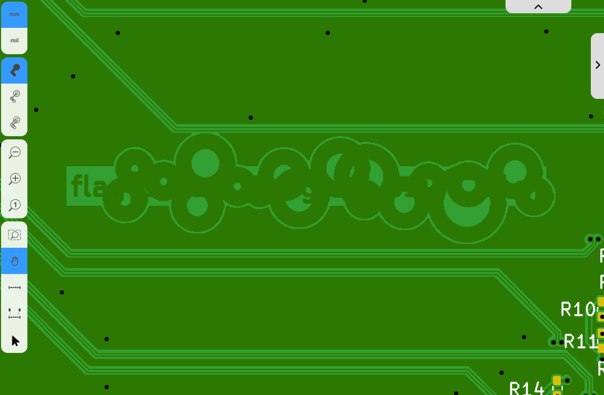
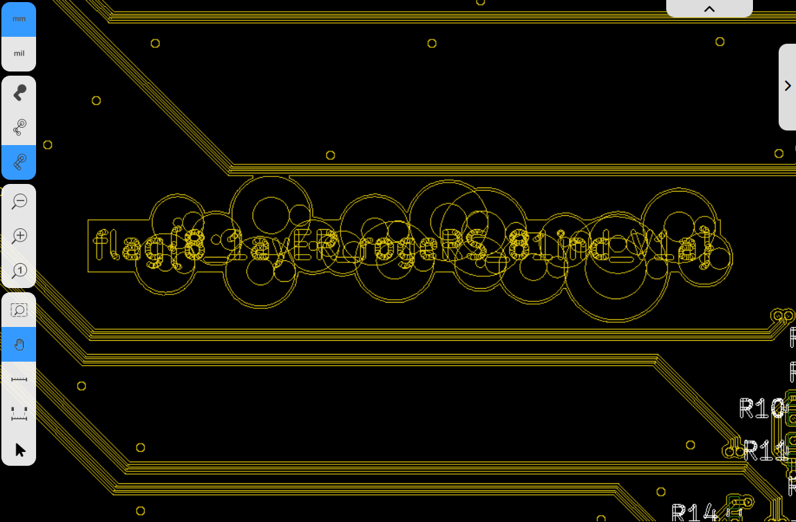
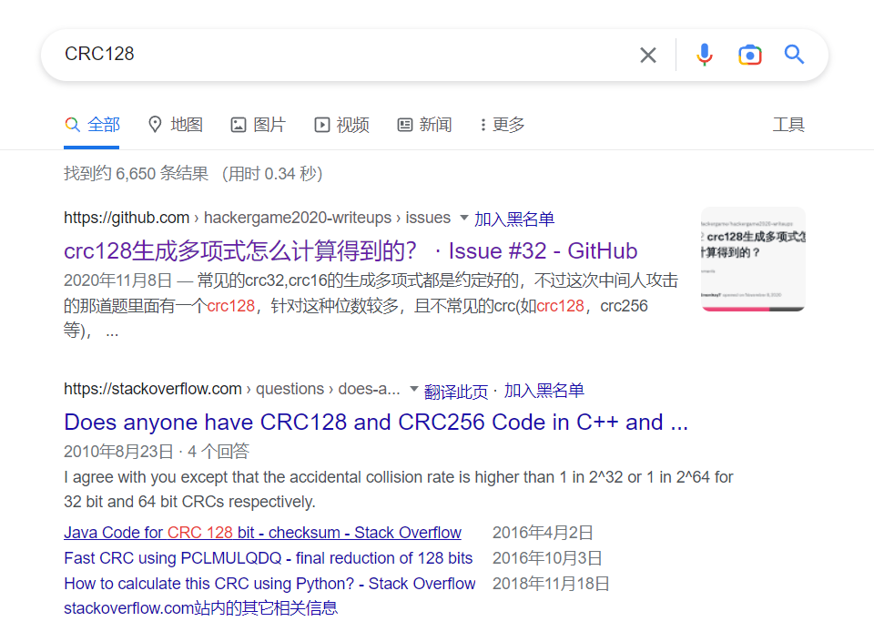

## 前言

今年的题目体感上要更友好一些，比如猫咪问答、旅行照片都设置了难度梯度，整体题目的难度梯度设计也更均匀一些，感觉很不错（

今年是我第三次参加 hacker game，在[去年](https://github.com/USTC-Hackergame/hackergame2021-writeups/tree/master/players/GalaxySnail)时间分配不合理的教训之后，今年我专门关注了题目的时间分配，加上发挥得也比较好，有幸做到了 4900 分、第 49 名，尤其是做出来了一些以前想都不敢想的题目，还挺有成就感的。

## 第1题：签到

随便画几下，点击提交，发现年份是直接通过 URL 上的 param 来传递的，于是把链接改成：

```
http://202.38.93.111:12022/?result=2022
```

即可。

## 第2题：猫咪问答喵

今年的猫咪问答在设计上要友好很多，答对一半题目也能得分，并且提交时会提示对了几道题，这样方便排查哪道题答错了。

许多问题在官方题解里已经讲得很好了，我就讲讲我和官方做法不完全一样的地方。

### 第 2 题：这个 KDE 程序的名字是什么

如官方题解所述，我在页面上找到了 slides 之后，完整阅读，没发现哪来明确写了软件名称，只看到“对 XWayland 的依赖程度”那一页有个截图。于是去看录播，在 https://www.bilibili.com/video/av260820233?t=9720 可以听到，这里说的是 KDE 的视频剪辑软件 Kdenlive。

当时看到这里，笑死，视频里全是 hacker game 的观光团，弹幕一堆问号听不清说的啥的（）因为 GNU/Linux 上的剪辑软件并不多，我听说过 Kdenlive 这个软件，所以不难听清了（

### 第 4 题：PwnKit（CVE-2021-4034）

CVE 号都给出来了，那非常简单，直接搜就行了。

这里需要对 Linux 内核的开发模式有一点了解，Linux 虽然使用 git 做版本控制，但是并不是通过 pull request 机制来接受贡献的，而是需要贡献者把对代码的更改存放在 patch 文件中（其实相当于就是 diff 命令的输出），在内核的邮件列表发邮件，提交代码的 patch，在维护者接受后，对 Linux git 仓库有写入权限的维护者就会把这个 patch 作为一个 commit 提交到 Linux git 仓库中去。

Linux 的官网是 https://kernel.org ，邮件列表也在这里，于是搜索 `Linux CVE-2021-4034 site:kernel.org`，第一个结果就是[提交这个 patch 的邮件](https://lore.kernel.org/lkml/20220126043947.10058-1-ariadne@dereferenced.org/T/)，看到这个 patch 是对 `fs/exec.c` 这个文件做了修改，接着就去 Linux 的源码里找这个文件。

虽然 Linux 的 git 仓库本身并不托管在 GitHub 上，但它在 GitHub 上有一个只读的镜像：https://github.com/torvalds/linux ，在找到 `fs/exec.c` 后点击右侧的 `blame` 按钮来进行 `git blame`，这个模式下可以看到每一行代码是在哪个提交中添加的。从上面邮件的 patch 来看，应该是修改了 `retval = count(argv, MAX_ARG_STRINGS);` 这一行附近的代码，用 `CTRL-F` 搜索，看到这一行的下一行[有一个 9 个月前的提交](https://github.com/torvalds/linux/commit/dcd46d897adb70d63e025f175a00a89797d31a43)，时间刚好能对上，简单阅读一下 commit message，提到了这个 CVE，那确信就是它没错了。

grep 搜索和 [git blame](https://git-scm.com/docs/git-blame) 都是阅读源码时的重要技能，要阅读开源项目的代码的话是很有必要掌握的。

### 第 5 题：ssh 服务器的域名

直接搜索 hash 即可，在搜索引擎搜索 `"e4:ff:65:d7:be:5d:c8:44:1d:89:6b:50:f5:50:a0:ce"`，注意要加上双引号，告诉搜索引擎只显示完整包括这段字符串的网页。在比赛期间能搜到两个结果（现在能搜到 3 个了，多出来的是官方题解😂），分别是：

- https://docs.zeek.org/en/master/logs/ssh.html
- http://tech.srij.it/2017/03/solving-0000-permission-denied.html

简单浏览一下，第二个页面没什么帮助。然后第一反应可能想当然以为就是 `zeek.org` 了，去掉重复的字母刚好是 6 个字母，不过题目的补充说明说域名**共有** 6 个字母，且**各不相同**。

在第一个页面里 `CTRL-F` 搜索这串 md5，看到这串 md5 对应的服务器 ip 是 `205.166.94.16`，于是继续搜索这个 ip，搜到它的域名是 `sdf.org`，并且确实是 1996 年注册的，那么就是它了。

### 第 6 题：网络通定价

这个题没什么需要补充的，就是我当时搜到 2010 年的网页后，直接填了 2011-01-01，结果不对，经过排查确定是这一题有错后，觉得有些摸不着头脑，又去查了查才发现早在 2003 年就有了相关文件，颇具年代感的扫描图片真是让人感慨，定价居然 20 年没有变过（）一开始真没想到这个竟然这么早。

## 第3题：家目录里的秘密

### VS Code 里的 flag

解压开文件后，用 grep 类工具搜索即可。官方题解中举了 grep 和 ripgrep 的例子，不过我更习惯使用 [the silver searcher](https://github.com/ggreer/the_silver_searcher) `ag`：

``` shell
$ ag -i --hidden 'flag{'
```

`-i` 表示不区分大小写，`--hidden` 表示搜索隐藏文件（否则默认会忽略点开头的文件和目录）。

### Rclone 里的 flag

这里和 rclone 有关的文件不多，很容易就能找到在 `user/.config/rclone/rclone.conf` 里存放着密码，不过很明显这个是经过加密的。于是在 GitHub 上的 rclone 源码仓库里搜索 `password`，不难找到 `cmd/obscure/obscure.go` 里包含了混淆和解混淆逻辑的命令行接口，而从 `import` 看出加密和解密的逻辑是在 [`fs/config/obscure.go`](https://github.com/rclone/rclone/blob/v1.60.0/fs/config/obscure/obscure.go) 当中实现的。

因为不熟悉 golang，我不打算修改Go语言代码并编译，而是阅读它的算法然后在 python 中实现。可以看出这里使用的是256位密钥的 AES-256 加密，在此前我对密码学也是零基础，不过往年就听说在 [CTF wiki](https://ctf-wiki.org/crypto/blockcipher/introduction/) 上有不错的资料，就去读了读。

补了一点基础知识后，看到这里使用的分组模式是 CTR 模式，于是就可以开写代码了。我用的是 python 生态中一个比较有名的密码学库 [cryptography](https://github.com/pyca/cryptography)，代码如下：

``` python
import base64

from cryptography.hazmat.primitives.ciphers import Cipher, algorithms, modes

# https://github.com/rclone/rclone/blob/v1.60.0/fs/config/obscure/obscure.go
KEY = bytes([
    0x9c, 0x93, 0x5b, 0x48, 0x73, 0x0a, 0x55, 0x4d,
    0x6b, 0xfd, 0x7c, 0x63, 0xc8, 0x86, 0xa9, 0x2b,
    0xd3, 0x90, 0x19, 0x8e, 0xb8, 0x12, 0x8a, 0xfb,
    0xf4, 0xde, 0x16, 0x2b, 0x8b, 0x95, 0xf6, 0x38,
])
# https://pkg.go.dev/crypto/aes#pkg-constants
AES_BLOCKSIZE = 16

def main():
    password = input().strip()
    password = base64.urlsafe_b64decode(password)
    iv = password[:AES_BLOCKSIZE]
    ciphertext = password[AES_BLOCKSIZE:]

    cipher = Cipher(algorithms.AES(KEY), modes.CTR(iv))
    decryptor = cipher.decryptor()
    plaintext = decryptor.update(ciphertext) + decryptor.finalize()
    print(plaintext)

main()
```

## 第4题：HeiLang

这题不难，简单的字符串处理。我没意识到可以直接查找替换，而是用正则表达式写的。

[点此查看代码](./src/q04_HeiLang.py)

## 第5题：Xcaptcha

这个页面会在 1 秒后自动提交，打开 F12 network，看到它会发送一个 POST 请求。那么很简单，写脚本抓取网页，然后计算出结果并 POST 提交。

[点此查看代码](./src/q05_Xcaptcha.py)。传入的 URL 是直接复制来的带有 token 的 URL，这样不用专门处理 cookie。

## 第6题：旅行照片 2.0

今年的旅行照片设置了难度梯度，即使不用社工也可以拿到一部分分了，这样设计挺不错的。

### 第一题：照片分析

第一问就是典型的 exif 信息问题。在相机拍摄照片的时候，会在照片中记录下诸如设备型号、拍摄时间地点、拍摄时相机使用的各种参数等元数据，这些就是 exif 信息。正如官方题解所说，直接向他人分享照片原图是非常危险的行为。

我使用的工具是命令行的 [exiv2](https://github.com/Exiv2/exiv2)：

``` shell
$ exiv2 travel-photo-2.jpg
```

或者可以加参数查看完整的元数据：

``` shell
$ exiv2 -P kt travel-photo-2.jpg
```

第一问中需要的数据都可以轻易在其中找到。

### 第二题：社工实践

放大图片，可以看到这里有个体育场，上面写着“ZOZOMARINE STADIUM”，即使看不清一两个字母也不影响搜索，经过查找就轻松找到地点是日本千叶海洋球场，位于日本千叶市（从前面 exif 里的时区来看也多半是在日本）。（这次不比去年那个肯德基简单多了，我哭死）

然后我想当然地去 wikipedia 上找到千叶市的邮编就贴在这里了。直到后面航班怎么都不对，才回来怀疑是邮编有问题，上 Google map 一看，竟然隔一两百米一栋楼邮编就不一样，只能说不愧是日本，还是国土面积限制了我的想象力.jpg。打开 Google earth，找到合适的位置角度，可以看到拍摄地点应该是体育馆东侧的一栋高楼，在 Google map 里查看这栋楼的邮编，是 261-0021。

关于手机型号，我是看题目真的很老实地去找近年的小米手机，看哪个型号的摄像头长得和照片里一样，完全没发现 exif 信息里其实就有了（

然后是航班，这个花了我不少时间。我一开始是查了一下航班路线，确定在此处向北飞的飞机一定是起飞于西边的东京国际机场（又叫羽田机场），但是一番搜索后没找到能查看几个月前历史航班信息的网站，都是要收费而且价格不菲。于是我就根据 exif 的拍摄时间，去[官网](https://tokyo-haneda.com/zh-CHS/index.html)找做题当天大约在当地时间下午6点之后起飞的航班，一个一个试。

在全试了一遍发现都是错的后，都差点打算放弃这个题了，不过幸好去检查了一下邮编，才发现邮编有错。改正了邮编后，我发现[这个网站](https://www.flightradar24.com/)不仅仅能查看实时的航班状态，还能查看几天之内的历史航班，于是我又在这里查找下午6点后经过拍摄地的航班，终于试出来了结果。

## 第7题：猜数字

这题的官方题解已经讲得很好了，答案是使用 [IEEE 754](https://en.wikipedia.org/wiki/IEEE_754) 浮点数的 NaN。我一开始也想着去暴力破解了，写好代码一看一秒才十几二十个请求，显然暴力破解是不现实的。又仔细读了读代码，才恍然大悟，应该用 NaN。

[点此查看代码](./src/q07_猜数字.py)

需要强调的一点是，NaN 并不是 java 或者 javascript 独有的，它是 IEEE 754 浮点数标准中规定的一类值，任何支持 IEEE 754 浮点数的编程语言、任何支持 IEEE 754 的 CPU 一定都有这个特性，网上很多段子拿它来黑 javascript 其实是很不合理的（虽然 js 爱搞隐式类型转换确实很坑），只不过 js 的隐式类型转换比别的语言更容易搞出来 NaN 罢了。

但是，像这里，字符串到浮点数的**显式类型转换**是任何语言都绕不过去的。比如：

- 在 python 中，`float("nan")` 不区分大小写，都能得到一个 NaN 值，参见[文档](https://docs.python.org/zh-cn/3/library/stdtypes.html#numeric-types-int-float-complex)。
- 在 rust 中，`f64::from_str("nan")` 同样不区分大小写能得到一个 NaN 值，参见[文档](https://doc.rust-lang.org/std/primitive.f64.html#method.from_str)。[在线编译器](https://play.rust-lang.org/?gist=cba772d38e5a7b0f219ee28c2a3b99ca)
- 在C语言中，从 c99 开始，`atof("nan")` 和 `strtod("nan", &end)` 不区分大小写得到一个 NaN 值，参见文档[[1]][[2]] 。[在线编译器](https://godbolt.org/z/K43hWfsds)

[1]: https://zh.cppreference.com/w/c/string/byte/atof
[2]: https://zh.cppreference.com/w/c/string/byte/strtof

还有一个例子是经典的 `0.1 + 0.2 != 0.3`，也被经常拿来黑 js。因为这个例子太过于常见，甚至有人做了一个网站：https://0.30000000000000004.com/ 专门来收集各个编程语言的浮点数在计算 `0.1 + 0.2` 时的输出。python 官方文档的教程也[专门有一节](https://docs.python.org/zh-cn/3/tutorial/floatingpoint.html)讨论这个问题。

同样，这个行为也是 IEEE 754 binary64 的64位二进制浮点数的标准行为，我们能见到的各种编程语言、CPU 都是如此。

因此，不论是什么编程语言，在处理字符串到浮点数的转换时一定要小心，要么在转换之后检查值是不是正负 inf 和 NaN，要么在转换之前用正则表达式检查，比如只接受 `\d+\.?\d*` 这样的格式。

而像 js 和 lua 这样爱做隐式类型转换的语言，NaN 的威胁则更加无处不在。比如去年（2021年）7月，B站崩溃的那次，事后的[事故分析](https://www.bilibili.com/read/cv17521097)表明就是因为在一段 openresty 的求最大公因数的代码中，lua 将字符串 `"0"` 在求余中隐式转换为 `0`，产生了 NaN，从而导致这个尾递归函数被优化成循环后陷入了死循环。一个小小的 NaN，竟能导致这么严重的事故。

说了这么多，让我想起之前看过的另一个版本的“编程三大错觉”：我懂浮点数、我懂 Unicode、我懂时区。[[链接]](https://hackmd.io/@sysprog/c-floating-point)

## 第8题：LaTeX 机器人

### 纯文本

这道题我是在第 10 题“[安全的在线测评](#第10题安全的在线测评)”之后做的，所以第一就想到了 `#include` 之类的办法，让 LaTeX 编译器帮我们读取 flag 并显示出来。

带着这个关键词去搜索，很容易[搜到了](https://tex.stackexchange.com/questions/246/when-should-i-use-input-vs-include)两个指令：`\input` 和 `\include`。经过尝试，发现 include 不行但 input 可以。

``` latex
\input{/flag1}
```

### 特殊字符混入

第二问，题目明确说 flag 中混入了井号 `#` 和下划线 `_`，上一问的做法自然是不奏效了。不过很自然地想到，有没有办法在 include 文件内容的同时，让文件内容被安全地转义成字符串呢？

经过搜索 `latex \input escape` 之类的关键词，找到了一个叫 `\write18` 的指令，它可以执行任意命令。不过很显然，这样强大的功能明显是安全漏洞，默认是禁用的，从题目的 shell 脚本也能看出加了 `-no-shell-escape` 参数禁用了这个指令。

一番搜索后，终于在 `latex \input underscore` 这样的关键词下搜到了结果：[Change Category Code](https://tex.stackexchange.com/a/386646)，答案是用 ``\catcode` ``指令（注意这个反引号），改变字符类别，让语法中的井号和下划线被解释为普通字符类别。

``` latex
\catcode`\#=11 \catcode`\_=11 \input{/flag2}
```

## 第9题：Flag 的痕迹

查看 dokuwiki 的官方文档，其中介绍了[检查历史变更](https://www.dokuwiki.org/recent_changes)这个功能，不过正如题目所说，这个功能被禁用了，`?do=recent` 不起作用。

不过，这个页面上还提到了一个 diff 功能，于是尝试一下 `?do=diff`，便如愿看到了变更。

## 第10题：安全的在线测评

很有趣的一道题，也是我签到题之后做的第一道题。

### 无法 AC 的题目

经过阅读判题代码和亲自尝试，发现上传上去的程序不论怎么做都是无法获得输出的，因为在执行时降低了权限，所以希望通过 `/proc` 打开父进程的 stdout 来输出数据也是做不到的。因为看不到输出，想要找漏洞提权也不现实。

不过，这里对编译器网开一面，编译器没有降低权限，那么有没有办法让编译器来帮我们读取文件呢？

这个需要对C语言有一点了解，C语言的编译过程分为了“预处理”、“编译”、“链接”这[三大步骤](https://zh.cppreference.com/w/c/language/translation_phases)，其中在预处理期，会执行诸如 `#include` 包含头文件、定义宏、展开宏等一系列操作。其中，`#include` 预处理语句的作用就是读取指定的头文件，然后用文件的内容来替换 `#include` 语句所在的位置，就是简单的文本替换。

而实际上，这个 `#include` 不仅仅能用来包含头文件，也能用来包含 `.c` 后缀的源码文件，更进一步它实际上来者不拒，只要是文本文件就都能处理。所以，我们把样例输出文件的路径传给 `#include` 语句，看看编译器能不能直接读取数据，编译到字符串里去：

``` c
int main(void)
{
    char *str1 = "
#include "/proc/self/cwd/data/static.out"
";
    return 0;
}
```

（我一开始没想到这里的相对路径是相对于被编译的文件，而不是编译器的工作目录，所以我当时用了 `/proc/self/cwd` 来让它变成绝对路径。其实像官方题解那样用正确的相对路径也是可以的。）

很可惜，C语言不支持这样的多行字符串，报告了语法错误，但同时，因为没有禁掉编译器的输出，我们也获得了样例输出的第二行：

```
./temp/code.c: In function ‘main’:
./temp/code.c:3:18: error: missing terminating " character
    3 |     char *str1 = "
      |                  ^
In file included from ./temp/code.c:4:
/proc/self/cwd/data/static.out:2:1: error: expected ‘,’ or ‘;’ before numeric constant
    2 | 10684702576155937335553595920566407462823007338655463309766538118799757703957743543601066745298528907374149501878689338178500355437330403123549617205342471
      | ^~~~~~~~~~~~~~~~~~~~~~~~~~~~~~~~~~~~~~~~~~~~~~~~~~~~~~~~~~~~~~~~~~~~~~~~~~~~~~~~~~~~~~~~~~~~~~~~~~~~~~~~~~~~~~~~~~~~~~~~~~~~~~~~~~~~~~~~~~~~~~~~~~~~~~~~~~~
./temp/code.c:5:1: error: missing terminating " character
    5 | ";
      | ^~
静态数据测试： Compile Error
```

如法炮制，稍微改一下代码（[点此查看代码](src/q10_安全的在线测评/q1-1.c)），就能获得第一行。既然是不会改变的静态数据，那么硬编码写死在代码里就能通过：

``` c
#include <stdio.h>

int main(void)
{
    printf(
        "9760010330994056474520934906037798583967354072331648925679551350152225627627480095828056866209615240305792136810717998501360021210258189625550663046239919\n"
        "10684702576155937335553595920566407462823007338655463309766538118799757703957743543601066745298528907374149501878689338178500355437330403123549617205342471\n"
    );
    return 0;
}
```

本题的 flag 说 `the_compiler_is_my_eyes`，可以说是非常精髓了。

### 动态数据

第二问则更有挑战性。因为不是静态数据，所以不能用编译器获取输出、再写死在代码里了，而必须要编译器直接读取数据并编译到可执行文件的字符串里。

上面多行字符串的尝试失败了，不过我又搜了一下，发现 C++ 有一个[多行字符串](https://zh.cppreference.com/w/cpp/language/string_literal)的语法，而 gcc 作为语法拓展，对C语言也支持这个语法：

``` c
int main(void)
{
    char *str1 = R"(
#include "/proc/self/cwd/data/static.out
)";
    return 0;
}
```

不过很可惜，这个“多行字符串”实际上是“原始字符串”，连着里面的预处理语句也一起转义了，没法在里面 include 文件。那还有别的办法吗？

实际上，在C语言代码里嵌入文件，本身就是个很常见的需求。比如需要把图片作为数组嵌入到可执行程序里去，或者是在程序里嵌入注入 README、LICENSE 之类的信息。我作为一个（自认为）比较关心编程语言最新发展的用户，之前看过一篇文章：[finally. `#embed` is in C23](https://thephd.dev/finally-embed-in-c23)。也就是说，因为这种需求太普遍了，但又一直没有足够好且足够通用的工具，因此在即将到来的 C23 标准中，甚至专门为此引入了一个预处理语句 `#embed`。如官方题解所说，C++ 也有类似的提案但好像没被 C++23 接受，推迟了。

但是至今 gcc 暂时还没有实现这个特性（包括目前最新的 gcc 13）。那么在这个提案之前，通常都是怎么做的呢？最普遍的做法是用诸如 `xxd` 这样的工具，把二进制文件转换成十六进制字符串，然后放在数组的初始化表达式里。也就是说，这是用额外工具在编译之前来做的，编译器对此不知情。那么，对这道题而言也是没有帮助的。

直到做这道题之前，我一直以为只有这一种办法。我又搜索了一下 `#embed` 的替代方案，结果在[这里](https://www.reddit.com/r/C_Programming/comments/wkuy2a/comment/ijpgdg8/?context=3)和[这里](https://stackoverflow.com/questions/4158900/embedding-resources-in-executable-using-gcc/36295692#36295692)看到了一个此前我从没听说过的方案：`.incbin`

这是一个 GNU 汇编器（`gas`）的指令，并不是真正的汇编，但它用来指示汇编器在这个位置嵌入指定文件里的数据。在C语言中，可以用 gcc 内联汇编语法 `__asm__` 来发出这个 `.incbin` 指令。从功能上讲，它几乎就和 `#embed` 差不多了，只不过未被标准化、不容易移植、并且需要写内联汇编。

不过好在已经有一个头文件库处理好了绝大部分样板代码：https://github.com/graphitemaster/incbin ，接下来只需要包含这个头文件，然后调用 `INCTXT` 宏就行。比如，用这个库的话，第一问可以这么做：

``` c
#include <stdio.h>

INCTXT(StaticOut, "/proc/self/cwd/data/static.out");

int main(void)
{
    printf("%s", gStaticOutData);
    return 0;
}
```

在把上面的代码粘贴到终端之前先要把 `incbin.h` 粘贴到终端。

于是这个问题迎刃而解。[点此查看代码](./src/q10_安全的在线测评/q2.c)

这一问的 flag 是 `cpp_need_P1040_std_embed`，当时直接笑出声，确实，要是有了 `#embed` 哪有这么多事（

## 第11题：线路板

解压开题目提供的压缩包，看到有一些 `.gbr` 后缀的文件，经过查询，这是一种叫 gerber 的矢量图格式，是专门为电路板设计的。于是，只需要找一个合适的 gerber 查看器，去掉遮挡就能拿到 flag 了。

先是找了一个叫 [gerbv](https://github.com/gerbv/gerbv) 的查看器，但是不太好用，不方便改遮挡。于是我到 [gerber 官网](https://www.ucamco.com/en/gerber) 看了一下，发现官网提供了一个 gerber 查看器的参考实现，能在浏览器上在线使用：https://gerber-viewer.ucamco.com/

在这里上传整个压缩包，就能看到电路板预览图：



然后在左边第二列按钮改一下预览模式，就能轻松看到 flag 了。




## 第12题：Flag 自动机

没想到这道题做出来的人这么多，而且是 binary 分类的签到题，应该是我对逆向没什么基础，在这道题上花了不少功夫的。官方题解本身已经足够详细了，我不熟悉 win32api，这题是用 [x64dbg](https://x64dbg.com/) 和 [frida](https://frida.re/) 来做的。

先把程序打开，发现鼠标指上去以后按钮会乱飘，于是打开 x32dbg 调试器，attach 上去，然后查看函数调用栈。

GUI 程序属于典型的事件驱动的程序，通常有一个处理事件的主循环（事件循环），等待事件到达，然后调用事件对应的处理程序，处理完毕后继续等待事件。看到调用栈，发现程序不活动时在 `0x00401B61` 地址处调用 `GetMessageA` 函数等待事件，想必这里就是事件循环了。

```
00401B13 | 83EC 30                | sub esp,30                                    |
00401B16 | A1 20B04000            | mov eax,dword ptr ds:[40B020]                 |
00401B1B | C74424 0C 00000000     | mov dword ptr ss:[esp+C],0                    |
00401B23 | C74424 08 90010000     | mov dword ptr ss:[esp+8],190                  |
00401B2B | C74424 04 59194000     | mov dword ptr ss:[esp+4],flag_machine.401959  | 401959:"U夊冹8亇\f"
00401B33 | 890424                 | mov dword ptr ss:[esp],eax                    |
00401B36 | E8 A5040000            | call <JMP.&SetWindowSubclass>                 |
00401B3B | 83EC 10                | sub esp,10                                    |
00401B3E | C74424 0C 00000000     | mov dword ptr ss:[esp+C],0                    |
00401B46 | C74424 08 00000000     | mov dword ptr ss:[esp+8],0                    |
00401B4E | C74424 04 00000000     | mov dword ptr ss:[esp+4],0                    |
00401B56 | 8D45 DC                | lea eax,dword ptr ss:[ebp-24]                 |
00401B59 | 890424                 | mov dword ptr ss:[esp],eax                    |
00401B5C | A1 10C34000            | mov eax,dword ptr ds:[<&GetMessageA>]         |
00401B61 | FFD0                   | call eax        <<---- 在这里                 |
00401B63 | 83EC 10                | sub esp,10                                    |
00401B66 | 85C0                   | test eax,eax                                  |
00401B68 | 0F95C0                 | setne al                                      |
00401B6B | 84C0                   | test al,al                                    |
00401B6D | 74 22                  | je flag_machine.401B91                        |
```

在这里往上找，发现上面使用了一个函数指针 `flag_machine.401959`，跳转过去看看：

```
     0040195F | 817D 0C 00020000       | cmp dword ptr ss:[ebp+C],200             |
 +---00401966 | 0F85 99000000          | jne flag_machine.401A05                  |
 |   0040196C | E8 17640000            | call <JMP.&rand>                         |
 |   ...      | ...                    | ...                                      |
 |   00401998 | E8 EB630000            | call <JMP.&rand>                         |
 |   ...      | ...                    | ...                                      |
 |   004019FA | A1 34C34000            | mov eax,dword ptr ds:[<&SetWindowPos>]   |
 |   004019FF | FFD0                   | call eax                                 |
 |   00401A01 | 83EC 1C                | sub esp,1C                               |
 |   00401A04 | 90                     | nop                                      |
 +-->00401A05 | 8B45 14                | mov eax,dword ptr ss:[ebp+14]            |
```

发现这个函数很蹊跷，有一个 if 分支判断，在分支里调用了两次 `rand` 函数，然后调用了 `SetWindowPos`，想必这里就是让窗口乱跳的逻辑了，在这里的 jne 上打个断点，尝试一下，证实了这个猜想。

其实 x32dbg 这里是可以直接修改寄存器的，让这个控制流不要跳进这个分支，但是手动改寄存器需要操作 x32dbg 的窗口，这样 flag_machine 就失去焦点了，就没法点按钮了。所以我打开了 frida，准备挂钩 `SetWindowsPos` 函数，更改按钮的坐标让它不乱飘。一个简短的 frida javascript 脚本：

``` js
Interceptor.attach(ptr(0x004019FA), {
    onEnter(args) {}
})
```

并用如下命令来执行这个脚本：

``` shell
$ frida -l q12_flag自动机.js flag_machine.exe
```

惊讶地发现，虽然我还啥逻辑都没写，但这样就已经能让按钮不乱飘了。我不太清楚这里的原理，有知道的朋友可以给我题解的仓库提 issue 或者给我发邮件，非常感谢（

我本以为到这就结束了，然而点击上去却弹窗 `获取 flag 失败！您不是本机的“超级管理员”！`

接着保持这个弹窗打开，然后在“线程”中点击主线程（因为此时程序可能因为 frida 而卡在 frida 注入的线程上），然后查看调用栈，发现此时正在 `0x00401836` 地址处调用 `MessageBoxW` 函数：

```
      0040180A | 817D 14 52BF0100     | cmp dword ptr ss:[ebp+14],1BF52               |
  +---00401811 | 74 2D                | je flag_machine.401840                        |
  |   00401813 | C74424 0C 00000000   | mov dword ptr ss:[esp+C],0                    |
  |   0040181B | C74424 08 5EA04000   | mov dword ptr ss:[esp+8],flag_machine.40A05E  | 40A05E:L"Error"
  |   00401823 | C74424 04 6CA04000   | mov dword ptr ss:[esp+4],flag_machine.40A06C  | 40A06C:"穬諷 "
  |   0040182B | 8B45 08              | mov eax,dword ptr ss:[ebp+8]                  |
  |   0040182E | 890424               | mov dword ptr ss:[esp],eax                    |
  |   00401831 | A1 20C34000          | mov eax,dword ptr ds:[<&MessageBoxW>]         |
  |   00401836 | FFD0   <-- 在这里    | call eax                                      |
  |   00401838 | 83EC 10              | sub esp,10                                    |
+-|---0040183B | E9 EF000000          | jmp flag_machine.40192F                       |
| +-->00401840 | 8B45 14              | mov eax,dword ptr ss:[ebp+14]                 |
|     00401843 | 894424 04            | mov dword ptr ss:[esp+4],eax                  |
|     00401847 | 8B45 08              | mov eax,dword ptr ss:[ebp+8]                  |
|     0040184A | 890424               | mov dword ptr ss:[esp],eax                    |
|     0040184D | E8 38070000          | call flag_machine.401F8A                      |
|     00401852 | 8945 EC              | mov dword ptr ss:[ebp-14],eax                 |
|     00401855 | C74424 0C 00000000   | mov dword ptr ss:[esp+C],0                    |
|     0040185D | C74424 08 A4A04000   | mov dword ptr ss:[esp+8],flag_machine.40A0A4  | 40A0A4:L"Congratulations"
|     00401865 | C74424 04 C4A04000   | mov dword ptr ss:[esp+4],flag_machine.40A0C4  | 40A0C4:"m`淯`O穬梍 "
|     0040186D | 8B45 08              | mov eax,dword ptr ss:[ebp+8]                  |
|     00401870 | 890424               | mov dword ptr ss:[esp],eax                    |
|     00401873 | A1 20C34000          | mov eax,dword ptr ds:[<&MessageBoxW>]         |
|     00401878 | FFD0                 | call eax                                      |
|     0040187A | 83EC 10              | sub esp,10                                    |
|     0040187D | C74424 04 28A14000   | mov dword ptr ss:[esp+4],flag_machine.40A128  | 40A128:L"w汦条浟捡楨敮琮瑸"
|     00401885 | C70424 2AA14000      | mov dword ptr ss:[esp],flag_machine.40A12A    | 40A12A:"flag_machine.txt"
v     0040188C | E8 3F650000          | call <JMP.&fopen>                             |
```

这样看来，应该是在上面 `0x00401811` 的分支判断处，进了不该进的分支。而另一条分支看来，有 `"Congratulations"`，然后还 fopen 打开一个 flag_machine.txt 的文件，再下面还调用 fwrite，那这多半就是成功的路径了。

所以，在上述分支判断处下一个断点，再点一下按钮触发断点，在右侧寄存器窗口把 `ZF` 寄存器的值从 0 改成 1，让程序继续运行，便成功进入正确的代码路径，弹出提示窗口，并且写入了 flag_machine.txt 文件。

在写题解复刻的时候，这样操作就一次成功拿到 flag 了。不过当时做题的时候，这样操作得到的 flag_machine.txt 里总是些看上去随机的字节，而且每次点击按钮写入的数据还都不一样，当时也搞不明白是为什么，不过我打算继续用 frida 来自动化这个步骤。

借助 x64dbg 的 [snowman](https://github.com/x64dbg/snowman) 反编译插件，虽然反编译代码的质量不如人意，不过足够帮我理清楚这段代码的控制流了：

<details>
<summary>展开反编译代码</summary>

``` c
void fun_401510(int32_t a1, int32_t a2, int32_t a3, int32_t a4) {
    int32_t eax5;
    int32_t eax6;
    int32_t eax7;
    int32_t eax8;
    int32_t eax9;
    int32_t eax10;
    int32_t v11;
    int32_t v12;
    int32_t eax13;
    int32_t eax14;
    int32_t v15;
    int32_t v16;
    int32_t eax17;
    int32_t v18;
    int32_t v19;
    int32_t v20;
    int32_t v21;
    int32_t eax22;
    int32_t v23;
    int32_t eax24;
    int32_t eax25;
    int32_t eax26;
    int32_t eax27;
    int32_t eax28;
    int32_t eax29;
    int32_t eax30;
    int32_t eax31;
    uint32_t eax32;
    int32_t eax33;
    int32_t eax34;
    int32_t eax35;
    int32_t eax36;
    int32_t eax37;
    int32_t eax38;
    int32_t eax39;
    int32_t eax40;
    int32_t eax41;
    int32_t eax42;
    int32_t eax43;

    if (a2 == 2) {
        eax5 = PostQuitMessage;
        eax5(0);
    } else {
        if (a2 == 0x111) {
            eax6 = a3;
            if (*(int16_t*)&eax6 == 2) {
                eax7 = PostQuitMessage;
                eax7(0);
            }
            eax8 = a3;
            if (*(int16_t*)&eax8 == 3) {
                if (a4 == 0x1bf52) {
                    eax9 = fun_401f8a(a1, a4);
                    eax10 = MessageBoxW;
                    v11 = 0x40187a;
                    eax10(a1, 0x40a0c4, "C", 0);
                    v12 = (int32_t)"w";
                    eax13 = fun_407dd0("flag_machine.txt", "w");
                    if (!eax13) {
                        v11 = 0;
                        v12 = 0x40a13c;
                        eax14 = MessageBoxW;
                        eax14(a1, 0x40a13c, "E", 0, a1, 0x40a0c4, "C", 0);
                        fun_407db8(eax9, v15, v16, 0x4018bf, a1, 0x40a13c, "E", 0, a1, 0x40a0c4, "C", 0);
                        fun_407de0(-1);
                    }
                    eax17 = fun_407d68(eax9, v12, "E", v11, a1, 0x40a0c4, "C", 0);
                    fun_407db0(eax9, 1, eax17, eax13, a1, 0x40a0c4, "C", 0);
                    fun_407dd8(eax13, 1, eax17, eax13, a1, 0x40a0c4, "C", 0);
                    fun_407db8(eax9, 1, eax17, eax13, a1, 0x40a0c4, "C", 0, v18, v19, v20, v21);
                } else {
                    eax22 = MessageBoxW;
                    eax22(a1, 0x40a06c, "E", 0);
                }
            }
        } else {
            if (a2 == 1) {
                v23 = a1;
                eax24 = CreateWindowExW;
                eax25 = (int32_t)eax24(0, "B", 0x40a028, 0x50000000, 85, 0x96, 80, 25, v23, 3, 0, 0);
                g40b020 = eax25;
                eax26 = CreateWindowExW;
                eax27 = (int32_t)eax26(0, "B", 0x40a040, 0x50000000, 0xb9, 0x96, 80, 25, a1, 2, 0, 0, 0, "B", 0x40a028, 0x50000000, 85, 0x96, 80, 25, v23, 3, 0, 0);
                g40b024 = eax27;
                eax28 = g409004;
                eax29 = CreateWindowExW;
                eax30 = (int32_t)eax29(0, "S", eax28, 0x50000000, 85, 100, 0x12c, 20, a1, 1, 0, 0, 0, "B", 0x40a040, 0x50000000, 0xb9, 0x96, 80, 25, a1, 2, 0, 0, 0, "B", 0x40a028, 0x50000000, 85, 0x96, 80, 25, v23, 3, 0, 0);
                g40b028 = eax30;
                eax31 = GetWindowLongA;
                eax32 = (uint32_t)eax31(a1, -16);
                eax33 = SetWindowLongA;
                eax33(a1, -16, eax32 & 0xfffeffff, -16);
                eax34 = CreateFontW;
                eax35 = (int32_t)eax34(12, 0, 0, 0, 0x190, 0, 0, 0, 0x86, 0, 0, 2, 18, 0x40a058);
                eax36 = SendMessageA;
                eax36(a1, 48, eax35, 1);
                eax37 = g40b020;
                eax38 = SendMessageA;
                eax38(eax37, 48, eax35, 1, a1, 48, eax35, 1);
                eax39 = g40b024;
                eax40 = SendMessageA;
                eax40(eax39, 48, eax35, 1, eax37, 48, eax35, 1, a1, 48, eax35, 1);
                eax41 = g40b028;
                eax42 = SendMessageA;
                eax42(eax41, 48, eax35, 1, eax39, 48, eax35, 1, eax37, 48, eax35, 1, a1, 48, eax35, 1);
            }
        }
    }
    eax43 = DefWindowProcW;
    eax43(a1, a2, a3, a4, 85, 0x96, 80, 25, v23, 3, 0, 0);
    return;
}
```

</details>

这里的判断的 `[ebp+14]` 实际上是函数的第 4 个参数，那么只需要挂钩这个函数，让第 4 个参数的值变成 `0x1bf52` 就可以了。不过这个函数会被反复调用，不是所有情况下都需要改这个参数的。

既然函数传参用的是 ebp 寄存器，发现 x64dbg 支持一个叫 `stdcall，EBP 栈帧` 的调用约定，切到这个模式，看到触发这个断点时，第二个参数的值是 `0x111`，那么就用它做判断好了。而 `0x1bf52` 是什么东西呢？转换一下进制，好家伙，原来是 114514，这不是超级管理员，是恶臭管理员罢（恼

综合以上信息，写出代码：

``` js
Interceptor.attach(ptr(0x004019FA), {
    onEnter(args) {}
})

Interceptor.attach(ptr(0x00401510), {
    onEnter(args) {
        if (args[1].toInt32() !== 0x111) {
            return
        }
        for (let i=0; i<4; i++) {
            console.log(`args[${i}]: ${args[i]}, ${args[i].toInt32()}`)
        }
        args[3] = ptr("114514")
        console.log("args[3] = ", args[3].toInt32())
    }
})
```

接着，重启 flag_machine.exe，然后不开调试器，只开 frida，点击按钮，获得 flag，一气呵成。

flag 说 `Y0u_rea1ly_kn0w_Win32API`，2333 其实我基本上一点都不懂 win32api，那么古老的历史遗留，学是不可能学的，只能挂一挂调试器、跑一跑 frida 这样子的，Linux 社区里个个都是人才，说话又好听，我超喜欢在里面的（逃

## 第13题：微积分计算小练习

这个题的官方题解已经讲得很好很完整了，我就说一下我当时做的思路。

这题第一眼让人有些摸不着头脑：一个把 flag 添加到 cookie 里的 selenium headless chromium 浏览器环境能有什么用呢？

cookie 会随着 HTTP 请求发送到比赛服务器，不过经过探索，服务器上也没有能获取其它客户端 cookie 的接口（毕竟这听起来也太扯了）。获取客户端的 cookie，一个容易想到的是 CSRF 跨站请求伪造，让客户端向一个自己控制的服务器发起请求，可是这一方面需要自己有个服务器，对于一道题的解法来说不太现实。（更何况比赛 docker 环境是没有互联网的。）还有 XSS 跨站脚本攻击，可是同样我印象中这需要攻击者拥有自己控制的服务器才行。

探索一番没发现别的解法，又回头看网页的源码，突然发现这里用的是一个 `innerHTML` 属性来设置内容，感觉有点眉目。经过搜索才知道，这是一种基于 DOM 的 XSS 攻击，不需要服务器参与。刚好提交信息的 bot 会在终端打印信息，那么把对应 DOM 的内容换成 cookie 不就行了？接下来的步骤就和官方题解一致了。payload 如下：

``` shell
base64 -w0 << EOF
:abc
EOF
```

## 第14题：杯窗鹅影

作为一个 Linux 用户（虽然日常 PC 是 Windows 居多，连本次比赛都大多是在 Windows 上完成的），wine 自然是熟悉的老朋友了。一个能在 Linux 运行 Windows 二进制程序的软件，听上去就很神奇，我对它的工作原理也一直比较好奇。

只要对 wine 有所了解或者看过官网，就会知道 wine 不是一个模拟器（“wine is not an emulator”），而是一个兼容层。此话怎讲？这就要说到不同操作系统的可执行文件格式了。

可执行文件，本质上就是一堆机器代码，只要这些代码被 CPU 加载执行，就是运行了我们要的程序。那么理论上讲，只要是同样指令集架构的 CPU（比如同样是 x86_64），那么同样的程序就应该都能正常执行。但为什么我们见到的程序都是与操作系统有关的呢？

这是因为，可执行文件除了机器代码外，还有一层用来封装代码的文件格式，它包含了一些程序包括哪些函数、入口在哪里（即要从哪里开始执行）、链接了哪些动态链接库等等的信息，需要和机器代码一起包装起来，而不同操作系统使用的文件格式是不一样的。Linux 使用的是 [ELF 格式](https://en.wikipedia.org/wiki/Executable_and_Linkable_Format)，而 Windows 使用的是 [PE 格式](https://en.wikipedia.org/wiki/Portable_Executable)。从格式上讲，不同操作系统就互不相认了。

既然只是文件格式不兼容，那么有没有一种可能，用一个程序去解析文件格式，把机器代码剥离出来，然后执行这些代码，就可以执行另一个操作系统的可执行文件了？wine 正是基于这样的思路。不过，仅仅这样还是不够的，程序为了完成各种功能，比如读写文件、接收用户鼠标键盘输入、向显示器显示图形，这些都需要操作系统的支持，因此程序往往还需要调用一些系统库函数（在 Windows 上通常就是 `ntdll.dll`, `msvcrt.dll` 之类的动态链接库）或者执行[系统调用](https://en.wikipedia.org/wiki/System_call)。如果不能提供这些功能，程序就没法正常运行。

好在，因为 Windows 的系统调用并不稳定，经常更改，绝大部分应用程序为了兼容性都不会亲自在代码中发起系统调用，而是调用更加稳定的 `ntdll.dll` 等 dll 提供的函数。于是，wine 一个个找出了 Windows 上常见的系统 dll，并通过黑箱的方式在 Linux 上自己从头实现了这些函数，当 Windows 程序发起函数调用的时候，就会跳转到 wine 自己实现的这些函数上去执行，这样这些程序在 Linux 上也能正常运行了。

不过，这也意味着，正如 [wine FAQ](https://wiki.winehq.org/FAQ#How_good_is_Wine_at_sandboxing_Windows_apps.3F) 所说，**wine 不会也不能阻止 Windows 程序调用系统调用**，wine 只会忠实地原样执行可执行文件里的代码，包括系统调用，因此 wine 不是任何意义上的沙箱。

我凭借这个印象，读完题目后直接搜索 `wine syscall`，搜到的第二个结构就是一篇 lwn 文章：[Emulating Windows system calls in Linux](https://lwn.net/Articles/824380/)，发现本文我之前看过，而文章一开始也说了 wine 不能阻止 Windows 程序发起系统调用。

既然 wine 会原样执行代码中的系统调用，那么如果我们自己写汇编，去按照 Linux 上的约定发起 Linux 的系统调用，就和普通的 Linux 程序一样了。只不过是编译成 Windows 上的 PE 格式而已，所以还是需要 mingw-w64 工具链。因为我日常主要用 Windows，而 [msys2](https://www.msys2.org/) 基本上是必需品，所以 mingw-w64 和 gcc 编译工具链不成问题，直接在 msys2 下用 gcc 命令就能编译了。

系统调用和函数调用类似，都是一条机器指令，比如在 x86_64 上就是 `syscall` 指令，只不过系统调用不会跳转到函数上去，而是把控制权直接交给操作系统内核，由操作系统内核决定该做什么事。对于想发起系统调用的用户代码来说，需要做的就是准备好系统调用需要的各种数据，按照约定放入指定的寄存器，然后执行一条 `syscall` 指令就可以了。

因为手写汇编比较麻烦，而传统上系统调用这一工作[由 libc 代劳](https://man.archlinux.org/man/syscall.2)，所以我直接去搜索 [musl](https://musl.libc.org/) 的代码，抄来了它用来发起系统调用的函数。接下来，只需要写代码就可以了。

### flag1

第一问，我没想到 wine 模拟的 Windows 函数也能访问 Linux 的路径，而是用上述思路发起系统调用。

在 Linux 上读取一个文件需要两个系统调用，[`open`](https://man.archlinux.org/man/open.2) 打开文件、[`read`](https://man.archlinux.org/man/read.2) 读取文件内容。对 Linux 编程不太熟悉的读者，我推荐阅读一下《unix 环境高级编程》（APUE）这本书，虽然比较老了，但是作为这方面知识的入门还是很不错的。

只需要传递 flag 文件的路径，用 open 打开文件，再用 read 读取文件就可以了。

``` c
#include <stdio.h>
#include <stdint.h>

// https://github.com/bminor/musl/blob/master/arch/x86_64/syscall_arch.h
static inline int64_t __syscall2(int64_t n, int64_t a1, int64_t a2)
{
    int64_t ret;
    __asm__ volatile ("syscall" : "=a"(ret) : "a"(n), "D"(a1), "S"(a2)
                      : "rcx", "r11", "memory");
    return ret;
}

static inline int64_t __syscall3(int64_t n, int64_t a1, int64_t a2, int64_t a3)
{
    int64_t ret;
    __asm__ volatile ("syscall" : "=a"(ret) : "a"(n), "D"(a1), "S"(a2),
                      "d"(a3) : "rcx", "r11", "memory");
    return ret;
}

// https://github.com/bminor/musl/blob/master/include/fcntl.h
#define O_RDONLY  0
#define O_WRONLY  1
#define O_RDWR    2

// https://github.com/bminor/musl/blob/master/arch/x86_64/bits/syscall.h.in
#define SYS_read   0
#define SYS_write  1
#define SYS_open   2

int open(const char *filename, int flags)
{
    return (int)__syscall2(SYS_open, (int64_t)filename, flags);
}

ssize_t read(int fd, void *buf, size_t count)
{
    return (ssize_t)__syscall3(SYS_read, fd, (int64_t)buf, count);
}

int main(void)
{
    int fd = open("/flag1", O_RDONLY);
    if (fd < 0) {
        fprintf(stderr, "open: %d\n", fd);
        return 1;
    }

    char buf[4096];
    ssize_t length;
    if ((length = read(fd, buf, 4096)) < 0) {
        fprintf(stderr, "read: %zd\n", length);
        return 1;
    }
    buf[length] = '\0';

    printf("flag1: %s\n", buf);
    return 0;
}
```

### flag2

在 Linux 上，用来执行一个可执行文件的系统调用是 [`execve`](https://man.archlinux.org/man/execve.2)，我们只需要把可执行文件的路径传给它就行了。因为只需要一个系统调用，代码反而比上一问还简单些（

``` c
#include <stdio.h>
#include <stdint.h>

// https://github.com/bminor/musl/blob/master/arch/x86_64/syscall_arch.h
static inline int64_t __syscall3(int64_t n, int64_t a1, int64_t a2, int64_t a3)
{
    int64_t ret;
    __asm__ volatile ("syscall" : "=a"(ret) : "a"(n), "D"(a1), "S"(a2),
                      "d"(a3) : "rcx", "r11", "memory");
    return ret;
}

// https://github.com/bminor/musl/blob/master/arch/x86_64/bits/syscall.h.in
#define SYS_execve  59

int execve(const char *path, char *const argv[], char *const envp[])
{
    return __syscall3(SYS_execve, (int64_t)path, (int64_t)argv, (int64_t)envp);
}

int main(void)
{
    char *argv[] = {"readflag", NULL};
    char *envp[] = {NULL};

    int ret;
    if ((ret = execve("/readflag", argv, envp)) < 0) {
        fprintf(stderr, "execve: %d\n", ret);
        return 1;
    }
    // unreachable
}
```

## 第15题：蒙特卡罗轮盘赌

阅读题目代码，看到这一行：

``` c
srand((unsigned)time(0) + clock());
```

发现本题用到了 [`srand`](https://zh.cppreference.com/w/c/numeric/random/srand) 和 [`rand`](https://zh.cppreference.com/w/c/numeric/random/rand) 这两个伪随机数函数，于是问题很明显是爆破随机种子了。因为题目是五局三胜，所以一个很容易想到的策略是，先故意失败两次，然后获得前两次模拟的正确结果，在本地爆破种子，直到猜对前两次结果，然后把后三次结果计算出来。

注意到这里的随机种子是用 `time(0) + clock()` 来初始化的，其中 `time(0)` 其实是 [`time(NULL)`](https://man.archlinux.org/man/time.2)，返回一个表示当前 unix 时间戳的整数，而 [`clock()`](https://man.archlinux.org/man/clock.3) 是返回当前进程使用 CPU 的时间，是一个以微秒为单位的整数。

显然，作为时间戳，`time` 的返回值是很容易预测的。而对于 `clock` 我一开始记错了，误以为 `clock` 是返回从操作系统启动开始计时的时间，认为它的值很难预测，就从 `seed = 0` 开始爆破，在我的电脑上 1024 个种子需要计算大约 12 秒，几个小时才爆破出了结果，而此时 netcat 连接早就超过五分钟被 killed 断开连接了。

后来经过尝试我才注意到，每次进程开始 `clock` 总是返回一个很小的值，通常是几百微秒，又仔细读了手册才发现它是返回进程的时间而不是操作系统的时间。那么爆破就非常容易了，只需要从当前时间戳开始，往后爆破最多大约 1000~2000 个值就够了。

``` c
#include <stdio.h>
#include <stdlib.h>
#include <time.h>
#include <string.h>

static inline double rand01(void)
{
    return (double)rand() / RAND_MAX;
}

double calc_pi(char pi_str[static 10])
{
    int M = 0;
    int N = 400000;
    for (int j = 0; j < N; j++) {
        double x = rand01();
        double y = rand01();
        if (x*x + y*y < 1) M++;
    }
    double pi = (double)M / N * 4;
    sprintf(pi_str, "%1.5f", pi);
    return pi;
}

int main(int argc, char *argv[])
{
    const char *expect1 = argv[1];
    const char *expect2 = argv[2];

    unsigned int seed_start, seed_end;
    seed_start = time(NULL);
    seed_end = seed_start + 2048;

    char pi_str[10];
    unsigned int seed;
    for (seed = seed_start; seed <= seed_end; seed++) {
        srand(seed);
        calc_pi(pi_str);
        if (strcmp(pi_str, expect1) != 0) continue;
        calc_pi(pi_str);
        if (strcmp(pi_str, expect2) != 0) continue;

        printf("Woo hoo! The seed is %u\n", seed);
        goto succeed;
    }

    printf("Unfortunately, not found.\n");
    return 1;

succeed:
    for (int i=0; i < 3; i++) {
        calc_pi(pi_str);
        printf("%s\n", pi_str);
    }
    return 0;
}
```

## 第17题：惜字如金

### HS384

很有趣的一题，经过阅读代码以后发现，`secret = b'ustc.edu.cn'` 是这里 hmac 签名所使用的密钥，但它是经过惜字如金化的，并且告诉了我们惜字如金化之前密钥的长度是 39 个字节，那么我们就需要反向惜字如金化，找到原始的密钥。而可能的原始密钥有很多种，我们需要验证哪一个才是正确的。这里告诉了我们密钥的 sha384 哈希值，但这个哈希值同样是经过惜字如金化的。

这样，就有了一个思路：我们找到一个计算反向惜字如金化的算法，遍历所有的可能性，并对每一种可能性计算出 sha384 哈希摘要，再对哈希摘要进行惜字如金化，直到找到一个能对上题目所给数据的结果。伪代码如下：

``` python
import sys
import hashlib

def XZRJify(string: str) -> str: ...

def unXZRJify_ustc_edu_cn() -> list[str]: ...

expect1 = "ec18f9dbc4aba825c7d4f9c726db1cb0d0babf47f"
expect2 = "a170f33d53bc62074271866a4e4d1325dc27f644fdad"
sha384_length = 384 // 4  # 96

for x in unXZRJify_ustc_edu_cn():
    digest = hashlib.sha384(x.encode()).hexdigest()

    for i in range(len(expect1) + 1, sha384_length - len(expect2) + 1):
        if (
            XZRJify(digest[:i]) == expect1
            and XZRJify(digest[i:]) == expect2
        ):
            print(x)
            sys.exit(0)
```

[点此查看完整代码](./src/q17_惜字如金/q1_search_key.py)

这个看上去有点奇怪的内层循环是干什么的呢？因为在题目源码中，这个 sha384 哈希摘要被截断成了两段，但我们不知道原先是从哪个位置截断的，只好从可能的截断位置中最左边的那个往右一个一个试，直到最右的位置。

原先我想当然地以为是从正中间截断的：

``` python
for x in unXZRJify_ustc_edu_cn():
    digest = hashlib.sha384(x.encode()).hexdigest()
    if (
        XZRJify(digest[:48]) == expect1
        and XZRJify(digest[48:]) == expect2
    ):
        print(x)
        break
```

结果程序运行了一遍以后没找到，然后才发现是自己想当然了，改正后才计算出来，结果是 `usssttttttce.edddddu.ccccccnnnnnnnnnnnn`，哈希摘要是从第 50 个字符处截断的。

接下来，就是用这个算出来的 key 来签名了，这就很简单了，代码如下：

``` python
import hmac
import base64

def sign(filename) -> None:
    secret = b"usssttttttce.edddddu.ccccccnnnnnnnnnnnn"

    with open(filename, "rb") as f:
        dgst = hmac.digest(secret, f.read(), "sha384")

    print(base64.urlsafe_b64encode(dgst).decode())
```

最后需要说明的是，这题的官方题解是有些问题的：

- 总共有约81万种可能性，官方题解的做法漏掉了12多万种，比如 `usttttttttccce.eddddddddddddu.ccccccccn` 就是一种合理的可能性，但被官方题解的代码漏掉了。
- 另外，官方题解中惜字如金化的代码也是有问题的，当单词结尾出现 `ae` 或者 `ee` 时也会删掉结尾的 `e`。
- 官方题解的代码在处理哈希摘要截断的地方也是有问题的，第一段的结尾是 `f`，是辅音字母，第二段开头是 `a`，是元音字母，如果原始摘要第一段的结尾是字母 `e` 的话，官方的代码是会忽略掉这种可能性的。

## 第18题：不可加密的异世界

本题的前两问还是不太难的，我密码学零基础，全靠临时抱佛脚看 CTF wiki 中[关于分组模式的那一节](https://ctf-wiki.org/crypto/blockcipher/mode/introduction/)做出了前两问。第三问当时就估计突破口在 CRC128 上，我一搜，好家伙第一个结果就是 2020 年 hacker game 的题解（



奈何基础知识不足，题解也没看懂，就无缘第三问了。

### 疏忽的神

在 AES 加密中，有两种基础运算：异或运算、AES 加解密。

异或运算有个很好的性质，那就是对任意满足 `a ^ b == c` 的 `a`, `b`, `c`，一定有 `a ^ c == b`、`b ^ c == a` 成立，这样可以轻易地知二求一。

对于 AES 加解密，只要知道密钥，并且知道明文块或者密文块任意二者其一，就能求出另一个。但是同时知道明文和密文，在这种情况下是无法求出密钥的。

利用这两条性质，选择合适的分组模式，就可以构造出来明文和密文一致的情况。先准备好两个工具函数：

``` python
# utils.py
from Crypto.Cipher import AES

def xor(x, y):
    return bytes(a ^ b for a, b in zip(x, y))

def aes_dec_block(key, msg):
    assert len(key) == len(msg) == 16
    return AES.new(key, AES.MODE_ECB).decrypt(msg)
```

对于第一问而言，需要加密的明文很短，长度小于一个块，而我们可以控制 iv，那么问题就很简单了。分别看看题目中提供的4个分组模式，发现 CBC 模式刚好可以满足要求：

在 CBC 模式下，我们可以用 key 和来对密文（其实也是明文）解密，得到一个解密的结果，然后让这个解密的结果和明文做异或运算，从而反推出 iv。这里的 key 是可以任选的。代码如下：

``` python
plaintext = b"Open the door!\x02\x02"
key = b"abcd1234abcd1234"
decrypted = aes_dec_block(key, plaintext)
iv = xor(decrypted, plaintext)
print(key.hex() + iv.hex())
```

### 心软的神

这一问需要加密的明文就长了很多，有 10 个块，不过不是一次性加密，而是加密每个块的时候可以用不同的密钥和 iv，那么只需要每个块单独考虑就行了，加密每个块互不干扰。

这一问我选择的是 OFB 模式，它的特点是用加密的输出块与明文块做异或运算，从而得到密文块。由于异或的特征，只需要得到一个全零的加密输出就行了，那么这里的任务就是用 10 个不同的 iv，分别得到从 1 到 10 每个块加密输出为全零即可，密钥 key 同样是任意的。用全零字节串和密钥，就可以一步步反推出 iv：

``` python
key = b"abcd1234abcd1234"

for i in range(10):
    data = aes_dec_block(key, bytes(16))
    for j in range(i):
        data = aes_dec_block(key, data)
    iv = data
    input(key.hex() + iv.hex())
```

## 置换魔群

### 置换群上的 RSA

阅读代码，发现这题实际上是随机生成了一个置换群作为 secret，然后乘 65537 次方的意思就是让这个置换操作连续执行 65537 次，得到加密后的数据。所以，我们的任务就是，已知这个加密后的置换群，求原始的置换群。因为我不太熟悉这方面的数学，所以就是用直觉加上一些简单的分析糊出来了一份代码（

由题目所述，一个置换群可以分解成数个循环的“小置换”，例如题目中的例子 `A = (1 -> 2 -> 4 -> 1), (3 -> 3)`，标准化记为 `A = (1, 2, 4)(3)`。那么只需要倒推分析每个小置换即可。

例如一个长度为 5 的小置换 `(A, B, C, D, E)`，对它平方，也就是让这个置换执行2次，执行 `A -> B` 再执行 `B -> C`，得到 `A -> C`，其它以此类推，便是 `(A, C, E, B, D)`。对于这个过程，把从 A 出发变换的次数记作 0，变换 4 次变成 E，变换 5 次则又回到 A。画在数轴上：

```
A    B    C    D    E    A    B    C    D    E   ...
+----+----+----+----+----+----+----+----+----+-- ...
0    1    2    3    4    5    6    7    8    9   ...
```

可以观察到，对位置 x 上的元素乘 n 次方，实际上就是 `(x * n) % 5`，其中 `5` 是小置换的元素个数，记为 length。比如，对位置 3 上的 D，乘 2 次方就是 `(3 * 2) % 5 == 1`，变换前位置 1 上的是 B，也就是位置 3 上的元素在变换后应该是 B。

不过，这里我们是需要反推，所以需要知道在变换 n 次之后，位置 1 上的元素 B，经过 n 次变换之前原先是在哪个位置上。因为凡是变换 n 次以后模 length 余 1 的位置就可以满足要求，因此，是求 index 满足 `(index * n) % length == 1`。

只要求出了变换后的 B 在变换前的位置 x，就能轻易推出整个原始的小置换了。比如变换后的 C，在变换前的位置就是 `(2 * index) % length`。按照这个思路求出了一个置换群的每一个小置换，就可以组合成原始的置换群了。

[点此查看完整代码](./src/q19_置换魔群/q1.py)

## 第20题：光与影

这是一道关于 webgl 的题，同样在我的知识盲区，我做出来这题基本纯属瞎猫抓到死耗子（

在 2020 年有一道关于 OpenGL 的题：[超简陋的 OpenGL 小程序](https://github.com/USTC-Hackergame/hackergame2020-writeups/tree/master/official/%E8%B6%85%E7%AE%80%E9%99%8B%E7%9A%84%20OpenGL%20%E5%B0%8F%E7%A8%8B%E5%BA%8F)，也是 flag 被某样东西遮挡掉了，所以思路就是想办法去除遮挡。

我先是搜索了一下调试 webgl 的方案，想试试能不能通过挪动摄像机的方式看到 flag。因此找到了 [Spector.js](https://spector.babylonjs.com/)，但看上去它并不能用来挪动摄像机。所以，只好下载下来代码，尝试在本地改改代码。

简单浏览了一下代码，发现大部分都是一些基本的胶水代码，真正的逻辑应该是在 `fragment-shader.js` 里（你字多跟你混.jpg）。根据 [OpenGL 入门教程中的介绍](https://learnopengl-cn.github.io/01%20Getting%20started/05%20Shaders/)，这是一种叫做 glsl 的语言，是专门用来编写 shaders 的语言，可以理解为是专门为 GPU 编程的一种语言。shader 译为着色器，也就是俗称的“光影”，没错，玩 minecraft 的时候打的光影包主要指的就是它。

简单浏览了这段 glsl 代码，发现有一个 `mk_homo` 函数（警觉），发现在 `sceneSDF` 函数中调用了它。在这个函数中，调用了 5 个后缀为 `SDF` 的函数，前 4 个函数体都很长，只有第 5 个函数体很短，调用时的传参也与另外 4 个很不一样，所以先删掉这个函数试试？

没想到，好家伙，删掉这个函数以后 flag 直接就露出来了（

patch 如下:

``` diff
diff --git a/fragment-shader.js b/fragment-shader.js
index b8e8d33..e772bf9 100644
--- a/fragment-shader.js
+++ b/fragment-shader.js
@@ -299,9 +299,8 @@ float sceneSDF(vec3 p, out vec3 pColor) {
     float t2 = t2SDF((mk_trans(-45.0, 0.0, 0.0) * pTO).xyz);
     float t3 = t3SDF((mk_trans(-80.0, 0.0, 0.0) * pTO).xyz);
     float t4 = t4SDF((mk_trans(-106.0, 0.0, 0.0) * pTO).xyz);
-    float t5 = t5SDF(p - vec3(36.0, 10.0, 15.0), vec3(30.0, 5.0, 5.0), 2.0);

-    float tmin = min(min(min(min(t1, t2), t3), t4), t5);
+    float tmin = min(min(min(t1, t2), t3), t4);
     return tmin;
 }
```

## 看不见的彼方

### 容器化技术

这一题主要是关于 Linux 上的容器化技术。在传统的类 unix 系统上，就有 [`chroot`](https://man.archlinux.org/man/chroot.2) 这样改变进程根目录的功能，能把进程能够访问的目录限制在一个较小的范围内，是一种比较简单轻量的方案，但 `chroot` 不是完整的沙箱，被 chroot 的进程仍然能够看到外面的进程、与外面的进程通信，甚至可能以某些方式逃脱 chroot 的限制。

因此，Linux 引入了许多容器化技术，比如用来拦截系统调用的 [`seccomp`](https://man.archlinux.org/man/seccomp.2)，可以阻止进程调用指定的系统调用。本题中就是用了 `seccomp` 来禁止了 socket 有关的系统调用和用来调试的 `ptrace` 系统调用。`ptrace` 可以跨域进程边界访问其它进程的内存、寄存器，是非常强大的系统调用，`strace`、`gdb` 这样的工具都用到了它，正因为它非常强大，所以通常的沙箱都会禁掉这个系统调用。

再比如用来限制 CPU 和内存等资源使用的 [`cgroups`](https://man.archlinux.org/man/cgroups.7) 控制组，用来防止进程占用过多资源。还有一系列 [`namespaces`](https://man.archlinux.org/man/namespaces.7) 命名空间，用来对进程的资源做彻底的隔离。比如 [IPC 命名空间](https://man.archlinux.org/man/ipc_namespaces.7) 可以阻止内外的进程以某些方式进行[跨进程通信](https://en.wikipedia.org/wiki/Inter-process_communication)，比如[网络命名空间](https://man.archlinux.org/man/network_namespaces.7)可以隔离 socket 通信。

既然我们看到，Linux 引入了这么不同方面的多容器化技术，需要组合使用才能拼出一个完整的沙箱容器，那么仅仅 `chroot` 肯定是不够的。

### `io_uring`

阅读本题的代码，发现这里没有挂载 `/proc`，那么我们没办法直接看到其它进程，想通过 `/proc/<pid>/fd` 来通信是不可能了。因为禁掉了 socket 相关的系统调用，所以 socket 通信也不可能了……吗？

在 Linux 上，除了 socket 相关的系统调用之外，还有一个机制可以使用 socket，那就是 [`io_uring`](https://man.archlinux.org/man/io_uring.7)。`io_uring` 是 Linux 上的一种全新的与操作系统内核通信的机制，专为高性能的异步 IO 而设计。对 `io_uring` 有兴趣的同学可以先看看 [Lord of the io_uring](https://unixism.net/loti/)，虽然已经快两年没更新了，有的信息有些过时，不过作为入门还是可以看看的。

`io_uring` 既然是 IO，那么最基本的文件读写操作、socket 读写操作肯定都是有的，更出乎意料的是，用 `io_uring` 来执行这些操作是不受 `seccomp` 影响的，因为 `seccomp` 只关心系统调用。而本题恰好没有禁止 `io_uring` 相关的系统调用。

不过很可惜的是，我又读了读手册，发现 `io_uring` 没有提供等价于 `bind`, `sendto`, `recvfrom` 系统调用的功能，因此本题是没法用 `io_uring` 来解的。

### socket 以外的 IPC

不过，如果读过《unix 环境高级编程》（APUE）的话，可能会想起来，进程间通信的方式不止 socket 这一种。比如 APUE 第三版的第 15 章“进程间通信”的第 15.7 节到 15.9 节就分别介绍了 3 种 IPC 的方式：消息队列、信号量和共享内存。

对于这三种 IPC 方式，分别有两种不同风格的接口：一种是传统 unix 系统上的 [System V IPC](https://man.archlinux.org/man/sysvipc.7)，另一种是经过 [posix](https://pubs.opengroup.org/onlinepubs/9699919799/basedefs/V1_chap01.html) 标准化的 POSIX IPC。

因为我们是需要传递 flag 这样的字节串数据，所以不考虑信号量。那么剩下的有 4 种：

- System V 消息队列：`msgget`, `msgsnd`, `msgrcv`, `msgctl` 系统调用
- [POSIX 消息队列](https://man.archlinux.org/man/mq_overview.7)：`mq_open`, `mq_send`, `mq_receive` 等函数
- System V 共享内存：`shmget`, `shmat`, `shmdt`, `shmctl` 系统调用
- [POSIX 共享内存](https://man.archlinux.org/man/shm_overview.7)：`shm_open`, `shm_unlink` 函数，以及 `mmap` 系统调用

其中前三种在 Linux 上都由系统调用直接支持，所以不依赖文件系统，即使跨越 `chroot` 的进程也可以使用这三种方案来通信。但第四种，Linux 没有直接支持 posix 共享内存，而是在 GNU/Linux 系统上由 glibc 实现的，它依赖挂载在 `/dev/shm` 目录上的 `tmpfs`，而在本题中因为 `chroot` 所以用不成。

实际上，如上 IPC 命名空间的手册所述，IPC 命名空间就是用来隔离 System V IPC 和 posix 消息队列的，正是因为它们不依赖文件系统标识。

### 解法

我当时做这题是用 posix 消息队列做的。大概看了一下选手们的题解，发现大多数都是用 System V 共享内存或者 System V 消息队列做的，还有的是和官方题解一样用 signal 的（这个解法我真的没想到）。那我就贴一下我的 posix 消息队列的做法吧，虽然也没什么特别的（

``` c
// alice.c
#include <stdio.h>
#include <fcntl.h>
#include <mqueue.h>
#include <unistd.h>

int main(void)
{
    mqd_t mq;
    struct mq_attr attr = {
        .mq_maxmsg = 10,
        .mq_msgsize = 1024,
    };
    mq = mq_open("/msgqueue", O_RDWR | O_CREAT, 0600, &attr);
    if (mq < 0) {
        perror("mq_open");
        return 1;
    }

    int fd = open("/secret", O_RDONLY);
    if (fd < 0) {
        perror("open");
        return 1;
    }

    char buf[1024];
    ssize_t ret;
    if ((ret = read(fd, buf, 64)) < 0) {
        perror("read");
        return 1;
    }
    buf[ret] = '\0';

    if (mq_send(mq, buf, 1024, 0) < 0) {
        perror("mq_send");
        return 1;
    }

    return 0;
}
```

``` c
// bob.c
#include <stdio.h>
#include <fcntl.h>
#include <mqueue.h>
#include <unistd.h>

int main(void)
{
    sleep(1);  // wait for Alice
    mqd_t mq = mq_open("/msgqueue", O_RDONLY);
    if (mq < 0) {
        perror("mq_open");
        return 1;
    }

    char buf[1024];
    if (mq_receive(mq, buf, 1024, 0) < 0) {
        perror("mq_receive");
        return 1;
    }

    printf("%s", buf);

    if (mq_unlink("/msgqueue") < 0) {
        perror("mq_unlink");
        return 1;
    }
    return 0;
}
```

（一点吐槽）希望将来 `io_uring` 能支持 `bind`, `sendto`, `recvfrom` 操作吧，这几个操作还是挺重要的。以及希望 `seccomp` 能早点支持 `io_uring`。（好梦在何方.jpg）

## 第30题：企鹅拼盘

这题的 TUI 说实话初见挺惊艳的，鼠标支持不算稀奇，但是竟然能实时报告鼠标位置，而且 help 弹窗还有弹出动画。看了一下代码，控件、布局、回调，真的有写 GUI 程序内味了。

### 这么简单我闭眼都可以！

第一问纯送分，手动输入序列挨个尝试即可。

### 大力当然出奇迹啦~

第二问序列的长度是 16 位，共 256 次拼盘，那么很显然是暴力破解题。阅读代码后发现，核心逻辑在 `Board` 类当中，并在 `BPApp.watch_pc` 中调用，其它的主要是些 UI 相关的代码。代码不难懂，不过这些意义不明的缩写变量命名看着真的头疼（

``` python
import sys
import json

from tqdm import tqdm

from BP import Board

def code_iter(bits: int):
    for n in range(1 << bits):
        yield [bool(n & (1 << i)) for i in range(bits)]

def main(jsonfilename, bitlength):
    bitlength = int(bitlength)
    with open(jsonfilename, encoding="utf-8") as f:
        branches = json.load(f)

    board = Board()
    for inbits in tqdm(list(code_iter(bitlength))):
        board.reset()
        for branch in branches:
            if inbits[branch[0]]:
                board.move(branch[1])
            else:
                board.move(branch[2])

        if board:
            print()
            print("".join("1" if bit else "0" for bit in inbits))
            break

if __name__ == "__main__":
    main(*sys.argv[1:3])
```

## 写在最后

这次做出来的题真比我预想要多不少，尤其是那几个数学题在以前可能都不敢想的。

除了做出来的题之外，还有“传达不到的文件”花了挺多时间的，可惜没做出来。当时的思路是，看到 `/etc/ld.so.cache` 是可写的，于是打算自己写一个 so 用 interpose libc 的方案来提权，只不过看不到 `/chall` 的文件内容只能是瞎子摸鸭子，试了好久也没成功。当时想到过 `ptrace`，不过根据[我查到的资料](https://stackoverflow.com/questions/21337923/why-ptrace-doesnt-attach-to-process-after-setuid)说出于安全考虑，ptrace 对 suid 程序是没用的，所以就没考虑 ptrace 了。没想到正确的解法就是用 ptrace，看来还是我对 ptrace 了解不足。

还有“二次元神经网络”那题，因为对机器学习没任何基础，看到本题是要上传一个训好的模型，就没多考虑了。本来想当然地以为模型是一些自定义的二进制格式，没想到看了题解才知道是 pickle。用 pickle 构造任意代码执行并不困难，这题没多考虑是有点可惜了。（这题的二次元浓度是真的高.jpg）

另外关于 wine，本来还打算写一点之前看到的关于 futex2 的东西，当时社区有流言称“Linux 终于支持 `WaitForMultipleObjects` 了”，言下之意 Linux 落后了 Windows 好多年，然而实际上这是个彻头彻尾的误解。本来想写一点讲一讲这个问题的，不过题解都鸽到今天了，这个就先鸽置了吧（）等以后搭博客了再写（咕咕咕.jpg

期待明年的 hacker game 🤣

