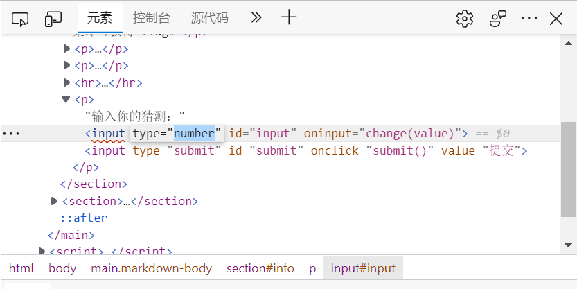
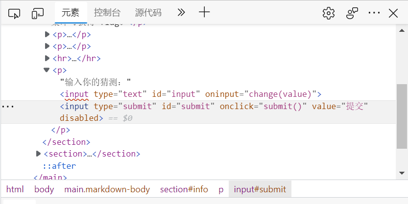

# 猜数字

题解作者:Lasius

本人解法较为特别，如下。

## 题解

通过对题目的分析，可以意识到通过暴力破解的手段是足够低效的，对页面检查，发现可以更改输入框的输入类型。

找到上图所示的元素并将其修改(此处以改为“text”为例)，修改后可以向输入框内输入文本(此处以输入"flag"为例)。

此时提交被禁用，发现按钮元素被添加disabled，将其删除。

此时提交可以被点击，获得flag。

Powered by *Lasius alienus*

**qigaolasius@sina.com**