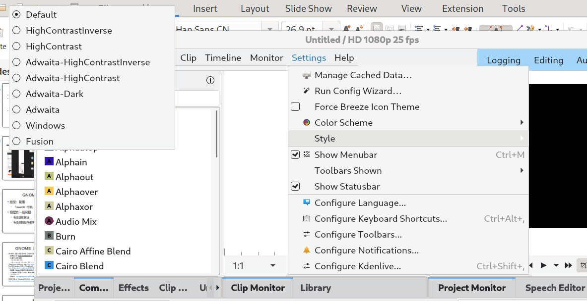
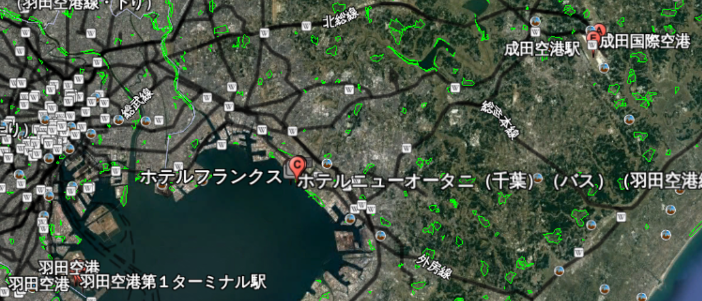
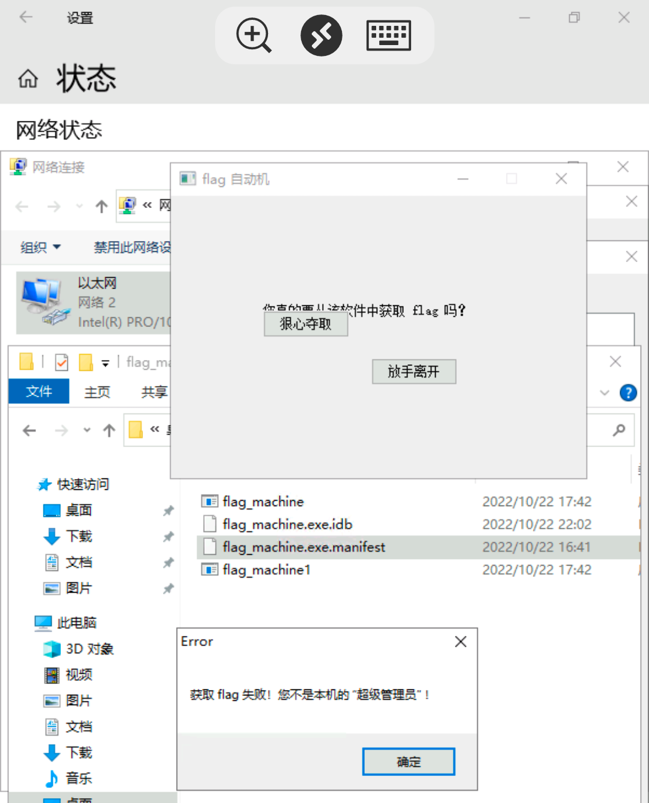
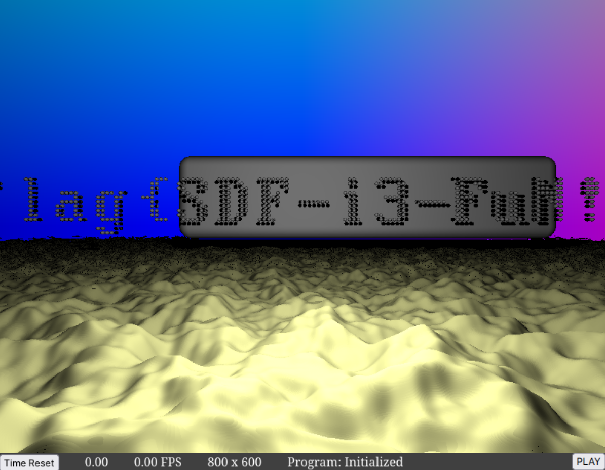
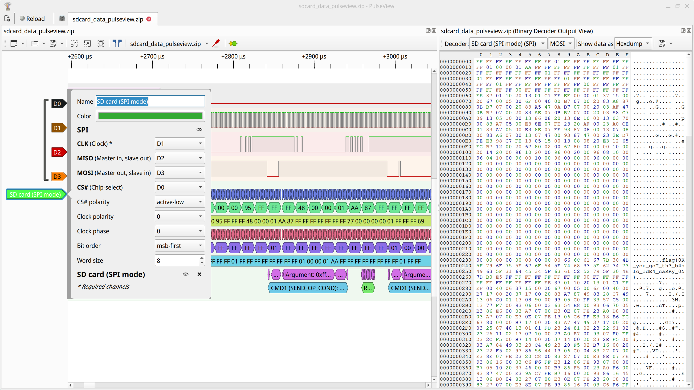
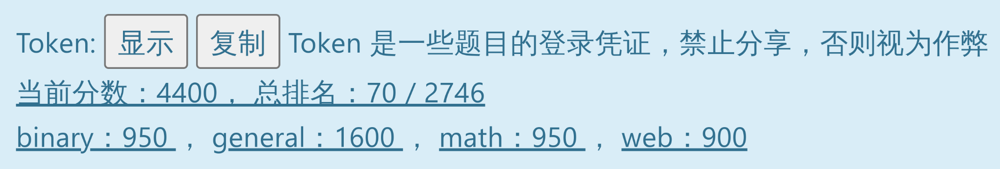

参加 Hackergame 喵，参加 Hackergame 谢谢喵。

<!-- more -->

## 前言

本 Writeup 将同时发布于[我的博客](https://blog.atri.tk/2022/hackergame-2022-writeup/)。

## 签到

题目要求在所给时间内在四个方格中画出“2022”并提交识别结果。打开浏览器 DevTools 并尝试提交一次结果，可以看出：

- 识别数字的功能是通过一个前端加载的 TensorFlow 模型实现的。
- 限制时间的变量在`const TIME_LIMITS = [2, 1, 0.1, 0];`。（可以通过截断代理重写覆盖）
- 提交结果是通过一个`GET`请求实现的，参数`result`的值为识别结果。

所以可以直接通过修改`GET`请求的参数提交正确结果，修改浏览器地址栏、通过控制台、通过截断代理重写、使用`curl`等都可以完成签到。

## 猫咪问答喵

1. 中国科学技术大学 NEBULA 战队（USTC NEBULA）是于何时成立的喵？

   通过搜索，找到了[这个结果](https://cybersec.ustc.edu.cn/2022/0826/c23847a565848/page.htm)喵。

   > 成立于 2017 年 3 月

   在赛前动员会和招新活动中好像也说过喵。

2. [USTCLUG 于 2022 年 9 月承办的 SFD 活动](https://lug.ustc.edu.cn/news/2022/09/SFD/)中，第一个闪电演讲主题里，主讲人于 slides 中展示了一张在 GNOME Wayland 下使用 Wayland 后端会出现显示问题的 KDE 程序截图，请问这个 KDE 程序的名字是什么？

   通过搜索，可以找到[当时的 slides](https://ftp.lug.ustc.edu.cn/%E6%B4%BB%E5%8A%A8/2022.9.20_%E8%BD%AF%E4%BB%B6%E8%87%AA%E7%94%B1%E6%97%A5/slides/gnome-wayland-user-perspective.pdf)喵。

   

   答案是`Kdenlive`喵。

3. Firefox 浏览器能在 Windows 2000 下运行的最后一个大版本号是多少？

   不知道喵。既然是自然数，那就可以使用[苏卡卡的 CC 攻击大法](https://blog.skk.moe/post/hackergame-2020-write-up/#Mao-Mi-Wen-Da)喵。

   答案是`12`喵。

4. 在 Linux 内核 master 分支（torvalds/linux.git）下，找出首个修复 PwnKit（CVE-2021-4034）的 commit 的 hash 喵！

   在[GitHub 上的 linux 镜像仓库中搜索`CVE-2021-4034`](https://github.com/torvalds/linux/search?q=CVE-2021-4034&type=commits)喵。

   答案是`dcd46d897adb70d63e025f175a00a89797d31a43`喵。

5. 会在终端显示 `ED25519 key fingerprint is MD5:e4:ff:65:d7:be:5d:c8:44:1d:89:6b:50:f5:50:a0:ce.` 的 ssh 服务器的域名（形如 example.com 的二级域名，答案中不同的字母有 6 个）？

   带上引号在 Google 搜索`"e4:ff:65:d7:be:5d:c8:44:1d:89:6b:50:f5:50:a0:ce."`喵。找到[这个结果](https://docs.zeek.org/en/master/logs/ssh.html#outbound-movement)喵。可以知道服务器的 IP 地址是`205.166.94.16`喵。

   试着查询一下`PTR`记录喵。

   ```sh
   $ drill -x 205.166.94.16
   ;; ->>HEADER<<- opcode: QUERY, rcode: NOERROR, id: 114514
   ;; flags: qr aa rd ra ; QUERY: 1, ANSWER: 1, AUTHORITY: 0, ADDITIONAL: 0
   ;; QUESTION SECTION:
   ;; 16.94.166.205.in-addr.arpa. IN PTR

   ;; ANSWER SECTION:
   16.94.166.205.in-addr.arpa. 172800 IN PTR sdf.org.

   ;; AUTHORITY SECTION:

   ;; ADDITIONAL SECTION:

   ;; Query time: 0 msec
   ;; SERVER: 127.0.0.1
   ;; WHEN: Wed Oct 23 11:45:14 2022
   ;; MSG SIZE rcvd: 65
   ```

   答案是`sdf.org`喵。

6. 中国科学技术大学可以出校访问国内国际网络的“网络通”定价为 20 元一个月是从哪一天正式实行的？

   找到[这个结果](https://netfee.ustc.edu.cn/faq/index.html#fee)，但是并不正确喵。

   使用[苏卡卡的 CC 攻击大法](https://blog.skk.moe/post/hackergame-2020-write-up/#Mao-Mi-Wen-Da)，得到答案`2003-03-01`喵。

```python
import requests
with open('token', 'r') as f:
    token = f.read().strip()
s = requests.Session()
headers = {}  # 省略喵
host = 'http://202.38.93.111:10002/'
s.get(host, headers=headers, params={'token': token})
for year in range(2000, 2023):
    for month in range(1, 13):
        for day in range(1, 32):
            month = str(month).zfill(2)
            day = str(day).zfill(2)
            print(f'{year}-{month}-{day}')
            data = {
                'q1': '2017-03',
                'q2': 'Kdenlive',
                'q3': '12',
                'q4': 'dcd46d897adb70d63e025f175a00a89797d31a43',
                'q5': 'sdf.org',
                'q6': f'{year}-{month}-{day}',
            }
            resp = s.post(host, data=data, headers=headers)
            if 'flag2' in resp.text:
                print(resp.text)
                exit()
```

## 家目录里的秘密

### VS Code 里的 flag

使用 VS Code 打开`user`目录，使用搜索（Ctrl+Shift+F）搜索`flag{`。或者使用命令：

```sh
$ grep --recursive --line-number --regexp 'flag{' user
user/.config/Code/User/History/2f23f721/DUGV.c:5:// flag{finding_everything_through_vscode_config_file_932rjdakd}
```

### Rclone 里的 flag

找到 rclone 配置文件 `user/.config/rclone/rclone.conf`。可以看到其中有
`pass = tqqTq4tmQRDZ0sT_leJr7-WtCiHVXSMrVN49dWELPH1uce-5DPiuDtjBUN3EI38zvewgN5JaZqAirNnLlsQ`。

这个密码并不是明文，通过搜索可以找到：

- [rclone obscure 文档](https://rclone.org/commands/rclone_obscure/)
- [rclone obscure 源码](https://github.com/rclone/rclone/blob/master/fs/config/obscure/obscure.go)

其中提到：在 rclone 配置文件中，明文密码通过`AES-CTR`对称加密与`base64`编码保存。这并不是一种安全的加密方式，因为 rclone 可以解密这些密码--这是为了防止偷窥。

通过源码第 17-22, 79-80 行，及[go aes 库的文档](https://pkg.go.dev/crypto/aes#pkg-constants)

> ```go
> buf := ciphertext[aes.BlockSize:]
> iv := ciphertext[:aes.BlockSize]
> ```

可以知道`aes.BlockSize`是 16。前 16 字节是`iv`，后面的是`buf`，
`cryptKey`是`9c935b48730a554d6bfd7c63c886a92bd390198eb8128afbf4de162b8b95f638`。

使用[CyberChef](https://gchq.github.io/CyberChef/)，Recipe 使用`From_Base64('A-Za-z0-9-_',false,false)`和`To_Hex('None',16)`。可以得到：

- iv: `b6aa93ab8b664110d9d2c4ff95e26bef`
- buf: `e5ad0a21d55d232b54de3d75610b3c7d6e71efb90cf8ae0ed8c150ddc4237f33bdec2037925a66a022acd9cb96c4`

把 Recipe 改为 AES Decrypt，填入 Key 和 IV，Mode 为 `CTR`，在 Input 中填入刚才得到的`buf`，即可得到 flag。

速通解法：在 rclone 论坛上找到[这个帖子](https://forum.rclone.org/t/how-to-retrieve-a-crypt-password-from-a-config-file/20051)，其中有一个[解密程序](https://play.golang.org/p/IcRYDip3PnE)，填入`pass`的内容运行即可。

## HeiLang

根据题意：`A[x | y | z] = t` 等于 `A[x] = t; A[y] = t; A[z] = t`。

```python
def heihei(hei_key, hei_val): # 元素赋值，一次不限个，嘿嘿！
    global a
    hei_key = map(int, hei_key.split(' | '))
    for k in hei_key:
        a[k] = hei_val
```

通过批量替换，使所有 HeiLang 语句调用这个函数。

## Xcaptcha

通过这个验证码需要在 1 秒内计算三个加法。通过实验确定后端存在限时验证。

既然题目的验证码用于验证客户端是不是机器人在操作，那么使用机器人就能通过验证了。

```python
import requests
from lxml import etree

with open('token', 'r') as f:
    token = f.read().strip()
s = requests.Session()
headers = {}  # 略
host = 'http://202.38.93.111:10047/'
s.get(host, params={'token': token}, headers=headers)

resp = s.get(f'{host}xcaptcha', headers=headers)
e = etree.HTML(resp.text)
labels = e.xpath('//form/div/label')
questions = [x.text.replace(' 的结果是？', '') for x in labels]

data = {f'captcha{i+1}': None for i in range(3)}
for i, question in enumerate(questions):
    question = map(int, question.split('+'))
    data[f'captcha{i+1}'] = sum(question)

resp = s.post(f'{host}xcaptcha', headers=headers, data=data)
print(resp.text)
```

## 旅行照片 2.0


羡慕旅行（

### 照片分析

```sh
$ exiftool travel-photo-2.jpg | grep -E 'Exif Version |Make |Camera Model Name |ISO |Create Date |Flash '
Make                            : Xiaomi
Camera Model Name               : sm6115 (juice)
ISO                             : 84
Exif Version                    : 0231
Create Date                     : 2022:05:14 18:23:35
Flash                           : Off, Did not fire
Create Date                     : 2022:05:14 18:23:35.220027+09:00
```

1. 图片所包含的 EXIF 信息版本是多少？（如 2.1）。
   2.31
2. 拍照使用手机的品牌是什么？
   小米 / 红米
3. 该图片被拍摄时相机的感光度（ISO）是多少？（整数数字，如 3200）
   84
4. 照片拍摄日期是哪一天？（格式为年/月/日，如 2022/10/01。按拍摄地点当地日期计算。）
   2022/05/14
5. 照片拍摄时是否使用了闪光灯？
   否

### 社工入门

将照片放大后可以看到以下字样：

```text
WELCOME TO ZOZOMARINE STADIUM 頂点を、つかむ。 CHIBA LOTTE MARINES 2022
```


找到[千叶海洋球场](https://zh.wikipedia.org/wiki/%E5%8D%83%E8%91%89%E6%B5%B7%E6%B4%8B%E7%90%83%E5%A0%B4)（[ZOZO Marine Stadium](https://en.wikipedia.org/wiki/ZOZO_Marine_Stadium) [千葉マリンスタジアム](https://ja.wikipedia.org/wiki/%E5%8D%83%E8%91%89%E3%83%9E%E3%83%AA%E3%83%B3%E3%82%B9%E3%82%BF%E3%82%B8%E3%82%A2%E3%83%A0)），邮政编码 2610021 。大城市的 Google Earth 3D 数据好棒（

通过刚才的`sm6115 (juice)`，找到手机可能是`Xiaomi POCO M3 / Redmi 9T nfc / Redmi 9 Power / Redmi note 9 4G`，分辨率 2340x1080。



在地图上可以看到附近的机场有<ruby>羽<rt>はね</rt>田<rt>だ</rt></ruby>空港（HND/RJTT）和<ruby>成<rt>なり</rt>田<rt>た</rt></ruby>空港（NRT/RJAA）。

由于地图信息上球场附近写着羽田，于是猜测是羽田空港起飞。接下来的航班信息找不到了。 ~~（我又没有会员）~~

[苏卡卡 CC 攻击大法](https://blog.skk.moe/post/hackergame-2020-write-up/#Mao-Mi-Wen-Da)，启动！（这是第三次了？？）

简单分析请求后，写出以下代码：

```python
import requests
from base64 import urlsafe_b64encode
s = requests.Session()
host = "http://202.38.93.111:10055/"
jp_airports = [] # 略
abroad_airports = [] # 略
for airport in jp_airports:
    for company in ['JL', 'NH', 'HD', 'BC']:
        for flight in range(1000):
            print(airport, f"{company}{flight}")
            query = f"1=2610021&2=2340x1080&3=HND&4={airport}&5={company}{flight}"
            query_base64 = urlsafe_b64encode(
                query.encode('utf-8')).decode('utf-8')
            resp = s.get(f"{host}{query_base64}.txt")
            if resp.status_code != 404:
                print(resp.text)
                exit()
```

还好是国内航班，且航班号数字是三位。最终得到降落机场为`HIJ`，航班号为`NH683`。

## 猜数字

通过查看源码，发现要让 isTalented 的值为 1，就需要控制一次猜中的误差在`1e-6/2`以内。

没有发现办法可以让服务器忘记上一次我猜过的状态。多次尝试后， ~~我不猜了，~~ 猜测`NaN`，然后就拿到了 flag。

~~只要我猜测足够多次，就一定有一次是直接猜中的。此服务器幸免于难（x~~

## LaTeX 机器人

### 纯文本

找到[Hacking with LaTeX](https://0day.work/hacking-with-latex/)，提交`\input{/flag1}`，得到 flag。

### 特殊字符混入

通过阅读 [Reading files containing # characters](https://tex.stackexchange.com/questions/319569/reading-files-containing-characters) 和 [Read strings from file that contains the special character #](https://tex.stackexchange.com/questions/142006/read-strings-from-file-that-contains-the-special-character)，找到可以使用 [TeX/catcode](https://en.wikibooks.org/wiki/TeX/catcode)来控制 TeX 遇到特殊字符时的行为。

payload：

```latex
\newread\file
\openin\file=/flag2
\catcode`\#=11
\catcode`\_=11
\read\file to\line
\line
\closein\file
```

## Flag 的痕迹

页面的 Revisions 被关闭了，但是查看特定 rev 还是可以使用的。

使用 [苏卡卡 CC 攻击大法](https://blog.skk.moe/post/hackergame-2020-write-up/#Mao-Mi-Wen-Da)，通过找到特定 rev 来获取 flag。

```python
import requests
headers = {} # 略
s = requests.Session()
host = "http://202.38.93.111:15004/"
for rev in range(1666396800, 1659244370, -1):
    print(rev)
    resp = s.get(f'{host}doku.php?rev={rev}',
                 headers=headers)
    if 'No such revision' not in resp.text:
        print(resp.text)
        exit()
```

找到 rev 有 [1665224447, 1665224461, 1665224470]，其中 1665224461 有 flag。

救救服务器！另一种解法是使用比较功能（`do=diff`），可以直接得到 Revisions...

## 安全的在线测评

### 无法 AC 的题目

阅读判题脚本后可以发现，静态数据的输入在`data/static.in`中，输出在`data/static.out`中。写一个 C 程序，读取`data/static.out`并输出就可以 AC 了。

```c
#include <stdio.h>
#include <stdlib.h>

int main() {
  FILE *fptr;
  char c;
  fptr = fopen("./data/static.out", "r");
  if (fptr == NULL) {
    printf("Cannot open file \n");
    exit(1);
  }
  c = fgetc(fptr);
  while (c != EOF) {
    printf("%c", c);
    c = fgetc(fptr);
  }
  fclose(fptr);
  return 0;
}
```

动态数据因为读不到（`为什么会变成这样呢？有了 0700 权限的动态输入，有了 0700 权限的动态输出，两份快乐的事情重合在一起；而这两份快乐，又给我带来更多的快乐。得到的，本该是……`），不知道怎么 AC。

## 线路板

打开 Gerber 文件，略微调节，发现 flag。（我使用的是 KiCad Gerber Viewer）


## Flag 自动机

运行 exe，发现“狠心夺取”按钮会避开鼠标，不让我点击。那么我使用触摸屏是不是就可以了呢？

很快啊，一个远程桌面配置，一个手机连接，发现可以点击到了。按传统功夫的“点”到为止它已经输了，应该给我 flag。



我关远程桌面的时间不点了，它突然告诉我“您不是本机的超级管理员”（我在使用 Administrator 账户）。我大意了啊，没有逆向改它函数。这个 flag 自动机不讲武德，我劝它好自为之，好好反思，以后不要再犯这样的小聪明。

后续通过逆向并 Patch Program 得到 flag。 ~~不会 binary 题，调了好几个小时~~

## 微积分计算小练习

打开练习网站，发现有 5 道微积分计算题。 ~~那么就先把它们都做出来吧~~

代码使用 [SageMath](https://www.sagemath.org/)，题目要求四舍五入，保留一位小数，可以使用`round`函数。（不想做题可以跳过此部分）

```sage
from sage.symbolic.integration.integral import definite_integral    # 导入定积分函数
definite_integral(1/(x**2+1),x,0,1)                                 # 第一题
lim(sin(x)/x,x=0)                                                   # 第二题
definite_integral(e**(-2*x**2),x,-oo,oo)                            # 第三题
definite_integral(arcsin(1/10),x,0,1)                               # 第四题
derivative(cos(x)/sin(x),x)(x=114)                                  # 第五题
answers = [0.8, 1.0, 1.3, 0.1, -1.6]                                # 答案
```

成功获得了 100 分。

从微积分的世界返回到 CTF 的世界，调试网页并阅读后端源码发现：

- 成绩页面存在 XSS 漏洞。
- 成绩页面的姓名与分数在 URL param 的 result 中通过 base64 编码。（以及 URL Encode）
- 提交练习成绩的页面会使用 selenium 控制 Chrome，打开成绩页面处理成绩后输出。
- flag 在后端 Chrome 的 cookie 中。

构造 payload 如下：

```html
:
```

通过 base64 编码，URL Encode 后，修改 URL 并在提交练习成绩的页面提交，得到 flag。

## 杯窗鹅影

### flag1

写一个 C 程序，读取`/flag1`并输出。使用`x86_64-w64-mingw32-gcc`编译并上传。

```c
#include <stdio.h>
#include <stdlib.h>

int main() {
  FILE *fptr;
  char c;
  fptr = fopen("/flag1", "r");
  if (fptr == NULL) {
    printf("Cannot open file \n");
    exit(1);
  }
  c = fgetc(fptr);
  while (c != EOF) {
    printf("%c", c);
    c = fgetc(fptr);
  }
  fclose(fptr);
  return 0;
}
```

~~原来可以读到的吗，震撼我一整年~~

### flag2

在 GitHub 搜索 wine exploit，找到 [schlafwandler/attacking_wine](https://github.com/schlafwandler/attacking_wine) 仓库。

使用`Part_I/exec_shellcode.c`中的代码，替换 shellcode，编译并上传，得到 flag。

## 蒙特卡罗轮盘赌

题目需要猜测程序运行结果，五局三胜。阅读源代码，发现其使用时间作为伪随机数生成器的种子，因此可以在本地生成最近时间的随机数。

先修改原来的代码，使其在有参数时，使用 argv[1]作为种子，否则使用当前时间作为种子。

```c
#include <stdio.h>
#include <stdlib.h>
#include <string.h>
#include <time.h>

double rand01() { return (double)rand() / RAND_MAX; }

int main(int argc, char **argv) {
  // disable buffering
  setvbuf(stdin, NULL, _IONBF, 0);
  setvbuf(stdout, NULL, _IONBF, 0);
  setvbuf(stderr, NULL, _IONBF, 0);

  unsigned long seed = (unsigned)time(0) + clock();
  if (argc > 1) {
    seed = atoi(argv[1]);
  }
  srand(seed);

  int games = 5;
  int win = 0;
  int lose = 0;
  char target[20];
  char guess[2000];
  for (int i = games; i > 0; i--) {
    int M = 0;
    int N = 400000;
    for (int j = 0; j < N; j++) {
      double x = rand01();
      double y = rand01();
      if (x * x + y * y < 1)
        M++;
    }
    double pi = (double)M / N * 4;
    sprintf(target, "%1.5f", pi);
    guess[7] = '\0';
    printf("%1.5f,", pi);
  }
  printf("\n");
  return 0;
}
```

编译后写一个 python 程序调用它生成最近时间作为种子的随机数，并输出到文件中。

```python
import os
import time
def getans(seed):
    ans = os.popen(f"./pwncarlo {seed}").read().strip()[:-1].split(",")
    return ans  # list of 5 answers
monte_carlo = []
time_stamp = int(time.time())
for seed in range(time_stamp - 1000, time_stamp + 1500):
    print(seed)
    monte_carlo.append(getans(seed))

with open("monte_carlo.txt", "w") as f:
    for i in monte_carlo:
        f.write(",".join(i) + "\n")
```

基于服务器给出的前两次结果，推测出后三次的结果，从而得到 flag。

## 惜字如金

### HS384

先尝试补全被惜字如金化的代码，如果使用具有代码补全和错误检查功能的 IDE 会更方便。发现`secret = b'ustc.edu.cn'`和它的 sha384 被惜字如金化了。已知`secret`长度为 39。阅读惜字如金化规则，找出所有可能的`secret`，并计算它们的 sha384，生成类似于彩虹表的文件。

```python
from hashlib import sha384
import itertools

f = open("/tmp/HS384rainbow.csv", "w")
for vec in itertools.product(range(1, 35), repeat=6):   # fxxk referer
    for vec2 in itertools.product(range(2), repeat=2):  # fxxk creat
        if sum(vec) + sum(vec2) == 34:
            secret = 'u' + vec[0] * 's' + vec[1] * 't' + vec[2] * 'c' + vec2[
                0] * 'e' + '.e' + vec[3] * 'd' + 'u.' + vec[4] * 'c' + vec[
                    5] * 'n' + vec2[1] * 'e'
            f.write(secret + ',' + sha384(secret.encode()).hexdigest() + '\n')
f.close()
```

单线程 python 慢慢地跑了十几分钟，生成了 106MB 的文件。 ~~[Python 3.14 将比 C++ 还快（误）](https://towardsdatascience.com/python-3-14-will-be-faster-than-c-a97edd01d65d)~~ 运行结束后在表中查找与题目给出的 sha384 值相似的值，得到`secret`是`usssttttttce.edddddu.ccccccnnnnnnnnnnnn`。

把`secret`和`secret_sha384`填入`HS384.py`，并用它来签名所需签名的数据，提交后得到 flag。

## 光与影

因为我在 Linux 环境下的 Chromium 无法正常渲染，所以使用 Firefox 和 Charles 来调试。

通过不断调试`fragment-shader.js`，最终可以得到 flag 的重写规则为：

```diff
<   vec4 pTO = mk_trans(35.0, -5.0, -20.0) * mk_scale(1.5, 1.5, 1.0) * pH;
>   vec4 pTO = mk_trans(35.0, -5.0, -2.0) * mk_scale(1.5, 1.5, 1.0) * pH;
```

在截图中，我还启动了以下重写规则，不影响 flag 查看。

```diff
<   return vec3(0.0, 0.0, 0.0);
>   return rayD;
```



## 片上系统

### 引导扇区

使用 PulseView 打开 zip 文件，点击`Add protocol decoder`，选择`SD card (SPI mode)`，配置解码器参数后，在`Binary Decoder Output View`中可以看到 flag。



## 量子藏宝图

~~呜呜，不懂量子~~

第一章要求使用[名为 BB84 的量子密钥分发协议](https://en.wikipedia.org/wiki/BB84)，协商出密钥。多次尝试后我的做法是`制备基底`填写 30 个`x`，量子态填写 30 个`0`。提交量子态后，根据返回的`测量基底`中的`x`的个数，填写相应个数的`0`。（如果制备基底填写`+`就填写返回的`测量基底`中的`+`的个数的`0`）

第二章给出了一个藏有 flag 的 [Bernstein-Vazirani 算法的量子电路图](https://qiskit.org/textbook/ch-states/single-qubit-gates.html)。我哪里懂什么量子电路图呢，只好先把电路图按行转写成了这样的格式，总共为 128 行，图中最后一行暂时不管，节点使用+表示。以下为末 8 行：

```text
0
x+x
+
0
0
+
zz+
0
```

因为最后一行是左边是 x，按照电路加入到前面的规则的话，就把+替换成了 x，末 8 行如下：

```text
0
xxx
x
0
0
x
zzx
0
```

已知`FLAG 是 flag{...} 的形式，使用 ASCII 编码，按大端序存储。q_127 对应第一个比特`，那么需要把每行二值化。又已知部分明文（`flag{`和`}`），调试后使用以下代码输出二进制：

```python
with open('q2.txt', 'r') as f:
    q = f.read().splitlines()
q = q[::-1]
for i in q:
    if i == '0' or i == 'xx':
        print('0', end='')
    else:
        print('1', end='')
print()
```

得到结果（为使结果美观添加了空格和换行）：

```text
01100110 01101100 01100001 01100111
01111011 01100101 00110010 01100010
00110010 00110010 01100010 01100001
00110110 00110110 01100010 01111101
```

使用 ASCII 转换为字符后得到 flag。

## 企鹅拼盘

### 这么简单我闭眼都可以

需要输入四位二进制数，总共也就 16 种可能，直接手动枚举即可。

### 大力当然出奇迹

通过修改 Python 源代码，使`chal`函数增加一个参数，输入 16 位二进制元组，并修改使它直接输出`info`字典，通过字典中的`scrambled`判断是否成功。

```python
for input_tuple in itertools.product([0, 1], repeat=16):
    info = chal(16, True, input_tuple)
    print(input_tuple)
    if info['scrambled']:
        print("".join(map(str, input_tuple)))
        break
```

## 火眼金睛的小 E

### 有手就行

手动使用 [BinDiff](https://www.zynamics.com/bindiff.html) 完成。

后续题目试了好几天，可惜没能解出来，只差 bindiff 的命令行输入和输出了。找到了 [ida_haru](https://github.com/TakahiroHaruyama/ida_haru/tree/master/bindiff) 但是没成功跑起来。

以下是不完整的解题代码：

```python
import os
import requests
import pwn
tmp_dir = r'hackergame/tmp'
conn = pwn.remote('202.38.93.111', 12400)  # connect to the server
def wipe():
    for file in os.listdir(tmp_dir):
        os.remove(os.path.join(tmp_dir, file))
def recv_and_print(line_num):
    for i in range(line_num):
        text = conn.recvline().decode('utf-8').strip()
        print(text)
def choose_difficulty(difficulty):
    for i in range(4):
        text = conn.recvline().decode('utf-8').strip()
        print(text)
    conn.sendline(str(difficulty).encode())
def challenge():
    urls = {
        '1': None,
        '2': None,
    }
    while True:
        text = conn.recvline().decode('utf-8').strip()
        print(text)
        if text.startswith('1st binary'):
            urls['1'] = text.split(' ')[-1]
        elif text.startswith('2nd binary'):
            urls['2'] = text.split(' ')[-1]
        elif text.startswith('Please show me the address of that function'):
            break
    assert urls['1'] is not None and urls['2'] is not None
    return urls

token = open('token', 'r').read()
conn.sendlineafter('Please input your token: ', token.encode())
difficulty = 2
challenges = 100
choose_difficulty(difficulty)
conn.sendlineafter(
    r'Do you want to perform dry run, so that you can see how many challenges you can answer correctly? (y/N)',
    b'N')
recv_and_print(5)
timestamp = input('Please input the timestamp: ')
conn.sendlineafter('Please input the timestamp:', timestamp.encode())
recv_and_print(2)
for i in range(challenges):
    wipe()
    challenge_urls = challenge()
    for i, url in challenge_urls.items():
        r = requests.get(url)
        with open(os.path.join(tmp_dir, f'file{i}'), 'wb') as f:
            f.write(r.content)
        os.system(f"idat64.exe -B -P+ {os.path.join(tmp_dir, f'file{i}')}")
    address = input() # TODO
    conn.sendline(address.encode())
conn.interactive()
```

## 总结

比赛好卷，不懂 math 不懂 binary 卷不过但是上榜了（）



在做“蒙特卡罗轮盘赌”题目的时候，发现正好度过了时间`Tue 25 October 2022 02:57:46 UTC`，其时间戳为`1666666666`！

明年可能会再来参加，希望到时候也能够顺利上榜。

参加 Hackergame 喵，参加 Hackergame 谢谢喵。
