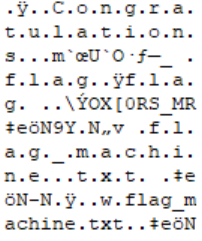
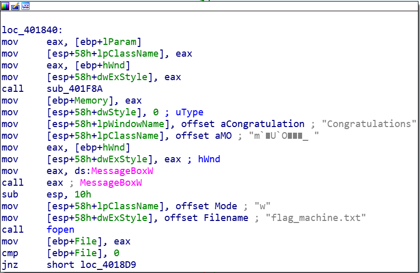
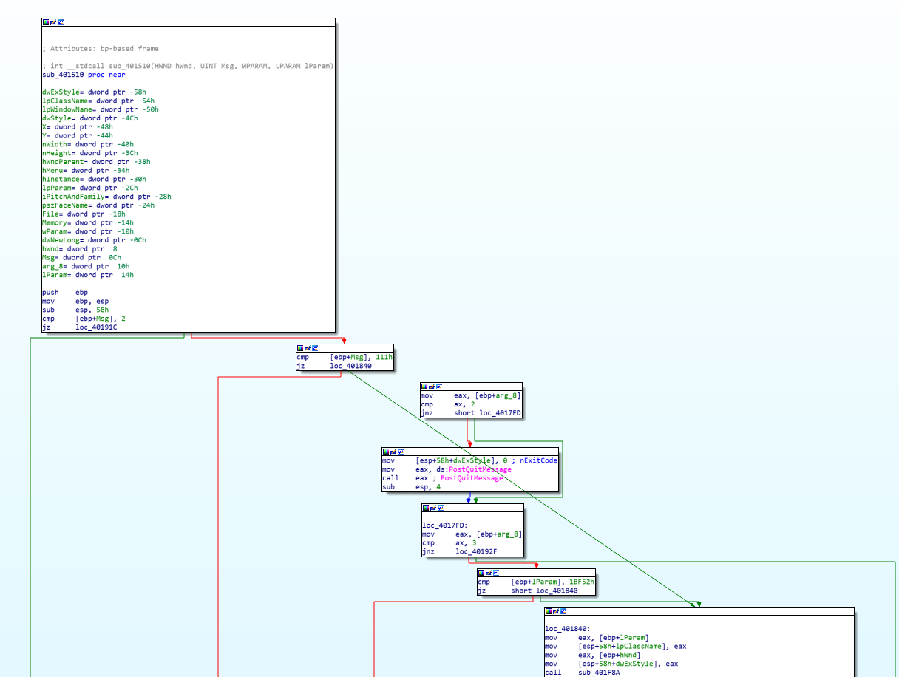

# Hackergame 2022 Writeup
上周六刚准备开始学Spring，突然有人给我丢了个链接hack.lug.ustc.edu.cn，我问他这是什么，他说是好康的，我问他刺激吗，他说比电脑游戏还刺激，我点开一看HackerGame,我说我不会啊没碰过，他说他也没碰过没事的，我就点开了签到题。

确实很刺激，我到现在还没学Spring，甚至咕了算法实验(~~和FF14周二刷新的CD~~)，爽肝一个星期。

完全没有接触过安全方面，从web到密码学到反汇编甚至linux命令都是学了十分钟的水平，在此记录一下写出来的题目思路。

## 签到
F12看页面的Script,发现:
```javascript
 const TIME_LIMITS = [2, 1, 0.1, 0];
```
是输入框的时间限制，全部改大之后在Source窗口中右键Save as Override然后刷新画2022就可以了。~~有人没看到URL里面的result=2022我不说是谁~~

## 猫咪问答喵
~~搜索引擎综合练习~~
> 1.中国科学技术大学 NEBULA 战队（USTC NEBULA）是于何时成立的喵？

直接搜索NEBULA战队，发现[中国科学技术大学星云（Nebula）战队在第六届强网杯再创佳绩](http://cybersec.ustc.edu.cn/2022/0826/c23847a565848/page.htm)，网页最下面写着:**中国科学技术大学“星云战队（Nebula）”成立于2017年3月**,所以是`2017-03`。

>2.2022 年 9 月，中国科学技术大学学生 Linux 用户协会（LUG @ USTC）在科大校内承办了软件自由日活动。除了专注于自由撸猫的主会场之外，还有一些和技术相关的分会场（如闪电演讲 Lightning Talk）。其中在第一个闪电演讲主题里，主讲人于 slides 中展示了一张在 GNOME Wayland 下使用 Wayland 后端会出现显示问题的 KDE 程序截图，请问这个 KDE 程序的名字是什么？

刚好在B站刷到过软件自由日的视频，翻出来看2:42:12的时候右下角的截图(~~因为做题的时候没开声音所以没听见说了什么~~)，Settings菜单最下面有一个**Configure Kdenlive**，所以程序名是`Kdenlive`。

> 3.22 年坚持，小 C 仍然使用着一台他从小用到大的 Windows 2000 计算机。那么，在不变更系统配置和程序代码的前提下，Firefox 浏览器能在 Windows 2000 下运行的最后一个大版本号是多少？

直接搜Firefox Windows 2000 发现[Firefox 13不再支持Windows 2000及XP RTM/SP1](https://news.mydrivers.com/1/215/215752.htm>),所以是`12`。

> 4.你知道 PwnKit（CVE-2021-4034）喵？据可靠谣传，出题组的某位同学本来想出这样一道类似的题，但是发现 Linux 内核更新之后居然不再允许 argc 为 0 了喵！那么，请找出在 Linux 内核 master 分支（torvalds/linux.git）下，首个变动此行为的 commit 的 hash 吧喵！
 
在仓库<https://github.com/torvalds/linux> 的commit记录中搜索 `CVE-2021-4034` ，发现只有一条记录<https://github.com/torvalds/linux/commit/dcd46d897adb70d63e025f175a00a89797d31a43>，所以答案是`dcd46d897adb70d63e025f175a00a89797d31a43`。

>5.通过监视猫咪在键盘上看似乱踩的故意行为，不出所料发现其秘密连上了一个 ssh 服务器，终端显示 ED25519 key fingerprint is MD5:e4:ff:65:d7:be:5d:c8:44:1d:89:6b:50:f5:50:a0:ce.，你知道猫咪在连接什么域名吗？

直接在shodan中搜索MD5:e4:ff:65:d7:be:5d:c8:44:1d:89:6b:50:f5:50:a0:ce，得到`sdf.org`。

>6.中国科学技术大学可以出校访问国内国际网络从而允许云撸猫的“网络通”定价为 20 元一个月是从哪一天正式实行的？

翻USTC网络服务中心公告发现<http://ustcnet.ustc.edu.cn/2015/0127/c11104a119602/page.htm>中提到**网字〔2003〕1号《关于实行新的网络费用分担办法的通知》终止实行**，找文件找到<https://ustcnet.ustc.edu.cn/2003/0301/c11109a210890/page.htm>,所以是`2003-03-01`。

# 家目录里的秘密
## VSCode
翻VSCode目录找到`user\.config\Code\User\History\2f23f721\DUGV.c`的注释里有第一个flag。

## RClone
打开`.bash_history`，发现
```shell
rclone config
ls
ls -lha
cat .config/rclone/rclone.conf 
```
找到`.config/rclone/rclone.conf`，看到
```
[flag2]
type = ftp
host = ftp.example.com
user = user
pass = tqqTq4tmQRDZ0sT_leJr7-WtCiHVXSMrVN49dWELPH1uce-5DPiuDtjBUN3EI38zvewgN5JaZqAirNnLlsQ
```
翻rclone文档和源码，发现pass是被`rclone obscure`加密的，并且可以解密，源码中有`\cmd\reveal\reveal.go`，于是尝试：
```
rclone reveal tqqTq4tmQRDZ0sT_leJr7-WtCiHVXSMrVN49dWELPH1uce-5DPiuDtjBUN3EI38zvewgN5JaZqAirNnLlsQ
```
得到解密后的pass。

# HeiLang
(~~正则忘光了所以~~)字符串处理把前面的a[ | ]全部换成普通的a[ ]赋值，然后运行代码。
```python
if __name__ == "__main__":
    with open("ip.txt","r") as f:
        fHandle=open("op.txt","w")
        lineInput = f.readlines()
        for line in lineInput:
            sp = line.split("=")
            num=sp[0][2:-2].split("|")
            for n in num:
                fHandle.write("a["+n.strip()+"] = "+sp[1])
        fHandle.close()
```
# Xcaptcha
先关掉浏览器的javascript，点击切换到三道计算题之后就不会返回，看到题目内容。然后发现是三道大数运算，并且有1s的提交时间限制，于是在浏览器F12的Snippnets里面写了个脚本计算结果并提交。
```javascript
var text1 = document.querySelectorAll("form div label")[0].innerText.split("+");
var text2 = document.querySelectorAll("form div label")[1].innerText.split("+");
var text3 = document.querySelectorAll("form div label")[2].innerText.split("+");
text1[1] = text1[1].replace(/[^0-9]/ig, "");
text2[1] = text2[1].replace(/[^0-9]/ig, "");
text3[1] = text3[1].replace(/[^0-9]/ig, "");
var i = (BigInt(text1[0])+BigInt(text1[1])).toString();
document.getElementsByName('captcha1')[0].value=i;
var i = (BigInt(text2[0])+BigInt(text2[1])).toString();
document.getElementsByName('captcha2')[0].value=i;
var i = (BigInt(text3[0])+BigInt(text3[1])).toString();
document.getElementsByName('captcha3')[0].value=i;
document.getElementById('submit').click();
```

# 旅行照片 2.0
## 照片分析
直接看图片的EXIF信息就全有了。

## 社工入门
从照片中的


可以看出场馆名字是ZOZOMARINE STADIUM。在地图上查可以获得邮编261-0022。

然后是错的，因为拍照的地方根据视角可以看出是在街对面的**APA HOTEL& RESORT TOKYO BAY MAKUHARI**，邮编是261-0021。(~~你们日本人有病吧隔条街邮编不一样害我搜到晚上3点还以为是飞机没找对~~)

手机其实可以直接看EXIF的照相机型号sm6115=骁龙662，小米家只有红米9是这个处理器，直接搜`小米 骁龙662`就可以。但我当时没想到真就这一个，我是看的照片反光中的摄像头样式，然后跑去ZOL中关村在线筛选小米/红米肉眼遍历，得到分辨率`2340x1080`(~~有人上来写了个2340*1080没发现我不说是谁~~)。


飞机就是EXIF信息发现时间2022/05/14 18:23然后跑去fr24看航线挨个搜，得到`HND HIJ NH683`

# 猜数字
下载源代码发现判定代码是
```javascript
var isLess = guess < this.number - 1e-6 / 2;
var isMore = guess > this.number + 1e-6 / 2;
var isPassed = !isLess && !isMore;
```
也就是说当 `isLess` 和 `isMore` 都为 `false` 时，`isPassed`也为`true`。所以只要令`guess`为NaN也可能令判定通过。

由于输入框被限制了只能输入数字，打开F12修改输入框的代码
```html
<input type="number" id="input" oninput="change(value)">
```
改为
```html
<input type="text" id="input">
```
然后随便打点什么东西提交就可以了。

# LaTex机器人
## 纯文本
直接输入\input{/flag1}
## 特殊字符混入
看后台代码发现`latex_to_image_converter.sh`中使用了`pdflatex -interaction=nonstopmode -halt-on-error -no-shell-escape result.tex`，于是去翻pdflatex的文档，发现
```
\pdffiledump [ offset ⟨integer⟩ ] [ length ⟨integer⟩ ] ⟨general text⟩ (expandable)
```
可以按照字节读取一定长度的文件。利用该命令
```
\pdffiledump offset 0 length 10{/flag2}
```
输出flag2中内容`666C61677B6C61746578.....`(我是10个10个字符输出的，后面懒得抄了)，感觉像是ASCII码于是找了个ASCII转字符试了一下，发现确实是，得到Flag。

另外，~~offset 0 length 10这样输入可选参数也太怪了吧，我以为是[0][10]或者[offset=0,length=10]报错了一下午。~~

# flag的痕迹
翻dokuwiki的文档，发现查看历史版本的Action包括do=recent和do=revision都被disable了，一开始还以为要通过某种方式拿到权限，然后在[文档](https://www.dokuwiki.org/devel:action_modes)里发现了
`diff: Generates a diff view for easy comparison between 2 revisions`这个Action。

于是通过`http://202.38.93.111:15004/doku.php?do=diff`看到了历史版本页面，找到flag。

# 安全的在线测评
## 静态数据
直接读取输出`./data/static.out`
```c
FILE *fp = fopen("./data/static.out","r");
char ch;
ch=fgetc(fp);
while(!feof(fp)){
	putchar(ch);
	ch=fgetc(fp);
}
fclose(fp);
```
## 动态数据
**寄！**

权限被设成了0x700，没法直接读出来文件，想了半天怎么用C语言搞权限但是没搞出来。

# 线路板
打开了十年没用的Altium Designer，打开文件，然后把一些层设了不显示就出来了。

(至于是哪些已经不记得了)

# flag自动机
用二进制编辑器打开看到了一个`Congratulations`和一个`flag_machine.txt`，感觉应该是操作成功的代码用的



IDA打开，找到这两行字符串的位置。



发现在地址为**loc_401840**的函数中，所以只要让程序直接调用这个函数。
上面部分的代码是这个样子

因为中间有一个`PostQuitMessage`，猜测**loc_40191c**这里是退出按钮，所以直接把后面的跳转地址改成了**loc_401840**，打开程序按下退出按钮果然弹出窗口告诉我过了。

# 微积分计算小练习
~~有人真的去做了那五道微积分我不说是谁~~
经过尝试发现那个URL是`http://202.38.93.111:10056/share?result=MjA6MQ%3D%3D`这样的模式，result后面改变，查看源码发现
```javascript
const colon = b64decode.indexOf(":");
const score = b64decode.substring(0, colon);
const username = b64decode.substring(colon + 1);

document.querySelector("#greeting").innerHTML = "您好，" + username + "！";
document.querySelector("#score").innerHTML = "您在练习中获得的分数为 <b>" + score + "</b>/100。";
```
意思是result后面是一个base64编码的字符串。
而判题脚本中
```python
driver.execute_script(f'document.cookie="flag={FLAG}"')
```
可以看出flag藏在cookie中，因此只需要获得cookie
```python
try:
    greeting = driver.execute_script(f"return document.querySelector('#greeting').textContent")
    score = driver.execute_script(f"return document.querySelector('#score').textContent")
except selenium.common.exceptions.JavascriptException:
    print('JavaScript Error: Did you give me correct URL?')
    exit(1)
```
从这段代码中则发现判题是用selenium打开了URL对应的网页并且直接获得了网页解析result参数的值。因此想到XSS。但是innerHTML拒绝执行`<script></scrpit>`中的javascript，所以改用``的方式执行。用base64处理
```
100:
```
放入url的result中即可看到flag出现在用户名处。

# 杯窗鹅影
## flag1
直接通过wine的目录映射读取根目录
```C
FILE *fp=fopen("../../flag1","r");
char ch;
ch=fgetc(fp);
while(!feof(fp)){
	putchar(ch);
	ch=fgetc(fp);
}
fclose(fp);
```
## flag2
**寄！**

想到了可能要用ShellCode但不太会用，就摆了(~~甚至以为必须要生成十六进制放到C才能用~~)，总之就是知识点本来就不会。

# 蒙特卡洛轮盘赌
源代码中的
```C
srand((unsigned)time(0) + clock());
```
生成一个种子之后连续生成了五次随机数，而种子基于时间生成，因此算出种子重复生成随机数就会和题目生产的一样，由于环境可能影响种子生成，拉一个debian:11的docker镜像下来，然后在里面通过前两次答错时的输出暴力搜索种子，即可得到剩下三次的正确解。
```C
seed = stamp-10000;
while(seed < (stamp+10000)){
    srand(seed);
    int M = 0;
    int N = 400000;
    for (int j = 0; j < N; j++) {
        double x = rand01();
        double y = rand01();
        if (x*x + y*y < 1) M++;
    }
    double pi = (double)M / N * 4;
    seed++;
    if(pi==input){
        int M = 0;
        int N = 400000;
        for (int j = 0; j < N; j++) {
            double x = rand01();
            double y = rand01();
            if (x*x + y*y < 1) M++;
        }
        double pi2 = (double)M / N * 4;
        if(pi2==input2){
            printf("Find Seed");
            break;
        }
    }
}
```
~~甚至就是拿他的代码随便改了改~~

# 惜字如金
## HS384
```python
secret = b'ustc.edu.cn' #uSTC.eDu.CN
check_equals(len(secret), 39)
secret_sha384 = 'ec18f9dbc4aba825c7d4f9c726db1cb0d0babf47f' +\
                'a170f33d53bc62074271866a4e4d1325dc27f644fdad'
check_equals(sha384(secret).hexdigest(), secret_sha384)
```
这里secret需要过长度39的check，而secret_sha384的长度比正常的sha384密文长度要短，很显然两者都被惜字如金化了。

从secret入手，`uSTC*.eDu.CN*`中的大写字母为辅音字母，*为可能出现e的部分，并且长度固定为39，直接暴力遍历所有情况，进行简单的程序筛选后肉眼判断是不是secret_sha384的惜字如金化后结果即可。

此处代码为其中一种补e的情况(~~没错，这个人直接跑了四遍反正也就两个可能补e的位置~~)
```python
def sign(file: str):
    with open(file, 'rb') as f:
        # import secret
        secret = b'ustc.edu.cn' 
        remain=27
        for i in range(0,remain):
            for j in range(0,remain-i):
                for k in range(0,remain-i-j):
                    for m in range(0,remain-i-j-k):
                        for n in range(0,remain-i-j-k-m):
                            sct=b'u'
                            sct+=(i+1)*b's'+(j+1)*b't'+(k+1)*b'c'
                            sct+=b'e'
                            sct+=b'.e'+(m+1)*b'd'+b'u.'+(n+1)*b'c'+(remain-i-j-k-m-n+1)*b'n'
                            sha384sct=sha384(sct).hexdigest()
                            if sha384sct[0]=='e' and sha384sct[1]=='c' and (sha384sct[2]=='c' or sha384sct[2]=='e' or sha384sct[2]=='1') and (sha384sct[-1] == 'd' or sha384sct[-1] == 'e'):
                                print(sct)
                                print(sha384sct)      

        print("end")
```
~~甚至直接写了五个for循环~~

~~随手乱写脚本的后果就是sct变量名抄成了scc没发现，修了一个多小时，下次不敢了~~

## RS384
**寄！**

其实题目都没看，暴力做完第一问混了个分就跑路了。

# 置换魔群
## 置换群上的 RSA
从题干看到置换可以表示为*A=(1,2,4)(3)*这样的小置换组合，并且对于类似*$A_1$=(1,2,4)*这样的小置换，做*k\*len($A_1$)*次置换就会变回原来的样子。因此对于*A=$A_1$$A_2$...$A_n$*,做*k\*lcm[len($A_1$),len($A_2$),...,len($A_n$)]*次置换(记作*kn*)次置换就会变成原来的样子,其中*k*为正整数。

根据`permutation_group.py`重写的\*和\*\*
```python
def __mul__(self, other):
        assert self.p == other.p, "not in the same group"
        res = []
        for i in range(self.p):
            # res.append(other.permutation_list[self.permutation_list[i]-1])
            res.append(self.permutation_list[other.permutation_list[i]-1])
        return permutation_element(self.p, res)

    #fast pow algorithm
    def __pow__(self, e: int):
        # fast exp
        res = permutation_element(self.p, list(range(1, self.p+1)))
        b = self
        if e == 0:
            # x^0 = identity for all x in A_n
            return res
        while e != 0:
            if e & 1 == 1:
                res = res * b
            e >>= 1
            b = b*b
        return res
```
可以发现A\*\*m就是做了m-1次置换，所以A\*\*(m+1)==A。
根据`chall.py`
```python
for _ in range(15):
        n = randint(2**9, 2**10)
        An = permutation_group(n)
        secret = An.random_element()
        e = 65537
        print(f"[+] RSA public key: n = {n}, e = {e}")
        print(f"[+] my encrypted secret is here: ")
        print(secret**e)
        print(f"[+] Prove that you own the secret (a list like [1,2,3]): ")
        ans_list = s2n(input("> your answer: "))
        ans = permutation_element(n, ans_list)
        if ans == secret:
            print("Good job")
        else:
            print("Bad")
            return
    print(open("./flag1", "r").read())
```
运行过程是随机生成一个群secret(记作S)，然后做65536次置换作为密文ans(记作B),此时为S的65537次方,即B=$S^{65537}$。

然后我测试了一下这个**运算，发现他的确是满足$(X^a)^b$=$X^{ab}$的。

求*n*可以通过上文的小置换长度的lcm进行，`permutation_group.py`中`permutation_element`类的`standard_tuple`中保存了作者给的小置换。

于是只要得到S的第kn次置换，即$S^{kn+1}$，就可以获得原始的S。

设$B^p$=$S^{kn+1}$，则$S^{65537p}$=$S^{kn+1}$,则$p=(kn-1)/65537$

编写代码求最小的整数*p*，则$B^p$即为最开始的群S
```python
def analyze(input):
    n = len(input)
    ans = permutation_element(n, input)
    gcdip = []
    for tp in ans.standard_tuple:
        ele = len(tp)
        gcdip.append(ele)
    lcmoflist = reduce(lambda x, y: lcm(x,y), gcdip)
    tag = int(lcmoflist)
    while (tag+1)%65537:
        tag+=lcmoflist
    tag = int((tag+1)/65537)
    op = (ans**(tag))
    return str(op)
```

## 置换群上的 DH
**寄！**

一下午速通置换群人都是晕的，第一问做完就爬了，真不会(悲)
## 置换群上的超大离散对数
**寄！**

一下午速通置换群人都是晕的，第一问做完就爬了，真不会(悲)

# 光与影
首先下载网页，然后根据我学了十分钟的opengl知识知道flag和那个墙大概可能应该是用`fragment_shader.js`里的代码渲染出来的，然后应该会有一些vec去控制参数。

然后就找看的顺眼的vec改，发现
```glsl
float t5 = t5SDF(p - vec3(36.0, 10.0, 15.0), vec3(0, 0, 0), 1.0);
```
中的第一个vec和挡住flag的墙的位置有关，第二个和挡住flag的墙的大小有关。然后我就把大小改成了最小就看到flag了。

~~就是说opengl太难了一分钟也看不下去~~

# 片上系统
## 引导扇区
打开PulseView，用`import raw binary data`导入数据，然后选择SPI的decoder,这个1看起来就像时钟，0看起来就像片选，然后2和3在MISO和MOSI试一下，找到正确的输出之后塞到随便什么十六进制解析就可以。
## 操作系统
**寄！**

flag{口口口}

# 企鹅拼盘
## 1
一共就16种，直接全部敲一遍......
## 2
**寄！**

大概也许可能感觉可以暴力解，但是感觉算起来有点慢然后写多线程什么的好麻烦就没试。
## 3
**寄！**

摊牌了，其实题目除了企鹅之外甚至没怎么看懂一点思路都没有，但是企鹅很可爱。

# 火眼金睛的小E
## 1
一共就2组，直接IDA打开找函数肉眼一个个点过去匹配就行了
## 2
**寄！**

然后就100组了，不会了。
## 3
**寄！**

总之这题也是我最后两三天看看哪些简单的第一问能混点分去做的这样（悲）
