# 前言

孩子水平有限，且代码功底稀烂，部分题目解法糟糕，还请各位师傅轻喷😭

Math一生之敌⚔

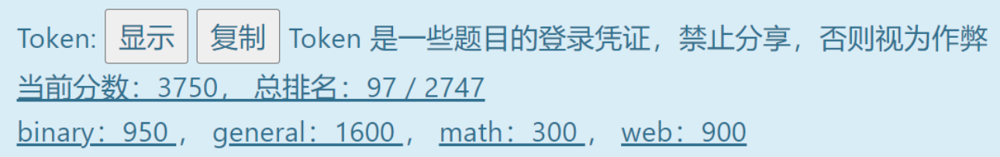

大量图片警告⚠

# Web

## 签到

试图挑战手速极限但宣告失败后发现直接修改 GET 请求参数即可

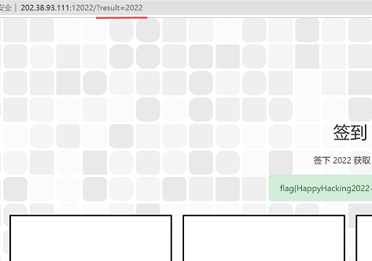

## Xcaptcha

企图挑战心算极限以及手速极限但宣告失败后编写脚本

```python
import requests
from lxml import etree

url1 = "http://202.38.93.111:10047/?token=<your token>"
url2 = "http://202.38.93.111:10047/xcaptcha"

# 首先利用token访问题目，会获得一个Cookie，用于身份验证
respon1 = requests.get(url1, allow_redirects=False)
headers = {
    "Cookie": respon1.headers["Set-Cookie"][:-18]
}

# 访问Captcha界面
respon2 = requests.get(url2, headers=headers)
origin_captcha_list = etree.HTML(respon2.text).xpath("//label/text()")
captcha_list = [ i[:-6] for i in origin_captcha_list]
result_list = [eval(i) for i in captcha_list]
result_dict = {"captcha1" : result_list[0], "captcha2" : result_list[1], "captcha3" : result_list[2],}

# 每次访问Captcha界面都会生成一个新的Cookie，POST提交时需要使用新的Cookie
headers = {
    "Cookie": respon2.headers["Set-Cookie"][:-18]
}

respon2 = requests.post(url2, headers=headers, data=result_dict)
print(respon2.text)
print(result_dict)
```

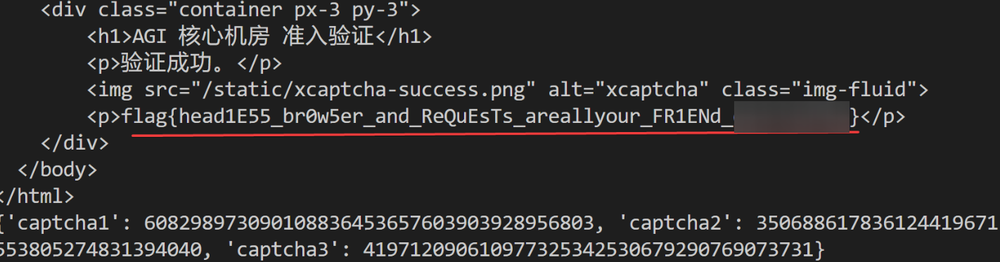


## LaTeX 机器人

我愿称之为面向 LaTeX 的社工题

### 纯文本

很容易搜索到解法`\input{/flag1}`

### 特殊字符混入

后端禁用了`\write18`，编译遇到错误直接退出，一点头绪都没有，卡了很久

终于在搜遍全网后找到一篇[文章](http://cseweb.ucsd.edu/~hovav/dist/texhack.pdf)

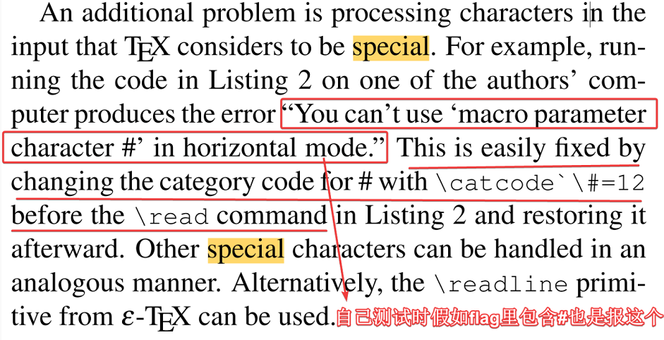

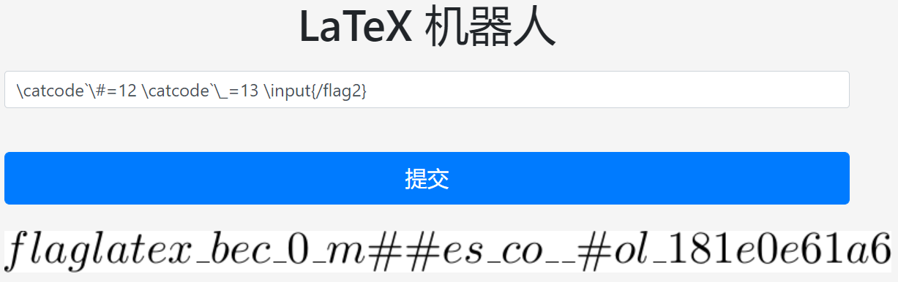

> 本来想试一下看能不能通过写入文件来进一步利用但通过`\input{/etc/hostname}`发现每次请求时后端都是新开了一个容器。。。
>

### 彩蛋

某在线 LaTeX 编译网站

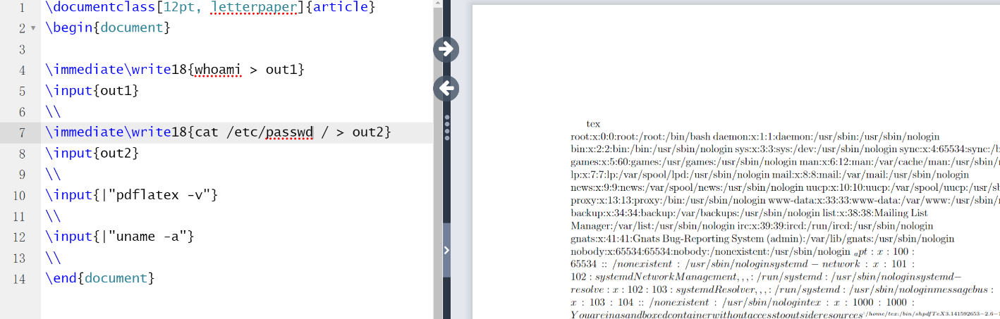


## Flag 的痕迹

经测试，`recent`、`register`、`revisions`等action都被禁用了，猜测后端应该是把所有action都给ban掉了

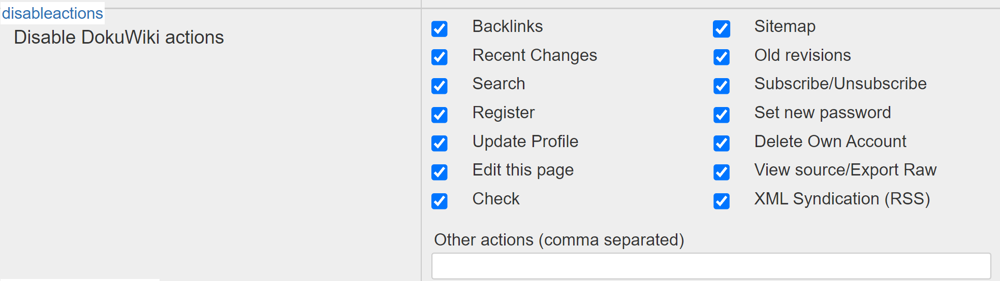

但是`diff`并没有在此列表中，因此输入`&do=diff`，即可浏览`revisions`

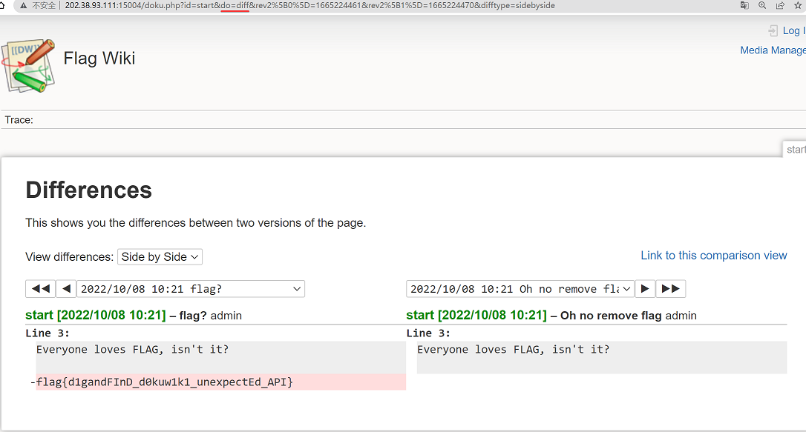

> 假如`diff`也被禁用了，实际上也能根据revision的时间戳访问到以往版本，这种情况下就需要从最新版本的时间往前进行爆破了
>
> 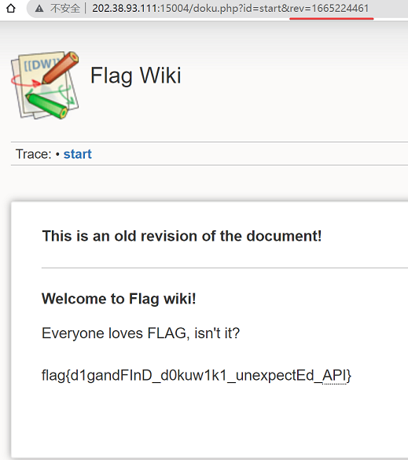

## 微积分计算小练习

企图挑战五题微积分计算满分但宣告失败后查看网页源码

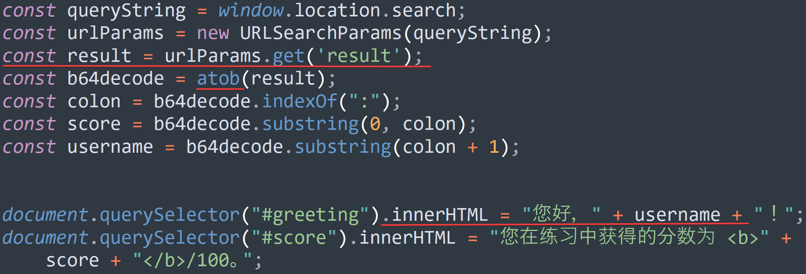

将GET请求参数`result`的值`base64`解码后通过`innerHTML`插入，妥妥的XSS啊（实际上是研究了半天bot源码无果后才看网页源码的。。。）

刚开始企图外带`cookie`，但是发现一旦访问自己的服务器程序就被Kill了

首先猜测后端可能添加了标签过滤，或者根本无法解析标签，但是经过测试后发现应该是题目环境无法访问外网

但注意最后会输出姓名以及成绩信息，因此直接将`cookie`填充到在`score`中

````html
123:
````

`base64`加`URL`编码后

```base64
MTIzOjxpbWcgc3JjPTEgb25lcnJvcj0iZG9jdW1lbnQuZ2V0RWxlbWVudEJ5SWQoJ3Njb3JlJykuaW5uZXJIVE1MPWRvY3VtZW50LmNvb2tpZTsiPg%3D%3D
```

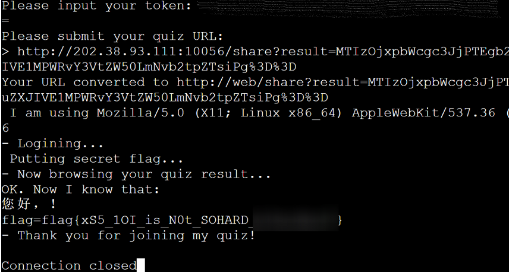


> 其他两道Web题看到解出来的只有十几人，那就不打扰了🏳

# General

## 猫咪问答喵

> 1

直接搜索`中国科学技术大学 NEBULA 战队`，[这个网页](https://cybersec.ustc.edu.cn/2022/0826/c23847a565848/page.htm)中有成立时间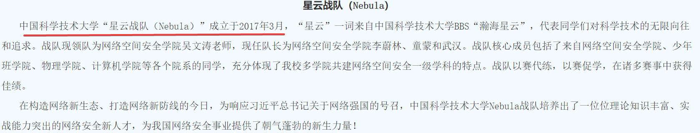


> 2

通过[LUG官网](https://lug.ustc.edu.cn/)找到[演示的PPT的PDF版](https://ftp.lug.ustc.edu.cn/%E6%B4%BB%E5%8A%A8/2022.9.20_%E8%BD%AF%E4%BB%B6%E8%87%AA%E7%94%B1%E6%97%A5/slides/gnome-wayland-user-perspective.pdf)，发现关键词`Kdenlive`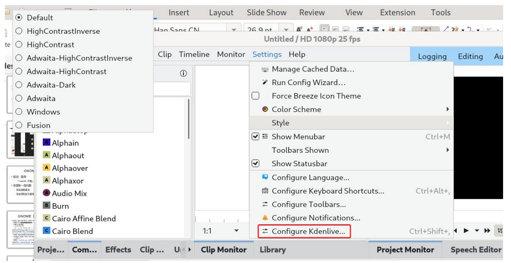


> 3

直接搜索`the latest version for win2000 firefox`可以找到官网的这个[网页](https://support.mozilla.org/en-US/questions/1052888)
两个`28`与`24`都试了但不对，仔细看了一下文章发现提问者用的`Firefox`是第三方的···文章中有正确答案是12
或者[Wikipedia](https://en.wikipedia.org/wiki/Firefox)中也可以找到

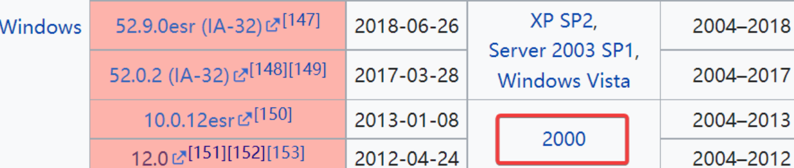


> 4

`Github`搜索技巧

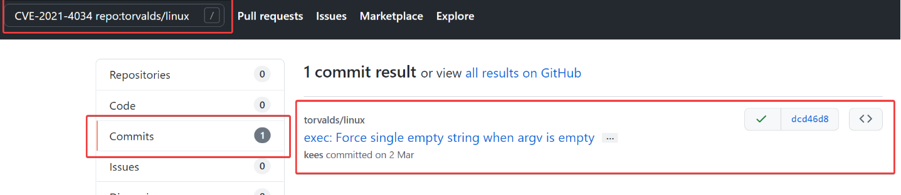


> 5

`shodan`搜索

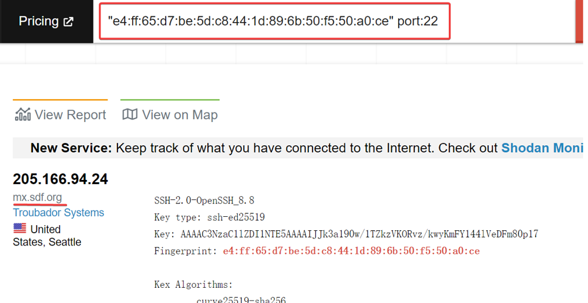

> 6

搜索`中国科学技术大学 网络通 20 元`，找到这个[页面](https://www.ustc.edu.cn/info/1057/4931.htm)


但答案不正确

因此再搜索`网字〔2003〕1号《关于实行新的网络费用分担办法的通知》`，找到这个[古老页面](http://ustcnet.ustc.edu.cn/2003/0301/c11109a210890/pagem.htm)。。。


## 家目录里的秘密

搜索`flag`，发现两个关键文件，第一个直接告诉了

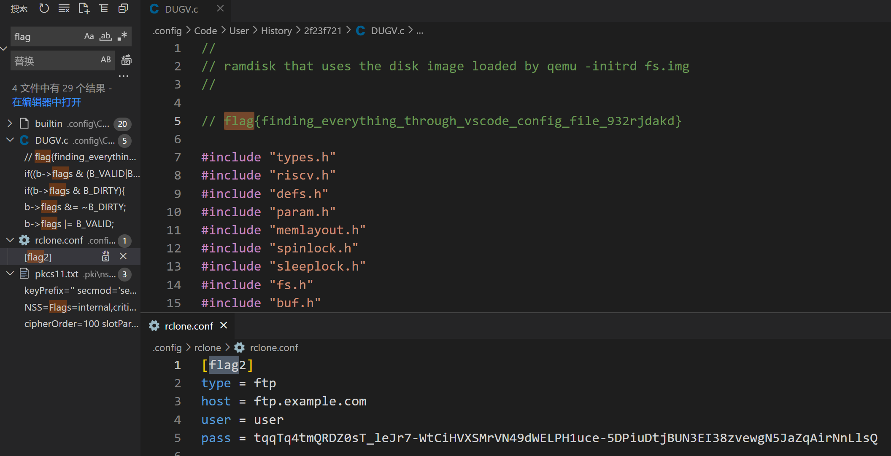


第二个`rclone.conf`提示了`flag2`在这里，因此`pass`的值应该是`flag2`，但是被加密了

搜索`rclone.conf pass`，找到[Rclone文档](https://rclone.org/commands/rclone_config_password/)，其中提到了关键词`obscure`

因此继续搜索`rclone.conf pass obscure`，又找到[一篇文档](https://rclone.org/commands/rclone_obscure/)

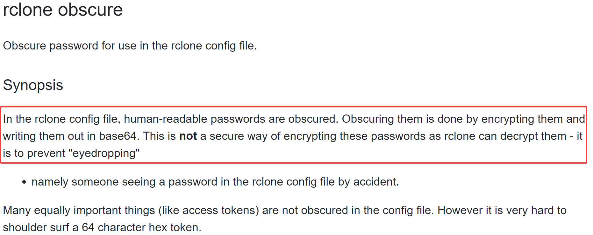

提到这种方式是不安全的，同时`Rclone`是开源的，应该能够查看源码编写解密脚本（不会Go语言，达咩！），所以直接找了别人写好的脚本：https://github.com/julianbrost/rclone-unobscure，按说明运行就可以了


## HeiLang

搜索替换

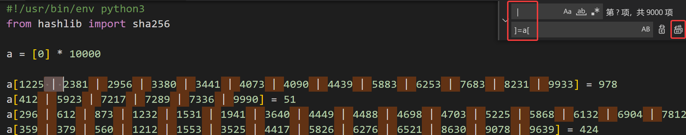


运行即可

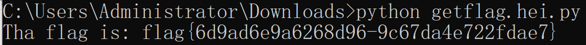


## 旅行照片 2.0

### 照片分析

使用`exiftool`工具查看

### 社工实践

- 由于原图片比较大，且关键建筑物是那个圆形建筑，因此截图后使用谷歌识图，发现拍摄者所在的酒店名叫做**东京湾幕张**，邮编就顺带能搜索出来了

- 手机分辨率是真没看出来，通过窗户上反射的手机估计出尺寸后发现和市面上卖的小米手机尺寸都差不多。最后是中关村上找了几个常见的小米手机的分辨率试出来的。。。

- 航班信息

已经有了拍摄者所在的地点以及拍摄方向，根据地图可以分析出来飞机的大致方向是向北飞的，然后就没有然后了

Excuse me？每天那么多飞机在飞，图片里的飞机比蚂蚁还小，我怎么知道是哪架飞机！但是突然想到了前段时间某音里直播某位老妖婆专机航程一事，提到了`https://www.flightradar24.com/`这个网站，看了一下，竟然能够查看以往的航班行程回放，但是普通用户只能查看最近一周的，尊贵的Gold会员才能够查看最近一年的，为了Flag果断订阅，终于把你逮住了吧

> 注意回放里的时间是UTC

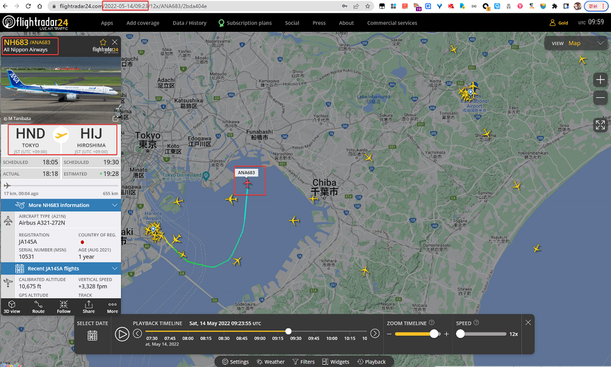


## 猜数字

这题也卡了很久

企图爆破的同时企图利用`XXE`但试了一下午发现根本行不通😤

只能再审源代码

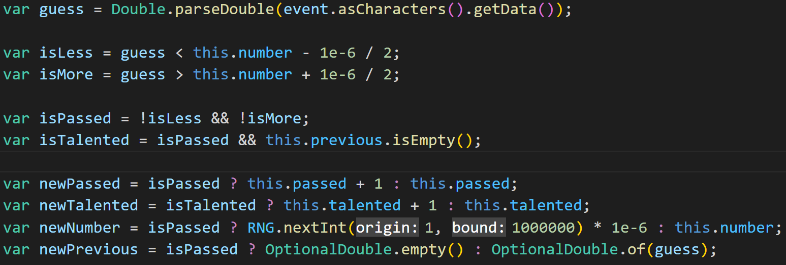

发现直接进行了大小比较，想到`NaN`可不可以搞一搞事情，就成功了。。。


## 安全的在线测评 - 无法AC的题目

虽然查看源码时发现创建文件夹时指定了权限`700`且运行时切换了用户，但是还是可以直接读取`./data/static.in`与`./data/static.out`，猜测是容器运行时`./data`文件夹以及`./data/static.in`和`./data/static.out`已经存在且权限为`755`，所以能够读取。看了WP后发现预期解是用`include`包含进来，所以这题解法算是出题人疏漏导致的非预期解

```c
#include <stdlib.h>
#include <stdio.h>
#include <string.h>

int main()
{
    FILE *fp = NULL;
    char buff1[400];
    char buff2[400];
    char buff3[400];
    memset(buff1,0,sizeof(buff1));
    memset(buff2,0,sizeof(buff2));
    memset(buff3,0,sizeof(buff3));
    if ((fp = fopen("./data/static.out","r")) == NULL)
    {
        return 1;
    }
    else
    {
        fgets(buff1, 400, fp);
        fgets(buff2, 400, fp);
        fgets(buff3, 400, fp);
        printf("%s", buff1);
        printf("%s", buff2);
    }
}
```

> 一些想法
>
> 观察源码，可以看到不同的情况下的OJ系统的输出是不同的，假如程序的返回值不是0则输出RE，如果返回值是0但答案错误则输出WA，因此应该可以通过控制自己的程序的返回值，利用类似SQL盲注的原理来获得系统内其他有权限访问的文件的内容
>
> 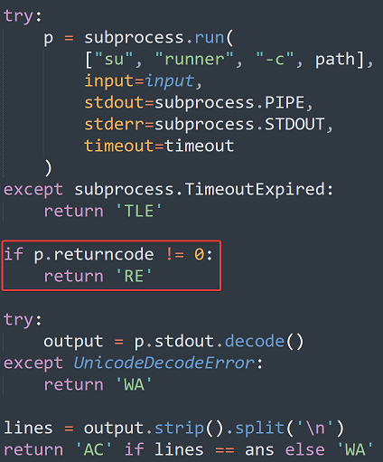


## 线路板

根据文件信息下载`Kicard`，打开`Kicard`，打开`Gerber文件查看器`，选择`打开Gerber工作文件`，选择`ebaz_sdr-job.gbrjob`，发现还是遮挡住的，隐约能看到Flag，但是就是没本事把遮挡物完全删除掉，于是想再导出到PCB编辑器编辑，结果就能直接看到了（别问我为什么，我也不知道）

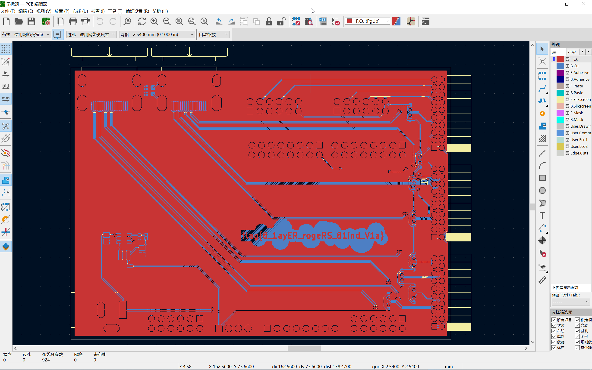


## 光与影

一打开还以为电脑宕机了

查看源代码发现使用了5个JS文件，没有其他与后端的交互，因此Flag就藏在前端代码中

试图调整画面质量为最低来拯救核显但发现没什么用

本来以为Flag躲在后面，调整相机角度后发现根本没有（跟我玩阴的是吧！）

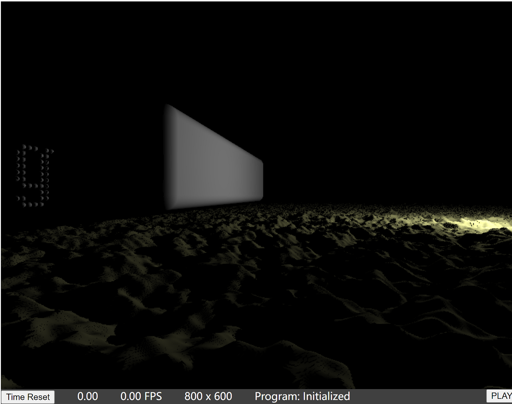

只能再审代码，`fragment-shader.js`文件是片段着色器程序，此WebGL的主要绘图功能在这个文件中，经观察，`t1SDF`函数很是独特

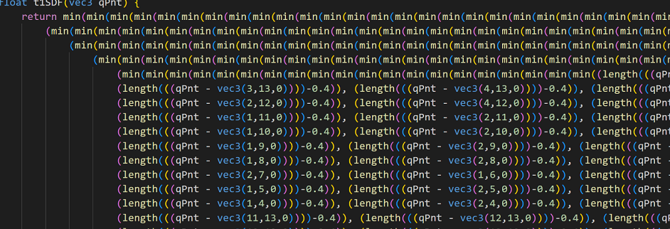

该函数有三个类似函数以及一个`t5SDF`函数，且在其他函数内同时被调用，不同点在于调用`mk_trans`时第一个参数不同，应该是将Flag的后面的三部分内容的延X轴进行了平移，最后调用了`t5SDF`将剩余部分包裹了起来

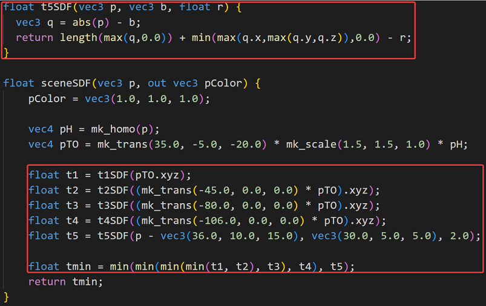

因此修改代码

```glsl
float t1 = t1SDF(pTO.xyz);
float t2 = t2SDF((mk_trans(-45.0, 0.0, 0.0) * pTO).xyz);
float t3 = t3SDF((mk_trans(-80.0, 0.0, 0.0) * pTO).xyz);
float t4 = t4SDF((mk_trans(-106.0, 0.0, 0.0) * pTO).xyz);

float tmin = min(min(min(t1, t2), t3), t4);
```

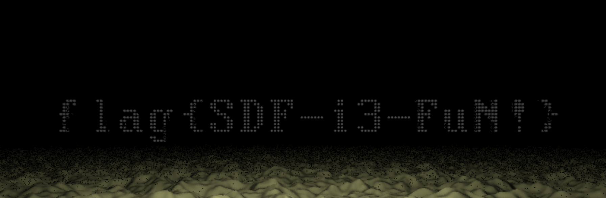

# Binary	

## Flag 自动机

> 点又点不到，动态调试也调试不了，函数调用一层套一层，真的超调皮的这个自动机

首先静态分析，查看字符串

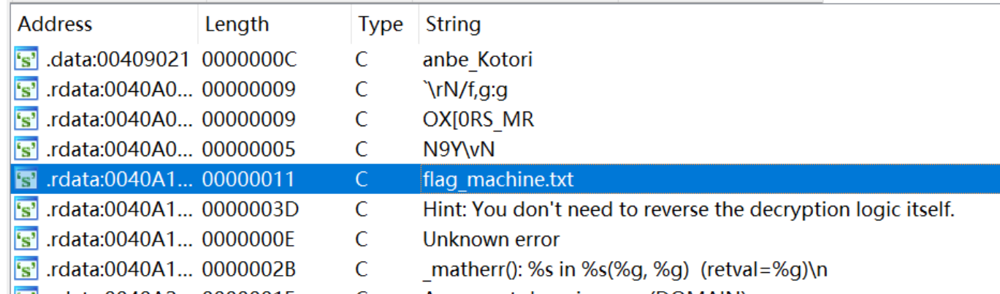

找到生成Flag的关键程序，将程序执行流程修改到目标地址

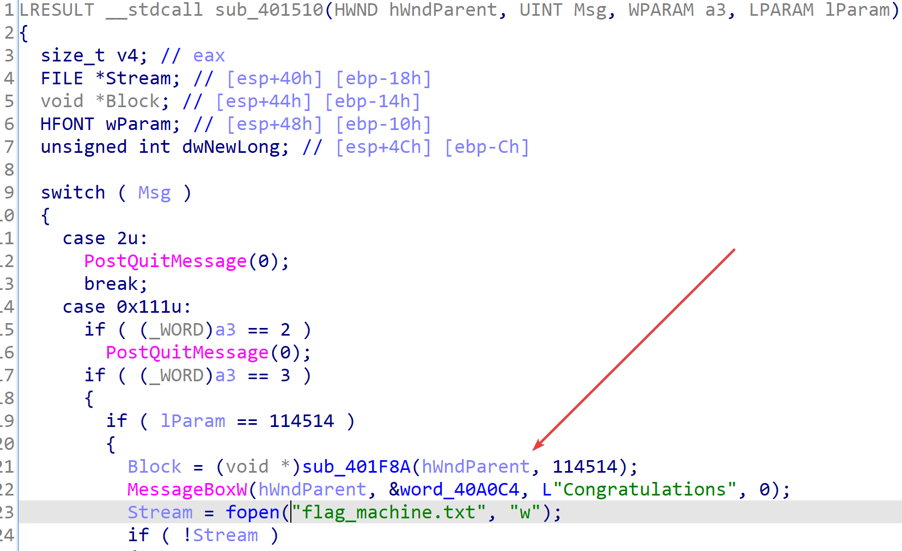

查看汇编，找到`switch`的第二个`case`分支如下

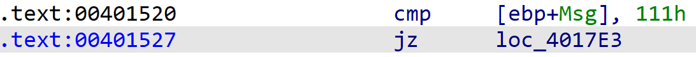

强制修改为`jmp loc_401840`，运行patch后的程序，看你还皮不皮

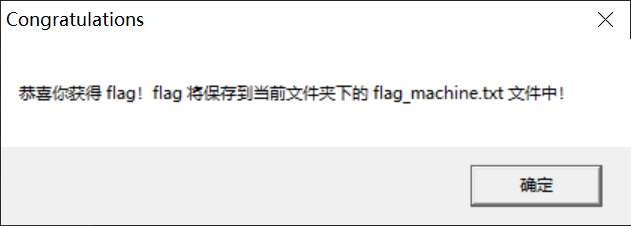

哎呀竟然能跑通，打开`flag_machine.txt`一看

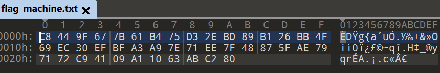

这什么鬼啊，但是刚刚那个窗口点击**确定**后并没有关闭，于是继续点击**确定**，内容又变了

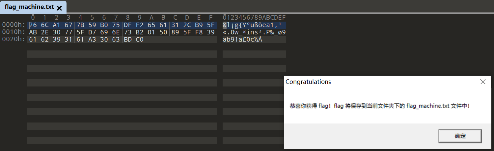

在点击了不知道多少次确定后终于在自动机的帮助下成功获得Flag :)

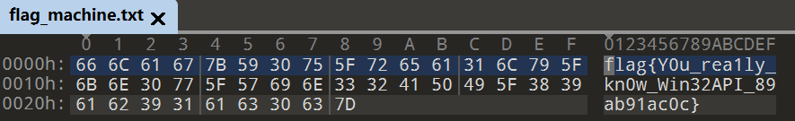

> 但自动机似乎觉得能够帮助生成更多的Flag因此怎么也关闭不掉

## 杯窗鹅影

### 第一问

虽然把Z盘的磁盘映射删除了，但是试了一下，竟然还是能够直接读取Linux根目录的文件？

```C
#include <stdlib.h>
#include <stdio.h>

int main()
{
    FILE *fp = NULL;
    if ((fp = fopen("./flag1","r")) == NULL)
    {
        printf("%s","wrong");
        return 1;
    }
    else
    {
        printf("%s","yes");
        char buff[100];
        fgets(buff, 100, fp);
        printf("%s",buff);
        return 0;
    }
}
```


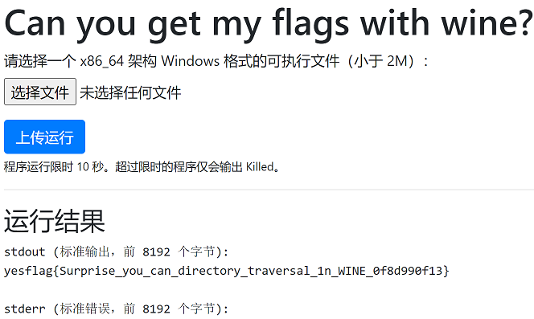


### 第二问

尝试使用执行系统命令的函数执行`/readflag`但失败了

[官网](https://wiki.winehq.org/FAQ#Is_Wine_malware-compatible.3F)有提到运行在`wine`中运行的`Windows`程序可以直接访问整个文件系统

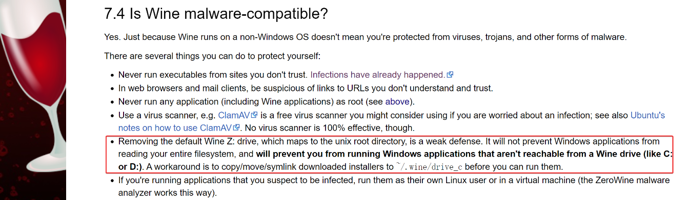

经过查阅资料发现Wine中运行的程序可以直接进行Linux的系统调用，而这就是打破`杯窗鹅影`之间的窗户纸的关键

自己在做的时候是先在main函数中写入无关代码，编译后全部用`NOP`指令填充，然后patch汇编。。。

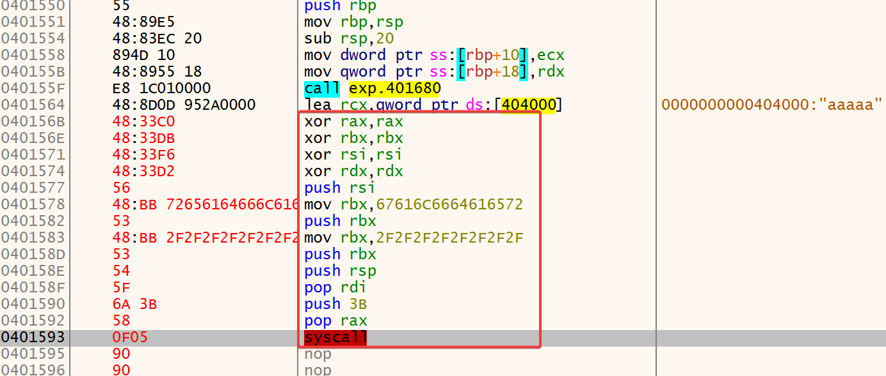


## 片上系统 - 引导扇区

用`PulseView`打开，有四组信号，搜索资料后判断应该是SD卡的`SPI`模式，使用该解码器，匹配信号（企图回忆数字逻辑记忆碎片），发现有数据，将`MISO`的数据导出后搜索`66 6C 61 67`

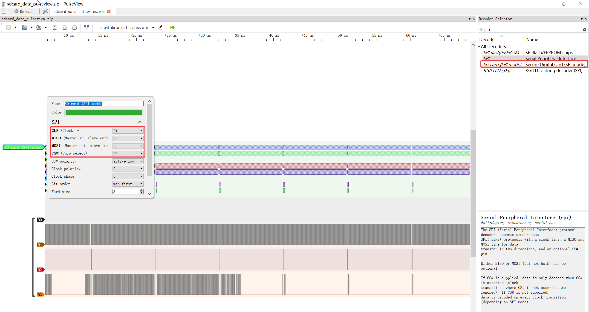

## 火眼金睛的小 E - 有手就行

题目提示了用`bindiff`，不用白不用（用了还是没做出来🙄）

由于只有两道题目，且根据`dry run`的结果两个函数的地址很接近，因此💣× 1

```python
from pwn import *

# context.log_level="debug"
first = ["your first list of addresses"]
second = ["your second list of addresses"]

host = "202.38.93.111"
port = "12400"

for i in first:
    for j in second:
        try :
            io = remote(host, port)
            io.recvuntil(b"token: ")
            io.sendline(b"<your token>")
            io.recvuntil(b"3. Easy\n")
            io.sendline(b"1")
            io.recvuntil(b"(y/N)\n")
            io.sendline(b"n")
            io.recvuntil(b"timestamp: ")
            io.sendline(b"1666973233")
            io.recvuntil(b"(in hex): \n")
            io.sendline(i.encode())
            io.recvuntil(b"(in hex): \n")
            io.sendline(j.encode())
            print(io.recv())
            io.close()
            time.sleep(5)
        except EOFError as e:
            print(i)
            print(j)
            time.sleep(5)
```


# Math

> 能做出来的Math题都很不Math

## 蒙特卡罗轮盘赌

猜对种子即可，💣× 2

> Windows下time函数得到的是北京时间，而容器内是UTC，且在本地容器内测试时clock()结果约为500，因此爆破范围1000，为了模拟题目环境在容器内编译运行

```c
#include <stdio.h>
#include <stdlib.h>
#include <time.h>
#include <string.h>

double rand01()
{
    return (double)rand() / RAND_MAX;
}

int main()
{
    // disable buffering
    setvbuf(stdin, NULL, _IONBF, 0);
    setvbuf(stdout, NULL, _IONBF, 0);
    setvbuf(stderr, NULL, _IONBF, 0);
    // printf("%ld\n", clock());
    // printf("%ld\n", (unsigned)time(0));

    time_t t = (unsigned)time(0);
    FILE *fp;
    fp = fopen("file.txt", "w");

    for (int k = -5; k <= 1000; k++)
    {
        srand(t + k);
        for (int i = 0; i < 5; i++)
        {
            int M = 0;
            int N = 400000;
            for (int j = 0; j < N; j++)
            {
                double x = rand01();
                double y = rand01();
                if (x * x + y * y < 1)
                    M++;
            }
            double pi = (double)M / N * 4;
            fprintf(fp, "%1.5f\n", pi);
        }
        fprintf(fp, "========================%d\n", k);
    }
    return 0;
}
```

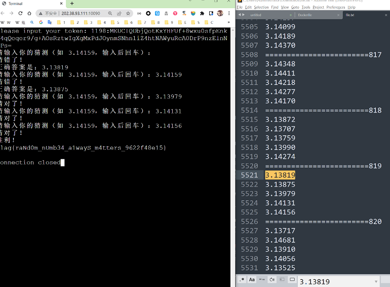


# 后记

比赛以General的两道搜索题锻炼选手的基础能力，后续题目由易到难，且涵盖范围广泛，可以看出来题目都是经过精心设计的。比赛带给我的最深刻的体验就是——从刚接触一道题目时的根本不可能完成的感觉到搜索资料，慢慢探索，找到思路到最终成功解题后的惊喜。同时整个比赛下来也学习了很多内容。

然而不蹦跶几下都不知道天花板有多高，师傅们真的是太太太太强啦，计算机领域就没有你们不会的吗？

虽然有的题目解出来了，但也仅仅是解出来了，知识还是要慢慢补充，还有好多其他题目都没来得及看orz。

题目很有趣，平台也很稳定，对各位出题以及幕后工作的师傅们表示感谢。

