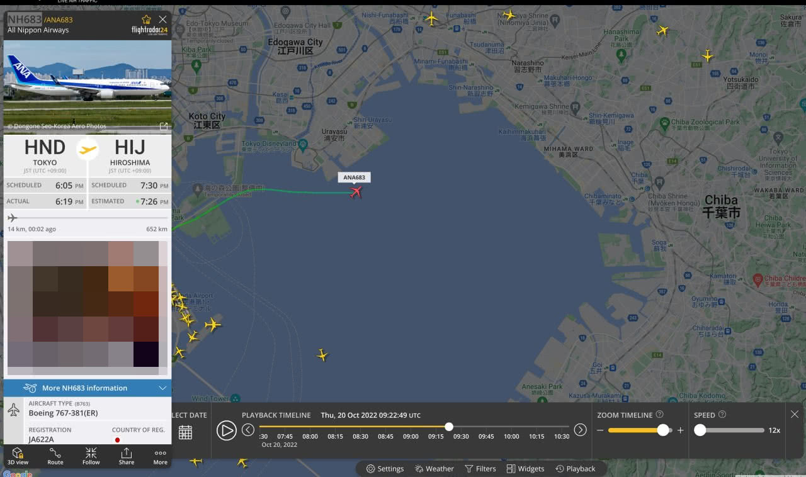

## 旅行照片 2.0

因为拿了第二小题的一血，所以写一下吧。

### 第一题：照片分析

大部分信息用 `exiv2 travel-photo-2.jpg` 就能读出来了：

```
$ exiv2 travel-photo-2.jpg
File 1/1: travel-photo-2.jpg
......
Camera make     : Xiaomi
Camera model    : sm6115 (juice)
Image timestamp : 2022:05:14 18:23:35
......
Flash           : No, compulsory
......
ISO speed       : 84
```

EXIF 版本没看到，翻[维基百科](https://en.wikipedia.org/wiki/Exif)，总共也没几个版本，试了觉得发布日期比较合理的 2.31，一下子就成功了。

### 第二题：社工实践

照片中的体育场名字“Zozo Marine Stadium”清晰可见。用 Google Maps 搜到在日本千叶市、东京湾边上。 拍摄者所在位置应当是体育馆附近的“APA HOTEL& RESORT TOKYO BAY MAKUHARI”，这也比较符合题目“旅行”的设定。

手机屏幕分辨率：EXIF 信息中的 camera model “sm6115 (juice)” 中 sm6115 是高通 SoC 的型号，即 Snapdragon 662，可以在 GSMAarena 上筛选 [Xiaomi + Snapdragon 662 芯片的手机](https://www.gsmarena.com/results.php3?sMakers=80&sChipset=90)。筛选出来只有四款，最像的是 Redmi 9T。但反正四款手机屏幕分辨率都是 2340x1080。

航班根据飞行方向（从东京湾向陆地）容易猜测是 HND 机场出发的。至于航班号，肯定是有飞行轨迹的历史数据的，但 Flightradar24 上只让免费看最近几日的数据。考虑到很多航班都是每日固定时间的，这题应该也不会太难，我就把做题日前一天东京时间 18:23 左右该方向飞行的航班挨个试一试，然后就试出来了是 NH683：



我被邮政编码坑了些时间。我在 Google Maps 上点到了酒店旁边的地点。没想到日本的邮编那么细，隔一条马路就不同了。