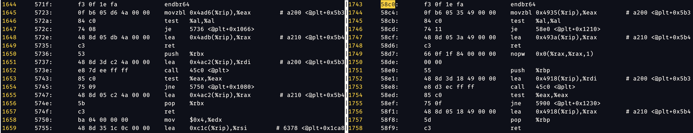

## 火眼金睛的小 E

我装了个 BinDiff，然后发现还得装 IDA，就默默卸载了。没有 IDA 只会 `objdump` 的选手再次献丑。

不过出题人很贴心地提供了测试模式，可以看正确答案。我自己手动尝试了几个，比较 `objdump -d` 的输出，发现第一题真的是“有手就行”。比如下面这对（571f -> 58c0），对比条件判断/跳转指令（`je`, `call`, `jne`, `test`）的相对位置、还有 `objdump` 加的内存位置的注释（`#` 后的内容），肉眼就可以看出来相似性。

### Level 1

掌握规律后，Level 1 直接人肉上就能过。

跳转指令的绝对地址会变化，所以不太适合用来字符串搜索。而注释部分的相对地址看起来比较稳定，所以我就用这些地址字符串搜索，然后人眼确认一下其他指令是否相似。

有些 binary 复杂点，字符串匹配可能会失败。但换几个时间戳很容易找到比较简单的组合。

### Level 2

Level 2 要比较 100 个 binary，但只要 40% 正确率。很自然想到把人肉比较的逻辑写成代码自动化。我的代码在 [火眼金睛的小_E/autorun.py](火眼金睛的小_E/autorun.py)，主要实现了以下逻辑：

1. 处理 `objdump` 输出，按 `endbr64` 指令把汇编代码分割成函数；
2. 每一段函数只保留条件判断/跳转指令（`j` 开头的指令、`cmp` / `test` / `call`）以及带 comment 的指令，这些指令是我们人眼看特征比较明显的；
3. 指令中的十六进制数字都去掉，因为两个 binary 中地址可能不同；
4. `analyze` 函数遍历 binary 2 中所有函数，跟 binary 1 中的目标函数比较得到相似度—— 实际上就是用 `difflib.SequenceMatcher` 比较字符串相似度，计算一个分数；
5. 取 binary 2 中分数最高的函数地址返回。

显然很粗糙，但够用了。

### Level 3 (没做出来)

粗糙的逻辑不管用了。开测试模式，人眼看了几组输入，发现这次不仅 binary 变大了，也无法人眼简单识别出指令相似性了。放弃。