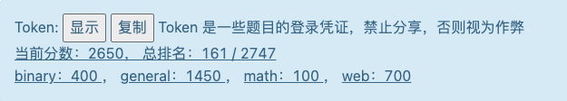
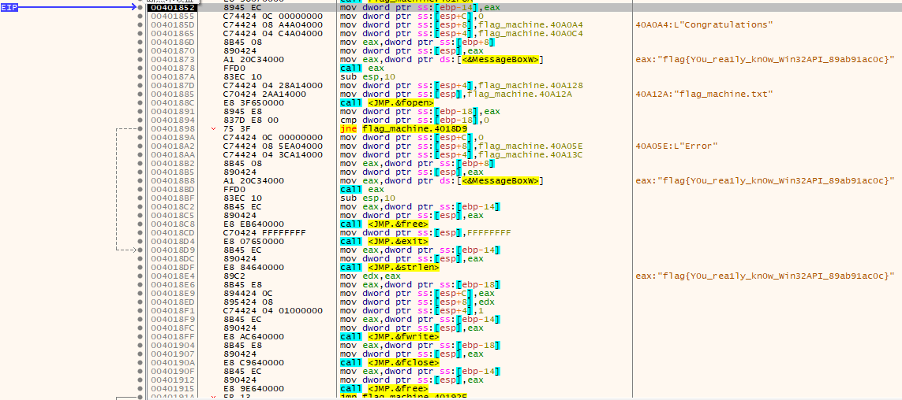

# 总结与感想



Hackergame是2019年刚进入大学时，我的社团学长推荐给我的。第一次比赛，只做出了签到题、白与夜和三教奇妙夜，得到两百多分。大多数题目我都看不懂，但我大受震撼；2020年，在学习一年计算机知识后，达到了六百分；2021年，能力再进一步，分数过千；而现在，在备战考研的关键时期，我仍然忙里偷闲参加比赛，并且得到2650分、rank161的不错成绩。

我先后经历专业调剂、转专业失败以及校招歧视等众多打击自身梦想的事情，然而我在冷眼与嘲笑之中从未放弃理想。我深爱这个领域，并不是什么收入和社会导向的促使，而是因为那无理由的、不可解释的沉迷。Hackergame带给我的不只是解出题目、提交flag、排名上升的喜悦，每一年的赛题，我并不能全部解出，但都能使我的知识面放大几倍；它更是**在各种逆流中少数给予我肯定的活动**。

长风破浪会有时，直挂云帆济沧海。愿自己考研顺利，虽然由于种种原因起步很晚，但也希望在两次之内上岸。

# 签到

尝试手写几次，后两个2都难以写出。尝试以错误结果提交，发现有形如`http://202.38.93.111:12022/?result=xxxx`的URL，不难判断，result参数改为2022，再访问，即可得到flag。

# 猫咪问答喵

1. Google搜索`中国科学技术大学 NEBULA 战队成立时间`，能够直接看到结果：`2017-03`.

2. <s>潜入</s>[USTCLUG网站](https://lug.ustc.edu.cn/wiki/lug/events/sfd/)，在下方演讲回放处找到此主题的[Slides](https://ftp.lug.ustc.edu.cn/%E6%B4%BB%E5%8A%A8/2022.9.20_%E8%BD%AF%E4%BB%B6%E8%87%AA%E7%94%B1%E6%97%A5/slides/gnome-wayland-user-perspective.pdf)，在Slides第15页处能够看到该问题的截图。不难判断，正在运行的是一个KDE系列的视频剪辑工具，即[`Kdenlive`](https://kdenlive.org/zh/).

3. 以关键词`支持windows2000的firefox版本`进行google搜索，能够得到大量相关网页链接。不难得到，答案为`12`.

4. 进入linux源码的git仓库并以关键词`CVE-2021-4034`搜索,只有一个对应commit：`dcd46d897adb70d63e025f175a00a89797d31a43`.

5. 此题关键词`e4:ff:65:d7:be:5d:c8:44:1d:89:6b:50:f5:50:a0:ce`在一定程度上有标志性。用google搜索，你能得到[这个网页](https://docs.zeek.org/en/master/logs/ssh.html)。跳转到[#outbound movement](https://docs.zeek.org/en/master/logs/ssh.html#outbound-movement),这里的一段数据包含一个公网ip`205.166.94.16`。打开终端，运行（DNS反查）:
```sh
$ nslookup 205.166.94.16
Server:		240e:58:c000:1600:180:168:255:118
Address:	240e:58:c000:1600:180:168:255:118#53

Non-authoritative answer:
16.94.166.205.in-addr.arpa	name = sdf.org.

Authoritative answers can be found from:
94.166.205.in-addr.arpa	nameserver = ns-b.sdf.org.
94.166.205.in-addr.arpa	nameserver = ns-c.sdf.org.
94.166.205.in-addr.arpa	nameserver = ns-a.sdf.org.
ns-a.sdf.org	internet address = 205.166.94.24
ns-b.sdf.org	internet address = 192.67.63.35
ns-c.sdf.org	internet address = 178.63.35.194
```
可知答案即为`sdf.org`。

6. 搜索`中科大 网络通 20元`，可以直接得到[这个网页](https://www.ustc.edu.cn/info/1057/4931.htm)，但其中提到2003年的文件。翻找网字文件，终于找到[2003年的文件](https://ustcnet.ustc.edu.cn/2003/0301/c11109a210890/page.htm)，对应答案为`2003-03`。

# 家目录里面的秘密

## VS Code里面的flag

通过翻找`~/.config/Code`文件夹，发现`~/.config/Code/User/History/2f23f721/DUGV.c`文件中，含有flag的明文。

## Rclone里的flag

打开`~/.config/rclone/rclone.conf`,这是仅有的与Rclone相关的文件，发现以下内容：

```sh
$ cat .config/rclone/rclone.conf
[flag2]
type = ftp
host = ftp.example.com
user = user
pass = tqqTq4tmQRDZ0sT_leJr7-WtCiHVXSMrVN49dWELPH1uce-5DPiuDtjBUN3EI38zvewgN5JaZqAirNnLlsQ
```
不难猜测pass字段就是被加密的flag。查阅Rclone文档如[rclone obscure](https://rclone.org/commands/rclone_obscure/
),并没有发现官方的解密方法，但文档中明确提出，rclone链接文件服务时，会将加密的密码解密，因此软件层面一定支持解密。访问rclone的git仓库，并搜索`obscure`，发现`rclone/fs/config/obscure/obscure.go`中存在相关解密函数：
```go
func Reveal(x string) (string, error) {
	ciphertext, err := base64.RawURLEncoding.DecodeString(x)
	if err != nil {
		return "", fmt.Errorf("base64 decode failed when revealing password - is it obscured?: %w", err)
	}
	if len(ciphertext) < aes.BlockSize {
		return "", errors.New("input too short when revealing password - is it obscured?")
	}
	buf := ciphertext[aes.BlockSize:]
	iv := ciphertext[:aes.BlockSize]
	if err := crypt(buf, buf, iv); err != nil {
		return "", fmt.Errorf("decrypt failed when revealing password - is it obscured?: %w", err)
	}
	return string(buf), nil
}
```
简单编写一个程序。
```go
//main.go
import(fmt
        obscure/obscure)

func main(){
    fmt.Println(Reveal("tqqTq4tmQRDZ0sT_leJr7-WtCiHVXSMrVN49dWELPH1uce-5DPiuDtjBUN3EI38zvewgN5JaZqAirNnLlsQ"))
}
```
运行一下就能得到flag。

# HeiLang

python存在一个特点，如：

```python
a=1
b=a
c=a
```
可简化为
```python
b=c=a=1
```
因此，对于`HeiLang`来说，无非是还原`arr[a|b|c]=1`到`arr[a]=arr[b]=arr[c]=1`.
对于以上举的例子，只需以`]=arr[`替换`|`即可，这在任何现代的编辑器上都是可以实现的。替换完成后，运行python脚本即可得到结果。

# Xcaptcha
题面比较常规，进入后发现算出三道加法的时间仅有1s，与验证码请求的“I'm a robot”呼应，因此，我们应该采用自动化解法。

参考脚本：

```python
from bs4 import BeautifulSoup
from requests import session

s = session()
req1 = s.get("http://202.38.93.111:10047/?token=1620%3AMEQCIH7surXPKSmDA%2FG%2FtCrFFXUPkF14fxHED%2FwfCM1n4cibAiBJkQkKBmSWq%2Fh7LgoSNQS924ItO%2BsqkQrgE9rNky%2FUCA%3D%3D")
req2 = s.get("http://202.38.93.111:10047/xcaptcha")
soup = BeautifulSoup(req2.text,"lxml")
problems = soup.select("label")
calculate = lambda p:eval(p.text.replace("的结果是？",""))
result = {
    "captcha1":calculate(problems[0]),
    "captcha2":calculate(problems[1]),
    "captcha3":calculate(problems[2]),
}
req3 = s.post("http://202.38.93.111:10047/xcaptcha",data = result)
print(req3.text)
```

# 猜数字

在输入框中填写`1e999999999999`<s>(请服务器吃个嫩牛七方)</s>这样大的数字，解除按钮禁用属性后提交，就能一次成功。然而原理并非是我想象中的“溢出”，而是程序将其识别成了`NaN`。

# Flag的痕迹

进入dokuwiki官网后尝试revision功能，发现revision页面是以`do=revision`参数形式进入的，而每个历史版本则以`rev=timestamp`参数形式进入，但do=revision对应页面是被关闭的，因此难以找到对应版本时间戳。

如果扫描所有时间戳，不就能去往flag对应revision的页面了？然而大概扫描400000个时间戳（对应时间间隔接近5天，用时几小时）后，没有结果。

google搜索`dokuwiki closed revision`，发现[一条issue下的评论](https://github.com/splitbrain/dokuwiki/issues/3421#issuecomment-1166623266)，得知使用参数`do=diff`时，即两版本间比较的功能，也能看到过往版本，从而得到flag。

<s>flag所在页面是10月8日，理论上爆破可行，只是消耗时间</s>

# 线路板

这是PCB设计常用的Gerber文件，如果白嫖过嘉立创的PCB，一定会有所了解。用相关专业软件编辑，即可看到flag。

# Flag自动机

看到讨论群和比赛界面300+的提交数，十分难过，因为我并不会Win32 API编程。首先使用按键精灵瞬移光标，不可行；又用16进制编辑器打开，发现提示——不必自行逆向。抱着试试看的想法打开ollydbg，终于撅动了Flag自动机！向下翻动找到一些关于flag的内容：



这里的指令是当某个变量等于<s>`114514`</s>时跳转过来的。打开单步调试，单步执行过所有加载dll库的指令后，随便找了一个将要执行的跳转指令，并将其立即数修改为输出flag的地址，flag便出现了。

# 微积分计算小练习

尝试题目，发现并没有什么异常；查看代码，发现“后端”会将flag写入“前端”cookie中，所以只要想办法让“前端”输出cookie就行了。查看网站源码，发现成绩与姓名是简单的拼接和base64转换，尝试自行构造参数，竟能通过网站显示，说明这<s>真的是一个前后端分离系统</s>。

所以，可以利用这个特性，将javascript代码注入`<body>`部分，例如读取cookie并将其设为用户名，然后就能被“后端”的代码识别并显示。但不能直接使用`<script>`注入，这样不会直接运行，我采用的方案是将要运行的js代码放置在自行构造的`<style>`标签的onload中。