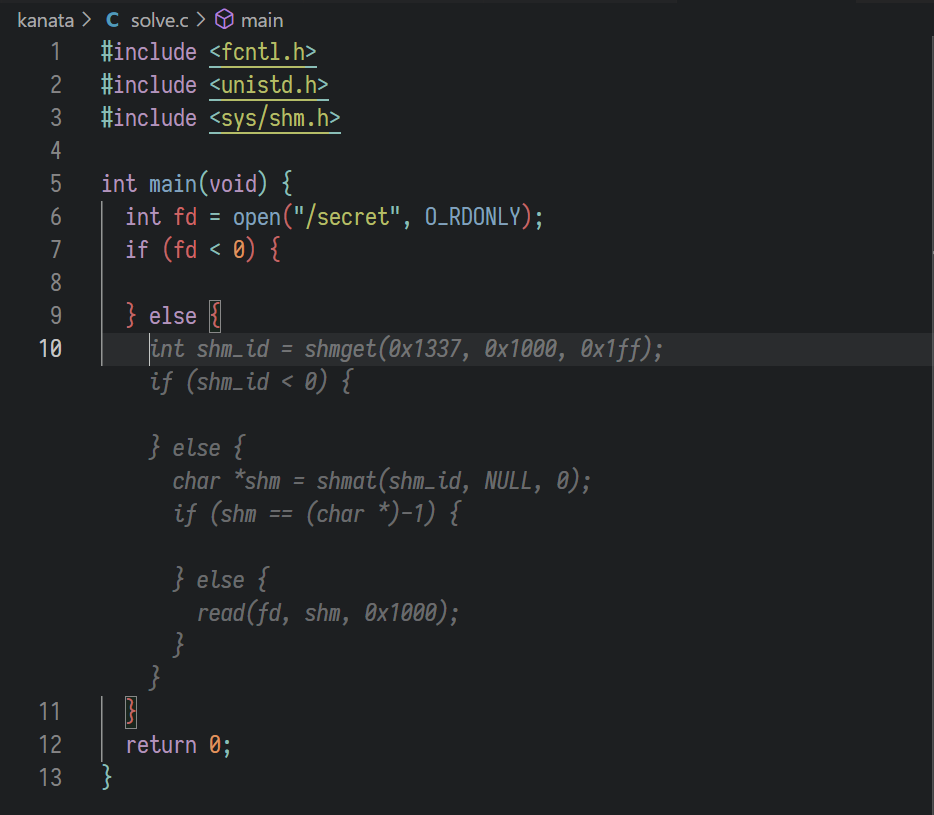

## 安全的在线测评

编译器没有运行在沙箱里，使用 .incbin 指挥编译器读取文件即可。

感兴趣的网友们可以尝试考一下古，BCTF 2015 上有一道基本一样的，叫 HDOJ 的题目，它叫这个名字当然是有原因的 🤔

## 不可加密的异世界

Part 1 和 Part 2 都是任选 {AES,DES}-{ECB,CBC,CFB,OFB,CTR}，随后构造 key 和 IV 使得之后某个指定位置的块加密之后跟原文一样。
这很容易通过合理利用会把明文 or 密文和我们能通过 IV 控制的东西 xor 在一起的各种 mode 来实现，详见这个 [wikipedia 页面](https://en.wikipedia.org/wiki/Block_cipher_mode_of_operation)，如果看了还是没懂，建议再看一遍。

翻了翻 writeup，Part 1 和 Part 2 其他选手基本都是使用 CBC 做的，实际上用 OFB 或者 CTR 做要稍微方便点：这两个 mode 工作的时候都是类似流密码的模式，输入的消息无论是明文还是密文都不会反馈进滚动的 IV 里，因此也不需要知道消息是什么。
具体构造上，设题目要求第 n 块加密之后不变，OFB 只需要把 00 00 .. 00 解密 n 次作为 IV 即可让第 n 块的 xorpad 为全 0；CTR 则是把 00 00 .. 00 解密一次，然后减去 (n-1) 即可。
后面的代码里使用的是 OFB。

Part 3 是个小 quiz，去 wikipedia 上贴个 DES weak key 来即可。构造 CRC 可以用[别人写好的代码](https://pypi.org/project/crcsolver/)，不用自己写小圆。

```python
from pwn import *
from Crypto.Cipher import AES
from Crypto.Util.number import long_to_bytes, bytes_to_long
import crcsolver

r = remote("202.38.93.111", 10110)
r.sendlineafter(b"Please input your token: ", read("../token").strip())

# 1
r.sendlineafter(b"> choice: ", b"1")
r.sendlineafter(b"> name: ", b"a")
r.sendlineafter(b"> algo: ", b"AES")
r.sendlineafter(b"> mode: ", b"OFB")
key = b"\x00" * 16
iv = AES.new(key=key, mode=AES.MODE_ECB).decrypt(b"\x00" * 16)
assert AES.new(key=key, iv=iv, mode=AES.MODE_OFB).encrypt(b"A" * 16) == b"A" * 16
r.sendlineafter(b"> hex keys: ", (key+iv).hex().encode())
r.recvuntil(b"Well done\n")
flag1 = r.recvline()
log.success(f"flag1: {flag1.decode()}")

# 2
r.sendlineafter(b"> choice: ", b"2")
r.sendlineafter(b"> name: ", b"a")
r.sendlineafter(b"> algo: ", b"AES")
r.sendlineafter(b"> mode: ", b"OFB")
key = b"\x00" * 16
cipher = AES.new(key=key, mode=AES.MODE_ECB)
cur = b"\x00" * 16
for i in range(10):
    cur = cipher.decrypt(cur)
    r.sendlineafter(b"> hex keys: ", (key+cur).hex().encode())
r.recvuntil(b"Well done\n")
flag2 = r.recvline()
log.success(f"flag2: {flag2.decode()}")

# 3: DES Weak key
r.sendlineafter(b"> choice: ", b"3")
r.sendlineafter(b"> name: ", b"a")
r.sendlineafter(b"> algo: ", b"DES")
r.sendlineafter(b"> mode: ", b"ECB")
weak_key = b"\x01\x01\x01\x01\x01\x01\x01\x01"
def crc128(data, poly=0x883ddfe55bba9af41f47bd6e0b0d8f8f):
    crc = (1 << 128) - 1

    for b in data:
        crc ^= b
        for _ in range(8):
            crc = (crc >> 1) ^ (poly & -(crc & 1))

    return crc ^ ((1 << 128) - 1)

inv = crcsolver.solve(b"\x00"*16, range(128), bytes_to_long(weak_key.ljust(16)), crc128)
r.sendlineafter(b"> hex msg (at least 16 bytes): ", inv.hex().encode())
r.recvuntil(b"What a miracle!\n")
flag3 = r.recvline()
log.success(f"flag3: {flag3.decode()}")
```

## 置换魔群

RSA, DH 的部分略过，使用 SageMath，题目说什么，你就怎么写即可。
最后一个部分，想要还原出比阶还大的操作次数的话，只需要搞点阶的 LCM 超过题目给的上界的群元素来就可以了。
容易发现这个群上的轮换的组合的阶就是这些轮换本身的长度的 LCM，这可以很容易的对应回求 LCM 最大的整数划分方案上，这个最大值是 Landau's function。它可以很容易的通过[打个牌](https://en.wikipedia.org/wiki/Dynamic_programming)的方式算出来，计算过程中顺便可以维护出对应的划分方案。
不熟悉的朋友们也可以通过搜索 Landau's function，多读几篇纸的方法学习一下。

这个题目需要的是 **两个** 这样的组合，LCM 起来最大，这可以给原来的打牌做法加一维，`f[a][b]` 维护和分别为 a, b 的，用到的素数**交集为空**的答案，注意到转移的时候是把每个素数的 k = 1, 2, ... 次加进去，做这样的改动之后转移依然能做。
构造回方案的时候需要结果是个偶置换，只有在方案里存在阶为 $$ 2^p $$ 的轮换的时候会违背这一点，可以通过把其中一个 2 拆出来解决（整体的阶也会降为原来的二分之一，但稍后我们会发现这对本题不重要）。

记录答案的时候别写链表，反正答案也不会有多长，全塞一个 list 里完事了，总之，用 PyPy 跑下面的代码即可：

```python
import pickle
import tqdm

PRIMEZ = [3, 5, 7, 11, 13, 17, 19, 23, 29, 31, 37, 41, 43, 47, 53, 59, 61, 67, 71, 73, 79, 83, 89, 97, 101, 103, 107, 109, 113, 127, 131, 137, 139, 149, 151, 157, 163, 167, 173, 179, 181, 191, 193, 197, 199, 211, 223, 227, 229, 233, 239, 241, 251, 257, 263, 269, 271, 277, 281, 283, 293, 307, 311, 313, 317, 331, 337, 347, 349, 353, 359, 367, 373, 379, 383, 389, 397, 401, 409, 419, 421, 431, 433, 439, 443, 449, 457, 461, 463, 467, 479, 487, 491, 499, 503, 509, 521, 523, 541, 547, 557, 563, 569]

def dp(maxn):
    g = [[1] * (maxn + 1) for _ in range(maxn + 1)]
    ans = [[[] for _ in range(maxn + 1)] for _ in range(maxn + 1)]
    for p in tqdm.tqdm(PRIMEZ):
        for n1 in range(maxn, p-1, -1):
            for n2 in range(maxn, p-1, -1):
                cnt = 1
                f = p
                while f <= n1 or f <= n2:
                    if f <= n1 and f * g[n1-f][n2] > g[n1][n2]:
                        g[n1][n2] = f * g[n1-f][n2]
                        ans[n1][n2] = ans[n1-f][n2] + [(1, p, cnt)]
                    if f <= n2 and f * g[n1][n2-f] > g[n1][n2]:
                        g[n1][n2] = f * g[n1][n2-f]
                        ans[n1][n2] = ans[n1][n2-f] + [(2, p, cnt)]
                    f *= p
                    cnt += 1
    return g, ans

MAXN = 2000
g, ans = dp(MAXN)
# print(g[1654][1654])

g = [g[i][i] for i in range(MAXN+1)]
ans = [ans[i][i] for i in range(MAXN+1)]
with open("precomp.pkl", "wb") as fp:
    pickle.dump((g, ans), fp)
```

有趣的是，题目本身给的 `pri_bound` 相当松，往往比我们实际算出来的最大可能的值（即使考虑了构造方案的时候要 / 2）小 2~3 个数量级。阅读出题人的题解之后才知道，原来是因为出题人不会打牌，贪了个次优方案出来。
~~所以我们不妨直接用 $$ A_{n-2} $$ 上的答案套到 $$ A_n $$ 上，就肯定可以构造出偶置换了，反正阶的 lcm 也是够大的。~~

```python
from pwn import *
import pickle
from IPython import embed
import ast

with open("precomp.pkl", "rb") as fp:
    maxlcm, ans = pickle.load(fp)

def build_on_An(l, n):
    l = l
    remain = n - sum(l)
    oddity = 0
    for v in l:
        oddity ^= ((v % 2) ^ 1)
    if oddity == 1:
        assert remain >= 2, f"bad answer for {n=}: {l}"
        l.append(2)
        remain -= 2
        oddity = 0
    for i in range(remain):
        l.append(1)
    permu = []
    last = 1
    for v in l:
        c = list(range(last, last+v))
        permu.extend(c[1:] + c[:1])
        last += v
    return permu

def split_answer(n):
    ls = [[], []]
    for who, p, cnt in ans[n-2]:
        ls[who-1].extend([p ** cnt])
    return ls

r = remote("202.38.93.111", 10114)
r.sendlineafter(b"Please input your token: ", read("../token").strip())
r.sendlineafter(b"> your choice: ", b"3")

for _ in range(15):
    print(f"Round {_}")
    r.recvuntil(b"n = ")
    n = int(r.recvuntil("\n", drop=True))
    r.recvuntil(b"The upper bound for my private key is ")
    pri_bound = ast.literal_eval(r.recvline().strip().decode())
    An = AlternatingGroup(n)
    assert maxlcm[n-2] >= pri_bound
    l1, l2 = split_answer(n)
    p1, p2 = build_on_An(l1, n), build_on_An(l2, n)
    g1, g2 = An(Permutation(p1)), An(Permutation(p2))
    r.sendlineafter(b"> your generator 0 (a list): ", str(list(g1.tuple())).encode())
    r.recvuntil(b"The public key 0 : ")
    pk1 = ast.literal_eval(r.recvline().strip().decode())
    r.sendlineafter(b"> your generator 1 (a list): ", str(list(g2.tuple())).encode())
    r.recvuntil(b"The public key 1 : ")
    pk2 = ast.literal_eval(r.recvline().strip().decode())
    s1 = discrete_log(An(pk1), g1)
    s2 = discrete_log(An(pk2), g2)
    secret = crt(s1, s2, g1.order(), g2.order())
    r.sendlineafter(b"Prove that you own the secret:", str(secret).encode())

r.interactive()
```

## 你先别急

题目逻辑就略过不提了，感兴趣的可以看其他人的 writeup。这里仅写一下一个需要写 0 行代码，花费 0 秒，训练 0 个模型，还不用去网上找验证码识别 API 的分类方法：

* 注意到只需要区分全数字的全字母的验证码就行了。
* 我们随便找一个 OCR 库，比如 Tesseract，虽然它做的非常垃圾（尤其是对验证码这种故意扭曲的东西），不过测一下可以注意到它还是很难对着全字母输出2个及以上的数字的，同样地对于数字也很难两个数字都认不出来。
* 答案是固定的，多跑几次就可以降噪了。

所以这样即可：

```python
from pytesseract import image_to_string

def check(img):
    text = image_to_string(img, config='--psm 13')
    cnt = 0
    for c in text:
        if c in string.digits:
            cnt += 1
    return cnt > 1

def denoised_check(prefix):
    res = 0
    for i in range(5):
        img = gen(f\"SELECT flag FROM flag WHERE flag LIKE '{prefix}%' LIMIT 1\")
        res += int(check(img))
    return res >= 3
```

顺便吐槽一句出题人用了 SQLite，LIKE 默认是不区分大小写的，翻了一会儿车。

## 链上记忆大师

讲讲弯路，Part 2, 写一个傻乎乎的循环根据数值消耗 gas 的话耗的实在太多了，链上估计跑不了（当然，我是写完才发现题目是 `eth_call` 的，不存在这个问题……）。
考虑用循环消耗 >= 51 的 gas，算一个 jump offset 跳到一堆 jumpdest-slide 中间，这样可以构造出近乎精确的 “多消耗 n gas” 的程序，当然实际上还得考虑 n 的字节表示里面如果有 00，那么 call data 里有 00，那么 gas 会差一点这种事情……不过随机到有 00 的 n 的概率不大。10 次测试都随不到的概率有足足 92.5%，可以忽略这个问题。

用 `solc --asm` 编译以下合约：
```solidity
// SPDX-License-Identifier: UNLICENSED

pragma solidity =0.8.17;

interface MemoryMaster {
    function memorize(uint16 n) external;
    function recall() external view returns (uint16);
}

contract Solve2 is MemoryMaster {
    // This will be reverted... Use remaining gas to save "state"?
    function memorize(uint16 n) external {
        unchecked {
            assembly {
                let v := div(n, 51)
                for {let i := 0} lt(i, v) {i := add(i, 1)} {
                }
                let t := mod(n, 51)
                mstore(0x10000, t)
            }
        }
    }
    function recall() external view returns (uint16) {
        unchecked {
            return uint16((0x41414141 - (gasleft()+140)*64/63));
        }
    }
}
```

再手改输出的汇编，加入：

```
    tag_16:
        /* "solve2-tpl.sol":433:445  {let i := 0} */
      pop
        /* "solve2-tpl.sol":524:526  51 */
      0x33
        /* "solve2-tpl.sol":521:522  n */
      dup3
        /* "solve2-tpl.sol":517:527  mod(n, 51) */
      mod
        /* "solve2-tpl.sol":560:561  t */
      dup1
        /* "solve2-tpl.sol":551:558  0x10000 */
      omg
      sub
      jump
      jumpdest
      jumpdest
      jumpdest
	  /* ... */
	  /* 省略一堆 jumpdest，爱塞多少塞多少，反正多于 51 个就可以 */
      /* ... */
      jumpdest
      jumpdest
      jumpdest
    omg:
      jumpdest
        /* "solve2-tpl.sol":375:576  {... */
      pop
      pop
```

然后用 `debug_traceCall` 看下执行的时候跑到对应位置剩余 gas 是多少，填入对应的值在 0x41414141 的位置即可。这样即使 n=65535 执行起来也就耗个十来万 gas。

## 看不见的彼方

注意到出题人没有用任何 namespace 做隔离，不妨 `man namespaces`，看看 Linux 都有哪些可以做隔离的 namespace，然后枚举下攻击面：

* cgroup: 造 cgroup 要 root，我们没有
* ipc: ... 好像里面每种机制都可以用来传数据耶
* network: syscall 限死了
* mount: 文件权限限制的比较死，哪里都写不进去；如果能写进去的话，可以用文件系统剩余空间之类的当隐蔽信道传数据
* pid: ... 进程可以互相碰到，好像随便做耶，比如 `process_vm_readv` 一下
* time: 改时间要 root，我们没有
* user: 乍一想不知道有什么用
* uts: 改 hostname 要 root

这里面 IPC 显然是比较有可能的，接下来，我们只要查下 IPC namespace 到底隔离了点什么资源，总之把 manpage 里提到的头文件 include 一下先，然后看看 GitHub Copilot 怎么说：



顺便一提即使上了全套 namespace，由于 sysconf 可以查询剩余内存（返回也不会受 mem cgroup 影响），所以也可以拿来做隐蔽信道。

## 壹...壹字节？

Dragon CTF 2021 上有一道叫 Shellcode verifier 的题目，这是 [writeup](https://ctftime.org/writeup/31592)。

## 火眼金睛的小 E

1, 2 都很简单，bindiff 就可以满足正确率要求。

3 因为要求比较 -O0 和 -O2/-O3 的 binary，显著的更难了，而且有不少参考答案本来就是错的或者有歧义（多见于 inline 或者猜测是编译器输出了类似 funcname.constprop.1 这样的符号名字的时候）。
考虑 ensemble 一下 Diaphora 和 Bindiff，能把正确率搞到 15%~22% 之间。题目只要求 30% of 200 pairs，也就是 60 个 binary，假设代码搞定 15%，我们手做两者都没有找到匹配的，做 16~30 个也就差不多了，有 180 分钟，并非做不了。

实际上手做了足足 44 个（手做的正确率预计是 70% 左右）……所以看来我脸比较黑。

手做的时候大部分匹配靠 same rare constants / callgraph 上其他函数里的 same rare constants，Diaphora 相比 Bindiff 的提升主要也是靠的 rare constatns 这个 heuristic，所以估计调调参是能自动搞定的。

## evilCallback

出题人整了一个 2021 年的 v8，手上有写好的 1-day exploit 的可以直接适配下 pointer compression = false 掏出来打。

不过仔细看看 patch，发现出题人似乎是非常粗暴的想要加回来 CVE-2021-21225（还改多了，所以实际上把 CVE-2017-5030 也给加回来了）。
自然地，我们想找找有没有这两个洞的写好的 exploit，这样我们也只需要适配下 pointer compression = false 就行了。CVE-2017-5030 的利用有是有，但年代久远，V8 变化比较大（比如那时候还不流行用写 wasm code page 的方法运行任意代码），适配起来有点麻烦。

然而……我们找一下 CVE-2021-21225 的利用，可以发现漏洞发现者的[这篇文章](https://tiszka.com/blog/CVE_2021_21225_exploit.html)，里面不仅给出了利用，还有一篇详细的 writeup。
并且我们顺便还理解了为什么出题人挑了 9.0.257.19 这么古老的 V8，因为这篇分析文章里面是对着这个版本写的。

然后就好办了，几个需要适配的地方：

* 把操作指针的地方改回 64-bit 的。
* Array 的内存布局略有不同，把 ta1 的内容对应改一下。
* 调一下几个偏移，以及受对象之间相对地址差影响的 hole 的位置。

这些都可以通过弄一份 debug 或者带符号的 V8 然后 `%DebugPrint` 或者在 gdb 里 `job` `jh` 并观察输出解决。
