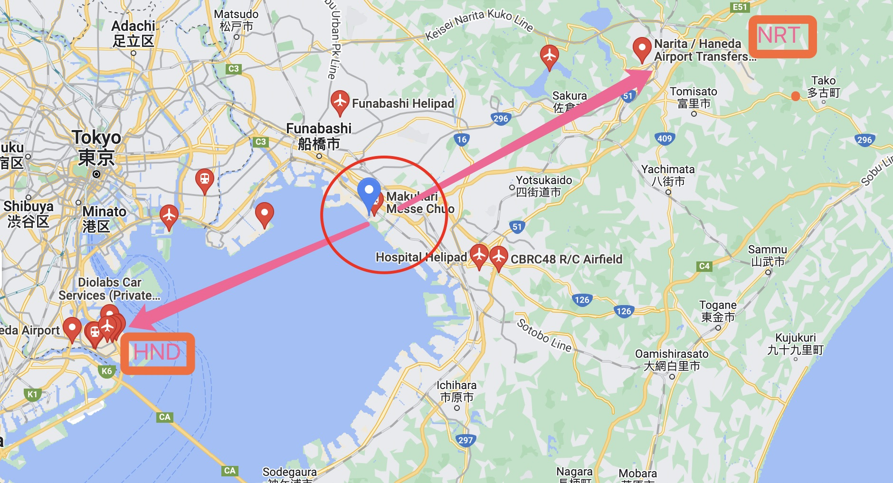
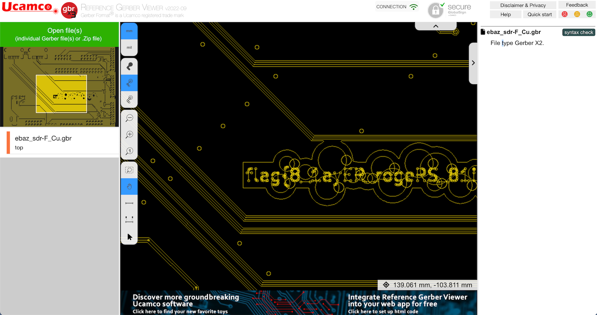
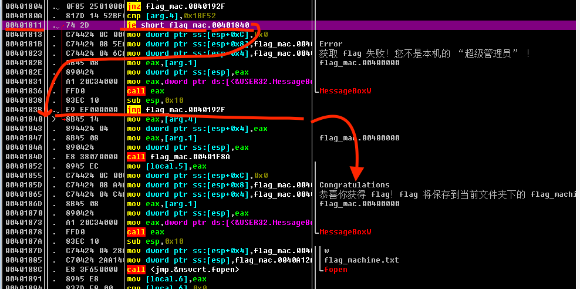
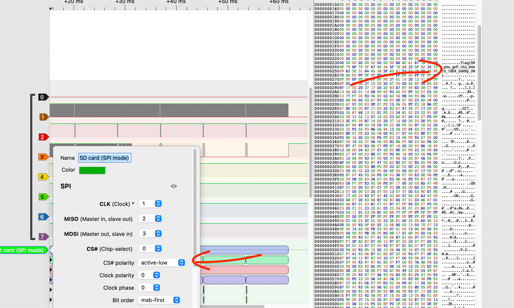
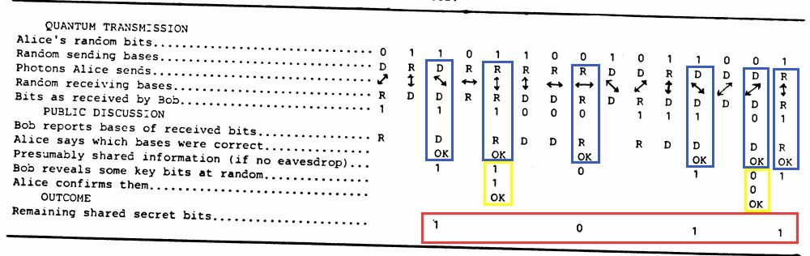
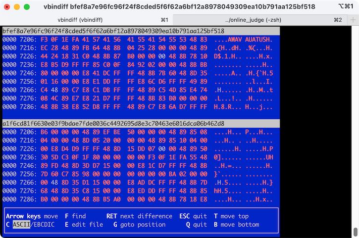

# 签到
随便画一画，发现很明显手画不太好弄。提交一下，观察地址栏变动，发现 `result` 参数就是刚刚识别的值，随手修改一下，r然后过了。

和去年的题也比较类似，其实就是只在前端限制而没有后端限制的情况下，我们直接对前端做些手脚就好了。

# 猫咪问答喵
考验你的信息检索能力，多搜搜就可以啦~ 由于反馈给你一共对了几个，所以可以很方便的

> 1.中国科学技术大学 NEBULA 战队（USTC NEBULA）是于何时成立的喵？

直接搜关键词：“USTC NEBULA 成立于”

https://cybersec.ustc.edu.cn/2022/0826/c23847a565848/page.htm

2017-03

> 2.2022 年 9 月，中国科学技术大学学生 Linux 用户协会（LUG @ USTC）在科大校内承办了软件自由日活动。除了专注于自由撸猫的主会场之外，还有一些和技术相关的分会场（如闪电演讲 Lightning Talk）。其中在第一个闪电演讲主题里，主讲人于 slides 中展示了一张在 GNOME Wayland 下使用 Wayland 后端会出现显示问题的 KDE 程序截图，请问这个 KDE 程序的名字是什么？

一开始我想和去年类似，我们直接搜相关的新闻，会不会正好有那张呢，于是搜到了 https://lug.ustc.edu.cn/news/2022/09/SFD/ 但是并没有我们想要的答案。

后来想到这种活动一般都是有视频的，于是在 b 站搜了下果然有：https://www.bilibili.com/video/BV11e411M7t9 ，翻了好几次才找到大概是 2:42:10 这个时间点，用力仔细听出来了是：`Kdenlive`。


> 3.22 年坚持，小 C 仍然使用着一台他从小用到大的 Windows 2000 计算机。那么，在不变更系统配置和程序代码的前提下，Firefox 浏览器能在 Windows 2000 下运行的最后一个大版本号是多少？

还是信息检索题，非常简单，直接搜：`firefox latest version windows 2000` 第一个就是答案：`Firefox 12.0` ，当然按照答案要求省略小数点：`12` 。

再不济也可以用一个一个一个一个试的方法试出来，其他题确定下来的情况下。

> 4.你知道 PwnKit（CVE-2021-4034）喵？据可靠谣传，出题组的某位同学本来想出这样一道类似的题，但是发现 Linux 内核更新之后居然不再允许 argc 为 0 了喵！那么，请找出在 Linux 内核 master 分支（torvalds/linux.git）下，首个变动此行为的 commit 的 hash 吧喵！

直接找到 Linux 内核 的仓库  https://github.com/torvalds/linux 然后搜索 `CVE-2021-4034` 就可以发现对应提交：https://github.com/torvalds/linux/commit/dcd46d897adb70d63e025f175a00a89797d31a43 ，答案就是：`dcd46d897adb70d63e025f175a00a89797d31a43`。

> 5.通过监视猫咪在键盘上看似乱踩的故意行为，不出所料发现其秘密连上了一个 ssh 服务器，终端显示 ED25519 key fingerprint is MD5:e4:ff:65:d7:be:5d:c8:44:1d:89:6b:50:f5:50:a0:ce.，你知道猫咪在连接什么域名吗？

信息检索问题，首先定位关键词：
`MD5:e4:ff:65:d7:be:5d:c8:44:1d:89:6b:50:f5:50:a0:ce`. 

多次拆分检索后可以在 Github 以 `e4:ff:65:d7:be:5d:c8:44:1d:89:6b:50:f5:50:a0:ce` 为关键词搜到完全一致的值：https://github.com/zeek/zeek-docs/blob/4bd4cf0233ba4d7585ce664f686eb4aff5ccb8dc/logs/ssh.rst 。来自 zeek 的文档。然后顺着下面看，可以看到一个 ip 地址。

```
.. literal-emph::

  {
    "ts": "2020-09-16T13:29:08.560780Z",
    "uid": "CFb8DZ1DLzStfZaERb",
    **"id.orig_h": "205.166.94.9",**
    "id.orig_p": 55699,
    **"id.resp_h": "192.168.4.37",**
    **"id.resp_p": 22,**
    **"auth_attempts": 0,**
    **"direction": "INBOUND",**
    **"server": "SSH-2.0-OpenSSH_7.6p1 Ubuntu-4ubuntu0.3"**
  }
```

找到 `205.166.94.9` 后，尝试搜索相关域名，由于提示了答案中不同的字母有 6 个，所以可以依次排除各个相同结果（后面又补充了域名的注册时间，这样就更好找了，不过我们用到，其实换几次也能排除其他的，不过主要是运气比较好这次）。

最后在 https://ipinfo.io/205.166.94.9 发现 `sdf.org`。

> 中国科学技术大学可以出校访问国内国际网络从而允许云撸猫的“网络通”定价为 20 元一个月是从哪一天正式实行的？

信息检索题，以 `网络通费用` 为关键词多次检索搜到若干个通知，然后从 https://ustcnet.ustc.edu.cn/2010/1210/c11109a210869/page.htm 定位到 2003 年有个文件被废了，一路往前翻翻到了：https://ustcnet.ustc.edu.cn/2003/0301/c11109a210890/page.htm 。 就找到了答案：`2003-03-01`。

# 家目录里的秘密
## VS Code
下载后用 VS Code 打开，搜索 flag 相应关键词，发现在 `user/.config/Code/User/History/2f23f721/DUGV.c` 内有第一个 flag。 其实就是用 VSCode 的全局搜索， ~~不过这也提醒我们 VSCode 的缓存文件也是有泄露隐私的风险的（~~

## RClone
同第一问，全局搜索 flag 相应关键词，发现 `rclone.conf` 文件内标有 flag 相应数据，一开始我以为是要连这个服务器用密码同步文件来着，但是里面的内容是：

```ini
[flag2]
type = ftp
host = ftp.example.com
user = user
pass = tqqTq4tmQRDZ0sT_leJr7-WtCiHVXSMrVN49dWELPH1uce-5DPiuDtjBUN3EI38zvewgN5JaZqAirNnLlsQ
```

很明显 `ftp.example.com` 没法连，文件内也没找到其他可以连接的地址， 尝试使用 `base64` 之类的解密，未果。 于是目标着眼在这个密码怎么解密上来。（主要是我之前并没有用过 RClone）。

搜索 `Rclone password crypt` 等相关信息。发现官方文档的说明（https://rclone.org/commands/rclone_obscure/ ） 以及官方论坛的讨论（https://forum.rclone.org/t/rclone-obscure-password-what-does-it-do/12692 ）。

> In the rclone config file, human-readable passwords are obscured. Obscuring them is done by encrypting them and writing them out in base64. This is not a secure way of encrypting these passwords as rclone can decrypt them - it is to prevent "eyedropping"

> namely someone seeing a password in the rclone config file by accident.
> Many equally important things (like access tokens) are not obscured in the config file. However it is very hard to shoulder surf a 64 character hex token.

即， RClone 对配置文件中密码的“加密”，是一种可逆的编码。只是为了防止别人一不小心看到他之类的场景。

于是继续寻找如何解密的方法。 搜了官方文档不知道为什么没有提到。 搜官方源码发现： https://github.com/rclone/rclone/blob/master/cmd/reveal/reveal.go 。尝试了一下 

```
rclone reveal tqqTq4tmQRDZ0sT_leJr7-WtCiHVXSMrVN49dWELPH1uce-5DPiuDtjBUN3EI38zvewgN5JaZqAirNnLlsQ
``` 


得到第二个 flag。 后来发现 [reddit](https://www.reddit.com/r/DataHoarder/comments/h05h75/comment/ftke4hv/?utm_source=share&utm_medium=web2x&context=3) 上也有人提到了。

# HeiLang

> 作为一个编程爱好者，我觉得实在是太酷了，很符合我对未来编程语言的想象，科技并带着趣味。

就是把数组内多个数字的或运算符操作 `a[1 | 2 | 3] = 4` 变成 `a[1] = 4; a[2] = 4; a[3] = 4` 。嫌麻烦没考虑优雅随便写了个。只处理数组部分，需要把生成的代码拼接回原来中间的位置：

```python
codes = ""
with open('getflag.hei.py', 'r') as f:
    for line in f.readlines():
        if(line.startswith('a[')):
            s = line.index('[')
            e = line.index(']')
            indexes = line[s+1: e].split(' | ')
            value  = line[line.index("= ")+1:]
            for i in indexes:
                codes+= f"a[{i}] = {value}"
    
with open('output.hei.py', 'w') as f:
    f.write(codes)
```

# Xcaptcha
> 我们需要验证您是否确实不是真实用户

需要你快速回答问题后点击回答。 这种场景感觉再用 Python 之类的东西获取网页再如何如何操作或者用 chromedriver 怎样怎样太麻烦了。我选择写了一个油猴脚本。

```javascript
// ==UserScript==
// @name         Hackergame Xcaptcha
// @namespace    http://tampermonkey.net/
// @version      0.1
// @description  try to take over the world!
// @author       zqm39
// @match        http://202.38.93.111:10047/xcaptcha
// @grant        none
// ==/UserScript==
(function() {
    'use strict';
    document.querySelectorAll('.form-group').forEach(el=>{
        const label = el.childNodes[1]
        const input = el.childNodes[3]
        const text = label.innerText.split('+')
        const a = BigInt(text[0])
        const b = BigInt(text[1].slice(0, -6))
        const res =  a + b
        input.value = res
    })
    document.querySelector('#submit').click()
})();
```

原理很简单，就是把题目读取进来然后填回去。 注意一下因为数字非常大，所以要用 `BigInt` 接一下。 放到油猴里直接进入网页点击就做完了。

# 旅行照片 2.0

又一年网络迷踪。 找飞机找哭系列（

## 照片分析

直接打开图片的 EXIF 第一问的信息都能看见。 比较坑的是 EXIF 2.3.1 要写作 `EXIF 2.31`。

## 社工入门

首先对外面很明显的建筑进行谷歌识图。 可以发现是日本的千叶海洋球场（ZOZO Marine Stadium）。或者直接放大图片可以看到前面这个英文，一搜就搜到了。

酒店

> 请写出拍照人所在地点的邮政编码

使用地图在上面地点附近搜索 `hotel` 关键词，根据拍摄角度位置推算。可以选出好几个备选的酒店。 例如：APA HOTEL& RESORT TOKYO BAY MAKUHARI，可以看到邮政编码为 `2610021`。附近符合角度的酒店大部分都是这个编码。 其他有不同的后面我选择了使用脚本枚举。

> 照片窗户上反射出了拍照人的手机。那么这部手机的屏幕分辨率是多少呢？

选择从第一题的信息入手。 第一题最后一问问你手机的品牌。 可以在 EXIF 中看到是 `Xiaomi SM6115 (juice)` 。后面是处理器的名称。搜索 `SM6115` 。可以发现是 `骁龙 622`。 然后搜索 `小米骁龙 622` （其实上一步就可能搜到了）。只能搜到 `Redmi Note 9 4G`。 直接搜索此机型分辨率，得到答案 `2340x1080`。

航班

> 仔细观察，可以发现照片空中（白色云上方中间位置）有一架飞机。你能调查出这架飞机的信息吗？

~~我不能~~

首先我们根据前面的信息可以在地图中搜索 ZOZO Marine Stadium 附近的机场。其实目标就只有两个：羽田机场（HND，东京国际机场）、成田国际机场（NRT）。



根据照片的朝向，则大概率是羽田机场的飞机。

有了这些初步信息，我们接下来就是要确定此航班是进港还是离港了。这一步如果是接触过相关问题和视频的人可能会很直接地想到 [flightradar24](https://www.flightradar24.com/) 之类的网站。但是关键问题就是，大部分这些网站都只提供近期的数据。而历史数据需要会员才可以浏览。（看了题解才知道[有](https://www.reddit.com/r/ADSB/comments/nzamfo/how_to_find_historical_adsb_records/)）──────当然，你也可以开一个试用，到时候取消订阅。 我并没有这么做，而是采取了更笨的方法。主要是不想再绑一次信用卡了。

我使用的是另一个相似的网站：[flightaware](https://flightaware.com/)。原因是我直接以 2022/05/14 与 HND 之类的组合关键词搜索时，搜索到了该网站当日的一部分航班的结果。这不是最重要的。

以这个航班为例：

```
https://flightaware.com/live/flight/ANA683/history/20221026/0915Z/RJTT/RJOA
```

看到链接里的日期了吗？我们假设一下，这个航班在 20220514 也飞过。 

```
https://flightaware.com/live/flight/ANA683/history/20220514/0915Z/RJTT/RJOA
```

ok 可以打开。这就说明，这个航班也在那一天飞过。 也就是说，我们只要找到当天的 HND 机场在照片所示的时间范围内的航班，再确定一下他到底在 5 月 14 日有没有飞过就是了。

当然，这样是有风险的────也许这个航班只在那一天飞这么一条航线呢？ 我对这方面不是很了解，但是姑且试了试，运气还不错。

当然，为了优雅的尝试，这些应该是自动化的了。 我们只需要把照片时间范围内当天从 HND 进出的航班从网站那复制过来整理一下，再逐个枚举就可以了。

> 起飞机场（IATA 机场编号，如 PEK）

> 降落机场（IATA 机场编号，如 HFE）


> 航班号（两个大写字母和若干个数字，如 CA1813）
CA1813

```python
from tqdm import tqdm
import requests
import base64

a = ["2610021", "2610020", "2610022", "2618733", "2610002", "2620033"] # 可能的邮政编码，其实已经确定是第一个了，不过多试试咯
b = ["2340x1080"]
flights = [ # 可能的航班，实际试的比较多，出于版面删去一部分
    ("HND", "UBJ", "7G15"),
    ("HND", "HKD", "JL589"),
    ("HND", "TKS", "NH285"),
    ("HND", "ITM", "JL131"),
    ("HND", "CTS", "ADO4731"),
    ("HND", "MSJ", "JL159"),
    ("HND", "OIT", "6J97"),
    ("HND", "FUK", "BC21"),
    ("HND", "MYJ", "NH595"),
    ("HND", "UBJ", "7G3815"),
    ("HND", "HKD", "NH557"),
    ("HND", "KMJ", "JL637"),
    ("HND", "IWK", "EH637"),
    ("HND", "OIT", "6J2497"),
    ("HND", "AKJ", "ADO87"),
    ("HND", "MMB", "ADO79"),
    ("HND", "UBJ", "JL295"),
    ("HND", "KLAX", "JL16"),
]

# https://flightaware.com/live/flight/ANA683/history/20220514/0915Z/RJTT/RJOA

flag = False
for x in a:
    if(flag): break
    for y in b:
        if(flag): break
        for i, j, k in tqdm(flights):
            ans = f"1={x}&2={y}&3={i}&4={j}&5={k}"
            name = base64.b64encode(ans.encode("utf-8")).decode()
            res = requests.get(f"http://202.38.93.111:10055/{name}.txt")
            if res.status_code != 404:
                flag = True
                print("我超，找到了")
                print(x, y, i, j, k)
                break
if not flag:
    print("谔谔，没找到……")
```

简单跑一下就能得到答案了：2610021 2340x1080 HND HIJ NH683。

# 猜数字

和去年卖瓜很像。 应该都是数字溢出？ 关键是我不会 java 啊。 于是就往大数方向一个一个试了几次。就出来了…… 运气好吧应该是。

payload: `0.5e3333` 。 当然你要手动改下元素的 disable 。不然交不上去。

# LaTeX 机器人

原来 $\LaTeX$ 也能注入啊.jpg。

搜索 `LaTeX Injection`  相关关键词。找到一篇文章：
https://zhuanlan.zhihu.com/p/455901476

第一个 flag 呼之欲出。
```latex
\input{/flag1}
```

第二个 flag，根据提示：

>这次，flag 花括号内的内容除了字母和数字之外，还混入了两种特殊字符：下划线（_）和井号（#）。你可能需要想些其他办法了。

所以想， 如果让 $\LaTeX$ 把这俩输入合法化呢？

以 `latex \input special characters` 之类的关键词，搜索，发现可以用 `\catcode` 转义。 处理一下即可。

```latex
\catcode`\#=11 \catcode`\_=11 \input{/flag2} 
```

谢谢 hg 教我新知识（
 
# Flag 的痕迹

根据提示，`（题目 Dokuwiki 版本基于 2022-07-31a "Igor"）` 如果说指定这个版本，说不定这个版本存在什么漏洞呢？

搜索 `dokowiki reversion` 之类的关键词，可以看到相关讨论：

查询关键词

https://github.com/splitbrain/dokuwiki/issues/3421

于是根据内容，访问如下地址即可：

http://202.38.93.111:15004/doku.php?id=start&do=diff

# 安全的在线测评

## 无法 AC 的题目

通过阅读源码，发现静态数据和动态数据都存储在 `data` 目录下。 尝试读取后直接输出。成功。 但是动态数据由于设置了 `0700` 权限。 无法直接绕开。 尝试了自己 chmod 一下、通过 Python 间接读取等方法后未果。只做出来第一问。

~~随便拼凑的代码有点烂（~~
```c
#include <stdio.h>
#include <stdlib.h>
#include <string.h>

char data_in[1000], data_out[1000], N[1000];
char path_in[1000] = "./data/static.in";
char path_out[1000] = "./data/static.out";

void readFile(char filepath[], char res[]) {
    FILE *fp = fopen(filepath, "r");
    int idx = 0;
    while ((res[idx++] = fgetc(fp)) != EOF) {};
    for (; res[idx] != '\n'; idx--) res[idx] = '\0';
    res[idx] = '\0';
    fclose(fp);
}

int main() {
    readFile(path_in, data_in);
    scanf("%s", N);
    if (strcmp(N, data_in) == 0) {
        readFile(path_out, data_out);
        printf("%s\n", data_out);
        return 0;
    }
    // doesn't work
    for (int i = 0; i < 5; i++) {
        sprintf(path_in, "./data/dynamic%d.in", i);
        if (strcmp(N, data_in) == 0) {
            sprintf(path_out, "./data/dynamic%d.out", i);
            readFile(path_out, data_out);
            printf("%s\n", data_out);
            break;
        }
    }
    return 0;
}
```

# 线路板

搜索一个在线的 [gerber viewer](https://gerber-viewer.ucamco.com/) 直接看就行了。 



# Flag 自动机

很有意思的一题 hhh。

点开这个程序后发现，手动点击确实是点不到那个按钮的。

坦白说，我并不会什么 binary。 所以往年来说这类题我应该是不会做的。 不过今年比较凑巧。 

不过我碰巧之前研究过一点点 `windows api` 来操作其他窗体的相关东西。 所以就写了个小 C# 程序来帮我点击那个按钮。

```csharp
[DllImport("user32.dll")]
public static extern IntPtr FindWindow(string lpClassName, string lpWindowName);

[DllImport("User32.dll", EntryPoint = "PostMessage")]
private static extern int PostMessage(IntPtr hWnd, int Msg, IntPtr wParam, string lParam);

[DllImport("User32.dll", EntryPoint = "SendMessage")]
private static extern int SendMessage(IntPtr hWnd, int Msg, IntPtr wParam, string lParam);

[DllImport("User32.dll")]
public static extern IntPtr FindWindowEx(IntPtr parent, IntPtr childe, string strclass, string FrmText);
const int WM_LBUTTONDOWN = 0x0201;
const int WM_LBUTTONUP = 0x0202;


IntPtr hwnd = FindWindow(null, "flag 自动机");
IntPtr jiemi_button = FindWindowEx(hwnd, IntPtr.Zero, "Button", "狠心夺取");
PostMessage(jiemi_button, WM_LBUTTONDOWN, hwnd, null);
PostMessage(jiemi_button, WM_LBUTTONUP, hwnd, null);
```

运行后发现需要使用超级管理员才能点击。 但是尝试过使用管理员运行之类的都无效。

于是开始根本不会逆向の逆向分析。 首先我用了 IDA。由于不是很熟练，所以我没弄出来什么名堂。

由于之前曾经学过 ollydbg 做过一些抓取小软件注册码和修改软件文本的坏事。就想着能不能改下什么东西呢。



结果是意外的很简单呀。凭借我少得可怜的汇编知识。可以看到这个 `je` 命令跳转的地址就是点击成功的情况。 而 `je` 是 `如果等于就跳转`。 我们不用关心他比较什么。 我们要的是后面的情况。而现在我们点击是前面的情况。 所以我们只需要把 `je` 改成 `jne` 就可以了。 即──如果不等于就跳转。

于是运行修改后的程序，再运行我们前面的点击器。就可以获取 flag 了。 做的有点绕了，真毕生所学hhhh。

# 微积分计算小练习	

XSS 注入~

一开始真的认认真真做了一下题（ 

然后发现结果网址中 `result=MDox` 后面就是一个 base64。 解码后可以看到：前面是你的分数，后面是你的名字。

将成绩修改为 100。提交后发现没区别。

阅读 `bot.py` 源码。 可以发现其实无论啥成绩都没区别。主要干了两件事：

1. 进入该网站。 往 cookie 中写入 flag。
2. 读入 分数 和 姓名，输出

所以我们只要想法构造一个 xss 让他读取 cookie 内容并反写回网页就可以了。

多试几回，就能找到可以注入的地方了~~

```javascript
s=createElement('script');body.appendChild(s);s.innerHTML = `document.querySelector('#score').innerHTML = document.cookie `
```

转为 base64，使用 img onerror 注入

```javascript
123:
```

再整体 base64 编码放到 url 中提交，就可以看 flag 了~


# 杯窗鹅影

## flag1

直接写了一个读文件内容的程序。 没啥问题，甚至可以改下前面安全的在线评测的代码就可以直接复用。 第二问没试出来。

```c
#include <stdio.h>
#include <stdlib.h>
int main() {
    char flag[128];
    FILE *fp = fopen("./flag1", "r");
    int idx = 0;
    while ((flag[idx++] = fgetc(fp))!= EOF) {}
    flag[idx-1] = '\0';
    printf("%s\n", flag);
    fclose(fp);
    return 0;
}
```

# 蒙特卡罗轮盘赌

考察伪随机数种子选取的安全性问题。 

只要我们能构造出来一样的种子，就可以获得一样的随机数。 所以保证时间基本一致的情况下。枚举时间差和 `clock()` 即可。 比较坑的是 macOS 上的生成算法可能和其他不太一样。所以前面一直没跑出来。还以为是 `clock()` 范围有问题。 后面开了一个 docker 环境就跑出来了。

```c
#include <math.h>
#include <stdio.h>
#include <stdlib.h>
#include <time.h>

int equals(double a, double b) {
    return fabs(a - b) <= 1e-7;
}

double rand01() {
    return (double)rand() / RAND_MAX;
}

int main() {
    // disable buffering
    setvbuf(stdin, NULL, _IONBF, 0);
    setvbuf(stdout, NULL, _IONBF, 0);
    setvbuf(stderr, NULL, _IONBF, 0);
    double pi_list[5], a, b, cs, ce;
    int cnt;
    scanf("%lf%lf", &cs, &ce);
    unsigned long tm = (unsigned)time(0); 
    printf("%lu\n", tm);
    scanf("%lf%lf", &a, &b);
    for (unsigned long clk = cs; clk <= ce; clk++) {
        printf("%lu\n", clk);
        for (int tm_diff = -2; tm_diff <= 0; tm_diff++) {
            // cout << "time " << tm + tm_diff << endl;
            srand(tm + tm_diff + clk);
            cnt = 0;
            for (int i = 5; i > 0; i--) {
                int M = 0;
                int N = 400000;
                for (int j = 0; j < N; j++) {
                    double x = rand01();
                    double y = rand01();
                    if (x * x + y * y < 1) M++;
                }
                pi_list[cnt++] = (double)M / N * 4;
                if (cnt >= 3 && !equals(pi_list[0], a) && !equals(pi_list[1], b)) break;
            }
            if (equals(pi_list[0], a) && equals(pi_list[1], b)) {
                for (int i = 0; i < cnt; i++) {
                    printf("%.5f\n", pi_list[i]);
                }
                printf("time: %lu  clk: %lu", tm+tm_diff, clk);
                break;
            }
        }
    }
    return 0;
}
```

# 光与影

WebGL。其实我不是很会。但是讨巧做出来了。

下载下来观察源文件，发现 t1 ~ t5 很复杂，也许就是关于渲染那一堆 flag 的呢？

于是下面一堆 min ，逐个去掉里面的 t1 ~ t5 ，发现 t1 是 flag ，t5 是那个墙

```cpp
float sceneSDF(vec3 p, out vec3 pColor) {
    pColor = vec3(1.0, 1.0, 1.0);
    
    vec4 pH = mk_homo(p);
    vec4 pTO = mk_trans(35.0, -5.0, -20.0) * mk_scale(1.5, 1.5, 1.0) * pH;
    
    float t1 = t1SDF(pTO.xyz);
    float t2 = t2SDF((mk_trans(-45.0, 0.0, 0.0) * pTO).xyz);
    float t3 = t3SDF((mk_trans(-80.0, 0.0, 0.0) * pTO).xyz);
    float t4 = t4SDF((mk_trans(-106.0, 0.0, 0.0) * pTO).xyz);
    float t5 = t5SDF(p - vec3(36.0, 10.0, 15.0), vec3(30.0, 5.0, 5.0), 2.0);
    // 去掉 t5
    float tmin = min(min(min(t1, t2), t3), t4);
    return tmin;
}
```

然后就可以读出了 `flag{SDF-i3-FuN!}`。

# 片上系统

## 引导扇区


根据提示，下载 PulseView。 打开题目文件，选择 sdcard-spi mode。

需要选择不同信号对应的类型。由于没这方面的基础，所以随便试了试，就出来了。




# 量子藏宝图

我竟然在学量子通讯.webp

## 第一章-第一幕

根据提示寻找 `BB84` 的相关文章。发现其实很简单。

只要匹配 `制备基地` 和 `测量基底` 中相同的地方。把对应位中的量子态输出即可。 参照这个图（[来源](https://zhuanlan.zhihu.com/p/22474140)）：



于是根据这个可以简单写个代码；

```python
base = input()
quan = input()
check = input()

key = ''
for index, q in enumerate(quan):
    if(base[index] == check[index]):
        key+=q

print(key)
```

由于限制了密钥长度至少为 10，所以需要简单构造一下：

```
+x+x+x+x+x+x+x+x+x+x+x+x+x
01010101010100101010010101
+++++x++++x+++x+++xx++x+x+
0001000100

0001000100
```
## 第二章-第一幕

一上来放一个大的电路图真吓坏我了。 我根据他提供的文档找了下相关资料。看了一个[官方的视频](https://www.youtube.com/watch?v=sqJIpHYl7oo)。大概明白了其实这个电路图对于有线的位就是 1。 其他则是 0。 所以对着图打出来，根据题意按大端来，解下就好了（眼睛好疼）。

```python

one_bits = [
    0, 2, 3, 4, 5, 6, 8, 11, 12, 13, 17, 21, 22, 24, 26, 28, 29, 36, 37, 40, 42, 
    44, 45, 48, 49, 53, 54, 60, 61, 64, 65, 66, 68, 69, 72, 73, 77, 78, 80, 83,
    84, 85, 88, 89, 91, 92, 93, 94, 96, 97, 98, 101, 102, 104, 109, 110, 114, 115,
    117, 118, 121, 122, 125, 126
]


num = ['0' for _ in range(128)]
for one in one_bits:
    num[one] = '1'

res = ''.join(num)[::-1]

for i in range(0, 129-8, 8):
    ascii = int(res[i: i+8], 2)
    char = chr(ascii)
    print(char, end = '')
print('')
```

# 企鹅拼盘
读懂题发现并不会用 math 做，所以只做了前两问。好喜欢这种 TUI 界面啊，以后一定自己写点小东西玩玩

## 这么简单我闭眼都可以！

由于只有 4 位，所以仅有 $2^4$ 种情况，随便试试就可以试出来 $1000$

## 大力当然出奇迹啦~

根据提示直接暴力。 实现一个暴力函数。

```python
 async def qwq(self):
     res = [bin(i)[2:].zfill(self.bitlength) for i in range(0, 2**self.bitlength)]
     for r in tqdm(res): # tqdm 统计进度
         self.inbits = [*map(int, list(r))]
        # 他这边有点类似于 vue 之类的前端框架做了数据绑定
        # 所以直接修改数据不会生效，需要触发一下。
         self.pc = len(self.branches)
         self.watch_pc(self.pc)
         if(bool(self.board)): 
             print(self.inbits, r)
             break
```

注入到：
```python
async def on_load(self, event: events.Load):
    pass # 省略前面
    qwq()
``` 

这个第一问也可以直接用的。

第二问需要跑一小会儿，就得到了答案：`0010111110000110` 。第三问应该是跑不出来的。 看了下题解，在理解范围之外。


# 火眼金睛的小 E

## 有手就行

确实是有手就行的题，就是有点累手。 我用的是 `vbindiff`。 每次把提供的两个文件打开，先跳转到提示地址，然后全局检索另一个文件的相关内容。 找到相似的那就对了。但是容错率很低。不过多试几次都能试出来。 看了题解后发现我是笨蛋（


